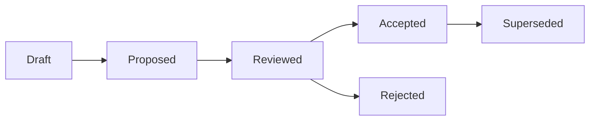

# Architecture Decision Records (ADR) Index

> **Purpose**: Central registry of all architectural decisions for SalesOS.
> **Last updated**: 2026-08-08 (ADR-109 added)

---

## Active ADRs

| ID | Title | Date | Status | Domain | File |
|----|-------|------|--------|--------|------|
| ADR-001 | Modular Monolith Foundation | 2026-06-01 | ✅ Accepted | Architecture | `engineering-os/adr/ADR-001-modular-monolith-foundation.md` |
| ADR-002 | Executive Intelligence Workspace | 2026-06-05 | ✅ Accepted | Product | `engineering-os/adr/ADR-002-executive-intelligence-workspace.md` |
| ADR-003 | Widget SDK v1 Freeze | 2026-06-10 | ✅ Accepted | Widget SDK | `engineering-os/adr/ADR-003-widget-sdk-v1-freeze.md` |
| ADR-025 | Entity Resolution Pipeline | 2026-07-12 | ✅ Accepted | Entity Resolution | `salesos/backend/docs/adr/0025-entity-resolution.md` |
| ADR-026 | Hybrid Search (Full-text + Semantic) | 2026-07-12 | ✅ Accepted | Search | `salesos/backend/docs/adr/0026-hybrid-search.md` |
| ADR-027 | Feature Store Implementation | 2026-07-12 | ✅ Accepted | Feature Store | `salesos/backend/docs/adr/0027-feature-store.md` |
| ADR-028 | Knowledge Graph Integration | 2026-07-12 | ✅ Accepted | Knowledge Graph | `salesos/backend/docs/adr/0028-knowledge-graph-integration.md` |
| ADR-029 | Number Never Issued | 2026-08-01 | 🚫 Not Issued | Governance | `docs/adr/0029-number-never-issued.md` |
| ADR-030 | Unified Provider Architecture | 2026-07-08 | ✅ Accepted | Architecture | `docs/adr/0030-unified-provider-architecture.md` |
| ADR-031 | Webhook Auth API Key Assessment | 2026-07-09 | ✅ Accepted | Security | `docs/adr/0031-webhook-auth-api-key-assessment.md` |
| ADR-032 | Widget SDK Reconciliation | 2026-07-17 | 📝 Proposed | Widget SDK | `docs/adr/0032-widget-sdk-reconciliation.md` (body: `engineering-os/adr/ADR-0032-widget-sdk-reconciliation.md`; alias ADR-0032) |
| ADR-033 | Decision Engine Lifecycle | 2026-07-17 | 📝 Proposed | Decision Engine | `docs/adr/0033-decision-engine-lifecycle.md` |
| ADR-034 | Repository Pattern Compliance | 2026-07-17 | 📝 Proposed | Architecture | `docs/adr/0034-repository-pattern-compliance.md` |
| ADR-035 | Sprint 0 Architecture Reconciliation | 2026-07-17 | 📝 Proposed | Architecture | `docs/adr/0035-sprint-0-architecture-reconciliation.md` |
| ADR-036 | Engineering Organization — Layer Separation | 2026-08-01 | ✅ Accepted | Governance | `docs/adr/0036-engineering-organization-layer-separation.md` |
| ADR-100 | Repository Canonicalization | 2026-08-05 | ✅ Accepted — governs repository topology; partially supersedes `docs/architecture/REPOSITORY_RESTRUCTURE_PLAN.md` v2.0; program complete | Architecture | `docs/adr/0100-repository-canonicalization.md` |
| ADR-101 | Platform Bootstrap & Stabilization | 2026-08-05 | ✅ Accepted — governs install/build/Docker/healthcheck/test cycle; new program, does not reopen ADR-100 | Platform Engineering | `docs/adr/0101-platform-bootstrap-stabilization.md` |
| ADR-102 | Engineering Hardening | 2026-08-06 | ✅ Accepted — quality/security/CI/observability hardening after Green Bootstrap; Kafka image claim aligned to compose `confluentinc/cp-kafka:7.7.2` | Platform Engineering | `docs/adr/0102-engineering-hardening.md` |
| ADR-103 | Digital Twin — Defer to v2.0 | 2026-08-07 | ✅ Accepted — zero components exist; defer to v2.0; remove from v1.0 scope | Architecture | `docs/adr/0103-digital-twin-deferred.md` |
| ADR-104 | Agent Runtime — Defer to v2.0 | 2026-08-07 | ✅ Accepted — placeholder string only; defer to v2.0; remove from v1.0 scope | Architecture | `docs/adr/0104-agent-runtime-deferred.md` |
| ADR-105 | Revenue Brain — Defer to v2.0 | 2026-08-07 | ✅ Accepted — no implementation; defer to v2.0; remove from v1.0 scope | Architecture | `docs/adr/0105-revenue-brain-deferred.md` |
| ADR-106 | Platform — Scope to SalesOS Only | 2026-08-07 | ✅ Accepted — only SalesOS exists as code; scope v1.0 to SalesOS only | Architecture | `docs/adr/0106-platform-scope.md` |
| ADR-107 | Data Residency — Use Existing Tenant.region Field | 2026-08-07 | ✅ Accepted — field exists but unused; implement basic enforcement in v1.0 | Architecture | `docs/adr/0107-data-residency-field.md` |
| ADR-108 | Knowledge Graph (Neo4j) — Keep Offline in v1.0 | 2026-08-07 | ✅ Accepted — Neo4j offline in production; keep offline for v1.0; SQL fallback remains | Architecture | `docs/adr/0108-neo4j-keep-offline.md` |
| ADR-109 | Kafka Event Bus — Current Posture and Graduation Path | 2026-08-08 | ✅ Accepted — Kafka provisioned idle; default in_memory; graduation criteria (C1-C5) before enabling in production | Platform Engineering | `docs/adr/0109-kafka-event-bus-posture.md` |

---

## ADR File Locations

| Location | Scope |
|----------|-------|
| `docs/adr/` | Product-root ADRs (ADR-029 disposition; ADR-030 to ADR-036 incl. **ADR-032** naming bridge; **ADR-036** multi-index per DEC-139 / criterion 6.5) |
| `salesos/backend/docs/adr/` | Backend domain ADRs (ADR-021..028; **ADR-025..028** canonical for criterion 6.1) |
| `engineering-os/adr/` | Engineering-platform ADRs (ADR-001 to ADR-003, ADR-012; ADR-032 body filename historically `ADR-0032-*` — alias per DEC-138) |
| `salesos/docs/ARCHITECTURE_BOOK.md` | Comprehensive architecture reference |
| `salesos/docs/DECISION_PLATFORM_ARCHITECTURE.md` | Decision Platform decisions |
| `docs/vnext/DECISIONS.md` | Pending vNext architectural decisions |

---

## Naming convention (DEC-138 / criterion 6.4)

| Surface | Convention | Example |
|---------|------------|---------|
| Registry / citation ID | `ADR-NNN` (3-digit zero-padded) | **ADR-032** |
| `docs/adr/` filename | `NNNN-slug.md` (4-digit) | `0032-widget-sdk-reconciliation.md` |
| `engineering-os/adr/` filename | `ADR-NNN-slug.md` (prefer 3-digit) | `ADR-003-…`; historical **`ADR-0032-…` = alias of ADR-032** |
| Alias | Legacy `ADR-0032` citations map to **ADR-032** | Not a second ADR |

---

## ADR Lifecycle



| Status | Description |
|--------|-------------|
| Draft | Initial authoring, not yet reviewed |
| Proposed | Submitted for Architecture Review Board review |
| Reviewed | ARB review complete, awaiting final decision |
| Accepted | Approved and in effect |
| Rejected | Considered and declined with rationale |
| Superseded | Replaced by a newer ADR |
| Not Issued | Number reserved / never authored — meta-disposition only (ADR-029); not a binding architecture decision |

---

## ADR Template

All ADRs follow the format:

```markdown
# ADR-{NNN}: {Title}

**Status**: {Proposed | Accepted | Superseded}
**Date**: {YYYY-MM-DD}
**Author**: {Name / Team}

## Context

{Problem statement and background}

## Decision

{What was decided}

## Consequences

{Benefits, trade-offs, migration notes}
```

---

## Related Documents

- [Architecture Book](../salesos/docs/ARCHITECTURE_BOOK.md) — Full architecture reference
- [Architecture Inventory](../salesos/docs/ARCHITECTURE_INVENTORY.md) — Component registry
- [Current Architecture](../salesos/docs/CURRENT_ARCHITECTURE.md) — Current state analysis
- [Target Architecture](../salesos/docs/TARGET_ARCHITECTURE.md) — Future architecture
- [Architecture Compliance Scorecard](../salesos/docs/ARCHITECTURE_SCORECARD.md) — Compliance tracking
