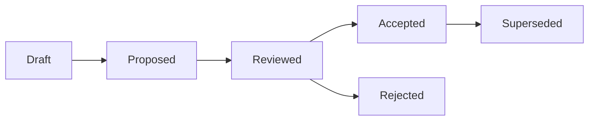

# Architecture Decision Records (ADR) Index

> **Purpose**: Central registry of all architectural decisions for SalesOS.
> **Last updated**: 2026-08-01 (DEC-135 — criterion 6.1: ADR-025..028 paths registered)

---

## Active ADRs

| ID | Title | Date | Status | Domain | File |
|----|-------|------|--------|--------|------|
| ADR-001 | Modular Monolith Foundation | 2026-06-01 | ✅ Accepted | Architecture | `engineering-os/adr/ADR-001-modular-monolith-foundation.md` |
| ADR-002 | Executive Intelligence Workspace | 2026-06-05 | ✅ Accepted | Product | `engineering-os/adr/ADR-002-executive-intelligence-workspace.md` |
| ADR-003 | Widget SDK v1 Freeze | 2026-06-10 | ✅ Accepted | Widget SDK | `engineering-os/adr/ADR-003-widget-sdk-v1-freeze.md` |
| ADR-025 | Entity Resolution Pipeline | 2026-07-12 | ✅ Accepted | Entity Resolution | `salesos/backend/docs/adr/0025-entity-resolution.md` |
| ADR-026 | Hybrid Search (Full-text + Semantic) | 2026-07-12 | ✅ Accepted | Search | `salesos/backend/docs/adr/0026-hybrid-search.md` |
| ADR-027 | Feature Store Implementation | 2026-07-12 | ✅ Accepted | Feature Store | `salesos/backend/docs/adr/0027-feature-store.md` |
| ADR-028 | Knowledge Graph Integration | 2026-07-12 | ✅ Accepted | Knowledge Graph | `salesos/backend/docs/adr/0028-knowledge-graph-integration.md` |
| ADR-030 | Unified Provider Architecture | 2026-07-08 | ✅ Accepted | Architecture | `docs/adr/0030-unified-provider-architecture.md` |
| ADR-031 | Webhook Auth API Key Assessment | 2026-07-09 | ✅ Accepted | Security | `docs/adr/0031-webhook-auth-api-key-assessment.md` |
| ADR-032 | Widget SDK Reconciliation | 2026-07-10 | ✅ Accepted | Widget SDK | `engineering-os/adr/ADR-0032-widget-sdk-reconciliation.md` |
| ADR-033 | Decision Engine Lifecycle | 2026-07-11 | ✅ Accepted | Decision Engine | `docs/adr/0033-decision-engine-lifecycle.md` |
| ADR-034 | Repository Pattern Compliance | 2026-07-12 | ✅ Accepted | Architecture | `docs/adr/0034-repository-pattern-compliance.md` |
| ADR-035 | Sprint 0 Architecture Reconciliation | 2026-07-17 | 📝 Proposed | Architecture | `docs/adr/0035-sprint-0-architecture-reconciliation.md` |

---

## ADR File Locations

| Location | Scope |
|----------|-------|
| `docs/adr/` | Product-root ADRs (ADR-030 to ADR-035) |
| `salesos/backend/docs/adr/` | Backend domain ADRs (ADR-021..028; **ADR-025..028** canonical for criterion 6.1) |
| `engineering-os/adr/` | Engineering-platform ADRs (ADR-001 to ADR-003, ADR-032) |
| `salesos/docs/ARCHITECTURE_BOOK.md` | Comprehensive architecture reference |
| `salesos/docs/DECISION_PLATFORM_ARCHITECTURE.md` | Decision Platform decisions |
| `docs/vnext/DECISIONS.md` | Pending vNext architectural decisions |

---

## ADR Lifecycle



| Status | Description |
|--------|-------------|
| Draft | Initial authoring, not yet reviewed |
| Proposed | Submitted for Architecture Review Board review |
| Reviewed | ARB review complete, awaiting final decision |
| Accepted | Approved and in effect |
| Rejected | Considered and declined with rationale |
| Superseded | Replaced by a newer ADR |

---

## ADR Template

All ADRs follow the format:

```markdown
# ADR-{NNN}: {Title}

**Status**: {Proposed | Accepted | Superseded}
**Date**: {YYYY-MM-DD}
**Author**: {Name / Team}

## Context

{Problem statement and background}

## Decision

{What was decided}

## Consequences

{Benefits, trade-offs, migration notes}
```

---

## Related Documents

- [Architecture Book](../salesos/docs/ARCHITECTURE_BOOK.md) — Full architecture reference
- [Architecture Inventory](../salesos/docs/ARCHITECTURE_INVENTORY.md) — Component registry
- [Current Architecture](../salesos/docs/CURRENT_ARCHITECTURE.md) — Current state analysis
- [Target Architecture](../salesos/docs/TARGET_ARCHITECTURE.md) — Future architecture
- [Architecture Compliance Scorecard](../salesos/docs/ARCHITECTURE_SCORECARD.md) — Compliance tracking
