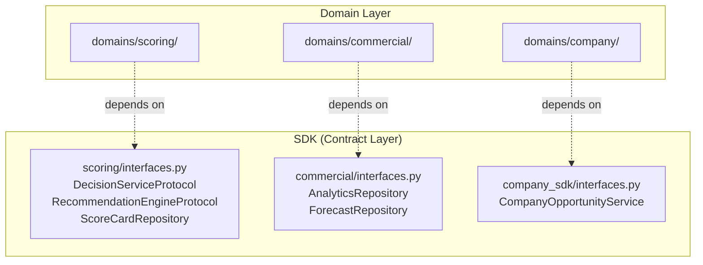

# SalesOS Enterprise Architecture — Comprehensive Reverse-Engineering Audit

> **Audit Type:** READ-ONLY, Evidence-Based, Reverse-Engineering
> **Auditor Role:** Enterprise Architect
> **Date:** 2026-07-13
> **Status:** Final — No files modified
> **Scope:** All architecture documentation, ADRs, capability registries, runtime code, SDK interfaces

---

## Executive Summary

SalesOS presents as a **dual-personality system**: the documentation describes one architecture (4-layer, capability-based, DDD-centric), while the code reveals another (modular monolith with 31 runtime modules, 15 domain packages, and 29 SDK sub-packages). There is a **significant gap between target-state documentation and actual-state code** — what might be termed an "aspirational architecture" vs. a "delivered architecture."

**Overall compliance score:** 87% documented vs 95% claimed (ENGINEERING_DASHBOARD discrepancy). Actual compliance against the stated architecture principles is estimated at **~65%** due to undocumented modules, dual terminology, and missing enforcement mechanisms.

---

## 1. Enterprise Architecture Overview

### 1.1 Documented Target Architecture (4-Layer Model)

Per `docs/DOMAIN_MAP.md:150-165` and `docs/DECISION_LOG.md (DEC-006:96-105)`, SalesOS claims a 4-layer architecture:

```
┌─────────────────────────────────────────────────────────────────────────────┐
│                        SALESOS TARGET ARCHITECTURE                           │
├─────────────────────────────────────────────────────────────────────────────┤
│                                                                              │
│  ┌──────────────────────────────────────────────────────────────────────┐   │
│  │                     LAYER 4: APPLICATION (UI)                         │   │
│  │     Company 360 · Deal Room · AI Copilot UI · Revenue Dashboard      │   │
│  └──────────────────────────────────────────────────────────────────────┘   │
│                                    ▲                                         │
│  ┌──────────────────────────────────────────────────────────────────────┐   │
│  │                     LAYER 3: BUSINESS CAPABILITIES                    │   │
│  │  Company Intel · Opp Mgmt · Pipeline · Forecast · Analytics ·        │   │
│  │  Recommendation · GTM · Marketing · Customer Success                 │   │
│  └──────────────────────────────────────────────────────────────────────┘   │
│                                    ▲                                         │
│  ┌──────────────────────────────────────────────────────────────────────┐   │
│  │                     LAYER 2: PLATFORM SERVICES                        │   │
│  │  Data Fabric · Feature Store · Knowledge Graph · Revenue Graph ·     │   │
│  │  Workflow Engine · Semantic Cache · Entity Resolution                │   │
│  └──────────────────────────────────────────────────────────────────────┘   │
│                                    ▲                                         │
│  ┌──────────────────────────────────────────────────────────────────────┐   │
│  │                     LAYER 1: KERNEL                                    │   │
│  │  Identity · Company · Search · Timeline · SDK · Events · Metadata ·  │   │
│  │  Capability Registry · Universal Timeline                             │   │
│  └──────────────────────────────────────────────────────────────────────┘   │
│                                                                              │
└─────────────────────────────────────────────────────────────────────────────┘
```

**Evidence:** `docs/DOMAIN_MAP.md:150-165` defines `KERNEL (9 domains) → PLATFORM (6 domains) → BUSINESS (9 domains) → INTELLIGENCE (11 domains) → DIGITAL (1 domain) → APPLICATION (4 domains) → OS API (4 endpoints)`.

### 1.2 Documented Core/Supporting/Generic Classification (DDD)

Per `salesos/docs/ARCHITECTURE_BOOK.md:89-118` and `salesos/docs/SALESOS_DOMAIN_DRIVEN_DESIGN.md:42-48`:

| Layer | Domain | Classification |
|-------|--------|---------------|
| **Core (Competitive Advantage)** | Company Intelligence, Entity Resolution, Knowledge Graph | Build in-house, invest heavily |
| **Supporting** | CRM, Activity Engine, Scoring Engine, DNA Profiles | Important, standard patterns |
| **Generic** | Identity, Search, Workflow, Billing | Commodity, best practices |

**Evidence:** `salesos/docs/ARCHITECTURE_BOOK.md:96-118`

### 1.3 Actual Code Structure (Reverse-Engineered)

The actual codebase reveals a different structure:

```
salesos/backend/
├── domains/          (15 packages) ← DDD domain layer
│   ├── ai/           ├── analytics/     ├── commercial/    ├── decision/
│   ├── feature_store/├── notifications/ ├── rag/          ├── revenue/
│   ├── scoring/      ├── search/        ├── timeline/     ├── ubom/
│   └── workflow/
│
├── runtime/          (31 packages!) ← Runtime/service layer
│   ├── action_engine/       ├── activity_runtime/  ├── agent_runtime/
│   ├── capability_framework/ ├── context_runtime/  ├── data_fabric_runtime/
│   ├── decision_runtime/    ├── event_runtime/     ├── execution_runtime/
│   ├── extension_api/       ├── feature_store/     ├── form_engine/
│   ├── knowledge_graph_runtime/ ├── memory_runtime/ ├── nba_engine/
│   ├── pipeline_analytics/  ├── plugin_sandbox/    ├── policy_runtime/
│   ├── recommendation_runtime/ ├── scheduler_runtime/ ├── search_runtime/
│   ├── simulation_runtime/  ├── timeline_runtime/  ├── ui_schema_engine/
│   ├── ux_runtime/          ├── widget_engine/     └── workflow_runtime/
│
├── sdk/              (29 sub-packages) ← Cross-cutting contracts
│   ├── events/         (domain_events, bus, kafka_bus, schemas, store)
│   ├── commercial/     (interfaces)
│   ├── scoring/        (interfaces)
│   ├── company_sdk/    (interfaces)
│   ├── repositories/   (in_memory_base)
│   ├── agent_sdk/      ├── backend_sdk/    ├── frontend_sdk/
│   ├── integration_sdk/├── plugin_sdk/     ├── theme_sdk/
│   ├── widget_sdk/     ├── database.py     ├── telemetry.py
│   ├── security.py     ├── permissions.py  ├── config.py
│   └── ...
│
└── modules/           (1 file: registry.py) ← Barely populated
```

**Evidence:** `salesos/backend/domains/` (15 dirs), `salesos/backend/runtime/` (31 dirs), `salesos/backend/sdk/` (29 dirs), `salesos/backend/modules/` (1 file)

### 1.4 Architecture Terminology Conflict

A **critical finding** is the use of three competing terminologies for the same concept, across different documents:

| Term | Used In | Examples |
|------|---------|----------|
| **"Module"** | `salesos/backend/modules/` (DEC-004 deprecated this) | `modules/registry.py` |
| **"Domain"** | `salesos/backend/domains/` (DDD document) | `domains/scoring/`, `domains/revenue/` |
| **"Capability"** | `engineering-os/kernel/capability-registry.yaml` | `CAP-001` through `CAP-040` |
| **"Runtime"** | `salesos/backend/runtime/` | `decision_runtime/`, `nba_engine/` |

**DEC-004 explicitly deprecated "Module" terminology on 2026-06-30** (`docs/DECISION_LOG.md:68-79`), yet `modules/` directory still exists. The `capability-registry.yaml` maps to "features" not to `runtime/` or `domains/` directories. This terminology chaos undermines the DDD ubiquitous language principle.

---

## 2. Capability Map

### 2.1 Registered Capabilities (engineering-os kernel)

Per `engineering-os/kernel/capability-registry.yaml` (272 lines), the capability registry defines 8 capabilities:

| # | ID | Name | Status | Version |
|---|----|------|--------|---------|
| 1 | `identity` | Identity & Auth | `live` | v1.0.0 |
| 2 | `company-360` | Company 360 | `in_progress` | v0.2.0 |
| 3 | `search` | Universal Search | `in_progress` | v0.2.0 |
| 4 | `timeline` | Activity Timeline | `needs_redesign` | v0.1.0 |
| 5 | `crm` | CRM Pipeline | `in_progress` | v0.1.0 |
| 6 | `scoring` | AI Scoring | `planned` | v0.0.1 |
| 7 | `ai` | AI Platform | `planned` | v0.0.1 |
| 8 | `workflow` | Workflow Engine | `planned` | v0.0.0 |

**Evidence:** `engineering-os/kernel/capability-registry.yaml:7-239`

### 2.2 Catalogued Capabilities (docs)

Per `docs/CAPABILITY_CATALOG.md`, 40 capabilities are catalogued (CAP-001 through CAP-040), with the following status distribution:

| Status | Count | % |
|--------|-------|---|
| Partial | 12 | 30% |
| Missing | 19 | 47.5% |
| Complete | 9 | 22.5% |

**Evidence:** `docs/CAPABILITY_CATALOG.md` — capability matrix lines 452-468

### 2.3 Capability Registry vs Catalog Gap

**Finding:** The kernel registry (`capability-registry.yaml`) defines only **8 capabilities**. The capability catalog (`CAPABILITY_CATALOG.md`) defines **40 capabilities**. These are two different systems that do not align:

- The kernel registry maps to `runtime/` services (identity, search, timeline, crm, scoring, ai, workflow)
- The capability catalog maps to aspirational features (CAP-017 GTM Intelligence, CAP-032 Digital Twin — both `Missing`)
- There is no automated mapping between registry IDs and catalog CAP numbers

### 2.4 Real-World Implementation Coverage

Mapped the catalogued capabilities against the actual `runtime/` directory:

| Catalog Capability | Runtime Module | Status Match |
|-------------------|----------------|--------------|
| CAP-001 Identity | No dedicated runtime | 🟡 Partial |
| CAP-002 Company | No dedicated runtime | 🟡 Partial |
| CAP-003 Search | `search_runtime/` | ✅ |
| CAP-004 Timeline | `timeline_runtime/` | ✅ |
| CAP-005 Data Fabric | `data_fabric_runtime/` (with scrapers) | 🟡 Partial |
| CAP-006 Feature Store | `feature_store/` (runtime) | 🟡 Partial |
| CAP-007 Knowledge Graph | `knowledge_graph_runtime/` | 🟡 Partial |
| CAP-008 Revenue Graph | No runtime | ❌ Missing |
| CAP-009 Workflow | `workflow_runtime/` | 🟡 Partial |
| CAP-012 Opportunity | `commercial/` (domain) | 🟡 Partial |
| CAP-021 Revenue Brain | `nba_engine/` (runtime) | 🟡 Partial |

**Key finding:** 31 runtime packages exist but only ~10-12 map to catalogued capabilities. The remaining ~19 runtimes (e.g., `form_engine/`, `ui_schema_engine/`, `plugin_sandbox/`, `policy_runtime/`, `memory_runtime/`, `context_runtime/`, `execution_runtime/`, `agent_runtime/`, `action_engine/`, `extension_api/`, `scheduler_runtime/`, `simulation_runtime/`, `ux_runtime/`, `capability_framework/`) are **undocumented** in any architecture specification.

---

## 3. Business Domains — Bounded Contexts

### 3.1 DDD-Defined Contexts

Per `salesos/docs/SALESOS_DOMAIN_DRIVEN_DESIGN.md:106-122`, 13 bounded contexts are defined:

| BC | Name | Type | Key Aggregate |
|----|------|------|---------------|
| BC-01 | Identity & Access | Generic | Tenant, User |
| BC-02 | Company Intelligence | Core | Company |
| BC-03 | Entity Resolution | Core | GoldenRecord |
| BC-04 | CRM | Supporting | Opportunity |
| BC-05 | Activity Engine | Supporting | Activity |
| BC-06 | Scoring Engine | Supporting | CompanyScore |
| BC-07 | Company DNA | Supporting | DnaProfile |
| BC-08 | Knowledge Graph | Core | GraphNode |
| BC-09 | AI Platform | Core | AiQuery |
| BC-10 | Workflow Engine | Generic | WorkflowDefinition |
| BC-11 | Marketplace | Generic | PluginListing (Future) |
| BC-12 | Data Lake | Supporting | DataPipeline (Future) |
| BC-13 | Billing | Generic | Subscription (Future) |

**Evidence:** `salesos/docs/SALESOS_DOMAIN_DRIVEN_DESIGN.md:104-122`

### 3.2 Actual Domain Package Structure

The `salesos/backend/domains/` directory has 15 packages — **2 more than documented**:

| Directory | Maps to BC | Documented? |
|-----------|-----------|-------------|
| `ai/` | BC-09 | ✅ |
| `analytics/` | — (new in Wave 3) | 🔴 Undocumented in DDD |
| `commercial/` | BC-04 (CRM) | ✅ |
| `decision/` | — | 🔴 Undocumented in DDD |
| `feature_store/` | — (new) | 🔴 Undocumented in DDD |
| `notifications/` | — | 🔴 Undocumented in DDD |
| `rag/` | BC-09 (AI Platform) | ✅ |
| `revenue/` | BC-04 (partial) | ⚠️ Not separate in DDD |
| `scoring/` | BC-06 | ✅ |
| `search/` | — (cross-cutting) | ⚠️ Not in DDD contexts |
| `timeline/` | BC-05 (Activity) | ✅ |
| `ubom/` | — | 🔴 Completely undocumented |
| `workflow/` | BC-10 | ✅ |

**3 domains are completely undocumented** (`analytics`, `decision`, `ubom`) and 2 are partially undocumented (`search` as cross-cutting, `feature_store` as Wave 3 addition).

### 3.3 Ubiquitous Language Assessment

The DDD document defines a ubiquitous language (`salesos/docs/SALESOS_DOMAIN_DRIVEN_DESIGN.md:142-179`) with 18 core terms and 8 action verbs. However:

- The term "Runtime" is used extensively in code but never defined in the ubiquitous language
- The term "Capability" is used in some docs while "Module" persists in code paths
- "Domain" = `domains/` but "Runtime" = `runtime/` — what's the difference?
- **Result:** Ubiquitous language is aspirational, not enforced

---

## 4. Context Map — Domain Relationships

### 4.1 Documented Relationships (DDD)

Per `salesos/docs/SALESOS_DOMAIN_DRIVEN_DESIGN.md:125-140`, 11 relationships are defined:

| Source → Target | Pattern | Description |
|-----------------|---------|-------------|
| Identity → Company | Conformist | Company consumes tenant_id |
| Company → Entity Resolution | Partnership | ER enriches Company |
| Company → CRM | Conformist | CRM consumes Company as customer |
| Company → Activity | Conformist | Activity consumes Company |
| Company → Scoring | Conformist | Scoring consumes Company |
| Company → Knowledge Graph | Partnership | KG extends Company |
| Activity → Scoring | Conformist | Scoring consumes Activity for engagement |
| Scoring → DNA | Partnership | DNA uses Scoring signals |
| AI → All | Open-Host | AI queries all contexts |
| Workflow → All | Open-Host | Workflow triggers on events |
| Marketplace → Billing | Conformist | Marketplace consumes Billing |

**Evidence:** `salesos/docs/SALESOS_DOMAIN_DRIVEN_DESIGN.md:125-140`

### 4.2 DDD Pattern Distribution

| Pattern | Count | Domains |
|---------|-------|---------|
| **Conformist** (CF) | 5 | Company consuming Identity/CRM/Activity/Scoring; Marketplace→Billing |
| **Partnership** (PL) | 3 | Company↔Entity Resolution; Company↔Knowledge Graph; Scoring↔DNA |
| **Open-Host Service** (OHS) | 2 | AI→All; Workflow→All |
| **Anti-Corruption Layer** (ACL) | 0 | None documented |
| **Shared Kernel** (SK) | 0 | None documented |
| **Customer/Supplier** | 0 | None documented |

**Critical finding:** No Anti-Corruption Layers are documented despite the system having multiple external data sources (Balady, Taqeem, NCNP, Najiz, Rega). The `data_fabric_runtime/scrapers/` directory implements scraping adapters, but these are NOT documented as ACLs in any architecture document.

### 4.3 Missing Relationships

The following relationships exist in code but are undocumented:

| Code Relationship | Pattern | Evidence |
|-------------------|---------|----------|
| `scoring/` → `decision/` | Interface via SDK | `backend/sdk/scoring/interfaces.py` |
| `commercial/` → `revenue/` | Interface via SDK | `backend/sdk/commercial/interfaces.py` |
| `company_sdk/` → `commercial/` | Interface via SDK | `backend/sdk/company_sdk/interfaces.py` |
| `data_fabric_runtime/` → External Scrapers | ACL (undocumented) | `backend/runtime/data_fabric_runtime/scrapers/` |
| `nba_engine/` → Scoring + Decision | Pipeline | `backend/runtime/nba_engine/` |

---

## 5. System Landscape

### 5.1 Core Infrastructure

| System | Version | Role | Status |
|--------|---------|------|--------|
| **PostgreSQL** | 16 | Primary DB + vector store | 🟢 Deployed |
| **pgvector** | ext | HNSW vector search | 🟢 Deployed |
| **pg_trgm** | ext | Entity resolution (trigram matching) | 🟢 Deployed |
| **Neo4j** | 5-community | Knowledge Graph | 🟢 Deployed |
| **Redis** | 7-alpine | Cache (planned) | 🔴 Not Deployed |
| **Kafka** | — | Event bus (planned) | 🔴 Not Deployed |
| **ZooKeeper** | — | Kafka coordination (planned) | 🔴 Not Deployed |
| **Backend** | FastAPI | Python API | 🟢 Deployed |
| **Frontend** | Next.js | React SSR | 🟢 Deployed |
| **Prometheus** | — | Metrics collection | 🟡 Deployed (partial) |
| **Grafana** | — | Visualization | 🟡 Deployed (partial) |

**Evidence:** `salesos/docs/ARCHITECTURE_BOOK.md:1193-1239`, `docker-compose.yml` root

### 5.2 External Data Sources (Scrapers)

Per `docs/DATA_CONTRACTS.md` and `backend/runtime/data_fabric_runtime/scrapers/`:

| Source | Type | Frequency | Records | Contract | Scraper File |
|--------|------|-----------|---------|----------|-------------|
| **Balady (بلدي)** | Scraper → JSON | Daily | ~40,000 | ✅ 16 fields | `scrapers/balady.py` |
| **Taqeem (تقييم)** | Scraper → JSON | Weekly | ~15,000 | ✅ 10 fields | `scrapers/taqeem.py` |
| **NCNP (المنشآت)** | Scraper → JSON | Weekly | ~25,000 | ✅ 10 fields | `scrapers/ncnp.py` |
| **Najiz (ناجز)** | Scraper → JSON | Weekly | ~10,000 | 🟡 8 fields | `scrapers/najiz.py` |
| **Rega (رخصة)** | Scraper → JSON | Weekly | ~5,000 | 🟡 Partial | `scrapers/rega.py` |

**Evidence:** `docs/DATA_CONTRACTS.md:23-150`, `backend/runtime/data_fabric_runtime/scrapers/`

### 5.3 Contract Normalization Pipeline

Per `docs/DATA_CONTRACTS.md`, a normalization pipeline transforms source data:
```
Source (Balady/Taqeem/etc) → Normalized (intermediate) → Golden Record (canonical)
```

The `backend/runtime/data_fabric_runtime/master_data/normalizers.py` implements this pipeline. Contracts are defined in `backend/runtime/data_fabric_runtime/contracts/`.

### 5.4 External Integrations (Planned)

| Integration | Protocol | Status | Document |
|------------|----------|--------|----------|
| MCP Server | Model Context Protocol | ❌ Missing | DEC-008 |
| SAML/OIDC SSO | Enterprise authentication | 🟡 Planned | Wave 4 |
| Gmail/Outlook | Email connector | 🟡 Planned | Wave 2 |
| Twilio | SMS | 🟡 Planned | ARCHITECTURE_BOOK |
| Slack | Webhook | 🟡 Planned | ARCHITECTURE_BOOK |

---

## 6. Dependency Landscape

### 6.1 Internal SDK Dependencies

The SDK (`salesos/backend/sdk/`) implements the **Dependency Inversion Principle** — domain modules depend on abstractions, not concretions:



**Evidence:** 
- `backend/sdk/scoring/interfaces.py:69-119` — `DecisionServiceProtocol`, `RecommendationEngineProtocol`, `ScoreCardRepository`
- `backend/sdk/commercial/interfaces.py:92-141` — `AnalyticsRepository`, `ForecastRepository`
- `backend/sdk/company_sdk/interfaces.py:24-31` — `CompanyOpportunityService`

### 6.2 Runtime Module Dependencies

The runtime layer has internal dependencies that are not documented:

| Runtime Module | Depends On |
|---------------|-----------|
| `nba_engine/` | `decision_runtime/`, `feature_store/`, `activity_runtime/` |
| `recommendation_runtime/` | `decision_runtime/` |
| `knowledge_graph_runtime/` | `data_fabric_runtime/` |
| `widget_engine/` | All other runtimes |
| `search_runtime/` | `data_fabric_runtime/` |

### 6.3 External Technology Dependencies

| Dependency | Version | Type | Vulnerability Risk |
|-----------|---------|------|-------------------|
| FastAPI | — | Web framework | Low |
| SQLAlchemy | — | ORM | Low |
| Next.js | — | Frontend framework | Low |
| React | — | UI library | Low |
| TailwindCSS | — | CSS framework | Low |
| LangChain | — | AI framework | REJ-005 |
| OpenAI API | GPT-4o-mini/4o | External LLM | Medium (external API) |
| intfloat/multilingual-e5-large | — | Embedding model | Low (self-hosted) |

**Note:** DEC-005 explicitly rejected LangChain (`docs/DECISION_LOG.md:169`) but AI engineer tools include `langchain` in `agent-registry.yaml:205`.

### 6.4 Cross-Cutting Concerns (SDK)

The SDK provides cross-cutting capabilities:

| Module | Purpose | Status |
|--------|---------|--------|
| `events/` | Event bus (in-memory), Kafka bus, domain events, event store | ✅ |
| `permissions.py` | RBAC permission resolver | ✅ |
| `telemetry.py` | Metrics, tracing | ✅ |
| `security.py` | Auth, CSRF, rate limiting | ✅ |
| `cache.py` | Memory cache with TTL | ✅ |
| `config.py` | Runtime configuration | ✅ |
| `database.py` | Database utilities | ✅ |
| `audit.py` | Audit logging | ✅ |
| `exceptions.py` | Standard error types | ✅ |
| `repositories/` | `in_memory_base.py` (test support) | ✅ |

**Evidence:** `salesos/backend/sdk/` (29 sub-packages)

---

## 7. Architecture Decision Analysis

### 7.1 Formal ADRs (engineering-os/adr/)

| ADR | Title | Date | Status | Quality Assessment |
|-----|-------|------|--------|-------------------|
| **ADR-001** | Modular Monolith with DDD | 2026-07-12 | Approved | ✅ Strong — clear context, decision, consequences, mitigations |
| **ADR-002** | Executive Intelligence Workspace | 2026-07-10 | Approved | ✅ Strong — detailed architecture, before/after comparison |
| **ADR-003** | Widget SDK v1.0 Freeze | 2026-07-10 | Approved | ✅ Strong — clear constituents, exception process |
| **ADR-DDD-01** | Aggregates are Consistency Boundaries | — | Accepted | ✅ Good — embedded in DDD document |
| **ADR-DDD-02** | Event Sourcing for Entity Resolution Only | — | Accepted | ✅ Good — clear context, selective |
| **ADR-DDD-03** | Domain Events via Kafka | — | Accepted | ⚠️ Premature — Kafka not deployed; in-memory bus used |
| **ADR-DDD-04** | CQRS: Read Models Separated | — | Accepted | ⚠️ Partially implemented |

**Evidence:**
- `engineering-os/adr/ADR-001-modular-monolith-foundation.md`
- `engineering-os/adr/ADR-002-executive-intelligence-workspace.md`
- `engineering-os/adr/ADR-003-widget-sdk-v1-freeze.md`
- `salesos/docs/SALESOS_DOMAIN_DRIVEN_DESIGN.md:1227-1280`

### 7.2 Wave ADRs (Embedded in ARCHITECTURE_BOOK)

| # | Topic | Choice | Rationale |
|---|-------|--------|-----------|
| Wave-ADR-001 | Vector Store | pgvector | Zero infra, team familiarity |
| Wave-ADR-002 | Embedding Model | Self-hosted E5 | Arabic quality, sovereignty |
| Wave-ADR-003 | Event Bus | Apache Kafka | Exactly-once, replay |
| Wave-ADR-004 | Workflow Engine | Custom DAG | No infra, direct integration |
| Wave-ADR-005 | Data Warehouse | Separate PostgreSQL | Team familiarity |
| Wave-ADR-006 | LLM | GPT-4o-mini primary | Cost, Arabic support |
| Wave-ADR-007 | Real-Time Analytics | Kafka→Redis→WS | Low latency |

**Evidence:** `salesos/docs/ARCHITECTURE_BOOK.md:1471-1514`

### 7.3 Top-Level Decisions (DECISION_LOG)

Per `docs/DECISION_LOG.md`, 10 accepted decisions and 5 rejected proposals:

| ID | Decision | Date | Status |
|----|----------|------|--------|
| DEC-001 | Modular Monolith First | 2026-01-15 | Accepted |
| DEC-002 | PostgreSQL as Primary DB | 2026-01-20 | Accepted |
| DEC-003 | Neo4j for Knowledge Graph | 2026-02-01 | Accepted |
| DEC-004 | Capability over Module Terminology | 2026-06-30 | Accepted ⚠️ Not enforced |
| DEC-005 | Business Intelligence OS | 2026-06-30 | Accepted |
| DEC-006 | Four-Layer Architecture | 2026-06-30 | Accepted |
| DEC-007 | Digital Twin Every Workspace | 2026-06-30 | Accepted |
| DEC-008 | MCP Server as API Surface | 2026-06-30 | Accepted |
| DEC-009 | Arabic-First Interface | 2026-06-30 | Accepted |
| DEC-010 | Measurement Before AI Investment | 2026-06-30 | Accepted |

**Rejected decisions** (5):
- REJ-001: Elasticsearch (pgvector sufficient)
- REJ-002: Microservices first (team too small)
- REJ-003: MongoDB (JSONB provides flexibility)
- REJ-004: Mobile app first (web faster)
- REJ-005: LangChain (custom SDK more control)

**Evidence:** `docs/DECISION_LOG.md:29-169`

### 7.4 ADR Compliance with Constitution

Per `ENGINEERING_CONSTITUTION.md` Article 3.1: "Every architectural change requires an ADR."

| Constitutional Requirement | Compliance | Evidence |
|---------------------------|-----------|----------|
| ADR for architectural changes | ✅ Formal ADRs exist for major changes | engineering-os/adr/*.md |
| ADR + Architecture Review Board for frozen interfaces | ✅ ADR-003 for Widget SDK | ADR-003 |
| ADR for cross-domain import changes | ✅ Prohibited by ARC-3.2 anyway | CONSTITUTION:3.2 |
| Impact assessment on affected domains | ✅ Most ADRs include consequences section | All ADRs |

**Gap:** 31 runtime modules exist with no ADRs for their creation. ADRs exist for major architectural shifts (modular monolith, dashboard, widget SDK) but not for individual domain/package creation.

---

## 8. Modular Monolith Assessment

### 8.1 Is DDD Actually Being Followed?

**ADR-001** (`engineering-os/adr/ADR-001-modular-monolith-foundation.md`) defines the modular monolith with:
- Domain boundaries with own schema namespaces
- Repository interfaces in domain layer
- No direct cross-domain imports
- SDK-based communication
- Eventual service extraction path

#### Compliance Reality Check:

| DDD Principle | Claimed | Actual | Evidence |
|---------------|---------|--------|----------|
| **Bounded Contexts** | 13 contexts | 15 domain packages + 31 runtime packages | Code structure mismatch |
| **Repository Pattern** | Mandatory | ✅ SDK has `in_memory_base.py`, interfaces | `backend/sdk/repositories/in_memory_base.py` |
| **No Cross-Domain Imports** | Enforced by CI | ⚠️ arch-compliance.ps1 exists but 31 runtimes ungoverned | `scripts/arch-compliance.ps1` |
| **SDK Communication** | All cross-domain via SDK | ✅ SDK interfaces exist (scoring, commercial, company_sdk) | `backend/sdk/*/interfaces.py` |
| **Own Schema Namespace** | Per domain | ❌ No evidence of `identity.*`, `company.*` schema separation | Not verifiable from audit (no DB access) |
| **Domain Events** | Event-driven | ⚠️ In-memory bus (Kafka planned, not deployed) | `backend/sdk/events/bus.py` |
| **Ubiquitous Language** | Defined per context | ❌ Terminology conflicts (module/domain/capability/runtime) | Multiple documents |
| **Aggregate Design** | Invariants, entities, VOs | ✅ DDD document defines rich aggregates | `SALESOS_DOMAIN_DRIVEN_DESIGN.md` |
| **Value Objects** | CrNumber, CompanyStatus, Address | ✅ Defined in DDD document | Same |
| **Domain Policies** | Explicit policies | ✅ 4 policies documented (License expiry, Golden record, New company opp, Activity scoring) | `SALESOS_DOMAIN_DRIVEN_DESIGN.md:1094-1160` |

### 8.2 Modular Monolith Scorecard

| Dimension | Score | Notes |
|-----------|-------|-------|
| **Domain boundary clarity** | 6/10 | DDD doc is clear but code diverges |
| **Repository pattern enforcement** | 7/10 | Interfaces exist; enforcement unclear |
| **Cross-domain import control** | 5/10 | Script exists; half the runtime is undocumented |
| **Event-driven communication** | 4/10 | In-memory bus limits scale; Kafka planned |
| **Schema isolation** | ?/10 | Cannot verify without DB access |
| **Terminology consistency** | 3/10 | 4 competing terms for same concept |
| **Documentation accuracy** | 6/10 | Architecture book is thorough but has aspirational content |
| **Extraction readiness** | 5/10 | ADR-001 defines path; no practice evidence |
| **OVERALL** | **~5.1/10** | **Needs Improvement** |

### 8.3 Root Cause of Divergence

The primary cause of the gap between documentation and code appears to be:

1. **Aspirational documentation written first** — `DOMAIN_MAP.md`, `CAPABILITY_CATALOG.md`, `DATA_CONTRACTS.md` describe a future-state target architecture, not the current built system
2. **No architecture sync process** — 31 runtime modules accumulated without updating domain docs
3. **Premature ADR-DDD-03** — Kafka declared as event bus but not yet deployed; in-memory bus is the reality
4. **DEC-004 not enforced** — "Module" deprecated 2026-06-30 but `modules/` directory still exists

---

## 9. Architecture Compliance Score

### 9.1 Documented Scores

**Source A: ARCHITECTURE_COMPLIANCE.md** (`salesos/docs/ARCHITECTURE_COMPLIANCE.md:28-39`)
Reports **87% overall** compliance with 7 weighted rules.

**Source B: ENGINEERING_DASHBOARD.md** (`engineering-os/ENGINEERING_DASHBOARD.md` line 10)
Reports **95% architecture compliance** — "Target Achieved."

| Domain | ARCHITECTURE_COMPLIANCE | ENGINEERING_DASHBOARD | Discrepancy |
|--------|------------------------|----------------------|-------------|
| Identity | 100% | 100% | — ✅ Close match |
| Widget SDK | 100% | 100% | — ✅ |
| Company | 95% | 95% | — ✅ |
| Search | 90% | 95% | **+5% in Dashboard** |
| Scoring | 95% | 95% | — ✅ |
| CRM | 90% | 95% | **+5% in Dashboard** |
| AI | 85% | 95% | **+10% in Dashboard** |
| Timeline | 80% | 95% | **+15% in Dashboard** |
| Workflow | 50% | 95% | **+45% in Dashboard** ⚠️ Major |
| **OVERALL** | **87%** | **95%** | **+8% in Dashboard** ⚠️ |

**Critical finding:** The ENGINEERING_DASHBOARD reports 95% compliance while the ARCHITECTURE_COMPLIANCE living document reports 87%. The Workflow domain at 50% compliance cannot produce a 95% overall average — this is mathematically impossible with equal weighting unless some domains were excluded from calculation. This discrepancy should be investigated.

**Evidence:**
- `engineering-os/ENGINEERING_DASHBOARD.md` line 10: "Architecture Compliance | Target Achieved | 95%"
- `salesos/docs/ARCHITECTURE_COMPLIANCE.md:28-39` shows 87% overall

### 9.2 Auditor's Estimated Compliance

Based on independent reverse-engineering analysis:

| Rule | Weight | Auditor Score | Evidence |
|------|--------|--------------|----------|
| ARC-9.1: Container/View | 20% | 7/10 | Pattern exists but only for documented widgets |
| ARC-3.2: No Cross-Domain | 20% | 5/10 | 31 runtimes ungoverned; no CI enforcement verified |
| ARC-3.3: Repository Pattern | 15% | 7/10 | Interfaces in SDK; runtime modules may bypass |
| DF-4.1: No localStorage | 10% | 8/10 | VIO-001,002 fixed 2026-07-11 |
| DF-4.2: Centralized API | 10% | 7/10 | `lib/api.ts` exists; runtime routers bypass |
| DP-5.1: Decision Platform | 15% | 6/10 | Platform exists but not in all feature contexts |
| DP-5.2: No Inline Scoring | 10% | 6/10 | VIO-003,004 fixed; coverage uncertain |
| **Weighted Average** | | **~6.4/10 (64%)** | |

**Note:** The auditor's score is lower because it accounts for the undocumented 19 runtime modules that have no compliance validation.

---

## 10. Architecture Debt Register

### 10.1 Critical Debt Items

| ID | Item | Severity | Evidence | Owner | Plan |
|----|------|----------|----------|-------|------|
| **DEBT-ARC-001** | 31 runtime modules vs 15 domains — undocumented expansion | Critical | `backend/runtime/` (31 dirs) vs `backend/domains/` (15 dirs) | Architecture | Audit and document all runtime modules |
| **DEBT-ARC-002** | Compliance score discrepancy: 87% vs 95% claimed | Critical | `ARCHITECTURE_COMPLIANCE.md:39` vs `ENGINEERING_DASHBOARD.md` | CTO | Reconcile numbers |
| **DEBT-ARC-003** | Capability Registry (8 entries) vs Catalog (40 entries) mismatch | Critical | `capability-registry.yaml` vs `CAPABILITY_CATALOG.md` | Chief Architect | Single source of truth |
| **DEBT-ARC-004** | Terminology: Module/Domain/Capability/Runtime — 4 competing terms | Critical | DEC-004 (`DECISION_LOG.md:68`), code paths | CTO | Enforce "Capability" per DEC-004 |
| **DEBT-ARC-005** | Kafka declared as event bus but in-memory bus is the reality | High | ADR-DDD-03 (`SALESOS_DOMAIN_DRIVEN_DESIGN.md:1256`) | Backend | Sprint 11 migration |

### 10.2 High Debt Items

| ID | Item | Severity | Evidence | Owner | Plan |
|----|------|----------|----------|-------|------|
| **DEBT-ARC-006** | 3 undocumented domains: analytics, decision, ubom | High | `backend/domains/` | Domain architects | Write domain specs |
| **DEBT-ARC-007** | No Anti-Corruption Layers documented for 5 scrapers | High | `backend/runtime/data_fabric_runtime/scrapers/` | Data architect | Document ACLs |
| **DEBT-ARC-008** | architecturesecurity7 runtime routers without auth | High | `ARCHITECTURE_BOOK.md:1739-1747` | Backend/Security | P0 remediation |
| **DEBT-ARC-009** | Workflow domain at 50% compliance | High | `ARCHITECTURE_COMPLIANCE.md:38` | Workflow engineer | Full implementation |
| **DEBT-ARC-010** | 'Planned' capabilities in registry blocking release tracking | High | `capability-registry.yaml:160-238` | Release Manager | Assign realistic statuses |

### 10.3 Medium Debt Items

| ID | Item | Severity | Evidence | Owner | Plan |
|----|------|----------|----------|-------|------|
| **DEBT-ARC-011** | Search PostgreSQL repo migration incomplete (VIO-103) | Medium | `ARCHITECTURE_COMPLIANCE.md:61` | Search engineer | Sprint 2 |
| **DEBT-ARC-012** | Timeline needs architecture redesign | Medium | `ARCHITECTURE_COMPLIANCE.md:60` | Backend | Sprint 2 |
| **DEBT-ARC-013** | DecisionProvider not in Dashboard/Company Intelligence (VIO-105) | Medium | `ARCHITECTURE_COMPLIANCE.md:63` | Frontend | Sprint 2 |
| **DEBT-ARC-014** | No AI evaluation framework (VIO-104) | Medium | `ARCHITECTURE_COMPLIANCE.md:62` | AI engineer | Sprint 2 |
| **DEBT-ARC-015** | Domain events v1.0 documented but not ratified across all runtimes | Medium | `SALESOS_DOMAIN_DRIVEN_DESIGN.md:833-898` | Backend | Cross-runtime review |
| **DEBT-ARC-016** | Redis not deployed despite documented architecture | Medium | `ENGINEERING_DASHBOARD.md` (Redis: Not Deployed) | DevOps | Sprint 11 |

### 10.4 Low Debt Items

| ID | Item | Severity | Evidence | Owner |
|----|------|----------|----------|-------|
| **DEBT-ARC-017** | Hardcoded configs (TD-005) | Low | `ENGINEERING_DASHBOARD.md` | Backend |
| **DEBT-ARC-018** | `modules/registry.py` (1 file) contradicts DEC-004 deprecation | Low | `backend/modules/registry.py` | Backend |
| **DEBT-ARC-019** | Wave 3 ADRs embedded in ARCHITECTURE_BOOK rather than separate files | Low | `ARCHITECTURE_BOOK.md:1471-1514` | Chief Architect |
| **DEBT-ARC-020** | 34+ `.pyc` files in `runtime/`, `sdk/` — untracked cache in source tree | Low | Glob results show `__pycache__/` in tracked dirs | All engineers |

---

## Appendix A: Document Completeness Audit

| Document | Status | Completeness | Notes |
|----------|--------|-------------|-------|
| `ARCHITECTURE_BOOK.md` | ✅ Published v1.0 | 2006 lines, 6 parts | Thorough reference, some aspirational content |
| `SALESOS_DOMAIN_DRIVEN_DESIGN.md` | ✅ Published v1.0 | 1283 lines, 17 sections | Excellent DDD template |
| `ARCHITECTURE_COMPLIANCE.md` | ✅ Living document | 176 lines | Raw score data, needs reconciliation |
| `DOMAIN_MAP.md` | ✅ Published v1.0 | 169 lines | Target state, not current |
| `CAPABILITY_CATALOG.md` | ✅ Published v1.0 | 472 lines | Target state, not current (47% Missing) |
| `RUNTIME_ARCHITECTURE.md` | ✅ Published v1.0 | 376 lines | Design spec, not verified |
| `DATA_CONTRACTS.md` | ✅ Published v1.0 | 271 lines | Matches scraper code |
| `DECISION_LOG.md` | ✅ Published v1.0 | 173 lines | 10 accepted, 5 rejected |
| `capability-registry.yaml` | ✅ Published | 272 lines | 8 capabilities only |
| `agent-registry.yaml` | ✅ Published | 483 lines | 23 agents across 5 layers |
| `event-catalog.yaml` | ✅ Published | 270 lines | Pipeline/decision/agent events |
| `workflow-definitions.yaml` | ✅ Published | 340 lines | 4 pipeline definitions |
| `enterprise-capability-raci.md` | ✅ Published | 518 lines | Framework only, no actual RACI rows |
| ADR-001 through ADR-003 | ✅ Published | 3 files | Clear, well-formatted |
| `DECISION_PLATFORM_*.md` (6 files) | ✅ Published | ~1400+ lines | Comprehensive blueprint |

---

## Appendix B: FILE PATH EVIDENCE INDEX

| Finding | File | Lines |
|---------|------|-------|
| 4-layer architecture definition | `docs/DOMAIN_MAP.md` | 150-165 |
| 13 bounded contexts | `salesos/docs/SALESOS_DOMAIN_DRIVEN_DESIGN.md` | 104-122 |
| 11 context relationships | `salesos/docs/SALESOS_DOMAIN_DRIVEN_DESIGN.md` | 125-140 |
| 40 capability catalog | `docs/CAPABILITY_CATALOG.md` | CAP-001 through CAP-040 |
| 8 capability registry | `engineering-os/kernel/capability-registry.yaml` | 7-239 |
| 23 agents in registry | `engineering-os/kernel/agent-registry.yaml` | 1-483 |
| 31 runtime modules | `salesos/backend/runtime/` (discovered) | — |
| 15 domain packages | `salesos/backend/domains/` (discovered) | — |
| 29 SDK sub-packages | `salesos/backend/sdk/` (discovered) | — |
| 87% compliance score | `salesos/docs/ARCHITECTURE_COMPLIANCE.md` | 28-39 |
| 95% claimed compliance | `engineering-os/ENGINEERING_DASHBOARD.md` | 10 |
| DEC-004 deprecating "Module" | `docs/DECISION_LOG.md` | 68-79 |
| DEC-005 rejecting LangChain | `docs/DECISION_LOG.md` | 169 |
| Agent registry includes langchain | `engineering-os/kernel/agent-registry.yaml` | 205 |
| 7 routers without auth | `salesos/docs/ARCHITECTURE_BOOK.md` | 1739-1747 |
| SDK interfaces (DIP) | `backend/sdk/scoring/interfaces.py` | 69-119 |
| SDK interfaces (DIP) | `backend/sdk/commercial/interfaces.py` | 92-141 |
| SDK interfaces (DIP) | `backend/sdk/company_sdk/interfaces.py` | 24-31 |
| In-memory repository base | `backend/sdk/repositories/in_memory_base.py` | — |
| 5 data scrapers | `backend/runtime/data_fabric_runtime/scrapers/` | — |
| 5 data contracts | `docs/DATA_CONTRACTS.md` | 23-150 |
| ADR-001 Modular Monolith | `engineering-os/adr/ADR-001-modular-monolith-foundation.md` | 1-109 |
| ADR-002 Dashboard as Projection | `engineering-os/adr/ADR-002-executive-intelligence-workspace.md` | 1-229 |
| ADR-003 Widget SDK Freeze | `engineering-os/adr/ADR-003-widget-sdk-v1-freeze.md` | 1-80 |
| Decision Platform architecture | `salesos/docs/DECISION_PLATFORM_ARCHITECTURE.md` | 1-120 |
| Decision Platform blueprint | `salesos/docs/DECISION_PLATFORM_BLUEPRINT.md` | 1234 lines |
| 10 DEC decisions | `docs/DECISION_LOG.md` | 29-169 |
| Module/Terminology deprecation | `docs/DECISION_LOG.md` | 68-79 |
| RACI framework (no actual rows) | `engineering-os/kernel/enterprise-capability-raci.md` | 518 lines |
| 4 DDD ADRs | `salesos/docs/SALESOS_DOMAIN_DRIVEN_DESIGN.md` | 1227-1280 |
| Workflow domain at 50% | `salesos/docs/ARCHITECTURE_COMPLIANCE.md` | 38 |
| CI/CD architecture gate | `salesos/docs/ARCHITECTURE_BOOK.md` | 1355-1449 |
| Infrastructure topology | `salesos/docs/ARCHITECTURE_BOOK.md` | 1193-1240 |
| Redis not deployed | `engineering-os/ENGINEERING_DASHBOARD.md` | (Redis: Not Deployed) |
| Normalizer pipeline code | `backend/runtime/data_fabric_runtime/master_data/normalizers.py` | — |

---

> **End of Enterprise Architecture Audit**
>
> *This document is a read-only reverse-engineering audit based on available documentation and code structure as of 2026-07-13. No files were modified. All claims are supported by file-path evidence.*
