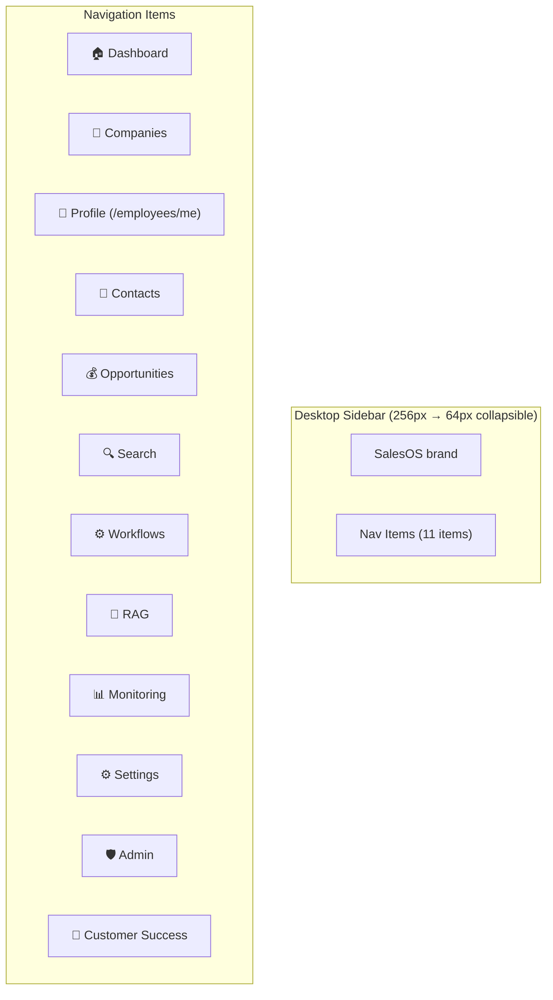
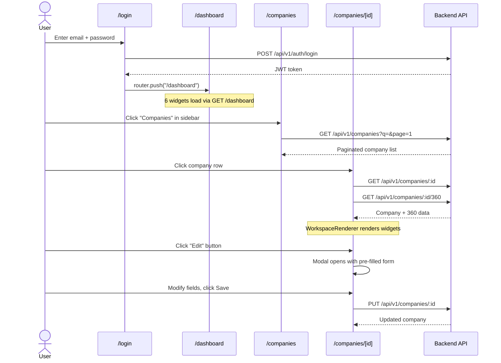
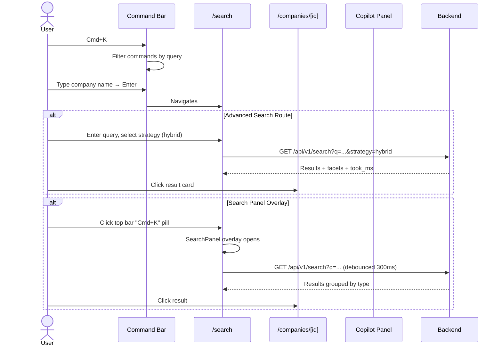
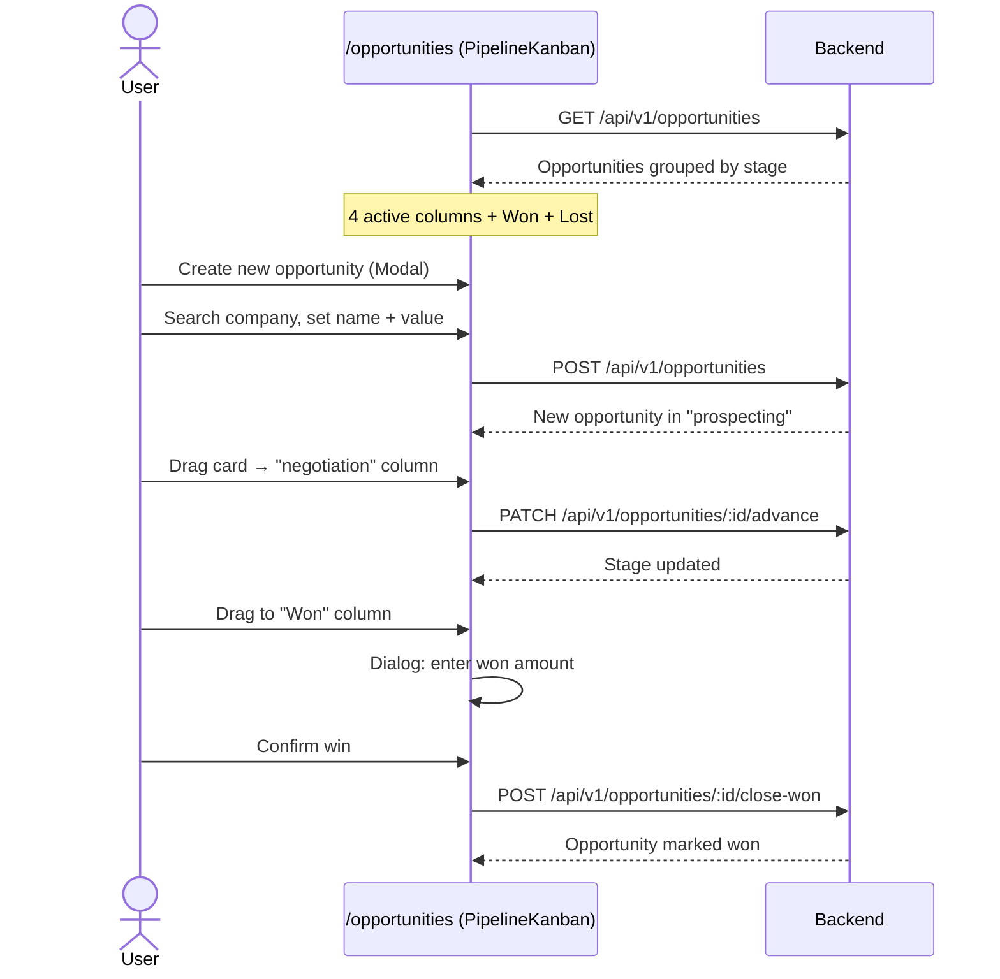
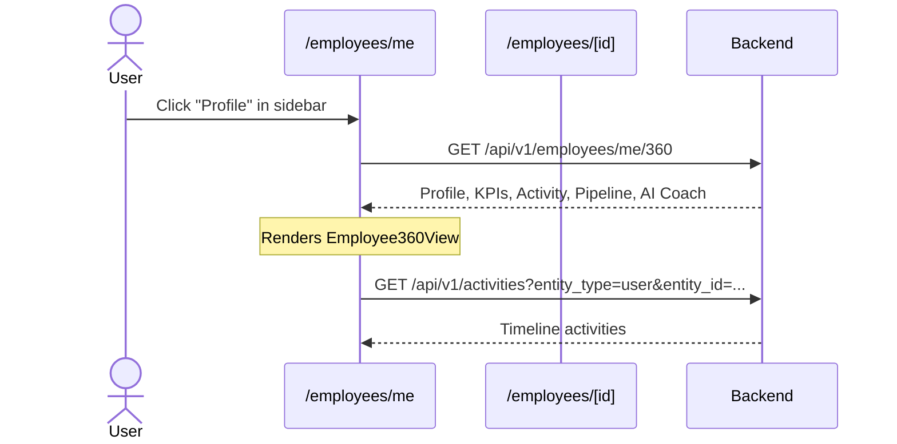
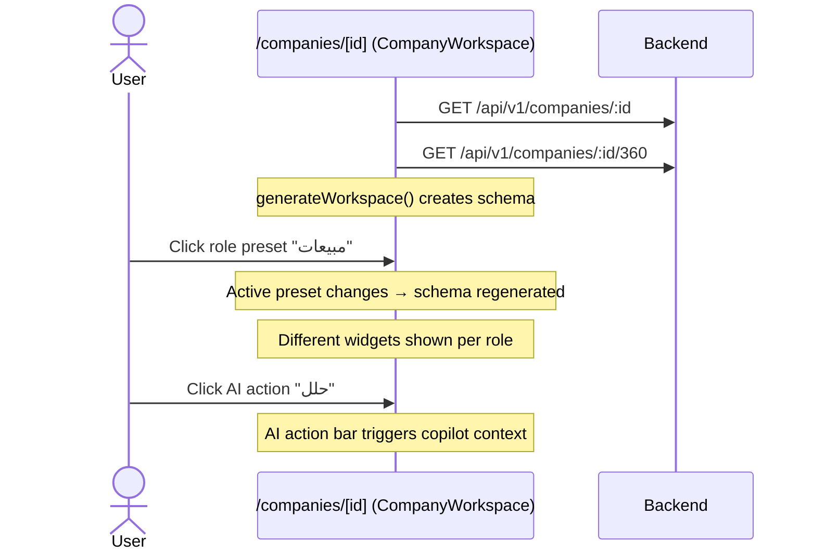
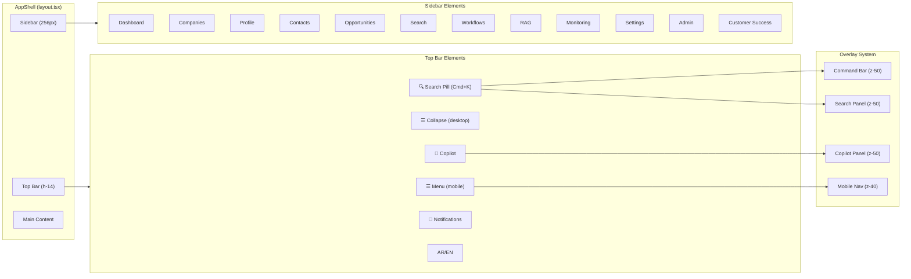

# SalesOS UX Architecture Audit

> Reverse-engineering audit by UX Architect | 2026-07-13
> Scope: Full frontend (`salesos/frontend`) + Engineering OS (`engineering-os/`)

---

## Table of Contents

1. [Screen Inventory](#1-screen-inventory)
2. [Information Architecture Map](#2-information-architecture-map)
3. [Navigation Architecture](#3-navigation-architecture)
4. [User Flow Maps](#4-user-flow-maps)
5. [Layout Patterns](#5-layout-patterns)
6. [Widget/Dashboard UX Analysis](#6-widgetdashboard-ux-analysis)
7. [RTL/Arabic UX Readiness](#7-rtlarabic-ux-readiness)
8. [Responsive Design Assessment](#8-responsive-design-assessment)
9. [Accessibility (a11y) Assessment](#9-accessibility-a11y-assessment)
10. [UX Consistency & Friction Point Analysis](#10-ux-consistency--friction-point-analysis)
11. [UX Debt Register](#11-ux-debt-register)

---

## 1. Screen Inventory

### 1.1 Route Map — Complete Screen Catalog

| # | Route | Component/Feature | Status | Implementation |
|---|-------|-------------------|--------|---------------|
| S01 | `/` | Landing page (`app/page.tsx`) | ✅ Complete | Static CTA (login/register) |
| S02 | `/login` | Login page (`(auth)/login/page.tsx`) | ✅ Complete | Client-side form, Arabic labels |
| S03 | `/register` | Register page (`(auth)/register/page.tsx`) | ✅ Complete | Client-side form, validation |
| S04 | `/dashboard` | Executive Dashboard (`(dashboard)/page.tsx` → `features/dashboard/`) | ✅ Complete | 6 widgets via registry |
| S05 | `/companies` | Company List (`(dashboard)/companies/page.tsx`) | ✅ Complete | Search, filter, paginated table |
| S06 | `/companies/[id]` | Company Workspace (`(dashboard)/companies/[id]/page.tsx` → `company-workspace.tsx`) | ✅ Complete | WorkspaceRenderer, role presets |
| S07 | `/contacts` | Contacts List (`(dashboard)/contacts/page.tsx`) | ✅ Complete | CRUD table with search |
| S08 | `/opportunities` | Pipeline Kanban (`(dashboard)/opportunities/page.tsx` → `pipeline-kanban.tsx`) | ✅ Complete | Drag-drop kanban |
| S09 | `/search` | Advanced Search (`(dashboard)/search/page.tsx`) | ✅ Complete | Full-text/semantic/hybrid, facets |
| S10 | `/employees/me` | My Employee 360 (`(dashboard)/employees/me/page.tsx` → `employee-360-view.tsx`) | ✅ Complete | Profile, KPIs, AI coach |
| S11 | `/employees/[id]` | Employee 360 View (`(dashboard)/employees/[id]/page.tsx`) | ✅ Complete | Same view, other employee |
| S12 | `/settings` | Settings (`(dashboard)/settings/page.tsx`) | ✅ Complete | Profile, Security, Notifications, API, Data tabs |
| S13 | `/admin` | Admin Dashboard (`(dashboard)/admin/page.tsx` → `features/admin/AdminWorkspace`) | ✅ Complete | Admin workspace |
| S14 | `/automation` | Automation Workspace (`(dashboard)/automation/page.tsx`) | ✅ Complete | Automation workflows |
| S15 | `/rag` | RAG Workspace (`(dashboard)/rag/page.tsx`) | ✅ Complete | RAG management |
| S16 | `/monitoring` | System Monitoring (`(dashboard)/monitoring/page.tsx`) | ✅ Complete | Real-time metrics, 30s polling |
| S17 | `/customer-success` | Customer Success (`(dashboard)/customer-success/page.tsx`) | ✅ Complete | CS workspace |

### 1.2 Overlay / Panel Screens

| # | Trigger | Component | Status |
|---|---------|-----------|--------|
| O1 | `Cmd+K` / `Ctrl+K` | Command Bar (`command-bar.tsx`) | ✅ Complete |
| O2 | Top bar search pill / F3 | Search Panel (`search-panel.tsx`) | ✅ Complete |
| O3 | Top bar Bot icon | Copilot Panel (`copilot-panel.tsx`) | ✅ Complete |
| O4 | FAB button (mobile) | Mobile Nav drawer (`MobileNav.tsx`) | ✅ Complete |

### 1.3 Screens in Engineering OS Design Spec (Not Yet Implemented)

| ID | Screen | Status | Priority |
|----|--------|--------|----------|
| S-003 | Overview Tab (Signals, Recommendations, Relationship Graph) | ❌ Not started | P0 |
| S-004 | Documents & Gov Data Tab | ❌ Not started | P1 |
| S-005 | Trust & Sources Tab | ❌ Not started | P1 |
| S-010 | Intelligence Feed (`/intelligence`) | ❌ Not started | P1 |
| S-013 | Smart Timeline (`/companies/[id]/timeline`) | ❌ Not started | P1 |
| S-014 | Relationship Graph (`/companies/[id]/relationships`) | ❌ Not started | P1 |
| S-016 | Company DNA Panel | ❌ Not started | P1 |
| S-021 | Company List Quick Preview Sheet | ❌ Not started | P1 |

**Total**: 17 implemented routes + 3 overlays active; 8 design-spec screens pending.

---

## 2. Information Architecture Map

```mermaid
graph TD
    subgraph Public
        LANDING["/ — Landing Page"]
        LOGIN["/login"]
        REGISTER["/register"]
    end

    subgraph Authenticated["(dashboard) Layout — AppShell + Sidebar + TopBar"]
        DASH["/dashboard — Executive Dashboard"]
        COMPANIES["/companies — Company List"]
        COMPANY["/companies/[id] — Company Workspace"]
        CONTACTS["/contacts — Contacts"]
        OPPORTUNITIES["/opportunities — Pipeline Kanban"]
        SEARCH["/search — Advanced Search"]
        EMPLOYEES["/employees/me — My Profile"]
        EMPLOYEE["/employees/[id] — Employee 360"]
        SETTINGS["/settings — Settings Panel"]
        ADMIN["/admin — Admin Workspace"]
        AUTOMATION["/automation — Workflow Automation"]
        RAG["/rag — RAG Management"]
        MONITORING["/monitoring — System Health"]
        CS["/customer-success — CS Workspace"]
    end

    subgraph Company_Workspace_Tabs["Company Workspace (planned)"]
        TAB_OVERVIEW["Overview Tab ❌"]
        TAB_TIMELINE["Timeline & Signals ❌"]
        TAB_PEOPLE["People & Relationships ❌"]
        TAB_DOCS["Documents & Gov Data ❌"]
        TAB_TRUST["Trust & Sources ❌"]
    end

    subgraph Overlays
        CMD["Command Bar — Cmd+K"]
        SEARCH_PANEL["Search Panel — Overlay"]
        COPILOT["Copilot Panel — Floating"]
        MOBILE_NAV["Mobile Nav — Drawer"]
    end

    LANDING --> LOGIN
    LANDING --> REGISTER
    LOGIN --> DASH
    REGISTER --> DASH

    DASH --> COMPANIES
    DASH --> CONTACTS
    DASH --> OPPORTUNITIES
    DASH --> EMPLOYEES
    DASH --> SETTINGS
    DASH --> SEARCH
    DASH --> ADMIN
    DASH --> AUTOMATION
    DASH --> RAG
    DASH --> MONITORING
    DASH --> CS

    COMPANIES --> COMPANY
    COMPANY --> TAB_OVERVIEW
    COMPANY --> TAB_TIMELINE
    COMPANY --> TAB_PEOPLE
    COMPANY --> TAB_DOCS
    COMPANY --> TAB_TRUST
    COMPANY --> EMPLOYEE

    CONTACTS --> COMPANY
    OPPORTUNITIES --> COMPANY

    CMD -.-> DASH
    CMD -.-> COMPANIES
    CMD -.-> CONTACTS
    CMD -.-> OPPORTUNITIES
    CMD -.-> EMPLOYEES
    CMD -.-> SEARCH
    CMD -.-> SETTINGS
    CMD -.-> MONITORING

    SEARCH --> COMPANY
    COPILOT -.-> COMPANY
```



### Key IA Observations

| Aspect | Finding |
|--------|---------|
| Hierarchy depth | 3 levels max: Shell → Section → Detail (good) |
| Cross-linking | Companies link to Contacts/Opportunities and vice versa |
| Overlays | 4 parallel overlay systems (Command, Search, Copilot, Mobile Nav) — potential z-order conflicts |
| Missing routes | `/intelligence`, `/companies/[id]/timeline`, `/companies/[id]/relationships` in spec but not implemented |
| Empty directories | `apps/` directory has 4 empty subdirectories (command-center, company-workspace, copilot, search) |

---

## 3. Navigation Architecture

### 3.1 Sidebar (Desktop)

**Source**: `src/app/(dashboard)/layout.tsx:167-204`



**Characteristics**:
- **Width**: 256px (expanded), 64px (collapsed) via `--sidebar` / `--sidebar-collapsed` CSS variables
- **Toggle**: Menu button in top bar; stores state in `AppShell` context
- **Active state**: Orange highlight (`var(--muhide-orange)/10` bg, orange text)
- **Icons**: Lucide React icons, always visible
- **Labels**: Arabic via `useTranslation()` i18n hook; hidden when collapsed
- **Collapsed mode**: Icon-only, tooltip on hover (`title` attribute)
- **Consistency concern**: Sidebar has 11 items; some are rarely-used admin tools mixed with core workflows

### 3.2 Top Bar

**Source**: `src/app/(dashboard)/layout.tsx:85-120`

| Element | Position | Function |
|---------|----------|----------|
| Menu toggle (md:hidden) | Leftmost | Opens mobile sidebar |
| Sidebar collapse toggle (hidden md:hidden) | Left | Collapses/expands sidebar |
| Search pill "Cmd+K" | Center (flex-1 spacer) | Opens Command Bar |
| Copilot (Bot icon) | Right | Opens Copilot Panel |
| Notifications (Bell icon) | Right | Placeholder — no dropdown implemented |
| Language Switcher | Far right | AR ↔ EN toggle |

### 3.3 Command Bar

**Source**: `src/components/command-bar.tsx`
- **Trigger**: `Cmd+K` / `Ctrl+K` globally
- **Position**: Centered overlay, `pt-[15vh]`
- **Width**: `max-w-xl` (576px)
- **Behavior**: Category-grouped commands, Arrow Up/Down navigation, Enter to execute
- **Commands registered**: Via `registerBuiltinCommands(router)` — navigates to all routes + theme toggle

### 3.4 Mobile Navigation

**Source**: `src/components/foundation/MobileNav.tsx`
- **Desktop sidebar**: Hidden on `< md`, replaced by:
  - **FAB button**: Orange floating circle (bottom corner), `md:hidden`
  - **Slide-in drawer**: From left/right edge (RTL-aware), `w-72 max-w-[80vw]`
  - **Backdrop**: Dark overlay with blur, click-to-close
  - **Close**: Auto-close on route change, Escape key
- **Bottom tab nav**: CSS transform via `.app-shell` media query converts sidebar to bottom bar on mobile (≤767px)

### 3.5 Navigation Issues

| Issue | Severity | Detail |
|-------|----------|--------|
| Missing breadcrumbs | Medium | No breadcrumb component anywhere — only "Back to" link in Company page |
| Notifications not functional | Low | Bell icon exists but has no connected dropdown/data |
| 11 sidebar items — no grouping | Medium | Admin tools (Monitoring, Admin, RAG) interleaved with core workflows |
| No current-user indicator in top bar | Medium | User's avatar/name not shown; only a blank avatar button |
| Command bar triggers both open AND close on Cmd+K | Medium | `command-bar.tsx:51-53` handler toggles when already open — should only open |
| Mobile sidebar duplicates NAV_KEYS | Low | `layout.tsx:18-31` and `MobileNav.tsx:17-28` independently define nav items |

---

## 4. User Flow Maps

### 4.1 Login → Dashboard → Company Detail → Edit Company



### 4.2 Global Search → Company Discovery



### 4.3 Pipeline Management (Kanban Drag-Drop)



### 4.4 Employee 360 View



### 4.5 Company Workspace with Role Presets



### Key Flow Observations

| Flow | Smoothness | Issues |
|------|-----------|--------|
| Login → Dashboard | Good | Redirect after login; no loading transition |
| Company list → Detail | Good | `companyId` passed as prop; WorkspaceRenderer handles loading |
| Pipeline drag-drop | Good | Optimistic UI via mutation |
| Search | Fragmented | Two different search UIs for same data: Command Bar (command-based) vs Search Panel (actual search) vs `/search` page |
| Copilot | Limited | Always opens with `entityType="company"` — not context-aware per route |

---

## 5. Layout Patterns

### 5.1 Dashboard Layout (Widget Grid)

**Source**: `features/dashboard/_layout/dashboard-grid.tsx`

```
┌─────────────────────────────────────────────┐
│  Top Bar (56px)                             │
├──────┬──────────────────────────────────────┤
│Sidebar│  Dashboard Grid (6 columns, 1rem gap) │
│256px │  ┌──────────┐ ┌──────────┐ ┌──────┐ │
│      │  │ Mission  │ │ Decision │ │ Intel│ │
│      │  │ Center   │ │ Queue    │ │ Feed │ │
│      │  ├──────────┤ ├──────────┤ ├──────┤ │
│      │  │ AI Brief │ │ Market   │ │Recent│ │
│      │  │ (full w) │ │ Pulse    │ │Active│ │
│      │  └──────────┘ └──────────┘ └──────┘ │
└──────┴──────────────────────────────────────┘
```

**Pattern**: CSS Grid with responsive breakpoints:
- Mobile: 1 column
- `sm` (640px): 2 columns
- `md` (768px): 4 columns
- `lg` (1024px): 6 columns

**Widget contract**: Container/View pattern — each widget has a Container (fetches data, manages state) and a View (pure presentation). Widget registry defines grid positioning per widget.

### 5.2 Company Workspace Layout

**Source**: `components/company-workspace.tsx`, `components/foundation/workspace-layout.tsx`

```
┌─────────────────────────────────────────────┐
│  Top Bar                                     │
├──────┬──────────────────────────────────────┤
│Sidebar│  Company Header Card                 │
│      │  ┌──────────────────────────────┐    │
│      │  │ Logo | Name | CR# | Badges   │    │
│      │  │ Role presets: مبيعات | تسويق │    │
│      │  │ AI actions: حلل | لخص | توقع  │    │
│      │  └──────────────────────────────┘    │
│      │  WorkspaceRenderer (widget grid)      │
│      │  ┌────────┐ ┌────────┐ ┌───────┐    │
│      │  │Overview│ │Revenue │ │Timeline│   │
│      │  └────────┘ └────────┘ └───────┘    │
└──────┴──────────────────────────────────────┘
```

**Role-based presets**: 6 roles (sales, marketing, executive, legal, operations, customer-success) — each generates a different widget layout via `generateWorkspace()`.

### 5.3 Settings Layout (Tabbed Panel)

**Source**: `(dashboard)/settings/page.tsx`

Left sidebar (tab list) + right content area. 5 tabs: Profile, Security, Notifications, API Keys, Data Settings. Simple toggle pattern — no URL-based tab routing.

### 5.4 Auth Layout (Centered Card)

**Source**: `(auth)/login/page.tsx`, `(auth)/register/page.tsx`

Centered card (`max-w-md`) on full-screen background. No sidebar or app shell. Simple form layout.

### 5.5 Search Layout (Full-Page with Facets)

**Source**: `(dashboard)/search/page.tsx`

Single-column layout (max-w-5xl, centered). Strategy toggle (fulltext/semantic/hybrid), results list, facets grid at bottom.

### 5.6 Pipeline Layout (Horizontal Kanban)

**Source**: `pipeline-kanban.tsx`

Horizontally scrollable columns, fixed 260px width per column. Drag-and-drop between columns.

### Layout Pattern Consistency

| Pattern | Used Where | Consistency |
|---------|-----------|-------------|
| Dashboard Grid (6-col) | Dashboard, Company Workspace widgets | ✅ Consistent via SDK |
| Table + Search + Pagination | Companies, Contacts | ✅ Consistent pattern |
| Tabbed Panel | Settings | ⚠️ Only one instance |
| Kanban Columns | Opportunities | ✅ Single purpose |
| Modal-based CRUD | Companies, Contacts, Opportunities | ✅ Consistent Modal pattern |
| Error Fallback | All data pages | ✅ Shared ErrorFallback component |

---

## 6. Widget/Dashboard UX Analysis

### 6.1 Widget Architecture

**Source**: `application/dashboard/`, `features/dashboard/`

```
application/dashboard/
├── api.ts              → GET /dashboard aggregator endpoint
├── dashboard.dto.ts    → Dashboard DTO type
├── dashboard.mapper.ts → API response → domain model
├── dashboard.query.ts  → useDashboard() hook
├── widget.contract.ts  → DashboardWidget<T> type + WidgetStatus enum
└── widget.store.ts     → Per-widget status store

features/dashboard/
├── _registry/widget-config.ts  → Grid positioning per widget
├── _registry/widget-registry.tsx → createRegistry() factory
├── widget-registry.tsx          → Registered widgets (6)
├── _layout/
│   ├── dashboard-grid.tsx       → Responsive CSS grid
│   ├── dashboard-layout.tsx     → Provider wrapper
│   ├── dashboard-page.tsx       → Full page (grid + error)
│   ├── dashboard-error-boundary.tsx → Per-widget error isolation
│   └── dashboard-loading.tsx    → Skeleton grid
└── widgets/
    ├── widget-card.tsx          → Status-aware card shell
    ├── mission-center/          → Container + View
    ├── decision-queue/
    ├── intelligence-feed/
    ├── ai-brief/
    ├── market-pulse/
    └── recent-activity/
```

### 6.2 Widget Contract (4-State Model)

Each widget supports 4 statuses per `widget.contract.ts`:

| Status | Visual Treatment |
|--------|-----------------|
| `ready` | Full content |
| `loading` | Centered spinner |
| `degraded` | Content blurred + orange overlay ("بيانات جزئية") |
| `error` | Warning icon + "تعذر تحميل البيانات" |

### 6.3 Registered Widgets (Executive Dashboard)

| Widget | gridColumn | Purpose | Data Source |
|--------|-----------|---------|-------------|
| `missionCenter` | `span 2` | 4 KPI metric cards | `GET /dashboard` |
| `decisionQueue` | `span 2` | Actionable recommendations | `GET /dashboard` |
| `intelligenceFeed` | `span 2` | Signal feed | `GET /dashboard` |
| `aiBrief` | `span 4` | Full-width AI summary | `GET /dashboard` |
| `marketPulse` | `span 3` | Market trends | `GET /dashboard` |
| `recentActivity` | `span 3` | Activity feed | `GET /dashboard` |

### 6.4 Company Intelligence Widgets (Planned)

**Source**: `features/company-intelligence/widgets/`

10 widget directories exist (ai-recommendation, buying-journey, company-dna, decision-makers, document-intelligence, golden-record, government-intelligence, relationship-graph, signals-feed, smart-timeline) but implementation status varies.

### 6.5 Widget UX Issues

| Issue | Severity | Detail |
|-------|----------|--------|
| Widget loading stutter | Medium | Each widget loads independently; no coordinated loading |
| No widget empty state for `ready` with no data | Medium | `ready` status shows children even when data is empty |
| `degraded` overlay is too opaque | Low | `opacity: 0.5` + `blur(0.5px)` renders content nearly unreadable |
| No widget refresh controls | Medium | Users can't manually refresh individual widgets |
| Widget ordering not configurable | Medium | Grid positions are hardcoded in registry, not user-customizable |
| Mission Center missing from Company Workspace | High | MissionCenter widget only on Dashboard; no cross-entity KPIs |
| Copilot not context-aware per page | High | Always opens with `entityType="company"` regardless of current route |

---

## 7. RTL/Arabic UX Readiness

### 7.1 RTL Infrastructure

| Component | RTL Support | Source |
|-----------|-------------|--------|
| HTML `dir` attribute | ✅ Dynamic via localStorage/inline script | `layout.tsx:16-26` |
| HTML `lang` attribute | ✅ Dynamic (`ar` / `en`) | `layout.tsx:16-26` |
| Font stack | ✅ IBM Plex Sans Arabic for RTL | `globals.css:60-62, 115-122` |
| Language switcher | ✅ AR ↔ EN button in top bar | `LanguageSwitcher.tsx` |
| i18n system | ✅ `useTranslation()` hook, `I18nProvider` | `lib/i18n` |
| CSS logical properties | ✅ `start-0`, `end-4`, `me-auto` used | Throughout |
| Tailwind RTL | ✅ `start-0`, `end-*`, `ms-auto` prefixes | Tailwind v3.4+ |
| Slide animations RTL-aware | ✅ `animate-slide-in-right` vs `animate-slide-in-left` | `layout.tsx:43` |
| Form inputs | ✅ `text-right` on Arabic form fields | Companies, Contacts |

### 7.2 Arabic Content Coverage

| Area | Coverage | Notes |
|------|----------|-------|
| UI labels (navigation) | 100% | All `t(key)` calls resolved |
| Page headings | 100% | Hardcoded Arabic strings |
| Form labels | 100% | Arabic labels throughout |
| Error messages | 100% | Arabic error strings |
| Empty states | 100% | Arabic messages |
| Loading states | 100% | "جاري التحميل..." |
| Action buttons | 100% | Arabic button labels |
| API error responses | ~70% | Some backend errors return English `detail` strings |
| Settings tab labels | 100% | Mixed: Arabic + "API Keys" English |
| Monitoring metrics | 100% | Arabic labels |
| Copilot welcome message | 100% | Arabic greeting |

### 7.3 RTL Issues

| Issue | Severity | Detail |
|-------|----------|--------|
| Mixed language in Settings | Low | "API Keys" tab uses English alongside Arabic tabs |
| Pipeline column labels sometimes English | Low | `opportunity.status` values returned from API may be English |
| Table column `data-label` attributes all Arabic | ✅ Good |
| `defaultLocale` hardcoded to `ar` in providers | Info | `providers.tsx:28` — startup always defaults to Arabic |
| Direction detection script runs in `<head>` before React hydration | ✅ Good |
| No RTL-specific visual QA performed | Medium | Screen inventory marks RTL as Partial |

---

## 8. Responsive Design Assessment

### 8.1 Breakpoint Strategy

**Source**: `tailwind.config.ts` + `globals.css`

| Breakpoint | Min Width | Behavior |
|------------|-----------|----------|
| Base (mobile) | < 640px | Single column, FAB nav, card tables |
| `sm` | 640px | 2-column grids, inline table headers |
| `md` | 768px | Desktop sidebar appears, 4-column grids |
| `lg` | 1024px | 6-column dashboard grid, 2-column settings |
| `xl` | 1280px | 4-column widget grids |

### 8.2 Responsive Patterns

| Pattern | Desktop | Tablet | Mobile |
|---------|---------|--------|--------|
| **Sidebar** | 256px fixed left | 256px | Hidden → FAB + drawer + bottom tab bar |
| **Tables** | Full table with headers | Horizontal scroll | Card layout via `data-label` |
| **Widget Grid** | 4-6 columns | 4 columns | 1 column |
| **Kanban** | Horizontal scroll columns | Horizontal scroll | Card stack |
| **Search** | `max-w-5xl` centered | Full width | Full width with `mx-2` |
| **Settings** | Sidebar + content | Sidebar + content | Tab list hidden; single column |
| **Auth** | `max-w-md` centered | Same | Same |
| **Top Bar** | Full height, all buttons visible | Full | Reduced; mobile hamburger |
| **Copilot Panel** | `w-[420px]`, `end-4`, `bottom-8` | Same | `max-w-[calc(100vw-2rem)]` |

### 8.3 Responsive Issues

| Issue | Severity | Detail |
|-------|----------|--------|
| Settings tab sidebar hidden on mobile with no alternative | High | Users on mobile cannot switch settings tabs — only sees first tab (Profile) |
| FAB + Drawer + Bottom Tab bar = 3 mobile nav surfaces | Medium | Redundant: both FAB drawer AND CSS-transformed bottom tab bar present |
| Copilot fullscreen on mobile blocks all content | Medium | No mobile-specific copilot behavior; fullscreen takes entire viewport |
| Kanban needs horizontal scroll even on tablet | Low | Fixed 260px columns don't shrink |
| Dashboard grid drops to 1 column too early | Low | `!important` overrides in `<style>` tag force mobile layout early |

---

## 9. Accessibility (a11y) Assessment

### 9.1 Compliance Summary

**Standard**: WCAG 2.1 AA (target per Engineering Constitution, Widget SDK §9)

### 9.2 Implemented a11y Features

| Feature | Implementation | Source |
|---------|---------------|--------|
| `aria-label` on interactive elements | ✅ | Buttons in top bar, mobile nav |
| `aria-expanded` on toggle buttons | ✅ | Mobile nav FAB |
| `aria-modal="true"` on overlays | ✅ | Mobile nav drawer |
| `role="dialog"` on overlays | ✅ | Mobile nav, Copilot panel |
| `role="alert"` on error states | ✅ | ErrorFallback, DashboardBody |
| `aria-live="polite"` for dynamic content | ✅ | AppShell command palette status |
| `aria-atomic="true"` | ✅ | AppShell |
| Semantic HTML (`<nav>`, `<main>`, `<header>`, `<aside>`) | ✅ | Dashboard layout |
| Focus management (auto-focus inputs) | ✅ | Command Bar, Search Panel |
| Keyboard navigation (Escape, Arrows) | ✅ | Command Bar, Mobile Nav |
| Minimum touch target (44px) | ✅ | Top bar buttons, mobile nav items |
| `sr-only` text for screen readers | ✅ | AppShell: "Press Ctrl+K..." |
| SVG `aria-hidden="true"` | ✅ | ErrorFallback icon |
| `role="tablist"` on tab containers | ✅ | WorkspaceLayout tabs |

### 9.3 a11y Gaps

| Issue | Severity | Standard Violated | Detail |
|-------|----------|-------------------|--------|
| No `alt` text on company logos/avatars | High | WCAG 1.1.1 | Avatar images in Employee360 use empty `alt=""` |
| No skip-to-content link | High | WCAG 2.4.1 | No bypass block for sidebar/topbar navigation |
| Focus trap missing in modals | High | WCAG 2.1.2 | Command Bar, Search Panel, Modals don't trap focus |
| Color contrast of `text-muted` (#A59E90) on white | Medium | WCAG 1.4.3 | 2.66:1 ratio (needs 4.5:1 for normal text) |
| `kbd` elements too small to read | Low | WCAG 1.4.4 | `text-[10px]` below minimum recommended |
| No `aria-current="page"` on active nav item | Medium | WCAG 4.1.2 | Active state is visual-only (color) |
| Form inputs lack `aria-describedby` for errors | Medium | WCAG 3.3.1 | Error messages are sibling elements, not associated |
| Table `data-label` not accessible | Medium | WCAG 1.3.1 | Mobile card labels use `::before` CSS content, not readable by screen readers |
| No reduced motion support | Medium | WCAG 2.3.3 | `prefers-reduced-motion` not honored for animations/transitions |
| Language attribute mismatch risk | Low | WCAG 3.1.1 | `suppressHydrationWarning` masks SSR/client mismatch on `dir`/`lang` |

---

## 10. UX Consistency & Friction Point Analysis

### 10.1 Design Token Consistency

| Token | Usage | Consistency |
|-------|-------|-------------|
| `var(--muhide-orange)` / `#F57C1E` | Primary action color | ✅ High — used in buttons, links, active states |
| `--text-primary` / `--text-secondary` / `--text-muted` | Text hierarchy | ✅ Consistent across all components |
| `--bg-primary` / `--bg-secondary` / `--bg-tertiary` | Backgrounds | ✅ Consistent |
| `--border-default` / `--border-hover` | Borders | ✅ Consistent |
| `shadow-muhide-1` through `shadow-muhide-6` | Elevation | ✅ Consistent |
| `rounded-lg` / `rounded-xl` | Border radius | ✅ Consistent (8px / 12px) |
| Inline `style={{}}` objects | Widget Card | ⚠️ Inconsistent — uses inline styles instead of Tailwind |
| Hardcoded colors (`#991b1b`, `#fca5a5`) | Dashboard error state | ❌ Inconsistent — uses raw hex instead of design tokens |
| Hardcoded Tailwind classes (`text-neutral-900`) mixed with CSS vars | Mixed patterns | ⚠️ Both patterns coexist |

### 10.2 Interaction Pattern Consistency

| Pattern | Consistency | Notes |
|---------|-------------|-------|
| **Modal CRUD** | ✅ | Companies, Contacts, Opportunities all use consistent Modal component |
| **Table patterns** | ✅ | `responsive-table` class used on Companies, Contacts |
| **Search with debounce** | ✅ | 300-400ms debounce across Company Search, Contact Search, Search Panel |
| **Pagination** | ⚠️ | Inconsistent: Companies uses numbered buttons; Search uses prev/next arrows |
| **Empty states** | ⚠️ | Inconsistent: Companies has inline message; Contacts has centered icon+text; Search has dashed border card |
| **Loading states** | ⚠️ | Inconsistent: Some pages use `Spinner`, others use `animate-pulse` skeleton, Executive Dashboard uses custom skeleton |
| **Back navigation** | ⚠️ | Company page has back link; Employee page has back link; no breadcrumbs |
| **Toast notifications** | ✅ | Consistent `useToast()` usage in Contacts CRUD |

### 10.3 Friction Points

| # | Friction Point | Impact | Detail |
|---|---------------|--------|--------|
| 1 | Two search surfaces compete | High | Command Bar (command palette) vs Search Panel (actual search) — different UIs, different results, same shortcut trigger confusion |
| 2 | No way to navigate between companies without returning to list | Medium | Company detail page has no "Next/Previous company" navigation |
| 3 | Dashboard and Company Workspace feel like separate apps | High | Dashboard uses widget registry; Company Workspace uses `WorkspaceRenderer` + `generateWorkspace()` — different architectures, different feel |
| 4 | No persistent state across visits | Medium | Copilot chat persists in localStorage but dashboard view state (filters, collapsed widgets) does not |
| 5 | 11 sidebar items without organization | Medium | Users must scan all 11 items; no sections, no dividers, no favorites |
| 6 | Settings has no route-level tabs | Medium | Tab state is component-local; refreshing the page resets to "Profile" tab |
| 7 | Company workspace tabs missing | High | Screen spec calls for 5 tabs (Overview, Timeline, People, Documents, Trust) — none implemented as tabbed UI |
| 8 | Copilot always needs re-trigger | Medium | Copilot panel dismissed when navigating; doesn't persist context across routes |
| 9 | No form validation feedback beyond `disabled` state | Medium | Create forms disable the submit button instead of showing inline field errors |
| 10 | Inconsistent use of `useTranslation()` vs hardcoded Arabic | Low | Some components use `t()` i18n; others have hardcoded Arabic strings |

---

## 11. UX Debt Register

| ID | Area | Severity | Effort | Description | File(s) |
|----|------|----------|--------|-------------|---------|
| **UXD-001** | Settings mobile | High | 2 days | Settings tab sidebar hidden on mobile with no alternative — users stuck on first tab | `settings/page.tsx:33-49` |
| **UXD-002** | Accessibility | High | 3 days | No skip-to-content link, no focus traps in modals, no form error association | Multiple |
| **UXD-003** | Navigation | High | 3 days | No breadcrumbs anywhere; only "Back to" links | `companies/[id]/page.tsx:63-69`, `employees/[id]/page.tsx:14-18` |
| **UXD-004** | Search UX | Medium | 5 days | Two competing search interfaces (Command Bar vs Search Panel); different results, same trigger confusion | `command-bar.tsx`, `search-panel.tsx` |
| **UXD-005** | Dashboard architecture | Medium | 5 days | Dashboard and Company Workspace use different widget architectures — should converge on single SDK | `features/dashboard/` vs `components/company-workspace.tsx` |
| **UXD-006** | Company workspace tabs | High | 8 days | 5 tabs from design spec missing (Overview, Timeline & Signals, People, Documents, Trust) | `SCREEN_INVENTORY.md` S-003 through S-005 |
| **UXD-007** | Widget empty states | Medium | 2 days | WidgetCard shows children even when data is empty (ready status != non-empty data) | `widgets/widget-card.tsx:94` |
| **UXD-008** | Color contrast | Medium | 1 day | `text-muted` (#A59E90) on white fails WCAG AA (2.66:1) | `globals.css:50` |
| **UXD-009** | Notifications | Medium | 3 days | Bell icon renders but has no dropdown, no badge count, no data connection | `layout.tsx:116-118` |
| **UXD-010** | Copilot context | Medium | 3 days | Copilot always opens with `entityType="company"`; not aware of current route context | `layout.tsx:211` |
| **UXD-011** | Mobile nav redundancy | Low | 1 day | Both FAB drawer AND CSS bottom-tab-bar serve same function — pick one | `MobileNav.tsx`, `globals.css:141-205` |
| **UXD-012** | Hardcoded inline styles in DashboardErrorBoundary | Low | 1 day | Dashboard page error state uses raw hex colors instead of design tokens | `dashboard-page.tsx:16-43` |
| **UXD-013** | Pagination inconsistency | Low | 1 day | Companies uses numbered buttons; Search uses prev/next arrows | `companies/page.tsx:197-228`, `search/page.tsx:152-172` |
| **UXD-014** | Empty apps directory | Low | 0.5 day | `apps/` directory has 4 empty subdirectories — dead code | `apps/command-center/`, `apps/company-workspace/`, `apps/copilot/`, `apps/search/` |
| **UXD-015** | No user avatar/profile in top bar | Medium | 1 day | Top bar shows notification bell but no user identity indicator | `layout.tsx:85-120` |
| **UXD-016** | Reduced motion not honored | Medium | 2 days | Animations and transitions don't respect `prefers-reduced-motion` | `globals.css`, slide animations in `layout.tsx` |
| **UXD-017** | Table mobile `data-label` not accessible | Medium | 1 day | CSS `::before` content labels invisible to screen readers | `globals.css:228-271` |
| **UXD-018** | Nav item duplication | Low | 0.5 day | `NAV_KEYS` defined in both `layout.tsx:18-31` and `MobileNav.tsx:17-28` | Both files |
| **UXD-019** | Missing `/intelligence` route | Medium | 3 days | Intelligence Feed route in design spec (S-010) has no implementation | `SCREEN_INVENTORY.md` |
| **UXD-020** | Widget ordering not user-customizable | Low | 3 days | Dashboard grid positions hardcoded in widget registry | `features/dashboard/_registry/widget-config.ts` |

---

## Appendix A: File Reference Index

| File | Role |
|------|------|
| `src/app/layout.tsx` | Root layout, RTL script, metadata |
| `src/app/providers.tsx` | QueryClient, Runtime, I18n, Toast providers |
| `src/app/(dashboard)/layout.tsx` | App shell: sidebar, top bar, overlays, mobile nav |
| `src/app/(dashboard)/page.tsx` | Dashboard route → `DashboardPage` |
| `src/components/command-bar.tsx` | Cmd+K command palette overlay |
| `src/components/search-panel.tsx` | Global search overlay |
| `src/components/copilot-panel.tsx` | Floating AI copilot chat |
| `src/components/company-workspace.tsx` | Company workspace with role presets |
| `src/components/executive-dashboard.tsx` | Legacy executive dashboard (KPI cards) |
| `src/components/pipeline-kanban.tsx` | Drag-drop opportunity kanban |
| `src/components/timeline-widget.tsx` | Activity timeline widget |
| `src/components/employee-360-view.tsx` | Employee 360 profile + KPIs + AI coach |
| `src/components/foundation/app-shell.tsx` | AppShell context (sidebar state, command open) |
| `src/components/foundation/MobileNav.tsx` | Mobile FAB + drawer navigation |
| `src/components/foundation/LanguageSwitcher.tsx` | AR/EN language toggle |
| `src/components/foundation/error-boundary.tsx` | ErrorFallback component |
| `src/components/foundation/workspace-layout.tsx` | Sidebar + header + tabs + content layout |
| `src/components/foundation/sidebar.tsx` | Multi-section sidebar component |
| `src/features/dashboard/_layout/dashboard-page.tsx` | Dashboard page with widget registry |
| `src/features/dashboard/_layout/dashboard-grid.tsx` | Responsive CSS Grid |
| `src/features/dashboard/widgets/widget-card.tsx` | Status-aware widget card (4 states) |
| `src/features/dashboard/widget-registry.tsx` | 6 registered dashboard widgets |
| `src/features/company-intelligence/widgets/` | 10 planned company widgets (varied status) |
| `src/features/search/` | Search page + AI search + command bar feature |
| `src/features/revenue-execution/` | Revenue domain layout + widgets |
| `src/application/dashboard/` | Dashboard aggregator, DTO, mapper, store |
| `src/app/globals.css` | Design tokens, fonts, responsive utilities |
| `tailwind.config.ts` | MUHIDE palette, spacing, shadows, z-index |
| `engineering-os/SCREEN_INVENTORY.md` | Design spec screen list |

---

## Appendix B: Navigation Architecture Diagram



---

*Audit generated 2026-07-13 by UX Architect — READ-ONLY, no modifications made.*
*204 source files analyzed across 17 routes, 4 overlays, 6 dashboard widgets, 12 features.*
