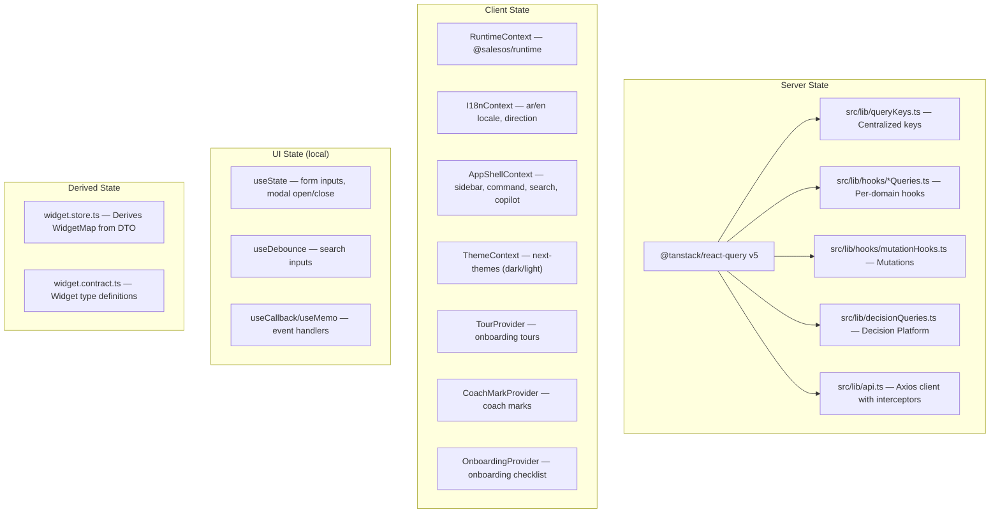
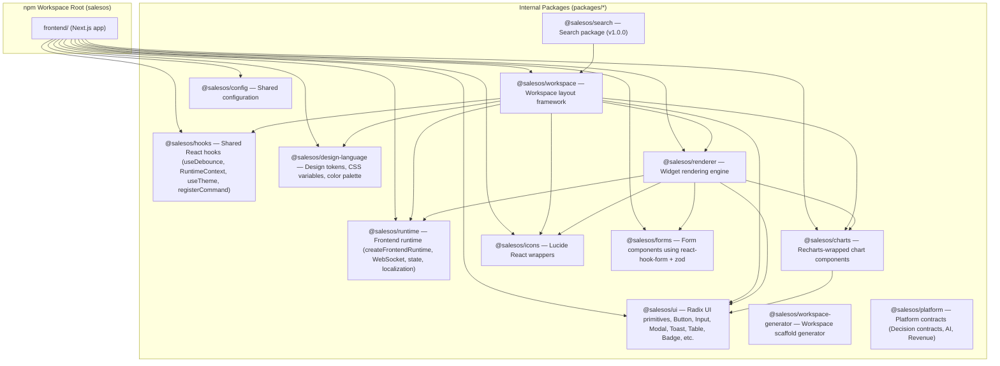

# Frontend Architecture Audit — SalesOS

> **Audit Type**: Deep Reverse-Engineering, READ-ONLY  
> **Auditor**: Frontend Architect  
> **Date**: 2026-07-13  
> **Scope**: `salesos/frontend/` (Next.js 15 + React 19 monorepo)

---

## Table of Contents

1. [Overview & Stack](#1-overview--stack)
2. [Next.js Architecture](#2-nextjs-architecture)
3. [Complete Route Tree](#3-complete-route-tree)
4. [State Management Architecture](#4-state-management-architecture)
5. [API Client Architecture](#5-api-client-architecture)
6. [Component Architecture Patterns](#6-component-architecture-patterns)
7. [Feature Module Architecture](#7-feature-module-architecture)
8. [Monorepo Structure](#8-monorepo-structure)
9. [Build & Bundling](#9-build--bundling)
10. [Performance Patterns](#10-performance-patterns)
11. [Testing Architecture](#11-testing-architecture)
12. [Frontend Technical Debt Register](#12-frontend-technical-debt-register)

---

## 1. Overview & Stack

| Category | Technology | Version |
|----------|-----------|---------|
| Framework | Next.js (App Router) | ^15.0 |
| UI Library | React | ^19.0 |
| Language | TypeScript | ^5.7 |
| Styling | Tailwind CSS | ^3.4 |
| State (Server) | TanStack React Query | ^5.60 |
| State (Client) | React Context + hooks | — |
| Forms | react-hook-form + zod | ^7.54 / ^3.23 |
| Tables | TanStack React Table | ^8.20 |
| Charts | Recharts | ^2.15 |
| Components | Radix UI primitives | — |
| Icons | Lucide React | ^0.460 |
| HTTP Client | Axios | ^1.7 |
| Testing | Jest + Testing Library + MSW | ^29.7 / ^16.1 / ^2.15 |
| Monorepo | npm workspaces | — |
| i18n | Custom React Context (ar/en) | — |
| Theming | next-themes (dark mode) | ^0.4 |
| Fonts | Viga + IBM Plex Sans/Arabic/Mono | — |
| Storybook | @storybook/react | ^8.0 |
| Server | Express reverse proxy | — |

---

## 2. Next.js Architecture

### 2.1 App Router Only — No Pages Router

The project uses **exclusively App Router** (`src/app/`). There is no `pages/` directory. The entire shell is client-rendered.

### 2.2 RSC vs Client Components

- **Root Layout** (`src/app/layout.tsx:28`): Server Component. Sets `<html>`/`<body>`, includes inline locale detection script, and wraps children in `<Providers>`.
- **Providers** (`src/app/providers.tsx:1`): `"use client"` — the entire provider tree is client-side. This means:
  - TanStack Query provider is client-only
  - Runtime provider is client-only  
  - I18n provider is client-only
- **Dashboard Layout** (`src/app/(dashboard)/layout.tsx:1`): `"use client"` — all navigation, auth checking, command registration, sidebars.
- **All pages under `(dashboard)`**: `"use client"` — every single page.
- **Auth pages** (`(auth)/login`, `(auth)/register`): `"use client"`.

**Key Finding**: The application is effectively a **SPA inside Next.js App Router**. There are zero Server Components beyond the root `layout.tsx`. No ISR, no SSR data fetching — all data is fetched client-side via React Query.

### 2.3 Rendering Strategy

- `next.config.js` sets `output: "standalone"` for Docker deployment.
- API calls are proxied via Next.js rewrites (`src/app/providers.tsx` rewrites `/api/*` to the backend).
- The Dockerfile builds with `next build`, copies `.next/standalone` to production image, then runs `node server.js` — the Express reverse proxy at `server/server.js` sits in front (port 3001 internal API mock server).
- **nginx.conf** exists for an alternative static-spa deployment path but is NOT the primary deployment — the Docker image uses `node server.js` (Next.js standalone server).

### 2.4 Offline/PWA

- `manifest.json` referenced in metadata.
- Theme-color meta tags set for PWA-like behavior.

---

## 3. Complete Route Tree

```mermaid
graph TD
    Root["/ (layout.tsx) — RSC"]
    Root --> Home["/ (page.tsx) — Landing"]
    Root --> Auth["(auth) — Route Group"]
    Root --> Dashboard["(dashboard) — Route Group"]
    
    Auth --> Login["/login — LoginPage"]
    Auth --> Register["/register — RegisterPage"]
    
    Dashboard --> DashLayout["layout.tsx — AppShell + Sidebar"]
    DashLayout --> DashPage["/dashboard — DashboardPage (SC)"]
    DashLayout --> Companies["/companies — CompaniesPage"]
    DashLayout --> CompanyDetail["/companies/[id] — CompanyPage"]
    DashLayout --> Contacts["/contacts — ContactsPage"]
    DashLayout --> Opportunities["/opportunities — PipelineKanban"]
    DashLayout --> Search["/search — SearchPage"]
    DashLayout --> Employees["/employees/[id] — EmployeePage"]
    DashLayout --> MyProfile["/employees/me — MyEmployeePage"]
    DashLayout --> Automation["/automation — AutomationWorkspace"]
    DashLayout --> RAG["/rag — RagWorkspace"]
    DashLayout --> Monitoring["/monitoring — MonitoringPage"]
    DashLayout --> Settings["/settings — SettingsPage"]
    DashLayout --> CustomerSuccess["/customer-success — CustomerSuccessPage"]
    DashLayout --> Admin["/admin — AdminWorkspace"]
```



### 3.1 Layout Nesting

```
RootLayout (app/layout.tsx)
├── Providers (app/providers.tsx)  [client boundary]
│   ├── QueryClientProvider
│   ├── I18nProvider
│   └── RuntimeContext.Provider
│       ├── / (landing page)
│       ├── (auth)/login, /register  [no sidebar]
│       └── (dashboard)/layout.tsx  [AppShell]
│           ├── Sidebar (desktop + mobile)
│           ├── Header (command bar trigger, copilot, notifications)
│           ├── CommandBar (⌘K)
│           ├── SearchPanel
│           ├── CopilotPanel
│           ├── MobileNav
│           └── {children: pages}
```

**No `loading.tsx`, `error.tsx`**, or `not-found.tsx` exist at any route level. Loading/error/empty states are handled per-component inline.

---

## 4. State Management Architecture



### 4.1 React Query Architecture

- **Single `QueryClient`** created in `Providers` with: `staleTime: 10s`, `retry: 1`, `refetchOnWindowFocus: false`.
- **Query keys** are centralized in `src/lib/queryKeys.ts` using hierarchical factory pattern:
  - `companyKeys`, `searchKeys`, `tenantKeys`, `dashboardKeys`, `company360Keys`, `employeeKeys`, `contactKeys`, `activityKeys`, `taskKeys`, `opportunityKeys`, `pipelineKeys`, `adminKeys`, `decisionKeys`.
- **Per-domain hooks** in `src/lib/hooks/`:
  - `companyQueries.ts` — `useCompany(id)`, `useCompanySearch(params)`
  - `company360Queries.ts` — Company 360 views
  - `contactQueries.ts` — CRUD with mutation invalidation
  - `employeeQueries.ts` — Employee 360
  - `searchQueries.ts` — hybrid search with strategy toggle
  - `opportunityQueries.ts` — pipeline data
  - `activityQueries.ts` — timeline activities
  - `taskQueries.ts` — task management
  - `executiveQueries.ts` — executive KPIs
  - `adminQueries.ts` — admin portal
- **Mutations** in `mutationHooks.ts`: `useLogin`, `useRegister`, `useCreateCompany`, `useUpdateCompany`, `useDeleteCompany`, `useAddContact`.
- **Additional queries**: `decisionQueries.ts` (Decision Platform), `workflowQueries.ts` (automation), `ragQueries.ts` (RAG).

### 4.2 Application Layer Pattern

```
src/application/<domain>/
├── <domain>.dto.ts          — Data Transfer Object types
├── <domain>.query.ts        — TanStack Query hooks
├── <domain>.keys.ts         — Query key factories
├── <domain>.store.ts        — State derivation/transformation
├── <domain>.mapper.ts       — DTO → UI mapping
├── <domain>.api.ts          — API call functions
├── use<Domain>.ts           — Unified hook (combines query + mapper)
└── __tests__/
    └── *.test.tsx
```

This is a **layered application architecture** (Clean Architecture-lite) visible in:
- `src/application/dashboard/` — Full implementation
- `src/application/company-intelligence/` — Partial implementation
- `src/application/search/` — Partial implementation  
- `src/application/revenue-execution/` — With NBA engine
- `src/application/api/` — API hooks

### 4.3 Widget Contract System

The Widget SDK defines a consistent contract in `src/application/dashboard/widget.contract.ts`:

```typescript
interface DashboardWidget<T> {
  id: string
  title: string
  status: 'ready' | 'loading' | 'degraded' | 'error'
  lastUpdated: string | null
  data: T | null
  actions: WidgetAction[]
}
```

The `widget.store.ts` derives widgets from a `DashboardDTO` with proper status derivation:
- No data + loading = `loading`
- Has data + loading = `degraded`  
- Error + no data = `error`
- Error + has data = `degraded`

---

## 5. API Client Architecture

### 5.1 Axios Configuration

**File**: `src/lib/api.ts`

- Base URL: `process.env.NEXT_PUBLIC_API_URL || "http://localhost:8000"`
- **Request interceptor**: Injects `Authorization: Bearer <token>` from localStorage
- **Response interceptor**: Handles 401 (redirect to login), 422 with missing auth header, 403 (warn)

### 5.2 Duplicate Client

**Warning**: `src/lib/api/client.ts` contains a **duplicate/simplified** Axios instance that only handles 401 but lacks the 422/403 handling. The main `src/lib/api.ts` is the canonical client.

### 5.3 API Proxy Strategy

- Next.js `rewrites()` in `next.config.js` proxies `/api/*` → backend
- All API calls use relative `/api/v1/*` paths
- Production Docker sets `NEXT_PUBLIC_API_URL=http://backend:8000`

### 5.4 API Scopes

The `src/lib/api.ts` file (1268 lines) is a monolithic API layer containing:
- **Types**: 70+ TypeScript interfaces (Company, Contact, Employee, Admin domains)
- **Functions**: 50+ exported async functions covering every backend endpoint
- **Domains covered**: Companies, Contacts, Employees, Opportunities, Pipelines, Search, Tasks, Activities, Entity Resolution, Admin Portal, DLQ, AI Costs, Billing, Feature Flags, Jobs

### 5.5 Monitoring & Telemetry

- `src/lib/monitoring.ts`: `Monitor` class with buffered `sendBeacon`/`fetch` flush. Tracks API calls, errors, renders, page loads, web vitals, memory. Production-only by default.
- `src/lib/analytics.ts`: `track()` function with batched events (50 threshold, 10s flush). Custom hooks: `usePageTracking`, `useWidgetTracking`.

---

## 6. Component Architecture Patterns

### 6.1 Foundation Components

Located at `src/components/foundation/` — 22 components that form the UI primitives:

| Component | File | Description |
|-----------|------|-------------|
| AppShell | `app-shell.tsx` | Dashboard shell context (sidebar, command, search state) |
| Card | `card.tsx` | Container card surface |
| Badge | `badge.tsx` | Status/type badges |
| Button (via @salesos/ui) | — | Button component from UI package |
| Input | — | From UI package |
| Sidebar | `sidebar.tsx` | Desktop sidebar layout |
| Header | `header.tsx` | Top navigation bar |
| Navigation | `navigation.tsx` | Nav item components |
| Grid | `grid.tsx` | Responsive grid layout |
| Stack | `stack.tsx` | Flex stack layout |
| Container | `container.tsx` | Width-constrained container |
| Typography | `typography.tsx` | H1-H6, body, caption |
| Icon | `icon.tsx` | Icon wrapper |
| Loading | `loading.tsx` | Loading states |
| Skeleton | `skeleton.tsx` | Skeleton loaders |
| ErrorBoundary | `error-boundary.tsx` | Error UI (used in all pages) |
| EmptyState | `empty-state.tsx` | Empty state illustrations |
| Metric | `metric.tsx` | KPI display card |
| WorkspaceLayout | `workspace-layout.tsx` | Generic workspace template |
| PageLayout | `page-layout.tsx` | Page template |
| Divider | `divider.tsx` | Visual separator |
| MobileNav | `MobileNav.tsx` | Bottom mobile navigation bar |
| LanguageSwitcher | `LanguageSwitcher.tsx` | ar/en toggle |
| CommandBar | `command-bar.tsx` | ⌘K command palette |
| Surface | `surface.tsx` | Elevated surface component |

### 6.2 Top-Level Components

Located at `src/components/`:

| Component | Description |
|-----------|-------------|
| `command-bar.tsx` | Global ⌘K palette |
| `search-panel.tsx` | Slide-out search overlay |
| `copilot-panel.tsx` | AI Copilot sidebar |
| `executive-dashboard.tsx` | Executive KPIs dashboard |
| `pipeline-kanban.tsx` | Kanban pipeline view (with `OpportunityCard`, `PipelineColumn`) |
| `timeline-widget.tsx` | Timeline/activity feed |
| `company-workspace.tsx` | Company 360 workspace |
| `employee-360-view.tsx` | Employee 360 view |

### 6.3 Guidance System

`src/components/guidance/` — multi-layered user guidance:

- **`tour/`**: `TourProvider`, `TourOverlay`, tour steps (`welcome.ts`, `pipeline.ts`, `rag.ts`, `workflow.ts`, `nba.ts`)
- **`onboarding/`**: `OnboardingProvider`, `OnboardingChecklist`
- **`coach-mark/`**: `CoachMarkProvider`, `CoachMarkRenderer`, `CoachMarkBubble`
- **`empty-states/`**: `EmptyState`, `EmptyWorkflows`, `EmptyRAG`, `EmptyPipeline`, `EmptyMeetings`, `EmptyNBA`, `EmptyAnalytics`

### 6.4 Container/View Pattern

Used in admin features (`src/features/admin/widgets/`):
- `RoleManagerContainer.tsx` / `RoleManagerView.tsx`
- `AuditLogContainer.tsx` / `AuditLogView.tsx`

This follows the Engineering Constitution Article 9.1 mandate.

---

## 7. Feature Module Architecture

### 7.1 Module Structure

```
src/features/
├── search/                          # Search domain feature
│   ├── components/                  # ~15 search UI components
│   │   ├── SearchBar, SearchInput, SearchResultCard, SearchFilters
│   │   ├── SearchFacet, SearchGroup, SearchHeader, SearchHistory
│   │   ├── SearchLoading, SearchEmpty, SearchError
│   │   ├── SearchPill, SearchBadge, SearchSuggestion, SearchSection
│   │   ├── index.ts                 # Barrel export
│   │   └── __tests__/               # Per-component tests
│   ├── ai-search/                   # AI-powered search
│   │   ├── AIAnswer.tsx
│   │   └── __tests__/
│   ├── search-page/                 # Full search page
│   │   ├── SearchPage.tsx
│   │   └── __tests__/
│   ├── quick-overlay/               # ⌘K overlay search
│   │   ├── QuickOverlay.tsx
│   │   └── __tests__/
│   └── index.ts                     # Feature barrel
│
├── dashboard/                       # Dashboard domain
│   ├── _layout/dashboard-page.tsx   # Main dashboard page
│   ├── _registry/
│   │   ├── widget-config.ts         # Widget grid config
│   │   └── widget-registry.tsx      # Registry factory
│   ├── _providers/
│   │   ├── dashboard-provider.tsx   # Dashboard context
│   │   └── __tests__/
│   ├── _telemetry/
│   │   └── dashboard-telemetry.ts
│   └── widgets/                     # Dashboard widgets
│       └── mission-center/
│
├── company-intelligence/            # Company 360 intelligence
│   ├── _layout/
│   │   └── company-intelligence-layout.tsx
│   ├── _providers/
│   │   └── company-intelligence-provider.tsx
│   ├── _registry/widget-config.ts
│   └── widgets/
│       ├── smart-timeline/
│       ├── signals-feed/
│       ├── relationship-graph/
│       ├── company-dna/
│       ├── ai-recommendation/
│       ├── decision-makers/
│       └── buying-journey/
│
├── revenue-execution/               # Revenue domain
│   ├── _providers/DecisionProvider.tsx
│   └── widgets/
│       ├── revenue-health/
│       ├── forecast-intelligence/
│       ├── opportunity-list/
│       └── meeting-intelligence/
│
├── employee-intelligence/           # Employee domain
│   ├── _layout/
│   ├── _providers/
│   └── workspace/
│
├── admin/                           # Admin domain
│   ├── AdminWorkspace.tsx
│   └── widgets/
│       ├── HealthDashboard, FeatureFlagManager
│       ├── UserList, TenantList, JobList, PlanManager
│       ├── AICostDashboard
│       ├── role-manager/ (Container + View)
│       └── audit-log/ (Container + View)
│
├── search/ (see above)
├── rag/                             # RAG domain
│   ├── workspace/rag/
│   └── widgets/
│       ├── rag-documents/
│       └── rag-chat/
│
├── automation/                      # Workflow automation
│   ├── workspace/automation/
│   └── widgets/workflow-builder/
│
├── analytics/                       # Analytics domain
│   ├── AnalyticsContainer.tsx
│   ├── AnalyticsView.tsx
│   ├── FeedbackWidget.tsx
│   └── types.ts
│
├── customer-success/                # Customer success
│   └── workspace/customer-success/
│
└── demo/                            # Demo utilities
    ├── DemoBadge.tsx
    ├── DemoResetButton.tsx
    ├── ScenarioLauncher.tsx
    └── index.ts
```

### 7.2 Naming Conventions

- **Private modules**: `_layout/`, `_providers/`, `_registry/`, `_telemetry/` — underscore prefix indicates feature-internal modules.
- **Widgets**: `widgets/<widget-name>/` with optional `__tests__/` per widget.
- **Workspace**: `workspace/<domain-name>/` for full-page workspace components.
- **Barrel files**: `index.ts` at every important directory level.

### 7.3 Cross-Feature References

- Features import from `@/application/` (application layer) for shared contracts/state.
- Features import from `@salesos/*` packages for reusable UI/hooks.
- Features import from `@/lib/` for domain queries.
- Features import from `@/components/` for foundation + top-level components.

---

## 8. Monorepo Structure

### 8.1 Workspace Configuration

**File**: `frontend/package.json` (`"workspaces": ["packages/*"]`)

### 8.2 Package Inventory



### 8.3 Package Details

| Package | Version | Main | Key Dependencies |
|---------|---------|------|-----------------|
| `@salesos/ui` | 5.0.0 | `src/index.ts` | Radix UI, lucide-react, tailwind-merge, clsx, class-variance-authority, @tanstack/react-table |
| `@salesos/hooks` | 5.0.0 | `src/index.ts` | react, axios, @tanstack/react-query |
| `@salesos/runtime` | 5.0.0 | `src/index.ts` | react, @tanstack/react-query, axios, zod |
| `@salesos/workspace` | 5.0.0 | `src/index.ts` | 7 sibling packages |
| `@salesos/charts` | 5.1.0 | `src/index.tsx` | react, recharts, @salesos/ui |
| `@salesos/design-language` | 5.0.0 | `src/index.ts` | *(no deps)* |
| `@salesos/icons` | 5.0.0 | `src/index.ts` | react, lucide-react |
| `@salesos/forms` | 5.0.0 | `src/index.tsx` | react-hook-form, @hookform/resolvers, zod |
| `@salesos/renderer` | 5.0.0 | `src/index.ts` | react, 5 sibling packages, clsx |
| `@salesos/config` | 5.0.0 | `src/index.ts` | *(no deps)* |
| `@salesos/search` | 1.0.0 | `src/index.ts` | react, @salesos/workspace |
| `@salesos/workspace-generator` | 5.0.0 | `index.js` | *(single JS file)* |
| `@salesos/platform` | 0.1.0 | `kernel/platform.ts` | Contracts: `./contracts/ai`, `./contracts/revenue` |

All packages use `"main": "./src/index.ts"` or similar — source files are consumed directly (no build step for packages). This works with Next.js bundler module resolution.

### 8.4 Root Dependencies

**External**: `next`, `react`/`react-dom` v19, `@tanstack/react-query` v5, `@tanstack/react-table`, `axios`, `react-hook-form`, `zod`, `lucide-react`, `class-variance-authority`, `clsx`, `tailwind-merge`, `next-themes`, Radix UI primitives (7 packages), Google Fonts packages (4).

**Dev**: `jest` + `jest-environment-jsdom` + `ts-jest`, `@testing-library/react` + `@testing-library/jest-dom`, `msw`, `@storybook/react`, `eslint-config-next`, `tailwindcss`, `postcss`, `autoprefixer`.

---

## 9. Build & Bundling

### 9.1 Next.js Configuration

**File**: `next.config.js`

```js
{
  output: "standalone",                  // Docker-optimized output
  typescript: { ignoreBuildErrors: true }, // ⚠️ Build errors ignored
  images: { domains: ["localhost"] },
  rewrites: [{ source: "/api/:path*", destination: "http://localhost:8000/api/:path*" }]
}
```

### 9.2 TypeScript

- `tsconfig.json`: `strict: true`, `moduleResolution: "bundler"`, `jsx: "preserve"`, `incremental: true`, `noEmit: true`.
- Path aliases: `@/*` → `./src/*`, `@salesos/decision-platform` → `packages/platform/decision/index.ts`.
- Excludes test files from production builds (`**/testing/**`, `**/*.test.*`, `**/*.spec.*`).
- `tsconfig.test.json` extends with `jsx: "react-jsx"` for Jest.

### 9.3 PostCSS / Tailwind

- Standard `postcss.config.js` with `tailwindcss` + `autoprefixer`.
- Content paths: `src/pages/**`, `src/components/**`, `src/app/**`, `packages/**`.
- Custom theme: MUHIDE brand colors, Viga/IBM Plex font families, custom spacing tokens (sidebar, topbar, copilot, command), custom z-index scale.

### 9.4 Docker Build

**File**: `Dockerfile`

- **Build stage**: `node:22-alpine`, copies packages, installs all workspaces, runs `next build`.
- **Production stage**: copies `.next/standalone`, `.next/static`, `public/`; runs as non-root `salesos` user.
- Healthcheck: `wget -qO- http://localhost:3000`.
- `NEXT_PUBLIC_API_URL=http://backend:8000`.
- Exposes port 3000.

### 9.5 Scripts

```json
{
  "dev": "next dev",
  "build": "next build",
  "start": "next start",
  "lint": "next lint",
  "test": "jest --config jest.config.js --passWithNoTests",
  "typecheck": "tsc --noEmit",
  "build:packages": "tsc -b packages/*/tsconfig.json",
  "storybook": "storybook dev -p 6006",
  "dev:company": "cd apps/company-workspace && next dev",
  "dev:search": "cd apps/search && next dev"
}
```

**Note**: `apps/` directory exists as a glob target but **no files were found** — the `dev:company` and `dev:search` scripts reference apps that may be planned or not yet created.

---

## 10. Performance Patterns

### 10.1 Code Splitting via `next/dynamic`

**File**: `src/lib/dynamic-imports.tsx`

18 dynamic imports covering:
- **Search components**: `DynamicSearchPanel`, `DynamicCopilotPanel` (with `ssr: false`, hidden loading state)
- **Dashboard widgets**: `DynamicExecutiveDashboard`, `DynamicPipelineKanban`, `DynamicTimelineWidget`, `DynamicMissionCenterView`
- **Company intelligence widgets**: `DynamicSmartTimelineView`, `DynamicSignalsFeedView`, `DynamicRelationshipGraphView`, `DynamicCompanyDNAView`, `DynamicAIRecommendationView`, `DynamicDecisionMakersView`, `DynamicBuyingJourneyView`
- **Revenue widgets**: `DynamicRevenueHealthView`, `DynamicForecastView`, `DynamicOpportunityListView`, `DynamicMeetingIntelligenceWidget`

All use `ssr: false` with skeleton loading options.

### 10.2 React Query Caching

| Setting | Value | Impact |
|---------|-------|--------|
| `staleTime` | 10-30s (queries), 30-120s (widgets) | Reduces refetches |
| `refetchInterval` | 30-60s (dashboard/monitoring) | Auto-poll for live data |
| `retry` | 1 | Fast failure |
| `refetchOnWindowFocus` | false | Prevents unnecessary refetches |

### 10.3 Image Optimization

- `next.config.js` allows `localhost` domain for images.
- Next.js `<Image>` component available but usage not extensively verified.

### 10.4 Font Optimization

- Fonts loaded via `@fontsource/*` npm packages (Viga, IBM Plex Sans, IBM Plex Sans Arabic, IBM Plex Mono).
- These are self-hosted, avoiding Google Fonts network requests.

### 10.5 Potential Issues

1. **TypeScript `ignoreBuildErrors: true`**: Build-time type errors are silenced — this masks real issues.
2. **No app/ directory at `apps/*`**: The `dev:company` and `dev:search` scripts reference non-existent directories.
3. **Duplicated API client**: `src/lib/api.ts` and `src/lib/api/client.ts` both exist with similar but slightly different interceptors.

---

## 11. Testing Architecture

### 11.1 Configuration

| Aspect | Setting |
|--------|---------|
| Runner | Jest 29.7 |
| Environment | jsdom |
| Transform | ts-jest |
| Setup | `jest.setup.ts` (adds `@testing-library/jest-dom`) |
| Module mapping | `@/*` → `src/*`, `@salesos/*` → `packages/*/src` |
| Test patterns | `**/__tests__/**/*.test.ts(x)`, `**/*.spec.tsx` |
| Mock service | MSW v2.15 (worker in `public/`) |

### 11.2 Test Distribution

Tests are co-located with source files in `__tests__/` directories:

| Area | Test Count (est.) | |
|------|------------------|----|
| `src/lib/__tests__/` | 12 test files | Core lib, hooks, queries |
| `src/lib/hooks/__tests__/` | 12 test files | Per-domain query hooks |
| `src/components/__tests__/` | 8 test files | Top-level components |
| `src/components/foundation/__tests__/` | 22+ test files | Foundation components |
| `src/components/guidance/__tests__/` | 3 test files | Tour, Onboarding, EmptyState |
| `src/features/search/__tests__/` | 8 test files | Search components |
| `src/features/search/components/__tests__/` | 7 test files | Search sub-components |
| `src/features/*/__tests__/` | Multiple per feature | Admin, dashboard, company-intelligence, etc. |
| `src/application/*/__tests__/` | Per domain | Dashboard, search, revenue, company-intelligence |

### 11.3 Test Coverage

Per the Engineering Dashboard: **93% unit test coverage** (target 85%), **2054 total tests**, **100% pass rate**.

### 11.4 Coverage Gaps

- No E2E tests in the frontend repo proper (some exist as separately listed "41 tests across 7 critical paths")
- No Storybook interaction tests (Storybook is configured but not verified)
- No visual regression tests (e.g., Percy, Chromatic)

---

## 12. Frontend Technical Debt Register

| ID | Area | Severity | Description | Impact |
|----|------|----------|-------------|--------|
| FE-TD-001 | API Layer | Medium | Duplicate Axios client in `src/lib/api/client.ts` vs `src/lib/api.ts` | Confusion, inconsistent error handling |
| FE-TD-002 | Build | High | `ignoreBuildErrors: true` in next.config.js | Type errors slip through to production |
| FE-TD-003 | App Router | Medium | All pages are `"use client"` — zero RSC/SSR utilization | Poor initial load, no SEO for content pages |
| FE-TD-004 | Routing | Low | No `loading.tsx`, `error.tsx`, or `not-found.tsx` files | Inconsistent loading/error UX |
| FE-TD-005 | Monorepo | Low | `dev:company` / `dev:search` scripts reference non-existent `apps/` directory | Broken scripts |
| FE-TD-006 | API Layer | Medium | 1268-line monolithic `api.ts` file | Hard to navigate, no domain separation |
| FE-TD-007 | Type Safety | Medium | Heavy use of `Record<string, unknown>` in API types (e.g., Company360Response) | Loses type safety on complex responses |
| FE-TD-008 | Error Handling | Low | ErrorFallback used per-page, not via ErrorBoundary at layout level | Duplicated error handling code |
| FE-TD-009 | State | Low | Dashboard state in `server/server.js` is hardcoded mock data | Dev-only mock may confuse testers |
| FE-TD-010 | Auth | Medium | Auth check via `localStorage.getItem("access_token")` in dashboard layout | Token expiry window between check and API call |
| FE-TD-011 | i18n | Low | CSS classes with hardcoded Arabic labels (e.g., `animate-slide-in-right`) | RTL support may break on LTR overrides |
| FE-TD-012 | Performance | Low | No `next/image` usage verified on key pages | Missing automatic image optimization |
| FE-TD-013 | Testing | Low | Storybook configured but no stories verified in audit | Story-driven development gap |
| FE-TD-014 | TypeScript | Low | `src/lib/api.ts` re-exports types also in `src/lib/api/types.ts` | Type deduplication needed |
| FE-TD-015 | Architecture | Medium | `src/lib/` is a catch-all (API, hooks, i18n, queries, monitoring, analytics, commands, utils) | Breaks single-responsibility principle |

---

## Appendix A: Dependency Graph (Simplified)

```
Root (Next.js App)
 ├── @tanstack/react-query (server state)
 ├── axios (HTTP)
 ├── next-themes (dark mode)
 ├── react-hook-form + zod (forms)
 ├── lucide-react (icons)
 ├── @salesos/ui (design system)
 │    └── @radix-ui/* (7 primitives)
 ├── @salesos/hooks (shared hooks)
 ├── @salesos/runtime (frontend runtime)
 ├── @salesos/workspace (layout framework)
 ├── @salesos/charts (recharts)
 ├── @salesos/design-language (tokens)
 ├── @salesos/icons (icon wrappers)
 ├── @salesos/forms (form components)
 ├── @salesos/renderer (widget rendering)
 ├── @salesos/config (shared config)
 └── @salesos/platform (domain contracts)
```

## Appendix B: Server Reverse Proxy

The `server/server.js` file is an Express server (port 3001) serving mock API responses:
- `GET /api/v1/dashboard` — hardcoded dashboard data
- `GET /api/v1/companies/:id/intelligence` — hardcoded company intelligence
- `POST /api/v1/search` — synthetic search results
- `POST /api/v1/search/suggest` — synthetic suggestions
- `POST /api/v1/search/ai` — synthetic AI answers

This is a **development mock server**, NOT production infrastructure. The production path goes through the Next.js rewrite proxy to the backend container.

---

*Audit completed by Frontend Architect — 2026-07-13*
