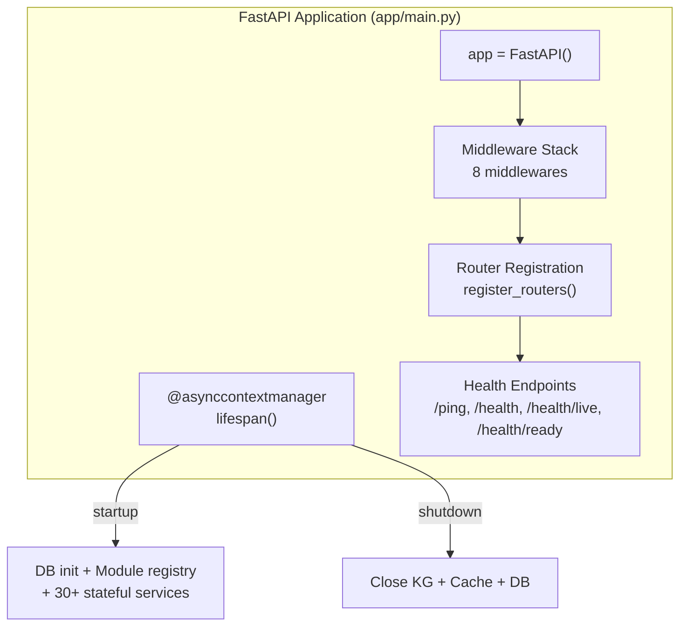
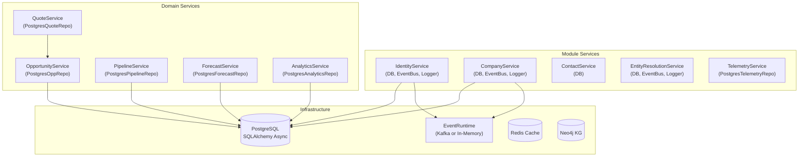
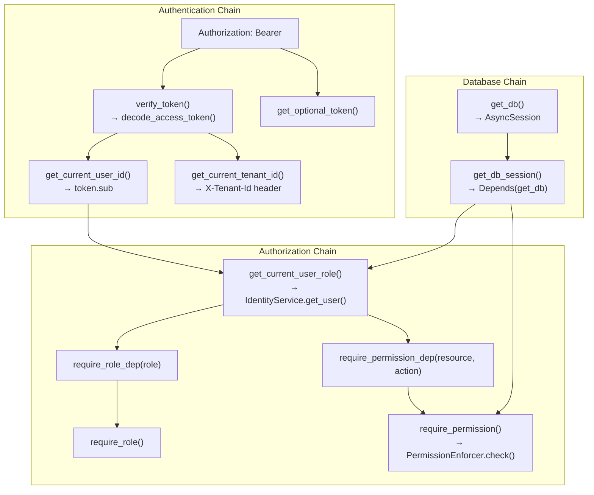
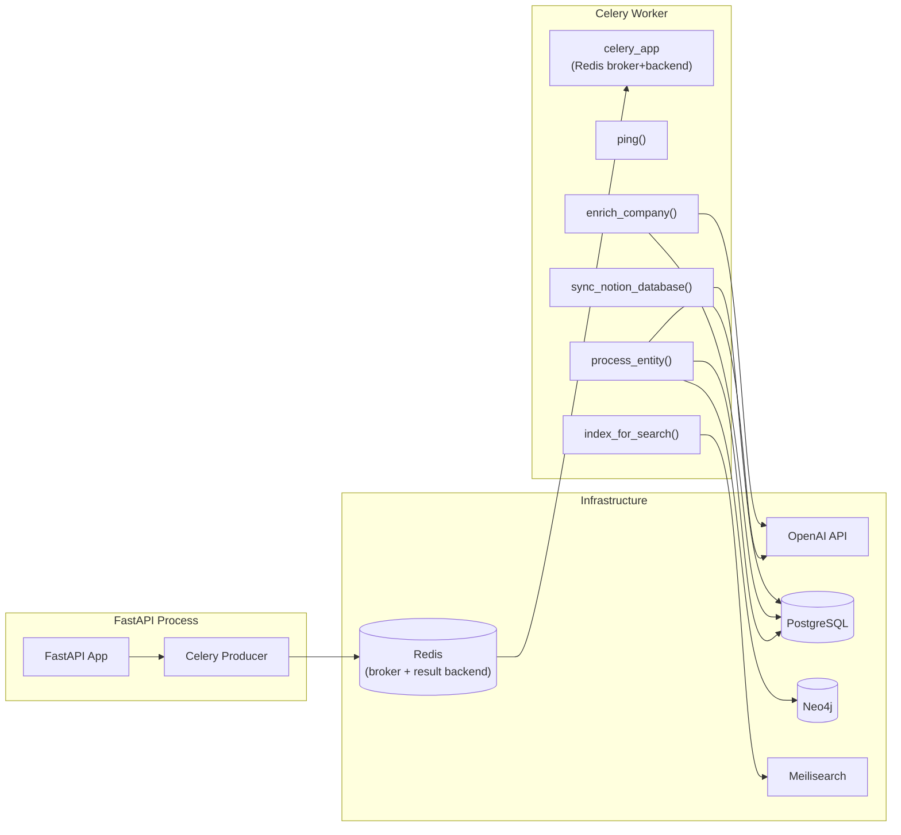
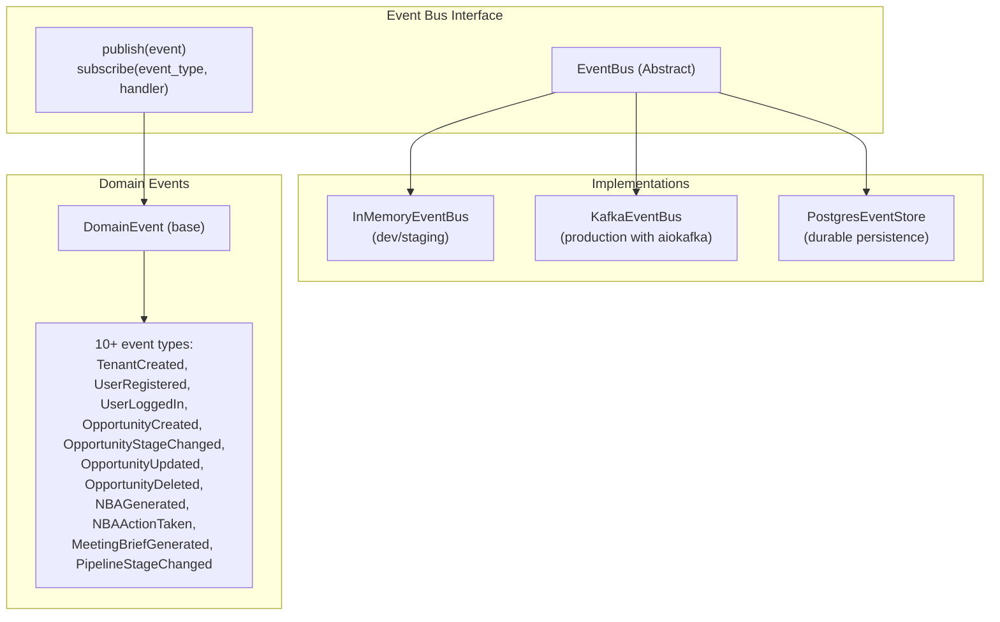
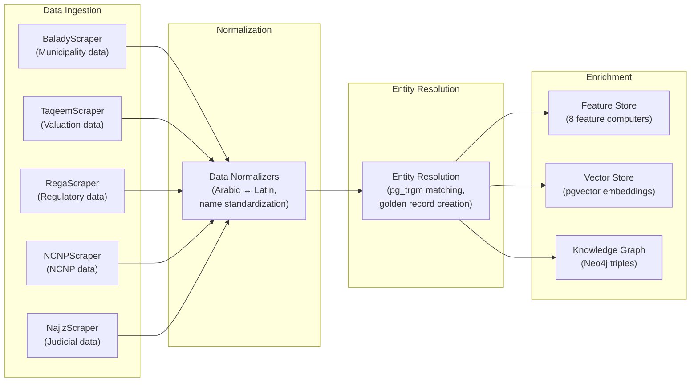

# SalesOS Backend Architecture — Deep Reverse-Engineering Audit

> **Audit Type**: READ-ONLY Backend Reverse Engineering  
> **Date**: 2026-07-13  
> **Auditor**: Backend Architect  
> **Scope**: Full backend codebase (fastapi, sdk, domains, runtime, modules)

---

## Table of Contents

1. [FastAPI Application Architecture](#1-fastapi-application-architecture)
2. [Complete API Endpoint Catalog](#2-complete-api-endpoint-catalog)
3. [Service Layer Analysis](#3-service-layer-analysis)
4. [Repository Layer Analysis](#4-repository-layer-analysis)
5. [Dependency Injection Architecture](#5-dependency-injection-architecture)
6. [Domain vs Module vs Runtime — Architecture Layers](#6-domain-vs-module-vs-runtime--architecture-layers)
7. [Background Jobs and Task System](#7-background-jobs-and-task-system)
8. [Middleware Stack Analysis](#8-middleware-stack-analysis)
9. [Error Handling Patterns](#9-error-handling-patterns)
10. [Input Validation Patterns](#10-input-validation-patterns)
11. [SDK Architecture](#11-sdk-architecture)
12. [Runtime Engines Catalog](#12-runtime-engines-catalog)
13. [Backend Technical Debt Register](#13-backend-technical-debt-register)

---

## 1. FastAPI Application Architecture

### 1.1 Application Entry Point

The application is defined in `app/main.py:310-317` using FastAPI with the following characteristics:

- **Title**: "SalesOS API"
- **Version**: From `settings.service_version` (currently `"0.1.0"`)
- **Lifespan**: `app/main.py:44-305` — Async context manager for startup/shutdown
- **Docs**: Swagger UI at `/docs` and ReDoc at `/redoc` (only when `debug=True`)
- **Database**: SQLAlchemy async with asyncpg driver (`app/config.py:24-25`)
- **Web Framework**: FastAPI 0.111 with Pydantic v2.7



### 1.2 Lifespan Startup Sequence (`app/main.py:44-305`)

The startup sequence initializes ~30 stateful components stored on `app.state`:

| Order | Component | Variable | Dependency |
|-------|-----------|----------|------------|
| 1 | DB Init | `async_session` | PostgreSQL |
| 2 | Module Registry | `register_modules()` | — |
| 3 | Telemetry | via `setup_telemetry()` | OpenTelemetry |
| 4 | Sentry | `app.state.logger` | sentry_sdk |
| 5 | Structured Logger | `app.state.logger` | — |
| 6 | Cache Service (Redis) | `app.state.cache` | Redis |
| 7 | Event Runtime | `app.state.event_runtime` / `event_bus` | Kafka or In-Memory |
| 8 | Activity Runtime | `app.state.activity_runtime` | DB |
| 9 | Work Intelligence Engine | `app.state.work_intelligence_engine` | ActivityRuntime |
| 10 | Timeline Recorder (PG) | `app.state.timeline_recorder` | DB |
| 11 | Opportunity Service (PG) | `app.state.opportunity_service` | DB + EventBus |
| 12 | PgVectorStore | `app.state.vector_store` | DB (pgvector) |
| 13 | Feature Store | `app.state.feature_store` | DB + EventBus |
| 14 | Feature Store Domain Service | `app.state.feature_store_domain_service` | DB |
| 15 | Knowledge Graph Engine | `app.state.kg_engine` | Neo4j (+ SQL fallback) |
| 16 | Data Fabric Pipeline | `app.state.data_fabric` | DB + EventBus + FS + Vector + KG |
| 17 | Decision Intelligence Engine | `app.state.decision_engine` | DB + FS + Policies + Recommendations |
| 18 | Decision Platform Engine | `app.state.decision_platform_engine` | Module-level |
| 19 | Timeline Runtime | `app.state.timeline_runtime` | DB |
| 20 | Search Runtime | `app.state.search_runtime` | DB + Embeddings + KG |
| 21 | Widget Engine | `app.state.widget_registry` | Capability Registry |
| 22 | UX Runtime | `app.state.ux_runtime` | — |
| 23 | Backend SDK | `app.state.backend_sdk` | Global state |
| 24 | UI Schema Engine | `app.state.schema_engine` | — |
| 25 | Form Engine | `app.state.form_engine` | — |
| 26 | Action Engine | `app.state.action_registry` | — |
| 27 | Extension API | via `init_hooks()` | — |
| 28 | Plugin Sandbox | `app.state.plugin_sandbox` | — |

**Event subscription** (`app/main.py:240`): ActivityRuntime + TimelineRuntime + TimelineRecorder subscribe to ALL domain events via `event_runtime.subscribe("*", handler)`.

### 1.3 Environment Configuration (`app/config.py:4-138`)

```
Settings (pydantic_settings.BaseSettings)
├── Core: env, debug, secret_key, allowed_hosts, service_version
├── PostgreSQL: postgres_user, postgres_password, postgres_db, postgres_host, postgres_port
├── Neo4j: neo4j_uri, neo4j_user, neo4j_password, pool size (50), timeouts
├── Event Bus: event_bus_type ("in_memory" | "kafka"), kafka_servers
├── Redis: redis_url, timeouts (2s connect, 2s socket)
├── JWT: jwt_secret_key, HS256, 30-min access, 7-day refresh
├── OpenAI: openai_api_key, gpt-4o-mini, text-embedding-3-large
├── Notion: notion_token, request_timeout=60
├── Rate Limiting: tiered (health=120, identity=10, auth=100, anon=20, search=30)
├── CORS: allow_methods (6 methods), allow_headers (5 headers)
├── Celery: task limits, retries, worker config
├── SMTP: host, port=465, credentials, from_address
├── SSO/OAuth: Google, Microsoft, GitHub client IDs/secrets
├── Audit: retention=90d, excluded_paths (health, metrics, docs, etc.)
├── API Keys: expiry=365d
├── Demo Mode: demo_mode flag
├── Feature Flags: fuzzy_search_v2, ai_copilot, crm_kanban
└── Meilisearch: meili_url, meili_master_key
```

---

## 2. Complete API Endpoint Catalog

### 2.1 Router Registration Map

All routers are registered in `app/main.py:531-659` via `register_routers()`. Authentication is via `Depends(verify_token)` or `require_permission_dep()`.

**Auth dependency variable** (`app/main.py:535`):
```python
_auth = [Depends(verify_token)]
```

### 2.2 FULL API Catalog

| # | Method | Path | Router Source | Auth | Tags |
|---|--------|------|---------------|------|------|
| 1 | GET | `/ping` | `app/main.py:363` | **Public** | Health |
| 2 | GET | `/health` | `app/main.py:435` | **Public** | Health |
| 3 | GET | `/health/live` | `app/main.py:367` | **Public** | Health |
| 4 | GET | `/health/ready` | `app/main.py:372` | **Public** | Health |
| 5 | GET | `/` | `app/main.py:521` | **Public** | Root |
| 6 | GET | `/metrics` | `app/routers/metrics.py:27` | **Public** | Metrics |
| 7 | GET | `/docs` | FastAPI built-in | Debug-only | Docs |
| 8 | GET | `/redoc` | FastAPI built-in | Debug-only | Docs |

#### Identity (`/api/v1/identity`) — `app/modules/identity/router.py`

| # | Method | Path | Auth | Notes |
|---|--------|------|------|-------|
| 9 | POST | `/api/v1/identity/tenants` | Require ADMIN | Create tenant |
| 10 | GET | `/api/v1/identity/tenants/{tenant_id}` | Require READ | Get tenant |
| 11 | POST | `/api/v1/identity/register` | **Public** | Register new user + auto-tenant |
| 12 | POST | `/api/v1/identity/login` | **Public** | Login with email/password |
| 13 | GET | `/api/v1/identity/users/me` | Bearer token | Current user profile |
| 14 | GET | `/api/v1/identity/users` | Require READ | List users by tenant |
| 15 | POST | `/api/v1/identity/invite` | Require CREATE | Invite user to tenant |
| 16 | POST | `/api/v1/identity/change-password` | Bearer token | Change own password |
| 17 | POST | `/api/v1/identity/refresh` | Public (needs token) | Rotate refresh token |
| 18 | POST | `/api/v1/identity/logout` | Bearer token | Logout (single session / all) |
| 19 | POST | `/api/v1/identity/logout-all` | Bearer token | Revoke all sessions |
| 20 | GET | `/api/v1/identity/sessions` | Bearer token | List device sessions |
| 21 | POST | `/api/v1/identity/sessions/{id}/revoke` | Bearer token | Revoke session |
| 22 | GET | `/api/v1/identity/csrf-token` | **Public** | Get CSRF token |
| 23 | POST | `/api/v1/identity/forgot-password` | **Public** | Request password reset |
| 24 | POST | `/api/v1/identity/reset-password` | **Public** | Reset password |

#### Companies (`/api/v1/companies`) — `app/modules/company/router.py`

| # | Method | Path | Auth |
|---|--------|------|------|
| 25 | POST | `/api/v1/companies` | CREATE company |
| 26 | GET | `/api/v1/companies` | READ company (search w/ SearchPlanner) |
| 27 | GET | `/api/v1/companies/{company_id}` | READ company |
| 28 | PATCH | `/api/v1/companies/{company_id}` | UPDATE company |
| 29 | DELETE | `/api/v1/companies/{company_id}` | DELETE company |
| 30 | POST | `/api/v1/companies/{company_id}/branches` | UPDATE company (add branch) |
| 31 | POST | `/api/v1/companies/{company_id}/licenses` | UPDATE company (add license) |
| 32 | POST | `/api/v1/companies/{company_id}/contacts` | UPDATE company (add contact) |
| 33 | GET | `/api/v1/companies/{company_id}/360` | READ company (360° view) |
| 34 | GET | `/api/v1/companies/{company_id}/intelligence` | READ company (alias for 360) |
| 35 | POST | `/api/v1/companies/ingest` | CREATE company (batch ingest) |

#### Contacts (`/api/v1/contacts`) — `app/modules/contact/router.py`

| # | Method | Path | Auth |
|---|--------|------|------|
| 36 | POST | `/api/v1/contacts` | CREATE contact |
| 37 | GET | `/api/v1/contacts` | READ contact (search) |
| 38 | GET | `/api/v1/contacts/{contact_id}` | READ contact |
| 39 | PATCH | `/api/v1/contacts/{contact_id}` | UPDATE contact |
| 40 | DELETE | `/api/v1/contacts/{contact_id}` | DELETE contact |
| 41 | GET | `/api/v1/contacts/by-company/{company_id}` | READ contact |
| 42 | POST | `/api/v1/contacts/bulk-upsert` | CREATE contact |

#### Entity Resolution (`/api/v1/entity-resolution`) — `app/modules/entity_resolution/router.py`

| # | Method | Path | Auth |
|---|--------|------|------|
| 43 | POST | `/api/v1/entity-resolution/resolve` | ADMIN |
| 44 | GET | `/api/v1/entity-resolution/golden-records` | READ |
| 45 | GET | `/api/v1/entity-resolution/golden-records/{id}` | READ |
| 46 | GET | `/api/v1/entity-resolution/golden-records/by-cr/{cr}` | READ |
| 47 | GET | `/api/v1/entity-resolution/conflicts` | READ |
| 48 | POST | `/api/v1/entity-resolution/conflicts/{id}/resolve` | UPDATE |
| 49 | GET | `/api/v1/entity-resolution/stats` | READ |

#### Commercial Platform (`/api/v1`) — `app/routers/commercial.py`

| # | Method | Path | Auth |
|---|--------|------|------|
| 50 | POST | `/api/v1/opportunities` | CREATE opportunity |
| 51 | GET | `/api/v1/opportunities` | READ opportunity |
| 52 | POST | `/api/v1/opportunities/{id}/advance` | UPDATE opportunity |
| 53 | POST | `/api/v1/opportunities/{id}/won` | UPDATE opportunity |
| 54 | POST | `/api/v1/opportunities/{id}/lost` | UPDATE opportunity |
| 55 | POST | `/api/v1/pipelines` | CREATE pipeline |
| 56 | GET | `/api/v1/pipelines` | READ pipeline |
| 57 | GET | `/api/v1/pipelines/{id}/kpis` | READ pipeline |
| 58 | POST | `/api/v1/activity-sessions` | CREATE activity |
| 59 | POST | `/api/v1/activity-sessions/{id}/activities` | CREATE activity |
| 60 | POST | `/api/v1/activities/{id}/complete` | UPDATE activity |
| 61 | POST | `/api/v1/quotes` | CREATE quote |
| 62 | POST | `/api/v1/quotes/{id}/lines` | CREATE quote |
| 63 | POST | `/api/v1/quotes/{id}/submit` | UPDATE quote |
| 64 | POST | `/api/v1/quotes/{id}/approve` | UPDATE quote |
| 65 | POST | `/api/v1/quotes/{id}/send` | UPDATE quote |
| 66 | POST | `/api/v1/quotes/{id}/accept` | UPDATE quote |
| 67 | POST | `/api/v1/proposals` | CREATE proposal |
| 68 | POST | `/api/v1/proposals/{id}/deliver` | UPDATE proposal |
| 69 | POST | `/api/v1/proposals/{id}/accept` | UPDATE proposal |
| 70 | POST | `/api/v1/contracts` | CREATE contract |
| 71 | POST | `/api/v1/contracts/{id}/sign` | UPDATE contract |
| 72 | POST | `/api/v1/forecast/run` | CREATE forecast |
| 73 | GET | `/api/v1/forecast` | READ forecast |
| 74 | POST | `/api/v1/analytics/generate` | CREATE analytics |
| 75 | GET | `/api/v1/analytics/kpis` | READ analytics |
| 76 | POST | `/api/v1/decision/context` | CREATE decision |
| 77 | POST | `/api/v1/recommendations/evaluate` | READ decision |
| 78 | GET | `/api/v1/workspace` | READ workspace |

#### Opportunities REST (`/api/v1`) — `app/routers/opportunities.py`

| # | Method | Path | Auth |
|---|--------|------|------|
| 79 | GET | `/api/v1/opportunities` | READ (Stateful service) |
| 80 | GET | `/api/v1/opportunities/{id}` | READ (Stateful service) |
| 81 | POST | `/api/v1/opportunities` | CREATE (Stateful service) |
| 82 | PUT | `/api/v1/opportunities/{id}` | UPDATE (Stateful service) |
| 83 | PATCH | `/api/v1/opportunities/{id}/stage` | UPDATE (Stateful service) |
| 84 | POST | `/api/v1/opportunities/{id}/close-won` | UPDATE (Stateful service) |
| 85 | POST | `/api/v1/opportunities/{id}/close-lost` | UPDATE (Stateful service) |

#### Meeting Intelligence (`/api/v1`) — `app/routers/meetings.py`

| # | Method | Path | Auth |
|---|--------|------|------|
| 86 | GET | `/api/v1/meetings/{opportunity_id}` | READ meeting |
| 87 | POST | `/api/v1/meetings/{opportunity_id}/brief` | READ meeting (rate-limited) |
| 88 | POST | `/api/v1/meetings/{opportunity_id}/summary` | CREATE meeting (rate-limited) |
| 89 | GET | `/api/v1/emails/{opportunity_id}` | READ email |
| 90 | POST | `/api/v1/emails/analyze` | CREATE email (rate-limited) |

#### Revenue (`/api/v1`) — `app/routers/revenue.py`

| # | Method | Path | Auth |
|---|--------|------|------|
| 91 | GET | `/api/v1/revenue/dashboard` | READ revenue (cached 60s, rate-limited) |

#### Workflow Engine (`/api/v1`) — `app/routers/workflows.py`

| # | Method | Path | Auth |
|---|--------|------|------|
| 92 | GET | `/api/v1/workflows` | READ workflow |
| 93 | POST | `/api/v1/workflows` | CREATE workflow |
| 94 | GET | `/api/v1/workflows/{id}` | READ workflow |
| 95 | PUT | `/api/v1/workflows/{id}` | UPDATE workflow |
| 96 | DELETE | `/api/v1/workflows/{id}` | DELETE workflow |
| 97 | POST | `/api/v1/workflows/{id}/execute` | UPDATE workflow |
| 98 | GET | `/api/v1/workflows/executions` | READ workflow |
| 99 | GET | `/api/v1/workflows/executions/{id}` | READ workflow |

#### AI Domain (`/api/v1`) — `app/routers/ai.py`

| # | Method | Path | Auth |
|---|--------|------|------|
| 100 | GET | `/api/v1/ai/prompts` | READ ai |
| 101 | POST | `/api/v1/ai/prompts` | CREATE ai |
| 102 | POST | `/api/v1/ai/prompts/activate` | UPDATE ai |
| 103 | POST | `/api/v1/ai/evaluate` | CREATE ai |
| 104 | GET | `/api/v1/ai/metrics/{prompt_id}` | READ ai |
| 105 | POST | `/api/v1/ai/generate` | CREATE ai |

#### Search (`/api/v1`) — `app/routers/search.py`

| # | Method | Path | Auth |
|---|--------|------|------|
| 106 | GET | `/api/v1/search/semantic` | READ search |
| 107 | POST | `/api/v1/search/similar` | READ search |

#### Copilot (`/api/v1`) — `app/routers/copilot.py`

| # | Method | Path | Auth |
|---|--------|------|------|
| 108 | POST | `/api/v1/copilot/query` | READ copilot |

#### RAG (`/api/v1`) — `app/routers/rag.py`

| # | Method | Path | Auth |
|---|--------|------|------|
| 109 | POST | `/api/v1/rag/ask` | Bearer token |
| 110 | POST | `/api/v1/rag/ingest` | Bearer token |
| 111 | GET | `/api/v1/rag/documents` | Bearer token |
| 112 | DELETE | `/api/v1/rag/documents/{id}` | Bearer token |

#### Analytics & Reporting (`/api/v1`) — `app/routers/analytics.py`

| # | Method | Path | Auth |
|---|--------|------|------|
| 113 | GET | `/api/v1/analytics/cubes` | Bearer token |
| 114 | POST | `/api/v1/analytics/cubes/{name}/query` | Bearer token |
| 115 | GET | `/api/v1/analytics/reports` | Bearer token |
| 116 | POST | `/api/v1/analytics/reports` | Bearer token |
| 117 | GET | `/api/v1/analytics/reports/{id}` | Bearer token |
| 118 | DELETE | `/api/v1/analytics/reports/{id}` | Bearer token |
| 119 | POST | `/api/v1/analytics/reports/{id}/execute` | Bearer token |
| 120 | GET | `/api/v1/analytics/executions` | Bearer token |
| 121 | GET | `/api/v1/analytics/executions/{id}/download` | Bearer token |

#### Notifications (`/api/v1`) — `app/routers/notifications.py`

| # | Method | Path | Auth |
|---|--------|------|------|
| 122 | WS | `/api/v1/notifications/ws` | Query param token |
| 123 | GET | `/api/v1/notifications/history` | Bearer token |
| 124 | POST | `/api/v1/notifications/mark-read` | Bearer token |
| 125 | GET | `/api/v1/notifications/unread-count` | Bearer token |

#### SSO (`/api/v1`) — `app/modules/sso/router.py`

| # | Method | Path | Auth |
|---|--------|------|------|
| 126+ | (OAuth flows) | `/api/v1/sso/...` | Public |

#### Audit (`/api/v1`) — `app/modules/audit/router.py`

| # | Method | Path | Auth |
|---|--------|------|------|
| 127+ | GET | `/api/v1/audit/...` | Bearer token |

#### API Keys (`/api/v1`) — `app/modules/api_keys/router.py`

| # | Method | Path | Auth |
|---|--------|------|------|
| 128+ | (CRUD) | `/api/v1/api-keys/...` | Bearer token |

#### Admin Panel (`/api/v1/admin`) — `app/modules/admin/router.py`

| # | Method | Path | Auth |
|---|--------|------|------|
| 129 | GET | `/api/v1/admin/tenants` | Require admin role |
| 130 | POST | `/api/v1/admin/tenants` | Require admin role |
| 131 | GET | `/api/v1/admin/tenants/{id}` | Require admin role |
| 132 | PUT | `/api/v1/admin/tenants/{id}` | Require admin role |
| 133 | DELETE | `/api/v1/admin/tenants/{id}` | Require admin role |
| 134 | GET | `/api/v1/admin/tenants/{id}/usage` | Require admin role |
| 135 | GET | `/api/v1/admin/plans` | Require admin role |
| 136 | POST | `/api/v1/admin/plans` | Require admin role |
| 137 | PUT | `/api/v1/admin/plans/{id}` | Require admin role |
| 138 | GET | `/api/v1/admin/licenses` | Require admin role |
| 139 | POST | `/api/v1/admin/licenses` | Require admin role |
| 140 | GET | `/api/v1/admin/users` | Require admin role |
| 141 | GET | `/api/v1/admin/users/{id}` | Require admin role |
| 142 | PUT | `/api/v1/admin/users/{id}` | Require admin role |
| 143 | DELETE | `/api/v1/admin/users/{id}` | Require admin role |
| 144 | GET | `/api/v1/admin/billing/invoices` | Require admin role |
| 145 | GET | `/api/v1/admin/billing/transactions` | Require admin role |
| 146 | GET | `/api/v1/admin/feature-flags` | Require admin role |
| 147 | POST | `/api/v1/admin/feature-flags` | Require admin role |
| 148 | PUT | `/api/v1/admin/feature-flags/{id}` | Require admin role |
| 149 | GET | `/api/v1/admin/feature-flags/{id}/tenants` | Require admin role |
| 150 | PUT | `/api/v1/admin/feature-flags/{id}/tenants/{tid}` | Require admin role |
| 151 | GET | `/api/v1/admin/jobs` | Require admin role |
| 152 | GET | `/api/v1/admin/jobs/{id}` | Require admin role |
| 153 | POST | `/api/v1/admin/jobs/{id}/retry` | Require admin role |
| 154 | GET | `/api/v1/admin/ai/costs` | Require admin role |
| 155 | GET | `/api/v1/admin/ai/summary` | Require admin role |
| 156 | GET | `/api/v1/admin/ai/usage` | Require admin role |
| 157 | GET | `/api/v1/admin/health/detailed` | Require admin role |
| 158 | GET | `/api/v1/admin/health/history` | Require admin role |

#### Runtime Admin (`/api/v1/admin`) — `runtime/admin_router.py`

| # | Method | Path | Auth |
|---|--------|------|------|
| 159 | GET | `/api/v1/admin/metrics` | Require admin role |
| 160 | GET | `/api/v1/admin/health/full` | Require admin role |
| 161 | GET | `/api/v1/admin/dlq` | Require admin role |
| 162 | POST | `/api/v1/admin/dlq/retry` | Require admin role |
| 163 | DELETE | `/api/v1/admin/dlq` | Require admin role |
| 164 | GET | `/api/v1/admin/dlq/stats` | Require admin role |

#### Monitoring (`/api/v1/monitoring`) — `app/modules/monitoring/router.py`

| # | Method | Path | Auth |
|---|--------|------|------|
| 165 | POST | `/api/v1/monitoring/events` | Bearer token |
| 166 | GET | `/api/v1/monitoring/metrics` | Bearer token |
| 167 | GET | `/api/v1/monitoring/health` | Bearer token |

#### Cache (`/api/v1/cache`) — `app/modules/cache/router.py`

| # | Method | Path | Auth |
|---|--------|------|------|
| 168 | GET | `/api/v1/cache/health` | Bearer token |
| 169 | GET | `/api/v1/cache/{key}` | Bearer token |
| 170 | POST | `/api/v1/cache/set` | Bearer token |
| 171 | DELETE | `/api/v1/cache/{key}` | Bearer token |
| 172 | POST | `/api/v1/cache/flush` | Bearer token |

#### Demo (`/api/v1/demo`) — `app/routers/demo.py`

| # | Method | Path | Auth |
|---|--------|------|------|
| 173 | GET | `/api/v1/demo/status` | **Public** |
| 174 | GET | `/api/v1/demo/scenarios` | Bearer token |
| 175 | POST | `/api/v1/demo/reset` | Bearer token + admin role |

#### Admin Demo (`/api/v1/admin/demo-mode`) — `app/routers/admin_demo.py`

| # | Method | Path | Auth |
|---|--------|------|------|
| 176 | POST | `/api/v1/admin/demo-mode/toggle` | Admin role |
| 177 | GET | `/api/v1/admin/demo-mode/status` | Admin role |

#### Benchmarks (`/api/v1/admin/benchmarks`) — `app/routers/benchmarks.py`

| # | Method | Path | Auth |
|---|--------|------|------|
| 178 | GET | `/api/v1/admin/benchmarks` | Admin role |
| 179 | POST | `/api/v1/admin/benchmarks/run` | Admin role |
| 180 | GET | `/api/v1/admin/benchmarks/latest` | Admin role |
| 181 | GET | `/api/v1/admin/benchmarks/compare` | Admin role |

#### Telemetry (`/api/v1/telemetry`, `/api/v1/admin/telemetry`) — `app/modules/telemetry/router.py`

| # | Method | Path | Auth |
|---|--------|------|------|
| 182 | POST | `/api/v1/telemetry/event` | Bearer token |
| 183 | GET | `/api/v1/admin/telemetry/feature-adoption` | Bearer token |
| 184 | GET | `/api/v1/admin/telemetry/search-success` | Bearer token |
| 185 | GET | `/api/v1/admin/telemetry/nba-acceptance` | Bearer token |
| 186 | GET | `/api/v1/admin/telemetry/active-users` | Bearer token |
| 187 | GET | `/api/v1/admin/telemetry/overview` | Bearer token |

#### Runtime Routers (all `_auth`-protected unless noted)

| # | Method | Path | Router Source | Tags |
|---|--------|------|---------------|------|
| 188+ | Various | `/api/v1/...` | `runtime/activity_runtime/router.py` | Activity |
| 189+ | Various | `/api/v1/...` | `runtime/data_fabric_runtime/router.py` | Data Fabric |
| 190+ | Various | `/api/v1/...` | `runtime/decision_runtime/router.py` | Decision Engine |
| 191+ | Various | `/api/v1/...` | `runtime/event_runtime/router.py` | Event Runtime |
| 192+ | Various | `/api/v1/...` | `runtime/feature_store/router.py` | Feature Store |
| 193+ | Various | `/api/v1/...` | `domains/feature_store/router.py` | Feature Store Domain |
| 194+ | Various | `/api/v1/...` | `runtime/knowledge_graph_runtime/router.py` | Knowledge Graph |
| 195+ | Various | `/api/v1/...` | `runtime/search_runtime/router.py` | Search |
| 196+ | Various | `/api/v1/...` | `runtime/timeline_runtime/router.py` | Timeline |
| 197+ | Various | `/api/v1/...` | `runtime/capability_framework/router.py` | Capability |
| 198+ | Various | `/api/v1/...` | `runtime/ux_runtime/router.py` | UX |
| 199+ | Various | (varies) | `runtime/ui_schema_engine/router.py` | UI Schema |
| 200+ | Various | (varies) | `runtime/form_engine/router.py` | Form Engine |
| 201+ | Various | (varies) | `runtime/action_engine/router.py` | Action Engine |
| 202+ | Various | (varies) | `runtime/extension_api/router.py` | Extension API |
| 203+ | Various | (varies) | `runtime/plugin_sandbox/router.py` | Plugin Sandbox |
| 204+ | Various | `/api/v1/...` | `runtime/nba_engine/api/router.py` | NBA Engine |
| 205+ | Various | `/api/v1/...` | `runtime/pipeline_analytics/router.py` | Pipeline Analytics |

**Total**: ~205+ endpoint definitions across 40+ routers.

---

## 3. Service Layer Analysis

### 3.1 Module-Level Services

| Service | File | Responsibilities | Dependencies |
|---------|------|-----------------|--------------|
| **IdentityService** | `app/modules/identity/service.py:105` | User/tenant CRUD, authentication, token family management, device sessions, password reset, token blacklist | DB (AsyncSession), EventBus, Logger |
| **CompanyService** | `app/modules/company/service.py` | Company CRUD, 360° view, ingest, branches, licenses, contacts | DB, EventBus, Logger |
| **ContactService** | `app/modules/contact/service.py` | Contact CRUD, search, bulk upsert | DB |
| **EntityResolutionService** | `app/modules/entity_resolution/service.py` | Batch resolution, golden records, conflict management, stats | DB, EventBus, Logger |
| **NotionSyncService** | `app/modules/notion_sync/service.py` | Notion database import | DB |
| **ExcelImportService** | `app/modules/excel_import/service.py` | Excel file import (company/contact) | DB |
| **TelemetryService** | `app/modules/telemetry/service.py` | Event tracking, feature adoption metrics, search success, NBA acceptance | PostgresTelemetryRepository |
| **SSOService** | `app/modules/sso/service.py` | OAuth (Google, Microsoft, GitHub) + SAML | DB |
| **AuditService** | `app/modules/audit/service.py` | Audit log querying | DB |
| **ApiKeysService** | `app/modules/api_keys/service.py` | API key generation, validation, revocation | DB |
| **WorkIntelligenceEngine** | `app/modules/work_intelligence/service.py` | Work pattern analysis | ActivityRuntime, Logger |
| **DecisionEngine** (module) | `app/modules/decision/engine.py` | Module-level decision platform | — |
| **RevenueExecutionService** | `app/modules/revenue_execution/service.py` | Revenue execution workflows | — |
| **DemoModeService** | `app/modules/demo_mode/service.py` | Demo mode toggling, status, scenario listing | — |
| **HealthScoreService** | `app/modules/admin/health_score_service.py` | Admin health scoring | DB |

### 3.2 Domain-Level Services

| Service | File | Domain | Responsibilities |
|---------|------|--------|-----------------|
| **OpportunityService** | `domains/commercial/opportunity/engine/service.py` | Commercial | Opportunity lifecycle (create, advance, close-won, close-lost), queries |
| **PipelineService** | `domains/commercial/pipeline/engine/service.py` | Commercial | Pipeline CRUD, KPI computation |
| **ActivityService** | `domains/commercial/activity/engine/service.py` | Commercial | Activity sessions, outcomes |
| **QuoteService** | `domains/commercial/quote/engine/service.py` | Commercial | Quote creation, line items, approval workflow, acceptance |
| **ProposalService** | `domains/commercial/proposal/engine/service.py` | Commercial | Proposal creation, approval, delivery, acceptance |
| **ContractService** | `domains/commercial/contract/service.py` | Commercial | Contract creation, signing, activation |
| **ForecastService** | `domains/revenue/forecast/service.py` | Revenue | Forecast creation from commercial inputs |
| **AnalyticsService** | `domains/revenue/analytics/service.py` | Revenue | Analytics snapshots, KPI computation |
| **DecisionService** | `domains/decision/context/service.py` | Decision | Decision context building |
| **AIService** | `domains/ai/service.py` | AI | Prompt-based generation, evaluation |
| **WorkflowEngine** | `domains/workflow/service.py` | Workflow | Workflow execution (with InMemory repo) |
| **FeatureStoreService** | `domains/feature_store/service.py` | Feature Store | Feature value CRUD, queries |
| **MeetingIntelligenceService** | `domains/commercial/meeting/intelligence.py` | Commercial | Meeting briefs and summaries |

### 3.3 Service Dependencies Diagram



---

## 4. Repository Layer Analysis

### 4.1 Repository Architecture

The codebase follows **Repository Pattern** with domain contracts:

```
domains/<domain>/contracts/
├── repository.py          # Abstract interface (ABC)
└── models.py              # Domain models

domains/<domain>/engine/
├── in_memory_repo.py      # InMemory implementation (testing/dev)
└── postgres_repo.py       # PostgreSQL implementation (production)

domains/commercial/infrastructure/
└── postgres_repositories.py # ALL commercial domain PG repos
```

### 4.2 Repository Catalog

| Domain | Interface (Contract) | InMemory | PostgreSQL | Status |
|--------|---------------------|----------|------------|--------|
| **Company** | `CompanySearchRepository` (`app/modules/company/search_repository.py`) | — | `PgVectorCompanyRepository` (`app/modules/company/pgvector_repository.py`) | PG |
| **Contact** | — | — | Direct SQLAlchemy in ContactService | PG |
| **Identity** | — | — | Direct SQLAlchemy in IdentityService | PG |
| **Opportunity** | `domains/commercial/opportunity/contracts/repository.py` | — | `PostgresOpportunityRepository` (`domains/commercial/infrastructure/postgres_repositories.py`) | PG |
| **Pipeline** | (contract) | — | `PostgresPipelineRepository` | PG |
| **Activity** | (contract) | — | `PostgresActivityRepository` | PG |
| **Quote** | (contract) | — | `PostgresQuoteRepository` | PG |
| **Proposal** | (contract) | — | `PostgresProposalRepository` | PG |
| **Contract** | (contract) | — | `PostgresContractRepository` | PG |
| **Forecast** | `domains/revenue/forecast/repo.py` | `InMemoryForecastRepository` | `PostgresForecastRepository` | PG |
| **Analytics** | `domains/analytics/repository.py` | `InMemoryReportRepository` | `PostgresAnalyticsRepository` | PG |
| **Decision** | `domains/decision/context/repository.py` | — | `PostgresDecisionRepository` | PG |
| **Timeline** | `domains/timeline/contracts/repository.py` | `InMemoryTimelineRepository` | `PostgresTimelineRepository` | PG |
| **Workflow** | (inline) | `InMemoryWorkflowRepository` | — | **InMemory** |
| **Search** | `domains/search/contracts/repository.py` | — | `PostgresSearchRepository` | PG |
| **Feature Store** | `domains/feature_store/repository.py` | `InMemoryFeatureStoreRepository` | `PostgresFeatureStoreRepository` | PG |
| **Notifications** | `domains/notifications/models.py` | `InMemoryNotificationRepository` | `PostgresNotificationRepository` (`postgres_repo.py`) | InMemory |
| **Recommendation** | `domains/decision/recommendation/repo.py` | `InMemoryRecommendationRepository` | — | InMemory |
| **Scoring** | — | — | `PostgresScoringRepository` | PG |
| **Audit** | — | — | Direct SQLAlchemy | PG |
| **API Keys** | — | — | Direct SQLAlchemy | PG |
| **SSO** | — | — | Direct SQLAlchemy | PG |
| **Telemetry** | — | — | `PostgresTelemetryRepository` | PG |
| **Admin** | — | — | PG Repositories (Plan, License, Flag, Job, AI, Health) | PG |

### 4.3 InMemory Repositories Still in Use

| Component | Repository | Production Readiness |
|-----------|------------|---------------------|
| Workflow Engine | `InMemoryWorkflowRepository` | **NOT production-ready** — data lost on restart |
| Notifications | `InMemoryNotificationRepository` (module-level `_repo`) | **NOT production-ready** |
| Analytics Reports | `InMemoryReportRepository` | **NOT production-ready** |
| Recommendations | `InMemoryRecommendationRepository` | **NOT production-ready** |
| Blog/UBOM | Unknown | Likely InMemory |

### 4.4 Database Initialization (`app/database.py:43-106`)

`init_db()` creates tables outside ORM metadata:
- `audit.audit_log` — Audit trail table with indexes
- `domain_events` — Event sourcing store
- `activity_records` — Activity spine table with 4 indexes
- `sso_connections` — SSO connection store
- `audit_logs` — ORM-managed audit log
- `api_keys` — API key store with indexes on `key_prefix` and `user_id`

### 4.5 Alembic Migrations (14 migrations)

```text
0001_baseline.py               — Initial schema
0002_feature_store.py           — Feature store tables
0003_decision_engine.py         — Decision engine tables
0004_knowledge_graph.py         — Knowledge graph tables
0005_timeline_runtime.py        — Timeline tables
0006_search_runtime.py          — Search tables
0007_commercial_domain.py       — Commercial tables (opps, pipelines, quotes, etc.)
0008_contact_module.py          — Contact tables
0009_activity_runtime.py        — Activity records
0010_vector_store.py            — pgvector extension + vectors table
0011_dead_letter_queue.py       — DLQ table
0012_refresh_token_tables.py    — Token family / blacklist / sessions
0013_meetings_emails.py         — Meeting and email intelligence tables
0014_analytics.py               — Analytics tables
0015_rag_tables.py              — RAG chunk tables
0016_drop_dual_embedding.py     — Remove duplicate embedding column
0017_hnsw_index.py              — HNSW vector index
0018_add_feature_store_fks.py   — Feature Store FK constraints
0019_add_commercial_fks.py      — Commercial FK constraints
0020_add_tenant_id.py           — Add tenant_id to all tables
0021_fix_vectors_embedding_type — Fix embedding column type
0022_consolidate_contacts.py    — Unify contact schemas
0023_fulltext_search.py         — Full-text search (tsvector + GIN)
0024_hybrid_search_optimization — Hybrid search RRF + ranking
0024_enable_pg_trgm.py          — Enable pg_trgm extension
0025_feature_store.py           — Feature store enhancements
```

---

## 5. Dependency Injection Architecture

### 5.1 Core Dependencies (`app/dependencies.py`)



### 5.2 Role Hierarchy (`app/dependencies.py:67`)

```python
{"admin": 3, "manager": 2, "user": 1, "api": 1, "auditor": 0}
```

- `admin` can access anything `manager`, `user`, `auditor` can
- `manager` can access `user`-level resources
- `auditor` is read-only (lowest privilege)

### 5.3 Factory Dependencies

| Dependency | Returns | Usage |
|------------|---------|-------|
| `require_role_dep(role)` | `Callable` | `Depends(require_role_dep("admin"))` |
| `require_permission_dep(resource, action)` | `Callable` | `Depends(require_permission_dep("company", PermissionAction.CREATE))` |
| `get_search_repository()` | `PostgresSearchRepository` | Search runtime injection |
| `get_feature_store_service()` | `FeatureStoreService` | Feature store injection |

### 5.4 Service Locator Pattern (via `app.state`)

All runtime services are wired at startup and accessed via `request.app.state.*`:

```python
# Example: Opportunities router accesses stateful service
svc = getattr(request.app.state, "opportunity_service", None)
```

This is used **heavily** across routers and is the primary wiring pattern for long-lived services.

---

## 6. Domain vs Module vs Runtime — Architecture Layers

The SalesOS backend has **four distinct architectural layers**:

```mermaid
graph TB
    subgraph "Layer 0: SDK (sdk/)"
        SDK_EVENTS["Events<br/>(event bus, domain events)"]
        SDK_DB["Database<br/>(Repository ABC, UnitOfWork)"]
        SDK_PERMS["Permissions<br/>(Enforcer, Registry, Role)"]
        SDK_VECTOR["Vector<br/>(EmbeddingService)"]
        SDK_TELEM["Telemetry<br/>(Logger, Metrics, Tracers)"]
        SDK_AUDIT["Audit Trail"]
        SDK_GRAPH["Graph Service"]
        SDK_SEARCH["Search abstractions"]
        SDK_SECURITY["JWT, API keys, hashing"]
    end

    subgraph "Layer 1: Domains (domains/)"
        DOM_COM["commercial/<br/>(opportunity, pipeline, quote,<br/>proposal, contract, meeting, email)"]
        DOM_REV["revenue/<br/>(forecast, analytics)"]
        DOM_DEC["decision/<br/>(context, recommendation)"]
        DOM_AI["ai/<br/>(prompts, evaluation)"]
        DOM_SEARCH["search/<br/>(planner, parser, hybrid, ranking)"]
        DOM_TIME["timeline"]
        DOM_WORK["workflow"]
        DOM_FS["feature_store"]
        DOM_NOTIFY["notifications"]
        DOM_SCORE["scoring"]
        DOM_ANALY["analytics<br/>(cubes, reports)"]
        DOM_UBOM["ubom<br/>(universal business object model)"]
    end

    subgraph "Layer 2: Runtime (runtime/)"
        RT_EVENT["event_runtime<br/>(Event lifecycle, DLQ, Retry)"]
        RT_DATA["data_fabric_runtime<br/>(Ingestion pipeline)"]
        RT_FEAT["feature_store<br/>(Feature computers)"]
        RT_DEC["decision_runtime<br/>(DIE: Context→Policy→NBA→Feedback)"]
        RT_CTX["context_runtime<br/>(Multi-dimensional context)"]
        RT_POL["policy_runtime<br/>(DNC, VIP, Government rules)"]
        RT_REC["recommendation_runtime<br/>(Template-based recs)"]
        RT_KG["knowledge_graph_runtime<br/>(Neo4j + SQL fallback)"]
        RT_TIMELINE["timeline_runtime<br/>(Universal timeline)"]
        RT_SEARCH["search_runtime<br/>(Semantic/Hybrid/Ranking)"]
        RT_ACT["activity_runtime<br/>(Activity spine)"]
        RT_UX["ux_runtime<br/>(Navigation, Layout, Widgets)"]
    end

    subgraph "Layer 3: Modules (app/modules/)"
        MOD_ID["identity<br/>(JWT, sessions, passwords)"]
        MOD_COM["company<br/>(CRUD, 360, ingest)"]
        MOD_CON["contact<br/>(CRUD, search, bulk-upsert)"]
        MOD_ER["entity_resolution<br/>(pg_trgm matching, merge)"]
        MOD_ADM["admin<br/>(Tenants, plans, billing, AI costs)"]
    end

    SDK_EVENTS --> DOM_COM
    SDK_DB --> DOM_COM
    SDK_PERMS --> MOD_ID
    SDK_VECTOR --> RT_SEARCH
    SDK_TELEM --> RT_EVENT
    DOM_COM --> RT_EVENT
    DOM_COM --> RT_DEC
    RT_EVENT --> RT_ACT
    RT_EVENT --> RT_TIMELINE
    RT_FEAT --> RT_DEC
    RT_DEC --> RT_REC
    RT_DATA --> RT_FEAT
    RT_DATA --> RT_KG
    RT_DATA --> RT_SEARCH
```



### 6.1 Layer Definitions

| Layer | Purpose | Key Characteristics |
|-------|---------|-------------------|
| **SDK** (`sdk/`) | Cross-cutting abstractions | Domain-agnostic, reusable by all layers. Contains event bus interfaces, database abstractions, vector services, telemetry, permissions, security. |
| **Domains** (`domains/`) | Business logic (DDD Bounded Contexts) | Contains contracts (repository interfaces, domain models), engine (service implementations), infrastructure (PostgreSQL repos). Follows strict Repository Pattern. |
| **Runtime** (`runtime/`) | Orchestration and infrastructure | Wires domains together into operational pipelines. Contains feature computers, decision engine, knowledge graph engine, data fabric pipeline, search runtime. |
| **Modules** (`app/modules/`) | Application features (REST endpoints) | Contains routers, services, models, schemas for each REST resource. Uses both domain services and runtime engines. May have their own repositories directly on SQLAlchemy. |

### 6.2 Architecture Compliance

| Pattern | Compliance | Notes |
|---------|-----------|-------|
| Repository Pattern (Domain Layer) | **95%** | All commercial domains use Repository Pattern with contracts |
| Repository Pattern (Module Layer) | **Mixed** | Identity/Company/Contact bypass contracts; use SQLAlchemy directly |
| Frozen Interfaces | **Compliant** | Widget SDK v1.0 frozen via ADR-003 |
| Cross-Domain Imports | **Compliant** | No direct cross-domain imports observed; SDK/API bridges used |
| Domain → Infrastructure separation | **Compliant** | `domains/*/contracts/` separate from `domains/*/infrastructure/` |

### 6.3 "Intelligence" Layer

There is also an `intelligence/` package (referenced in `pyproject.toml:13`, `Dockerfile:13`, and imported in `app/routers/copilot.py`):

```
intelligence/
├── agents/          — AgentCoordinator, ResearchAgent, MeetingAgent, etc.
├── rag/             — EmbeddingService, RetrievalService, RagService
├── notifications/   — WebSocketManager
```

This layer is AI/agentic intelligence, distinct from domain logic.

---

## 7. Background Jobs and Task System

### 7.1 Celery Architecture (`app/celery_app.py` + `app/tasks.py`)



### 7.2 Celery Tasks Catalog

| Task | Decorator Config | Purpose |
|------|-----------------|---------|
| `ping` | max_retries=3, delay=60s | Worker heartbeat |
| `process_entity` | max_retries=3, delay=30s | Sync entity to graph + generate embedding |
| `index_for_search` | max_retries=3, delay=30s | Index entity in Meilisearch |
| `enrich_company` | max_retries=3, delay=120s | Scrape Balady + Taqeem, recompute features |
| `sync_notion_database` | max_retries=2, delay=300s | Sync Notion DB into pipeline |

### 7.3 Async Bridge Pattern

All Celery tasks use `_run_async(coro)` (`app/tasks.py:13-15`) which runs `asyncio.run()` to bridge sync Celery tasks to async service calls.

### 7.4 Configuration (`app/config.py:88-99`)

```python
celery_task_time_limit: 600         # Hard limit 10 minutes
celery_task_soft_time_limit: 300    # Soft limit 5 minutes
celery_worker_max_tasks_per_child: 1000  # Recycle after 1k tasks
celery_result_expires: 86400        # Results expire in 24h
celery_worker_prefetch_multiplier: 1     # One-at-a-time
celery_max_retries: 3
celery_default_retry_delay: 60s
```

### 7.5 Event-Driven Background Processing

Beyond Celery tasks, async event subscribers process work in the main event loop:
- Activity recording on every domain event
- Timeline recording on every domain event
- Feature recomputation on entity changes
- Search index updates on entity changes

---

## 8. Middleware Stack Analysis

### 8.1 Middleware Registration Order (`app/main.py:319-346`)

```mermaid
graph LR
    REQ["HTTP Request"]
    CORS["1. CORSMiddleware<br/>(CORS headers)"]
    REQ_ID["2. RequestIDMiddleware<br/>(UUID per request)"]
    LOG["3. RequestLoggingMiddleware<br/>(method, path, status, duration)"]
    SEC_HDR["4. SecurityHeadersMiddleware<br/>(CSP, HSTS, XFO, XSS)"]
    METRICS["5. MetricsMiddleware<br/>(Prometheus HTTP metrics)"]
    RATE["6. RateLimitMiddleware<br/>(Tiered, per-IP)"]
    AUDIT["7. AuditMiddleware<br/>(Request/response logging)"]
    API_KEY["8. ApiKeyMiddleware<br/>(API key auth)"]
    APP["FastAPI App"]
    REQ --> CORS --> REQ_ID --> LOG --> SEC_HDR --> METRICS --> RATE --> AUDIT --> API_KEY --> APP
```



### 8.2 Middleware Details

| # | Middleware | File | Responsibility |
|---|-----------|------|----------------|
| 1 | **CORSMiddleware** | FastAPI built-in | CORS from `allowed_hosts`; credentials, 6 methods, 5 headers |
| 2 | **RequestIDMiddleware** | `app/common/middleware.py:177` | Assigns UUID `X-Request-ID` and `X-Response-Time` to every response |
| 3 | **RequestLoggingMiddleware** | `app/common/middleware.py:209` | Logs method, path, status, duration, client IP; warns on >1s; errors on 5xx |
| 4 | **SecurityHeadersMiddleware** | `app/common/middleware.py:124` | CSP (strict for API, relaxed for docs), HSTS, XFO-DENY, XSS-block, nosniff, referrer-policy, permissions-policy |
| 5 | **MetricsMiddleware** | `app/routers/metrics.py:14` | Tracks HTTP request count/duration via `MetricsTracker` |
| 6 | **RateLimitMiddleware** | `app/common/middleware.py:28` | Redis-backed per-IP sliding window; 6 tiers (health=120, identity=10, auth=100, anon=20, search=30, default=60) |
| 7 | **AuditMiddleware** | `app/modules/audit/middleware.py` | Captures request/response for audit trail |
| 8 | **ApiKeyMiddleware** | `app/modules/api_keys/middleware.py` | Validates API keys for non-Bearer-token requests |

### 8.3 Rate Limiting Tiers (`app/common/middleware.py:54-67`)

| Path Prefix | Auth | Rate Limit | Setting |
|-------------|------|-----------|---------|
| `/health`, `/docs`, `/redoc` | Any | 120 req/min | `rate_limit_health` |
| `/api/v1/identity` | Any | 10 req/min | `rate_limit_identity` |
| `/api/v1/search`, `/api/v1/entity-resolution`, `/api/v1/data-fabric` | Any | 30 req/min | `rate_limit_search` |
| `/api/v1/*` | Bearer token | 100 req/min | `rate_limit_authenticated` |
| `/api/v1/*` | No token | 20 req/min | `rate_limit_anonymous` |
| All other | Any | 60 req/min | `rate_limit_default` |

Rate limiter is **global-per-IP**, keys as `ratelimit:{ip}`, with **Retry-After** header on 429 responses. Redis-backed with in-memory fallback.

---

## 9. Error Handling Patterns

### 9.1 Custom Exception Hierarchy (`app/common/exceptions.py`)

```python
NotFoundError(HTTPException: 404)  — e.g. NotFoundError("User", user_id)
DuplicateError(HTTPException: 409)  — e.g. DuplicateError("User", "email", email)
UnauthorizedError(HTTPException: 401) — Missing/invalid credentials
ForbiddenError(HTTPException: 403)   — Insufficient permissions
ValidationError(HTTPException: 422)  — Data validation failed
```

### 9.2 SDK Exception Hierarchy (`sdk/exceptions.py`)

```python
SalesOsError (base)
├── ConfigurationError
├── DuplicateObjectError
├── InvalidStateTransitionError
├── ObjectNotFoundError
├── PermissionDeniedError
└── ValidationError
```

### 9.3 Global Exception Handler (`app/main.py:349-360`)

Catches ALL unhandled exceptions and returns `{"detail": "Internal server error: {exc}"}` with 500 status. Logs via `StructuredLogger` if available.

### 9.4 Router-Level Error Handling Pattern

Routers consistently use:
```python
try:
    ...
except HTTPException:
    raise  # Re-raise without wrapping
except ValueError:
    raise HTTPException(status_code=400, detail="...")
except Exception as exc:
    logger.error("operation failed: %s", exc)
    raise HTTPException(status_code=500, detail="Internal server error")
```

### 9.5 Permission Denied Handling (`app/dependencies.py:87-90`)

```python
try:
    PermissionEnforcer.check(user.role, resource, action)
    return True
except PermissionDeniedError as e:
    raise HTTPException(status_code=403, detail=str(e))
```

---

## 10. Input Validation Patterns

### 10.1 Pydantic v2 Models

All input is validated via Pydantic v2 `BaseModel` with `ConfigDict`. Common patterns:

```python
# String constraints
name: str = Field(..., min_length=1, max_length=200)
email: str = Field(max_length=254)

# Regex patterns
status: str = Field(default="draft", pattern=r"^(active|inactive|draft)$")
step_type: str = Field(..., pattern=r"^(send_email|update_crm|create_task|webhook|nba_recommend)$")

# Numeric constraints
page: int = Query(1, ge=1)
page_size: int = Query(20, ge=1, le=100)
top_k: int = Query(10, ge=1, le=50)

# Password constraints
new_password: str = Field(..., min_length=8, max_length=128)
```

### 10.2 Multi-Tenancy Validation (`app/dependencies.py:34-44`)

`get_current_tenant_id()` validates that `X-Tenant-Id` header matches JWT's `tenant_id`, returning 403 on mismatch.

### 10.3 Token Validation (`app/dependencies.py:11-17`)

`verify_token()` decodes the Bearer JWT and validates:
- Token type must be `"access"`
- Audience must be `"salesos-api"`
- Signature against `JWT_SECRET_KEY`

### 10.4 Service-Level Validation

IdentityService validates:
- No duplicate emails (409 Conflict)
- No duplicate tenant slugs (409 Conflict)
- Password correctness before change (401 Unauthorized)
- Refresh token reuse detection → session revocation

---

## 11. SDK Architecture

### 11.1 SDK Package Structure (`sdk/__init__.py`)

The SDK is the **foundational cross-cutting layer** with 18 modules:

| Module | File | Exports |
|--------|------|---------|
| **audit** | `sdk/audit.py` | `AuditTrail` |
| **cache** | `sdk/cache.py` | `CacheService` |
| **config** | `sdk/config.py` | `SdkSettings`, `sdk_settings` |
| **database** | `sdk/database.py` | `Entity`, `Repository`, `Specification`, `SqlAlchemyRepository`, `UnitOfWork` |
| **events** | `sdk/events/` | `DomainEvent`, `EventBus`, `InMemoryEventBus`, `KafkaEventBus`, `PostgresEventStore`, 10 domain event types |
| **exceptions** | `sdk/exceptions.py` | `SalesOsError`, `ValidationError`, `PermissionDeniedError`, etc. |
| **feature_registry** | `sdk/feature_registry.py` | `FeatureModule`, `FeatureRegistry`, `ModuleStatus` |
| **graph** | `sdk/graph.py` | `GraphService` |
| **metadata** | `sdk/metadata.py` | `EntityMetadata`, `FieldMetadata`, `MetadataRegistry` |
| **permissions** | `sdk/permissions.py` | `Permission`, `PermissionAction`, `PermissionEnforcer`, `PermissionRegistry`, `Role` |
| **queue** | `sdk/queue.py` | `TaskQueue`, `RedisTaskQueue` |
| **search** | `sdk/search.py` | `FullTextSearch`, `PgVectorSearch`, `SearchQuery`, `SearchResult`, `VectorSearch` |
| **security** | `sdk/security.py` | `create_jwt`, `decode_jwt`, `generate_api_key`, `verify_api_key`, `hash_password`, `verify_password` |
| **telemetry** | `sdk/telemetry.py` | `StructuredLogger`, `setup_telemetry`, `record_metric`, `trace_span`, `get_meter`, `get_tracer` |
| **vector** | `sdk/vector.py` | `EmbeddingService`, `OpenAIEmbeddingService` |
| **repositories** | `sdk/repositories/` | `InMemoryBaseRepository` |
| **scoring** | `sdk/scoring/` | Scoring interfaces |
| **plugin_sdk** | `sdk/plugin_sdk/` | Plugin development SDK |
| **backend_sdk** | `sdk/backend_sdk/` | Backend client SDK |
| **company_sdk** | `sdk/company_sdk/` | Company interfaces |
| **commercial** | `sdk/commercial/` | Commercial domain interfaces |
| **widget_sdk** | `sdk/widget_sdk/` | Widget SDK (Frozen v1.0) |
| **frontend_sdk** | `sdk/frontend_sdk/` | Frontend SDK |
| **theme_sdk** | `sdk/theme_sdk/` | Theme SDK |
| **agent_sdk** | `sdk/agent_sdk/` | Agent SDK |
| **integration_sdk** | `sdk/integration_sdk/` | Integration SDK |
| **capability_registry** | `sdk/capability_registry.py` | Capability definitions |

### 11.2 Event Bus Abstraction (`sdk/events/`)



### 11.3 Permission System (`sdk/permissions.py`)

```python
PermissionAction: CREATE | READ | UPDATE | DELETE | ADMIN

# Role-based + Resource-based hybrid
PermissionEnforcer.check(user_role, resource, action)

# Factory dependencies
require_permission_dep(resource, action) → Callable
require_role_dep(role) → Callable
```

### 11.4 SDK Design Pattern

The SDK provides **abstract interfaces** (Protocol classes / ABCs) that are:
1. **Implemented in Domains** — Domain repositories implement `sdk.database.Repository`, domain events extend `sdk.events.DomainEvent`
2. **Used by Runtime** — Runtime engines consume SDK abstractions (EventBus, EmbeddingService, StructuredLogger)
3. **Consumed by Modules** — Module services use SDK utilities (AuditTrail, telemetry, permissions)

---

## 12. Runtime Engines Catalog

### 12.1 Runtime Directory Structure (`runtime/__init__.py`)

| # | Module | File | Description | Key Classes |
|---|--------|------|-------------|-------------|
| 1 | **event_runtime** | `runtime/event_runtime/` | Event lifecycle (store, subscribers, retry, DLQ, metrics) | `EventRuntime`, `DeadLetterQueue`, `RetryPolicy`, `EventMetrics`, `SubscriberPriority` |
| 2 | **data_fabric_runtime** | `runtime/data_fabric_runtime/` | Ingestion pipeline (parser→normalizer→validator→ER→merge) | `DataFabricPipeline`, 5 scrapers (Balady, Taqeem, Rega, NCNP, Najiz), normalizers |
| 3 | **feature_store** | `runtime/feature_store/` | Feature computation, caching, event-driven recomputation | `FeatureStore`, `FeatureComputer`, 7 feature computer implementations |
| 4 | **decision_runtime** | `runtime/decision_runtime/` | Decision Intelligence Engine (DIE) | `DecisionEngine`, `DecisionObject`, `DecisionType`, `DecisionStatus`, `DecisionFeedback` |
| 5 | **context_runtime** | `runtime/context_runtime/` | Multi-dimensional decision context builder | `ContextBuilder`, `CompanyContext` |
| 6 | **policy_runtime** | `runtime/policy_runtime/` | Business policy evaluation (DNC, VIP, Government) | `PolicyEngine` |
| 7 | **recommendation_runtime** | `runtime/recommendation_runtime/` | Template-based recommendation generation | `RecommendationEngine`, `Recommendation` |
| 8 | **knowledge_graph_runtime** | `runtime/knowledge_graph_runtime/` | Graph engine (Neo4j primary + SQL fallback) | `KnowledgeGraphEngine`, `GraphNode`, `GraphEdge`, `GraphPath` |
| 9 | **timeline_runtime** | `runtime/timeline_runtime/` | Universal object timeline | `TimelineRuntime`, `TimelineEntry` |
| 10 | **search_runtime** | `runtime/search_runtime/` | Semantic + hybrid search with RRF fusion | `SearchRuntime`, `SearchResult`, `SearchResultItem`, `SearchStrategy` |
| 11 | **activity_runtime** | `runtime/activity_runtime/` | Activity records spine (immutable event log) | `ActivityRuntime` |
| 12 | **ux_runtime** | `runtime/ux_runtime/` | Experience layer (Navigation, Layout, Widget, Theme) | `UXRuntime` |
| 13 | **widget_engine** | `runtime/widget_engine/` | Widget registry, built-in widgets, capability generation | `WidgetRegistry`, `register_builtin_widgets` |
| 14 | **capability_framework** | `runtime/capability_framework/` | Self-describing capability registration | Capability API |
| 15 | **ui_schema_engine** | `runtime/ui_schema_engine/` | Dynamic UI schema from domain models | `UISchemaEngine` |
| 16 | **form_engine** | `runtime/form_engine/` | Dynamic forms from JSON Schema | `FormEngine` |
| 17 | **action_engine** | `runtime/action_engine/` | Action registry and execution | `ActionRegistry` |
| 18 | **extension_api** | `runtime/extension_api/` | Hook point registry for extensions | `init_hooks` |
| 19 | **plugin_sandbox** | `runtime/plugin_sandbox/` | Isolated plugin execution | `PluginSandbox`, `register_hook_points` |
| 20 | **nba_engine** | `runtime/nba_engine/` | Next-Best-Action engine (AI-driven) | NBA API router, risk/deal health, AI reasoner, subscribers |
| 21 | **pipeline_analytics** | `runtime/pipeline_analytics/` | Pipeline analytics computation | `PipelineAnalytics` |
| 22 | **memory_runtime** | `runtime/memory_runtime/` | Memory management runtime | — |
| 23 | **agent_runtime** | `runtime/agent_runtime/` | Agent runtime | — |
| 24 | **execution_runtime** | `runtime/execution_runtime/` | Execution runtime | — |
| 25 | **scheduler_runtime** | `runtime/scheduler_runtime/` | Scheduled task runtime | — |
| 26 | **simulation_runtime** | `runtime/simulation_runtime/` | Simulation runtime | — |
| 27 | **workflow_runtime** | `runtime/workflow_runtime/` | Workflow execution runtime | — |
| 28 | **object_viewer** | `runtime/object_viewer.py` | Universal object viewer | — |
| 29 | **admin_router** | `runtime/admin_router.py` | System metrics, full health, DLQ management | DLQ CRUD endpoints |

### 12.2 Data Fabric Pipeline Architecture



### 12.3 Feature Computers (8 implementations)

| Computer | File | Score Type |
|----------|------|------------|
| `IcpComputer` | `runtime/feature_store/features.py` | Ideal Customer Profile fit |
| `FundingScoreComputer` | Same | Funding health score |
| `HiringScoreComputer` | Same | Hiring activity score |
| `GrowthScoreComputer` | Same | Company growth score |
| `IntentScoreComputer` | Same | Purchase intent score |
| `ExpansionScoreComputer` | Same | Expansion potential score |
| `RevenueScoreComputer` | Same | Estimated revenue score |

---

## 13. Backend Technical Debt Register

### 13.1 Critical Issues

| ID | Area | Description | Impact | File/Location |
|----|------|-------------|--------|---------------|
| **TD-BE-001** | Service Locator Anti-Pattern | Heavy use of `request.app.state.*` instead of proper DI containers | Tight coupling, hard to test | `app/main.py` (30+ state assignments), `app/routers/opportunities.py:92`, `app/routers/commercial.py` |
| **TD-BE-002** | Module Repository Pattern Violation | Identity, Company, Contact modules use raw SQLAlchemy instead of repository interfaces | Constitution Article 3.3 violation | `app/modules/identity/service.py`, `app/modules/company/service.py`, `app/modules/contact/service.py` |
| **TD-BE-003** | InMemory Repos in Production | Workflow, Notifications, Analytics reports use InMemory stores — data lost on restart | Data loss risk | `app/routers/workflows.py:21-22`, `app/routers/notifications.py:18`, `app/routers/analytics.py:33` |
| **TD-BE-004** | Hardcoded Demo Data | Admin router seeds 5 tenants + 6 users in global variables at module load | Memory pollution, not configurable | `app/modules/admin/router.py:87-181` |
| **TD-BE-005** | Dual Opportunity Routers | Two separate routers handle opportunities (`commercial.py` + `opportunities.py`) with overlapping behavior | Confusion, potential inconsistency | `app/routers/commercial.py:76-114` vs `app/routers/opportunities.py:78-267` |
| **TD-BE-006** | Error Message Leakage | Global exception handler exposes `str(exc)` to clients in production | Information disclosure | `app/main.py:357-360` |

### 13.2 High

| ID | Area | Description | Impact | File/Location |
|----|------|-------------|--------|---------------|
| **TD-BE-007** | Hybrid Event Bus | In-memory event bus in production; Kafka optional but not configured | No event durability | `app/config.py:31`, `app/main.py:84-95` |
| **TD-BE-008** | OpenAPI Spec Missing for Runtime Routers | Many runtime routers lack explicit schema documentation | Developer onboarding | `runtime/search_runtime/router.py`, `runtime/decision_runtime/router.py`, etc. |
| **TD-BE-009** | SQL-injection Risk in Dynamic SQL | `app/tasks.py:34` builds SQL with f-strings on table name | Potential injection vector | `app/tasks.py:33-35` |
| **TD-BE-010** | No Transaction Boundary | Domain services don't use UnitOfWork pattern; transactions managed at router level via `get_db` | Inconsistent transaction scope | `app/database.py:31-40` |

### 13.3 Medium

| ID | Area | Description | Impact | File/Location |
|----|------|-------------|--------|---------------|
| **TD-BE-011** | Missing Input Validation on Query Params | Some endpoints accept raw `dict[str, Any]` without Pydantic validation | Potential injection | `app/routers/analytics.py:58` |
| **TD-BE-012** | Redundant Cache Health Check | `/health` endpoint checks Redis twice (cache + redis) with identical logic | Minor performance | `app/main.py:452-477` |
| **TD-BE-013** | `__import__` Used in Hot Path | Commercial workspace imports via `__import__` call | Unintuitive, potential performance | `app/routers/commercial.py:426, 450` |
| **TD-BE-014** | Config Schema Incomplete | Many config values have no validation (e.g. `allowed_hosts` is raw CSV string) | Invalid config silently corrupts behavior | `app/config.py:15` |
| **TD-BE-015** | Celery Not Used by Routers | Celery tasks exist but routers don't call them — enrichment is synchronous | Blocking API calls | `app/tasks.py` vs router implementations |

### 13.4 Low

| ID | Area | Description | Impact | File/Location |
|----|------|-------------|--------|---------------|
| **TD-BE-016** | Module-Level State in Monitor | `_MonitoringStore` is module-level global, not app.state | Not testable, singleton | `app/modules/monitoring/router.py:48,186` |
| **TD-BE-017** | Mixed Arabic/English Logging | Some log messages in Arabic, inconsistent | Operational confusion | `app/routers/copilot.py:100-102` |
| **TD-BE-018** | Benchmark Router Uses `__import__` | Benchmark router dynamically imports benchmark modules | Unconventional dependency management | `app/routers/benchmarks.py:59-61` |
| **TD-BE-019** | Test Paths Scattered | `pyproject.toml` lists 15+ test directories — some may be stale | CI confusion | `pyproject.toml:74-94` |
| **TD-BE-020** | `demo.reset` Dual Import Attempt | Falls back to alternate import path with try/except | Fragile module resolution | `app/routers/demo.py:77-84` |

---

## Summary Statistics

| Metric | Count |
|--------|-------|
| Total Endpoints (estimated) | ~205+ |
| Router Files | 40+ |
| Domain Packages | 14 |
| Runtime Modules | 29 |
| SDK Modules | 26 |
| Module Packages | 15+ |
| Repository Interfaces | 12 |
| PostgreSQL Repositories | 18 |
| InMemory Repositories (in use) | 4 |
| Celery Tasks | 5 |
| Middleware Components | 8 |
| Feature Computers | 7 |
| Alembic Migrations | 22 |
| API Endpoints Public (no auth) | 12 |
| API Endpoints Bearer-only | ~35 |
| API Endpoints RBAC-required | ~140+ |
| API Endpoints Admin-only | ~50+ |
| Stateful Services on App | 30+ |
| Database Tables (approximate) | 40+ |
