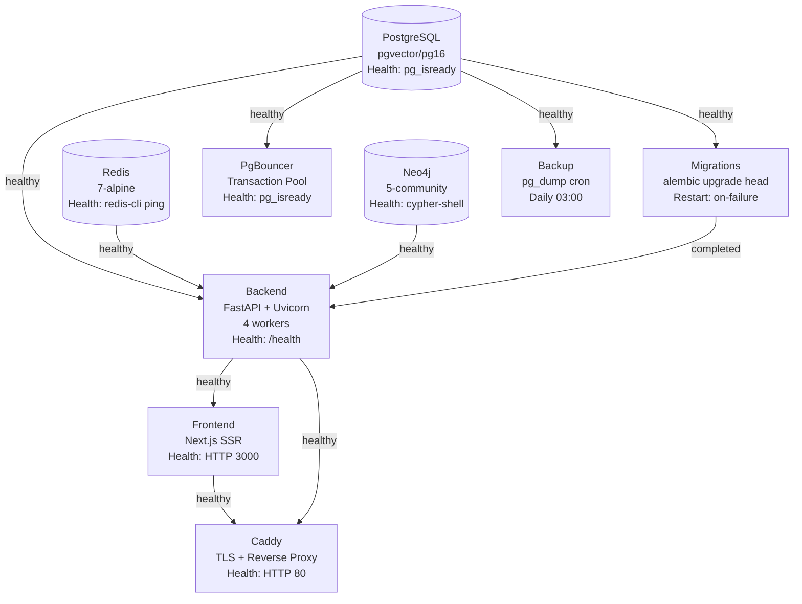
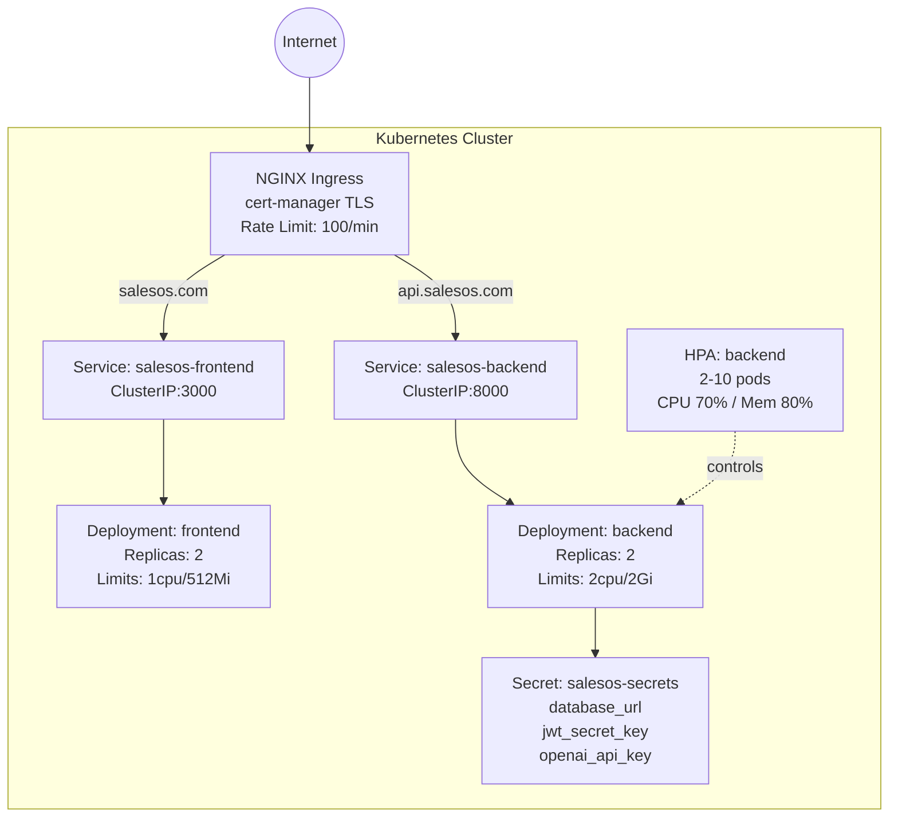
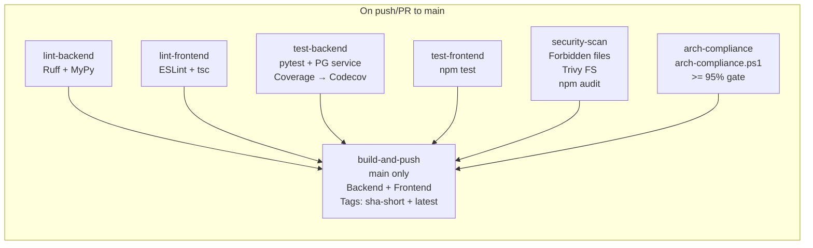
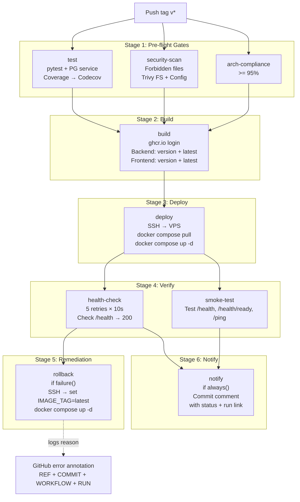
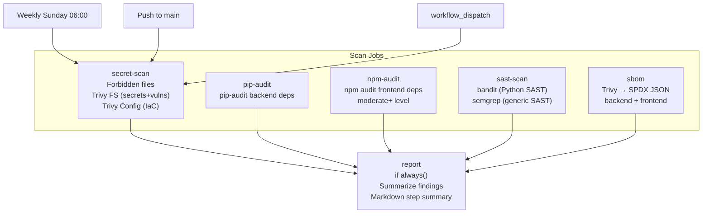
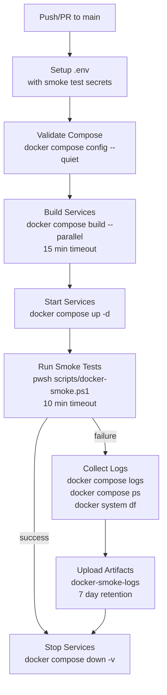
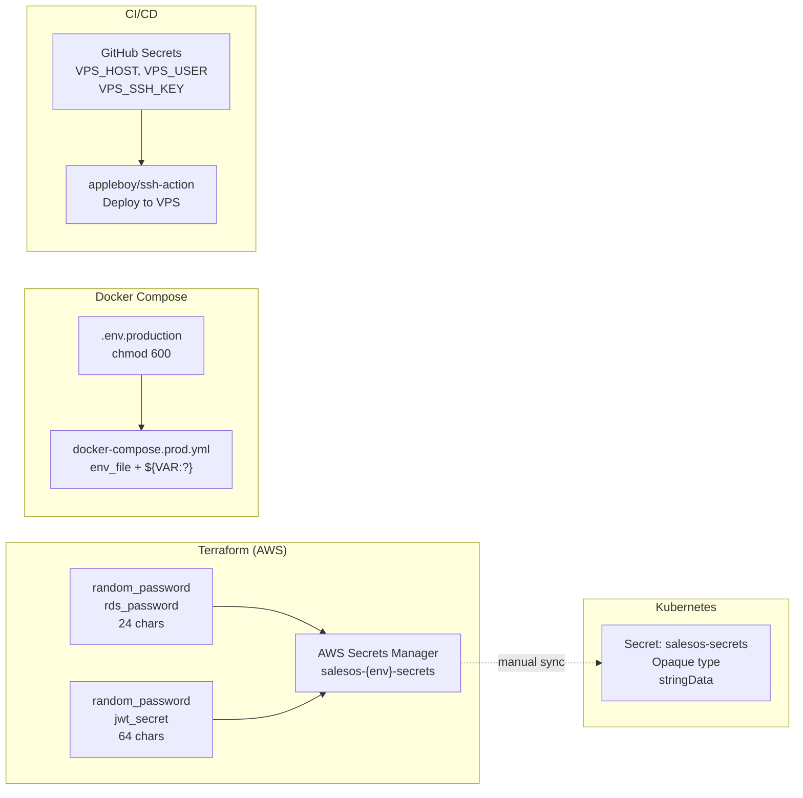
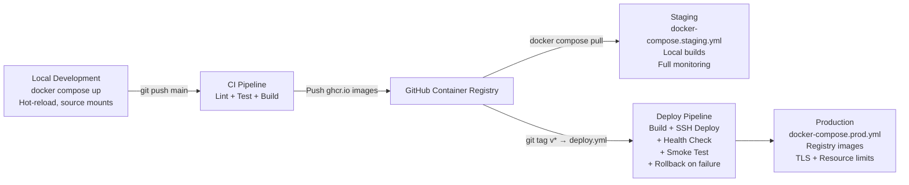

# SalesOS DevOps Architecture Audit

> **Audit Type**: Deep Infrastructure Reverse-Engineering (Read-Only)
> **Auditor**: DevOps Architect
> **Date**: 2026-07-13
> **Scope**: All Docker, K8s, Terraform, CI/CD, Observability, Backup, Secrets, and Deployment assets
> **Classification**: Internal — Engineering

---

## 1. Container Architecture

### 1.1 Service Inventory

| # | Service | Image | Version | Port(s) | Role | Environment(s) |
|---|---------|-------|---------|---------|------|---------------|
| 1 | **postgres** | `pgvector/pgvector:pg16` | pg16 | 5432 | Primary relational DB with vector+trgm extensions | Dev, Staging, Prod |
| 2 | **pgbouncer** | `edoburu/pgbouncer:latest` | latest | 6432 | Connection pooling (transaction mode) | Dev, Staging, Prod |
| 3 | **neo4j** | `neo4j:5-community` | 5 | 7474, 7687 | Knowledge graph (Bolt protocol) | Dev, Staging, Prod |
| 4 | **redis** | `redis:7-alpine` | 7-alpine | 6379 | Cache, rate limiting, sessions | Dev, Staging, Prod |
| 5 | **zookeeper** | `confluentinc/cp-zookeeper:7.0.0` | 7.0.0 | 2181 | Kafka coordinator (dev/staging only) | Dev, Staging |
| 6 | **kafka** | `confluentinc/cp-kafka:7.0.0` | 7.0.0 | 9092 | Event bus (dev/staging only) | Dev, Staging |
| 7 | **meilisearch** | `getmeili/meilisearch:latest` | latest | 7700 | Full-text search engine | Root Dev only |
| 8 | **backend** | Custom `backend/Dockerfile` | Python 3.12-slim | 8000 | FastAPI REST API (multi-stage build) | Dev, Staging, Prod |
| 9 | **frontend** | Custom `frontend/Dockerfile` | Node 22-alpine | 3000 | Next.js SSR (multi-stage build) | Dev, Staging, Prod |
| 10 | **migrations** | Same as backend image | — | — | Alembic schema migrations (prod/staging) | Staging, Prod |
| 11 | **caddy** | `caddy:2-alpine` | 2-alpine | 80, 443 | Reverse proxy + TLS (auto Let's Encrypt) | Prod only |
| 12 | **worker** | Custom `backend/Dockerfile` | — | — | Celery background worker (root dev only) | Root Dev only |
| 13 | **api** | Custom `backend/Dockerfile` | — | 8000 | Combined API + migrations (root dev only) | Root Dev only |
| 14 | **backup** | Custom `infra/docker/backup/Dockerfile` | postgres:16-alpine | — | pg_dump automated backups | Dev (profile), Staging (profile), Prod |
| 15 | **prometheus** | `prom/prometheus:latest` | latest | 9090 | Metrics collection | Dev, Staging |
| 16 | **grafana** | `grafana/grafana:latest` | latest | 3000 (mapped 3001) | Metrics dashboards | Dev, Staging |
| 17 | **postgres-exporter** | `prometheuscommunity/postgres-exporter:latest` | latest | 9187 | PostgreSQL metrics exporter | Dev, Staging |
| 18 | **redis-exporter** | `oliver006/redis_exporter:latest` | latest | 9121 | Redis metrics exporter | Dev, Staging |
| 19 | **alertmanager** | `prom/alertmanager:latest` | latest | 9093 | Alert routing (root dev only) | Root Dev only |
| 20 | **loki** | `grafana/loki:latest` | latest | 3100 | Log aggregation (root dev only) | Root Dev only |

### 1.2 Image Tagging Strategy

| Environment | Tag Strategy | Registry |
|-------------|-------------|----------|
| **Development** | Built locally via `build:` context | Local Docker daemon |
| **Staging** | Built locally via `build:` context | Local Docker daemon |
| **Production** | Pulled from registry: `ghcr.io/ragheeda-boop/salesos/{service}:{IMAGE_TAG}` | GitHub Container Registry (ghcr.io) |
| **CI (main push)** | `backend:<sha-short>` + `backend:latest`, `frontend:<sha-short>` + `frontend:latest` | ghcr.io |
| **CI (tag push v*)** | `backend:<version>` + `backend:latest`, `frontend:<version>` + `frontend:latest` | ghcr.io |

> **Finding**: Docker image tags were pinned (version-based, not `latest`) during Sprint 8 GA hardening. CI tags by git SHA (7 chars) on main push, semantic version on `v*` tags. Prod compose defaults to `latest` but supports `IMAGE_TAG` override.

---

## 2. Docker Compose Architecture (Dev vs Staging vs Prod)

### 2.1 File Mapping

| File | Path | Purpose | Services Count |
|------|------|---------|---------------|
| Root Dev Compose | `C:\Users\raghe\OneDrive - RATL Technology Ltd\Muhide\docker-compose.yml` | Full local dev with explicit network + Celery worker | 12 |
| SalesOS Dev Compose | `C:\Users\raghe\OneDrive - RATL Technology Ltd\Muhide\salesos\docker-compose.yml` | Standard dev with hot-reload, monitoring | 12 |
| SalesOS Prod Compose | `C:\Users\raghe\OneDrive - RATL Technology Ltd\Muhide\salesos\docker-compose.prod.yml` | Production with resource limits, logging, pre-built images | 8 |
| Staging Compose | `C:\Users\raghe\OneDrive - RATL Technology Ltd\Muhide\salesos\infra\staging\docker-compose.staging.yml` | Staging with local builds, resource limits, monitoring | 13 |
| Frontend Dev Compose | `C:\Users\raghe\OneDrive - RATL Technology Ltd\Muhide\salesos\frontend\docker-compose.yml` | Standalone frontend dev with nginx | 4 |

### 2.2 Key Differences

| Aspect | Development (`salesos/docker-compose.yml`) | Staging (`infra/staging/docker-compose.staging.yml`) | Production (`docker-compose.prod.yml`) |
|--------|-------------------------------------------|-----------------------------------------------------|---------------------------------------|
| **Image Source** | `build:` context (local) | `build:` context (local) | `image:` from registry (ghcr.io) |
| **Backend Command** | `uvicorn --reload` | `uvicorn --reload` | `uvicorn --workers 4` (no reload) |
| **Debug Mode** | `SALESOS_DEBUG=true` (implied) | `SALESOS_DEBUG=true` | `SALESOS_DEBUG=false` |
| **Env File** | `.env` | `../../.env.staging` | `.env.production` |
| **Resource Limits** | None | Yes (deploy.resources) | Yes (deploy.resources) |
| **Logging Driver** | Default | `json-file` (10MB/3 files) | `json-file` (10MB/3 files) |
| **Restart Policy** | `unless-stopped` | `unless-stopped` | `always` |
| **Caddy/TLS** | Not present | Not present | Present (ports 80/443, auto-TLS) |
| **Kafka/Zookeeper** | Present | Present | Not present (planned post-GA) |
| **Backup Service** | Profile-based | Profile-based | Always-running (cron: 03:00 daily) |
| **Migrations Service** | Not present (backend runs them) | Separate service | Separate service |
| **Healthcheck Start Period** | 15s (backend) | 30s (backend) | 30s (backend) |
| **Exposed DB Ports** | Yes (5432, 7475, 7688, 6379, 6432) | Yes (5432, 7475, 7688, 6379, 6432) | Only pgbouncer:6432 (postgres/neo4j/redis NOT exposed) |

### 2.3 Dependency Ordering (Production)



### 2.4 Resource Limits (Production)

Calculated from `docker-compose.prod.yml` deploy.resources:

| Service | CPU Limit | CPU Reservation | Memory Limit | Memory Reservation |
|---------|-----------|-----------------|-------------|-------------------|
| postgres | 2.0 | 0.5 | 2 GB | 1 GB |
| pgbouncer | 0.5 | — | 256 MB | 128 MB |
| neo4j | 2.0 | 1.0 | 4 GB | 2 GB |
| redis | 0.5 | — | 256 MB | 128 MB |
| migrations | 0.5 | — | 256 MB | — |
| backend | 2.0 | 0.5 | 1 GB | 512 MB |
| frontend | 1.0 | 0.5 | 512 MB | 256 MB |
| caddy | 0.25 | — | 128 MB | 64 MB |
| backup | 0.5 | — | 256 MB | — |
| **Total Guaranteed** | — | **~2.75 cores** | — | **~2.4 GB** |
| **Total Burst** | **~9.25 cores** | — | **~8.7 GB** | — |

### 2.5 Health Check Configuration

All production services have health checks with dependency conditions:

| Service | Test | Interval | Timeout | Start Period | Retries |
|---------|------|----------|---------|-------------|---------|
| postgres | `pg_isready -U salesos` | 10s | 5s | 10s | 5 |
| pgbouncer | `pg_isready -h postgres -U salesos` | 10s | 5s | — | 5 |
| neo4j | `cypher-shell RETURN 1` | 15s | 10s | 30s | 10 |
| redis | `redis-cli ping` | 5s | 3s | — | 5 |
| backend | `curl http://localhost:8000/health` | 30s | 5s | 30s | 3 |
| frontend | `wget http://localhost:3000` | 30s | 5s | 15s | 3 |
| caddy | `wget http://localhost:80/health` | 15s | 5s | 5s | 3 |
| backup | `test -d /backups` | 60s | 5s | — | 3 |

---

## 3. Kubernetes Deployment Architecture

### 3.1 Manifest Inventory

| File | Resources Defined | Reference |
|------|------------------|-----------|
| `infra/k8s/backend-deployment.yaml` | Deployment (2 replicas) + Service (ClusterIP:8000) | `salesos/backend:latest` image |
| `infra/k8s/frontend-deployment.yaml` | Deployment (2 replicas) + Service (ClusterIP:3000) | `salesos/frontend:latest` image |
| `infra/k8s/secrets.yaml.template` | Secret (`salesos-secrets`: database_url, jwt_secret_key, openai_api_key) | Opaque type, stringData |

### 3.2 Backend Deployment

```yaml
Replicas: 2
Image: salesos/backend:latest
Port: 8000
Resources:
  requests:  cpu: 500m, memory: 512Mi
  limits:    cpu: 2,    memory: 2Gi
Probes:
  liveness:  /health:8000, initialDelay:30s, period:10s
  readiness: /health:8000, initialDelay:5s,  period:5s
Secrets:
  DATABASE_URL  ← secretKeyRef: salesos-secrets/database_url
  JWT_SECRET_KEY ← secretKeyRef: salesos-secrets/jwt_secret_key
Environment:
  ENV: production
  DEBUG: false
```

### 3.3 Frontend Deployment

```yaml
Replicas: 2
Image: salesos/frontend:latest
Port: 3000
Resources:
  requests:  cpu: 200m, memory: 256Mi
  limits:    cpu: 1,    memory: 512Mi
Probes:
  liveness: /:3000, initialDelay:30s, period:10s
Environment:
  NEXT_PUBLIC_API_URL: https://api.salesos.com
```

### 3.4 Ingress (Documented, Not Deployed as File)

The deployment guide describes an ingress at `infra/k8s/ingress.yaml` with:
- `nginx` ingress class
- `cert-manager.io/cluster-issuer: letsencrypt-prod` annotation
- TLS secret: `salesos-tls`
- Host routing: `salesos.com` → frontend:3000, `api.salesos.com` → backend:8000

### 3.5 HPA (Documented, Not Deployed as File)

```yaml
Backend HPA:
  minReplicas: 2, maxReplicas: 10
  CPU target: 70% utilization
  Memory target: 80% utilization
  Scale-up: 2 pods per 60s, stabilization 60s
  Scale-down: 1 pod per 120s, stabilization 300s
```

### 3.6 K8s Architecture Diagram



---

## 4. Terraform Infrastructure as Code Analysis

### 4.1 Module Inventory

**File**: `C:\Users\raghe\OneDrive - RATL Technology Ltd\Muhide\salesos\infra\terraform\main.tf`

| Module/Resource | Source | Version | Purpose |
|-----------------|--------|---------|---------|
| `module.vpc` | `terraform-aws-modules/vpc/aws` | ~> 5.0 | VPC, subnets, NAT, DNS |
| `module.eks` | `terraform-aws-modules/eks/aws` | ~> 20.0 | EKS cluster, managed node group |
| `module.rds` | `terraform-aws-modules/rds/aws` | ~> 6.0 | PostgreSQL RDS instance |
| `random_password.rds_password` | hashicorp/random | ~> 3.6 | 24-char RDS password (no special chars) |
| `random_password.jwt_secret` | hashicorp/random | ~> 3.6 | 64-char JWT secret (no special chars) |
| `aws_secretsmanager_secret` | hashicorp/aws | ~> 5.0 | Secrets Manager for DB URL + JWT |

### 4.2 AWS Region & Compliance

- **Region**: `me-south-1` (Bahrain) — closest AWS region to Saudi Arabia
- **KSA PDPL compliance**: Data residency in ME region (note: me-south-1 is in Bahrain, not KSA — KSA has `me-central-1` launched later)

### 4.3 Infrastructure Composition

| Resource | Specification | Notes |
|----------|--------------|-------|
| **VPC** | CIDR `10.0.0.0/16`, 2 AZs, public + private subnets, NAT gateway | Single NAT for non-prod, multi-NAT for production |
| **EKS** | K8s 1.30, `t3.medium`/`t3.large`, 3 desired/2 min/10 max nodes | ON_DEMAND capacity type |
| **RDS** | PostgreSQL 16.3, `db.t3.medium`, 100-500GB gp3 storage | Multi-AZ only in production |
| **Backup** | Production: 30-day retention, dev: 7-day | Backup window: 02:00-03:00 UTC |
| **Security** | Storage encrypted, deletion protection in production | Password auto-generated via random_password |

### 4.4 Terraform State

- **Backend**: S3 (`salesos-terraform-state` bucket, `infra/terraform.tfstate` key, `me-south-1`)
- **State locking**: Not explicitly configured (no DynamoDB table visible)

### 4.5 Terraform Outputs

From `outputs.tf`:
- `cluster_endpoint` — EKS API endpoint
- `cluster_name` — EKS cluster name
- `rds_endpoint` — RDS instance address
- `rds_database` — Database name
- `secrets_arn` — Secrets Manager ARN
- `vpc_id` — VPC identifier

---

## 5. CI/CD Pipeline Architecture

### 5.1 Workflow Inventory

| Workflow | File | Trigger(s) | Purpose |
|----------|------|-----------|---------|
| **CI** | `ci.yml` | Push/PR to `main` | Lint, test, security-scan, arch-compliance, build-and-push |
| **Deploy** | `deploy.yml` | Tag push `v*` | Test, security-scan, arch-compliance, build, deploy, health-check, smoke-test, rollback, notify |
| **Docker Smoke** | `docker-smoke.yml` | Push/PR to `main` | Full Docker E2E compose build + smoke tests |
| **Security Scan** | `security-scan.yml` | Push to `main` + weekly cron (`0 6 * * 0`) + manual | Secret scan (Trivy), pip-audit, npm-audit, bandit SAST, semgrep, SBOM |

### 5.2 Dependabot Configuration

**File**: `C:\Users\raghe\OneDrive - RATL Technology Ltd\Muhide\salesos\.github\dependabot.yml`

| Ecosystem | Directory | Schedule | PR Limit | Groups |
|-----------|-----------|----------|----------|--------|
| `npm` | `/frontend` | Weekly (Monday) | 10 | react, radix, testing |
| `pip` | `/backend` | Weekly (Monday) | 10 | fastapi, testing |
| `docker` | `/backend` | Weekly (Monday) | — | — |
| `docker` | `/frontend` | Weekly (Monday) | — | — |
| `github-actions` | `/` | Weekly (Monday) | — | — |

### 5.3 CI Pipeline (`ci.yml`)



### 5.4 Deploy Pipeline (`deploy.yml`)



### 5.5 Security Scan Pipeline (`security-scan.yml`)



### 5.6 Docker Smoke Pipeline (`docker-smoke.yml`)



---

## 6. Observability Stack

### 6.1 Monitoring Components

| Component | Config File | Environment(s) |
|-----------|------------|----------------|
| **Prometheus** | `infra/monitoring/prometheus.yml` | Dev, Staging |
| **Alertmanager** | `infra/monitoring/alertmanager.yml` | Root Dev only |
| **Alert Rules** | `infra/monitoring/alerts.yml` | Dev, Staging |
| **Grafana** | `infra/monitoring/grafana/` | Dev, Staging |
| **Postgres Exporter** | Inline compose env | Dev, Staging |
| **Redis Exporter** | Inline compose env | Dev, Staging |
| **Loki** | Default config | Root Dev only |

### 6.2 Prometheus Scrape Targets

From `prometheus.yml`:

| Job | Target | Path | Interval |
|-----|--------|------|----------|
| `salesos-backend` | `backend:8000` | `/metrics` | 15s |
| `prometheus` | `localhost:9090` | self | 15s |
| `postgres-exporter` | `postgres-exporter:9187` | default | 15s |
| `redis-exporter` | `redis-exporter:9121` | default | 15s |

### 6.3 Alert Rules Summary

From `alerts.yml` (15 rules across 8 categories):

| Category | Alerts | Severities |
|----------|--------|-----------|
| **Error Rate** | `HighErrorRate` (5xx > 5%) | critical |
| **Latency** | `HighLatency` (p99 > 1s), `HighLatencyP95` (p95 > 500ms) | critical, warning |
| **Service Health** | `BackendServiceDown` (1m), `BackendUnhealthy` (5m), `BackendDegraded` (10m) | critical, critical, warning |
| **Database** | `PostgresDown`, `PostgresHighConnections` (>50), `SlowDatabaseQueries` (p95 > 1s) | critical, warning, warning |
| **Redis** | `RedisDown` | critical |
| **Neo4j** | `Neo4jDown` | critical |
| **AI** | `SlowAIInference` (p95 > 10s) | warning |
| **Infrastructure** | `NoTraffic` (10m), `QueueDepthHigh` (Kafka lag > 1000), `DiskSpaceLow` (<10%), `MemoryUsageHigh` (>90%) | warning, warning, critical, warning |

### 6.4 Alertmanager Routing

From `alertmanager.yml`:

| Receiver | Severity | Group Interval | Repeat Interval | Channel |
|----------|----------|---------------|-----------------|---------|
| `default` | warning | 5m | 4h | Slack webhook |
| `critical` | critical | 5m | 1h | Slack webhook (CRITICAL prefix) |

> **Gap**: Slack API URL is a placeholder (`YOUR/SLACK/WEBHOOK`) — must be configured per environment.

### 6.5 Grafana Configuration

| Component | File | Details |
|-----------|------|---------|
| Datasource | `grafana/datasources/prometheus.yml` | Prometheus at `http://prometheus:9090`, proxy access, default DS |
| Dashboard Provider | `grafana/provisioning/dashboards.yml` | Auto-loads from `/etc/grafana/provisioning/dashboards/salesos`, folder "SalesOS" |
| Pre-built Dashboards | `grafana/dashboards/` | `salesos-overview.json` (5 min refresh), `salesos-pipeline.json` (1 min refresh) |

### 6.6 Logging Architecture

Production uses JSON file logging with rotation:
```yaml
x-logging: &default-logging
  driver: "json-file"
  options:
    max-size: "10m"
    max-file: "3"
    tag: "{{.Name}}/{{.ID}}"
```

| Aspect | Current | Gap |
|--------|---------|-----|
| Log driver | `json-file` (local) | No centralized aggregation |
| Rotation | 3 files × 10 MB | Acceptable for single VPS |
| Shipping | None | No Loki/Promtail in prod |
| Retention | 30 MB per service | Short — no archiving |

---

## 7. Backup and Disaster Recovery

### 7.1 Backup Architecture

| Component | Method | Frequency | Retention | Storage | Script |
|-----------|--------|-----------|-----------|---------|--------|
| PostgreSQL | `pg_dump` custom format (--compress=9) | Daily 03:00 UTC | 7 days local | `/backups/postgres/` + optional S3 | `infra/scripts/backup-db.sh` |
| PostgreSQL WAL | Not configured | — | — | — | — |
| Neo4j | Not automated (manual `cypher-shell` dump) | — | — | — | — |
| Redis | Not configured (RDB disabled) | — | — | — | — |
| Docker Volumes | Not snapshotted | — | — | — | — |
| Terraform State | S3 backend | On apply | Indefinite | S3 (versioned) | `infra/terraform/main.tf` |

### 7.2 Backup Service (Production)

From `docker-compose.prod.yml`:
```yaml
backup:
  image: postgres:16-alpine + aws-cli + backup-db.sh
  restart: on-failure
  command: |
    echo "0 3 * * * /usr/local/bin/backup-db" | crontab -
    crond -f -l 2
```

### 7.3 Restore Capability

| File | Purpose |
|------|---------|
| `infra/scripts/restore-db.sh` | PostgreSQL restore via `pg_restore --clean --if-exists --no-owner --no-acl` |
| `infra/scripts/cron-backup.sh` | Host cron wrapper: `docker compose --profile backup run --rm backup backup-db` |

### 7.4 RPO/RTO Targets (from Deployment Guide)

| Metric | Target |
|--------|--------|
| RPO | < 1 hour |
| RTO | < 4 hours |
| Backup testing | Monthly restore to staging |

### 7.5 Disaster Recovery Gaps

| Gap | Severity | Impact |
|-----|----------|--------|
| No Neo4j automated backup | CRITICAL | Knowledge graph data loss possible |
| No Redis AOF/RDB persistence configured | HIGH | Cache/rate-limit state lost on restart |
| No WAL archiving | MEDIUM | Point-in-time recovery not possible |
| No backup verification automation | MEDIUM | Backups may be corrupt without detection |
| No cross-region backup | MEDIUM | Region failure → data loss |
| Manual restore process only | LOW | Human-dependent DR |

---

## 8. Secrets Management

### 8.1 Secrets Inventory

| Secret | Development | Staging | Production | K8s |
|--------|------------|---------|------------|-----|
| `POSTGRES_PASSWORD` | `.env` | `.env.staging` | `.env.production` | `secrets.yaml` → `database_url` |
| `NEO4J_PASSWORD` | `.env` | `.env.staging` | `.env.production` | Not in k8s secrets |
| `JWT_SECRET_KEY` | `.env` | `.env.staging` | `.env.production` | `secrets.yaml` → `jwt_secret_key` |
| `OPENAI_API_KEY` | `.env` | `.env.staging` | `.env.production` | `secrets.yaml` → `openai_api_key` |
| `MEILI_MASTER_KEY` | Hardcoded in root compose | Not used | `.env.production` | Not applicable |
| `GRAFANA_PASSWORD` | `admin` (dev) | Env var | Not present (no Grafana in prod) | — |
| RDS Password | — | — | Terraform `random_password` | AWS Secrets Manager |

### 8.2 Secrets Flow



### 8.3 Secrets Strengths

- Production env file permissions: `chmod 600`, owned by `root:root`
- `.env.production` in `.gitignore`
- `secrets.yaml` excluded from git
- Terraform generates passwords via `random_password` (never hardcoded)
- Production compose uses `${VAR:?Set VAR}` — fails fast if missing
- All Dockerfiles use `ENV` not `ARG` for secrets (no build-time secret leakage)
- K8s uses `secretKeyRef` (not environment variables for sensitive values)

### 8.4 Secrets Gaps

| Gap | Severity | Detail |
|-----|----------|--------|
| Root dev compose hardcodes passwords | HIGH | `C:\Users\raghe\OneDrive - RATL Technology Ltd\Muhide\docker-compose.yml` line 7: `salesos_dev_password`, line 55: `salesos_meili_master_key_dev`, line 91: `salesos-jwt-dev-key-change-in-production` |
| No HashiCorp Vault | MEDIUM | Secrets stored in files, not a vault |
| No ESO (External Secrets Operator) | MEDIUM | K8s secrets are manual, not synced from AWS SM |
| No secret rotation automation | MEDIUM | Manual rotation only |
| Grafana password defaults to `admin` | LOW | Dev environments only |

---

## 9. Environment Configuration Analysis

### 9.1 Environment Files

| File | Path | Scope |
|------|------|-------|
| Template | `salesos/.env.production.template` | Reference (97 lines, 46 variables) |
| Root Dev | `.env` (in root) | Root docker-compose |
| SalesOS Dev | `salesos/.env` | Standard dev compose |
| Staging | `salesos/.env.staging` | Staging compose |
| Production | `salesos/.env.production` | Production compose |

### 9.2 Variable Categories

From `.env.production.template`:

| Category | Count | Examples |
|----------|-------|----------|
| Required Secrets | 5 | `POSTGRES_PASSWORD`, `NEO4J_PASSWORD`, `JWT_SECRET_KEY`, `DOMAIN`, `OPENAI_API_KEY` |
| Database | 3 | `POSTGRES_USER`, `POSTGRES_DB`, `DATABASE_URL` |
| Neo4j | 1 | `NEO4J_USER` |
| Redis | 1 | `REDIS_URL` |
| OpenAI | 3 | `OPENAI_MODEL`, `OPENAI_EMBEDDING_MODEL` |
| JWT | 3 | `JWT_ALGORITHM`, `JWT_ACCESS_TOKEN_EXPIRE_MINUTES`, `JWT_REFRESH_TOKEN_EXPIRE_DAYS` |
| Frontend | 1 | `NEXT_PUBLIC_API_URL` |
| Scraper APIs | 6 | `BALADY_API_KEY`, `TAQEEM_API_KEY`, etc. |
| Observability | 2 | `LOG_LEVEL`, `SENTRY_DSN` |
| SMTP | 4 | `SMTP_HOST`, `SMTP_PORT`, etc. |
| SSO/OAuth | 6 | Google / Microsoft / GitHub OAuth credentials |
| Rate Limiting | 3 | `RATE_LIMIT_AUTHENTICATED`, `RATE_LIMIT_ANONYMOUS`, `RATE_LIMIT_SEARCH` |
| Feature Flags | 3 | `FEATURE_SEARCH_FUZZY_V2`, `FEATURE_AI_COPILOT`, `FEATURE_CRM_KANBAN` |
| Kafka | 1 | `KAFKA_BOOTSTRAP_SERVERS` |
| Celery | 3 | Task time limits, result expiry |
| LLM | 2 | `LLM_TEMPERATURE`, `LLM_MAX_TOKENS` |
| Meilisearch | 2 | `MEILI_MASTER_KEY`, `MEILI_URL` |

### 9.3 Multi-Environment Backend Dockerfile

**File**: `C:\Users\raghe\OneDrive - RATL Technology Ltd\Muhide\salesos\backend\Dockerfile`

Key characteristics:
- **Multi-stage build**: Builder (with build-essential) → Production (slim, curl only)
- **Non-root user**: `salesos:salesos` with `/sbin/nologin` shell
- **No hardcoded secrets**: All configs via environment variables
- **HEALTHCHECK**: Built into Dockerfile (not just compose)
- **Excludes**: `.pytest_cache`, `.ruff_cache`, `tests/`, `demo/`, `docs/`, `benchmark/`, `*.md`

### 9.4 Multi-Environment Frontend Dockerfile

**File**: `C:\Users\raghe\OneDrive - RATL Technology Ltd\Muhide\salesos\frontend\Dockerfile`

Key characteristics:
- **Multi-stage build**: Build (npm install + next build) → Production (standalone output)
- **Non-root user**: `salesos:salesos`
- **Next.js standalone mode**: `.next/standalone` output
- **HEALTHCHECK**: Built into Dockerfile
- **Default API URL**: `http://backend:8000` (overridden per environment)

### 9.5 Startup Scripts

| Script | Platform | Checks | Actions |
|--------|----------|--------|---------|
| `start.sh` | Linux/macOS | Docker binary, Docker daemon, Compose v2 | Creates `.env` if missing, `npm ci`, `docker compose up --build` |
| `start.bat` | Windows | Docker binary, Docker daemon | Creates `.env` if missing, `npm ci`, `docker compose up --build` |
| `setup.ps1` | Windows | Docker, PostgreSQL container, migrations, seed | Full setup pipeline with PG container, test DB, Alembic, seed data |

---

## 10. Deployment Process Analysis (Dev → Staging → Prod)

### 10.1 Deployment Environments



### 10.2 Deployment Flow (from Deploy Pipeline)

1. **Pre-flight** (test + security-scan + arch-compliance) — all must pass
2. **Build**: Docker images pushed to `ghcr.io` with semantic version tag + `latest`
3. **Deploy**: SSH to VPS → `docker compose pull` → `migrations up` → `docker compose up -d --remove-orphans`
4. **Verify**: Health check endpoint (5 retries × 10s) + smoke tests (`/health`, `/health/ready`, `/ping`)
5. **Rollback** (automatic): If health or smoke fails → SSH → set `IMAGE_TAG=latest` → `docker compose up -d`
6. **Notify**: Commit comment with deploy status

### 10.3 Manual Deployment (`deploy.sh`)

**File**: `C:\Users\raghe\OneDrive - RATL Technology Ltd\Muhide\salesos\infra\scripts\deploy.sh`

Flow:
1. Validate `.env.production` exists
2. Copy compose file + infra to `/opt/salesos`
3. Build & push images (if not CI)
4. `docker compose pull`
5. `docker compose up -d --remove-orphans`
6. `docker image prune -f`

### 10.4 Load Testing

**File**: `C:\Users\raghe\OneDrive - RATL Technology Ltd\Muhide\salesos\scripts\load-test.py`

| Scenario | Default Iterations | Semaphore | Auth Required |
|----------|-------------------|-----------|---------------|
| Health check | 20 | 5 | No |
| Login | 10 | 10 | No |
| Dashboard load | 30 | 30 | Yes |
| Company search | 20 | 30 | Yes |
| Company detail | 20 | 25 | Yes |

---

## 11. Infrastructure Maturity Assessment

### 11.1 Maturity Model Scoring

| Dimension | Score (1-5) | Evidence |
|-----------|-------------|----------|
| **Containerization** | 5 | All services containerized. Multi-stage builds. Non-root users. Health checks on all services. Resource limits in staging + prod. |
| **Orchestration** | 3 | Docker Compose for all envs. K8s manifests exist but are basic (Deployment + Service only). No ingress/HPA/PVC files deployed. |
| **CI/CD** | 4 | Multi-workflow pipeline with gates. Automatic rollback. Smoke tests. Version-pinned images. SBOM generation. Missing: staging deploy automation. |
| **IaC** | 3 | Terraform for AWS (VPC, EKS, RDS). Well-structured but missing: workspaces, DynamoDB state locking, environment-specific tfvars files. |
| **Observability** | 3 | Prometheus + Grafana in dev/staging. 15 alert rules. Not deployed in production compose. No Loki in prod. No distributed tracing. |
| **Secrets Management** | 3 | Env files + K8s secrets + Terraform random_password. Missing: Vault, automated rotation, ESO sync. |
| **Backup & DR** | 2 | PostgreSQL daily backups with retention. S3 optional. Missing: Neo4j backups, Redis persistence, automated restore testing, WAL archiving. |
| **Security** | 4 | Trivy + Bandit + Semgrep + pip-audit + npm audit in CI. Non-root containers. RBAC in app. CSRF. Rate limiting. Missing: container image signing (Cosign). |
| **Documentation** | 5 | Comprehensive deployment guide (1623 lines). Production runbook (1410 lines). Docker validation report. Architecture diagrams. |
| **Network** | 3 | Prod only exposes 80/443 (Caddy). Staging/dev expose DB ports. No network policies in K8s. Cloudflare documented but not provisioned in IaC. |

### 11.2 Overall Maturity: **3.5 / 5** (Production-Ready with Gaps)

### 11.3 What's Excellent

- Multi-stage Dockerfiles with non-root users
- Complete health check dependency chain with conditions
- Resource limits on every production service
- CI/CD with automatic rollback
- Comprehensive runbook and deployment guide
- 15 Prometheus alert rules covering all infrastructure
- Multi-layer security scanning (Trivy, Bandit, Semgrep, pip-audit, npm audit)
- SBOM generation
- Dependabot for 5 ecosystems
- Log rotation configured on all services
- Version-pinned container images (not floating `latest` in CI builds)

### 11.4 What Needs Improvement

- Neo4j has no automated backup
- Redis has no persistence (AOF/RDB disabled)
- No Prometheus/Grafana in production compose
- No centralized logging (Loki only in root dev)
- K8s manifests are incomplete (no ingress, HPA, PVC files — only documented in guide)
- Terraform missing DynamoDB state locking
- No container image signing (Cosign/Notary)
- No distributed tracing (Jaeger/Zipkin)
- No automated backup verification
- Staging deployment not automated in CI (manual via `deploy.sh`)
- No Cloudflare provisioning in Terraform
- Root dev compose has hardcoded passwords

---

## 12. DevOps Technical Debt Register

| ID | Area | Severity | Effort | Description | Current Mitigation |
|----|------|----------|--------|-------------|-------------------|
| **DTD-001** | Backup | **CRITICAL** | 1 sprint | No automated Neo4j backup. Knowledge graph data at risk. | Manual dump via `cypher-shell` documented |
| **DTD-002** | Backup | **HIGH** | 3 days | Redis has no AOF/RDB persistence. Rate-limit state lost on restart. | State reconstruction on startup |
| **DTD-003** | Observability | **HIGH** | 1 sprint | Prometheus + Grafana not in production compose. No production metrics. | Health endpoint monitoring only |
| **DTD-004** | Observability | **HIGH** | 1 sprint | No centralized log aggregation in production. Logs lost on container restart. | JSON file driver with 30MB rotation |
| **DTD-005** | K8s | **HIGH** | 2 sprints | K8s manifests incomplete. Ingress/HPA/PVC only documented, not deployed. | Docker Compose as primary orchestration |
| **DTD-006** | IaC | **MEDIUM** | 3 days | Terraform missing DynamoDB state locking. Risk of concurrent state corruption. | Single deployer manual coordination |
| **DTD-007** | Backup | **MEDIUM** | 1 sprint | No automated backup verification. Backups may be silently corrupt. | Monthly manual restore test documented |
| **DTD-008** | Backup | **MEDIUM** | 1 sprint | No WAL archiving. Point-in-time recovery not possible. | Daily full dump only |
| **DTD-009** | Security | **MEDIUM** | 1 sprint | No container image signing (Cosign). Supply chain risk. | Image pull from trusted registry (ghcr.io) |
| **DTD-010** | Observability | **MEDIUM** | 2 sprints | No distributed tracing (Jaeger/Zipkin). Hard to debug latency across services. | Per-service logs only |
| **DTD-011** | Network | **MEDIUM** | 3 days | Staging/dev expose database ports (5432, 7475, 7688, 6379) externally. | Firewall rules at host level |
| **DTD-012** | CI/CD | **MEDIUM** | 1 week | Staging deployment not automated. Manual `deploy.sh` only. | CI deploys to production only |
| **DTD-013** | Secrets | **MEDIUM** | 2 sprints | No secrets rotation automation. Manual rotation only. | Rotation documented in runbook |
| **DTD-014** | IaC | **LOW** | 1 week | Cloudflare WAF not provisioned via Terraform. Manual DNS/WAF config. | Documented in deployment guide |
| **DTD-015** | Security | **LOW** | 3 days | Root dev compose has hardcoded passwords. Risk of accidental production use. | `.env.production` gate; dev compose not deployable to prod |
| **DTD-016** | K8s | **LOW** | 1 sprint | No ESO (External Secrets Operator). K8s secrets are manual. | Direct `secretKeyRef` in deployment |
| **DTD-017** | CI/CD | **LOW** | 2 days | `docker-smoke.yml` uses hardcoded test secrets in workflow YAML. | Non-prod test secrets only; no real credentials |
| **DTD-018** | Observability | **LOW** | 3 days | Grafana dashboards exist but unverified (JSON content unknown — may be placeholders). | Grafana provisioning auto-loads them |
| **DTD-019** | Docker | **LOW** | 1 day | Frontend standalone compose (`frontend/docker-compose.yml`) uses deprecated `version: '3.8'` and `NEO4J_AUTH=none`. | Not used in production path |

---

## Appendix A: Key File Path Reference

| Category | File | Lines/Size |
|----------|------|-----------|
| Dev Compose | `salesos/docker-compose.yml` | 245 lines |
| Prod Compose | `salesos/docker-compose.prod.yml` | 256 lines |
| Staging Compose | `salesos/infra/staging/docker-compose.staging.yml` | 379 lines |
| Root Dev Compose | `docker-compose.yml` | 218 lines |
| Backend Dockerfile | `salesos/backend/Dockerfile` | 48 lines |
| Frontend Dockerfile | `salesos/frontend/Dockerfile` | 28 lines |
| Backup Dockerfile | `salesos/infra/docker/backup/Dockerfile` | 5 lines |
| Nginx Config | `salesos/frontend/nginx.conf` | 17 lines |
| Caddy Config | `salesos/infra/caddy/Caddyfile` | 7 lines |
| Prometheus Config | `salesos/infra/monitoring/prometheus.yml` | 28 lines |
| Alert Rules | `salesos/infra/monitoring/alerts.yml` | 150 lines |
| Alertmanager Config | `salesos/infra/monitoring/alertmanager.yml` | 24 lines |
| Grafana Datasource | `salesos/infra/monitoring/grafana/datasources/prometheus.yml` | 9 lines |
| Grafana Provisioning | `salesos/infra/monitoring/grafana/provisioning/dashboards.yml` | 11 lines |
| Grafana Dashboards | `salesos/infra/monitoring/grafana/dashboards/salesos-*.json` | 2 files |
| Postgres Init | `salesos/infra/docker/postgres/init/01-init.sql` | 13 lines |
| K8s Backend | `salesos/infra/k8s/backend-deployment.yaml` | 67 lines |
| K8s Frontend | `salesos/infra/k8s/frontend-deployment.yaml` | 49 lines |
| K8s Secrets Template | `salesos/infra/k8s/secrets.yaml.template` | 23 lines |
| Terraform Main | `salesos/infra/terraform/main.tf` | 132 lines |
| Terraform Variables | `salesos/infra/terraform/variables.tf` | 77 lines |
| Terraform Outputs | `salesos/infra/terraform/outputs.tf` | 29 lines |
| CI Workflow | `salesos/.github/workflows/ci.yml` | 202 lines |
| Deploy Workflow | `salesos/.github/workflows/deploy.yml` | 264 lines |
| Docker Smoke Workflow | `salesos/.github/workflows/docker-smoke.yml` | 92 lines |
| Security Scan Workflow | `salesos/.github/workflows/security-scan.yml` | 175 lines |
| Dependabot | `salesos/.github/dependabot.yml` | 71 lines |
| Deploy Script | `salesos/infra/scripts/deploy.sh` | 78 lines |
| Backup Script | `salesos/infra/scripts/backup-db.sh` | 82 lines |
| Restore Script | `salesos/infra/scripts/restore-db.sh` | 25 lines |
| Cron Backup Script | `salesos/infra/scripts/cron-backup.sh` | 10 lines |
| Env Template | `salesos/.env.production.template` | 97 lines |
| Makefile | `salesos/Makefile` | 66 lines |
| Start Script (Unix) | `salesos/start.sh` | 49 lines |
| Start Script (Windows) | `salesos/start.bat` | 45 lines |
| Setup Script | `salesos/setup.ps1` | 129 lines |
| Load Test Script | `salesos/scripts/load-test.py` | 425 lines |
| Docker Smoke Script | `salesos/scripts/docker-smoke.ps1` | 340 lines |
| Backend .dockerignore | `salesos/backend/.dockerignore` | 20 lines |
| Deployment Guide | `salesos/docs/deployment_guide.md` | 1623 lines |
| Production Runbook | `salesos/docs/production_runbook.md` | 1410 lines |
| Docker Validation | `salesos/docs/DOCKER_VALIDATION_REPORT.md` | 305 lines |

---

## Appendix B: Total Infrastructure Summary

| Metric | Value |
|--------|-------|
| **Total Docker images** | 12 unique (3 custom, 9 third-party) |
| **Total Docker Compose files** | 5 |
| **Total services across all envs** | 20 |
| **Total GitHub Actions workflows** | 4 |
| **Total CI/CD jobs** | 22 |
| **Total Terraform modules** | 3 (VPC, EKS, RDS) |
| **Total Terraform resources** | 5 |
| **Total K8s manifests** | 3 (2 deployment+service, 1 secrets template) |
| **Total monitoring rules** | 15 alerts |
| **Total scrape targets** | 4 |
| **Total backup/restore scripts** | 3 |
| **Total startup scripts** | 3 (sh, bat, ps1) |
| **Total env variables documented** | 46 |
| **Technical debt items** | 19 |
| **Critical gaps** | 1 |
| **High gaps** | 4 |
| **Infrastructure maturity score** | 3.5 / 5 |

---

*Audit completed: 2026-07-13*
*Next review: After DTD-001 resolution or quarterly architecture review*
