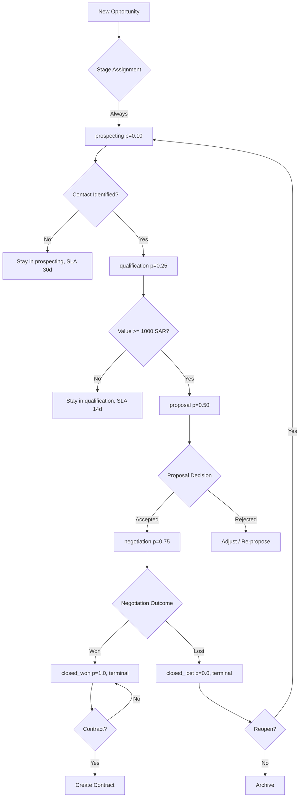
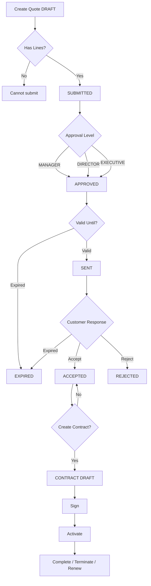
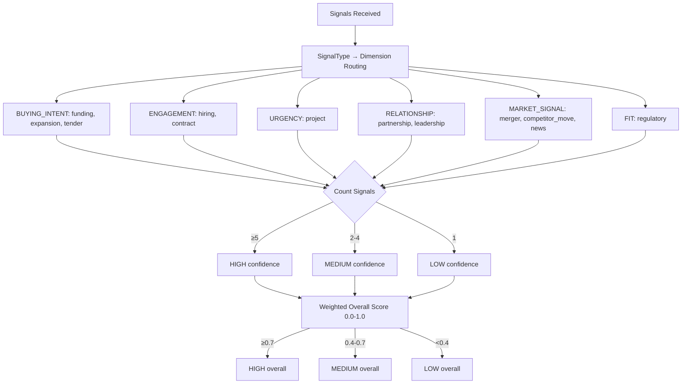
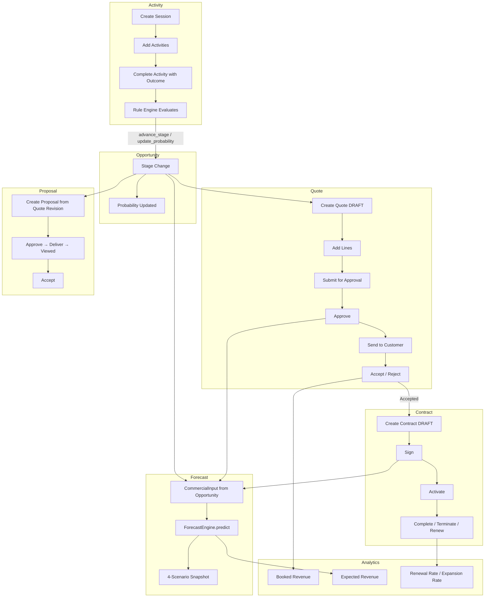
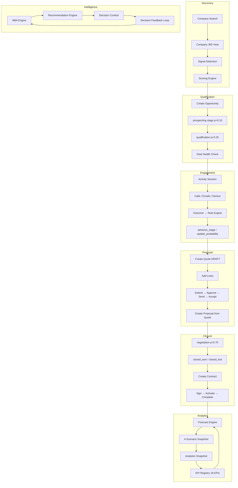
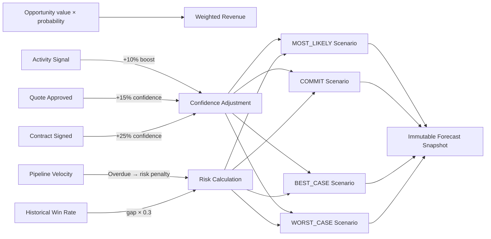
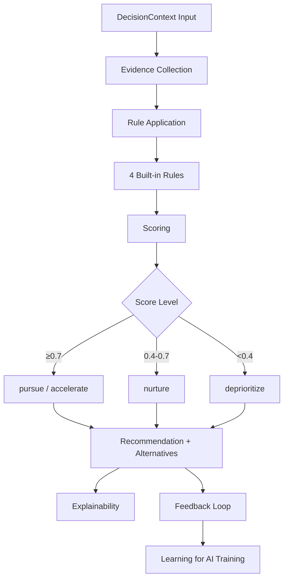
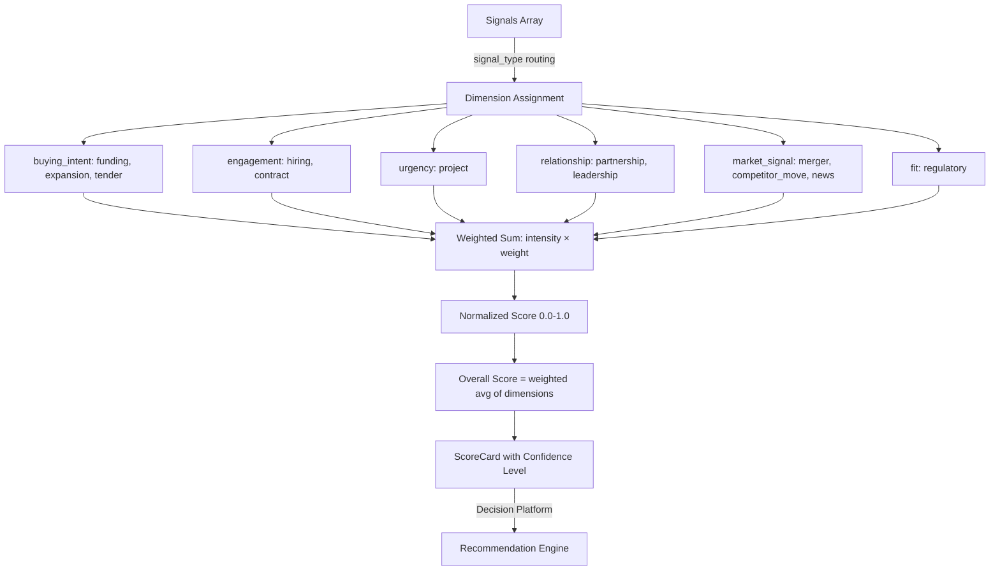

# Business Logic Reverse-Engineering Audit

> **SalesOS — Section 14: Business Logic Audit**
> **Auditor:** Business Analyst (Read-Only — No Modifications)
> **Audit Date:** 2026-07-13
> **Methodology:** Full codebase reading of all commercial, revenue, scoring, decision, intelligence, and runtime domains. Every business rule is traced to source files and line numbers.

---

## 1. Business Model Canvas

### 1.1 Value Proposition

| Component | Description | Source Evidence |
|-----------|-------------|----------------|
| **Core Value** | "Improve measurable commercial outcomes for enterprise organizations through explainable decision intelligence." | `platform/OPERATING_SYSTEM.md:10` |
| **Primary Promise** | Transform Company Intelligence into Revenue Execution — from knowing about a company to knowing what to do about it. | `REVENUE_EXECUTION_BIBLE.md:15` |
| **Key Differentiators** | (1) Explainable decision engine (not black-box AI); (2) Never replaces CRM — CRM records past, SalesOS decides future; (3) Arabic-first bilingual platform for Saudi market; (4) Preserves ownership of business facts. | `REVENUE_EXECUTION_BIBLE.md:43`; `OPERATING_SYSTEM.md:17-21` |
| **Target Pain Points** | (1) Knowledge-to-execution gap — know the company but not the next step; (2) Manual opportunity management in Excel; (3) No meeting preparation intelligence; (4) Disconnected playbooks; (5) Inaccurate forecasting. | `REVENUE_EXECUTION_BIBLE.md:23-29` |
| **Cognitive Layers** | Facts → Knowledge → Measurement → Policy (EPC framework) | `OPERATING_SYSTEM.md:27-34` |

### 1.2 Customer Segments

| Segment | Profile | Evidence |
|---------|---------|----------|
| **Sales Rep (مندوب مبيعات)** | B2B Account Executive managing opportunities, attending meetings, updating pipeline | `REVENUE_EXECUTION_BIBLE.md:110-128` |
| **Sales Manager (مدير مبيعات)** | Reviews pipeline, trains reps, forecasts, manages deal health | `REVENUE_EXECUTION_BIBLE.md:129-148` |
| **Customer Success Manager** | Manages existing accounts, renewals, expansion opportunities | `REVENUE_EXECUTION_BIBLE.md:149-163` |
| **VP Sales / CRO** | Strategy, resource allocation, channel/product analytics | `REVENUE_EXECUTION_BIBLE.md:165-180` |
| **Geographic Focus** | Saudi Arabia (KSA PDPL compliance, Arabic-first design) | ENGINEERING_CONSTITUTION.md Art 7.3 |

### 1.3 Revenue Model

| Component | Details | Evidence |
|-----------|---------|----------|
| **Platform Model** | Multi-tenant SaaS — `tenant_id` isolation on all entities | `backend/app/modules/company/models.py:30` (Company.tenant_id) |
| **Currency** | Saudi Riyal (SAR) as default currency | `backend/domains/commercial/quote/contracts/models.py:112` |
| **Unit Economics** | Pipeline value → weighted revenue → forecast → booked revenue | `backend/domains/revenue/forecast/engine.py:51-165` |
| **Deal Flow** | Discover → Understand → Prioritize → Engage → Meet → Propose → Negotiate → Close → Expand | `REVENUE_EXECUTION_BIBLE.md:57-85` |
| **Success Metrics** | Win rate, Forecast accuracy, Sales cycle reduction, NBA acceptance rate (>60%), Pipeline accuracy (>80%) | `REVENUE_EXECUTION_BIBLE.md:694-701` |

---

## 2. Complete Business Rule Catalog

### 2.1 Opportunity Stage Rules

| ID | Rule | Trigger | Action | Source |
|----|------|---------|--------|--------|
| OPP-R01 | New opportunity starts in `prospecting` stage with 10% probability | `create_opportunity()` | Set stage to first pipeline stage | `backend/domains/commercial/opportunity/engine/service.py:61-69` |
| OPP-R02 | Stage probability: prospecting=0.10, qualification=0.25, proposal=0.50, negotiation=0.75, closed_won=1.0, closed_lost=0.0 | Stage transition | Update `opportunity.probability` | `backend/domains/commercial/opportunity/contracts/models.py:31-37` |
| OPP-R03 | Forward-only stage progression (or recycling to stage 0). Terminal stages cannot transition except to reopen_target | `is_valid_transition()` | Accept or reject transition | `backend/domains/commercial/opportunity/contracts/models.py:56-66` |
| OPP-R04 | Cannot change value of a closed (terminal) opportunity | `update_value()` check | Raise ValueError | `backend/domains/commercial/opportunity/engine/service.py:123-124` |
| OPP-R05 | Won opportunities get `status=WON`, `won_amount=value` | `advance_stage` to closed_won | Set terminal state | `backend/domains/commercial/opportunity/engine/service.py:98-101` |
| OPP-R06 | Lost opportunities get `status=LOST`, `probability=0.0`, `loss_reason` recorded | `advance_stage` to closed_lost | Set terminal state | `backend/domains/commercial/opportunity/engine/service.py:102-103` |
| OPP-R07 | Weighted pipeline value = value × probability | `Opportunity.weighted_value` | Computed property | `backend/domains/commercial/opportunity/contracts/models.py:101-102` |

### 2.2 Pipeline Stage Rules (Advanced)

| ID | Rule | Trigger | Action | Source |
|----|------|---------|--------|--------|
| PIP-R01 | Prospecting stage SLA: 30 days. Exit criteria: contact must exist. Reopen target: yes. | Stage entry | Enforce SLA and exit criteria | `backend/domains/commercial/pipeline/contracts/models.py:76-79` |
| PIP-R02 | Qualification stage SLA: 14 days. Entry: contact_id exists. Exit: value >= 1000 SAR. | Stage entry | Validate entry/exit criteria | `backend/domains/commercial/pipeline/contracts/models.py:80-86` |
| PIP-R03 | Proposal stage SLA: 21 days. Entry: value >= 1000 SAR. | Stage entry | Validate | `backend/domains/commercial/pipeline/contracts/models.py:87-88` |
| PIP-R04 | Negotiation stage SLA: 14 days. | Stage entry | SLA enforcement | `backend/domains/commercial/pipeline/contracts/models.py:89` |
| PIP-R05 | Closed_won: terminal. Entry: won_amount >= 0. | Terminal state | No further progression | `backend/domains/commercial/pipeline/contracts/models.py:90-91` |
| PIP-R06 | Closed_lost: terminal, is_reopen_target. Can be reopened to prospecting. | Terminal state | Reopen permitted | `backend/domains/commercial/pipeline/contracts/models.py:93-94` |
| PIP-R07 | Transition validation: forward-only from_idx >= to_idx or to_idx==0. Terminal stages only allow reopen. | `is_valid_transition()` | Accept/reject | `backend/domains/commercial/pipeline/contracts/models.py:57-66` |
| PIP-R08 | Entry criteria check: `exists`, `gte`, `eq` operators supported. Returns first violation. | `enter_stage()` | Raise ValueError | `backend/domains/commercial/pipeline/engine/service.py:178-191` |
| PIP-R09 | Overdue detection: opportunity in stage > SLA days → emit `stage.overdue` event | `check_overdue()` | Event emission | `backend/domains/commercial/pipeline/engine/service.py:126-150` |
| PIP-R10 | Reopen: only targets marked `is_reopen_target=True` (prospecting, closed_lost) | `reopen()` | Enter stage | `backend/domains/commercial/pipeline/engine/service.py:159-174` |

### 2.3 Activity Outcome → Business Action Rules

| ID | Outcome ID | Activity Type | Business Action | Params | Source |
|----|-----------|---------------|-----------------|--------|--------|
| ACT-R01 | `call_qualified` | CALL | `update_probability` | delta=+0.15 | `backend/domains/commercial/activity/contracts/models.py:56-59` |
| ACT-R02 | `meeting_approved` | MEETING | `advance_stage` | target=next | `backend/domains/commercial/activity/contracts/models.py:70-73` |
| ACT-R03 | `proposal_accepted` | PROPOSAL | `advance_stage` | target=next | `backend/domains/commercial/activity/contracts/models.py:82-85` |
| ACT-R04 | `demo_interested` | DEMO | `update_probability` | delta=+0.10 | `backend/domains/commercial/activity/contracts/models.py:93-95` |
| ACT-R05 | Activity completion triggers Rule Engine evaluation → emits `activity.rule_triggered` event | `complete_activity()` | Event emission | `backend/domains/commercial/activity/engine/service.py:156-161` |

### 2.4 Quote Lifecycle Rules

| ID | Rule | Trigger | Action | Source |
|----|------|---------|--------|--------|
| QTE-R01 | Quote is only editable in DRAFT status | `add_line()`, `revise()` | Raise ValueError | `backend/domains/commercial/quote/engine/service.py:83-84` |
| QTE-R02 | Cannot submit empty quote (no lines) | `submit_for_approval()` | Raise ValueError | `backend/domains/commercial/quote/engine/service.py:106-107` |
| QTE-R03 | State machine: DRAFT → SUBMITTED → APPROVED → SENT → ACCEPTED | Transition guard | Enforce | `backend/domains/commercial/quote/engine/service.py:100-179` |
| QTE-R04 | Approval level escalation: MANAGER → DIRECTOR → EXECUTIVE | `ApprovalLevel` enum | Apply policy | `backend/domains/commercial/quote/contracts/models.py:22-26` |
| QTE-R05 | Expired quote cannot be sent or accepted | `send()`, `accept()` | Transition to EXPIRED, raise ValueError | `backend/domains/commercial/quote/engine/service.py:146-150,167-170` |
| QTE-R06 | Approved quotes are immutable — revise creates new version | `revise()` | Archive old, create new DRAFT | `backend/domains/commercial/quote/engine/service.py:197-241` |
| QTE-R07 | Revision control: each revise increments version number, archives current state as QuoteRevision | `revise()` | Version++ | `backend/domains/commercial/quote/contracts/models.py:204-241` |

### 2.5 Proposal Lifecycle Rules

| ID | Rule | Trigger | Action | Source |
|----|------|---------|--------|--------|
| PRP-R01 | Only APPROVED proposals can be delivered | `deliver()` check | Raise ValueError | `backend/domains/commercial/proposal/engine/service.py:83-85` |
| PRP-R02 | Only DELIVERED or VIEWED proposals can be accepted | `accept()` check | Raise ValueError | `backend/domains/commercial/proposal/engine/service.py:106-107` |
| PRP-R03 | Proposals reference Quote revisions — never duplicate commercial data | Architecture principle | Reference, don't copy | `backend/domains/commercial/proposal/engine/service.py:3-5` |
| PRP-R04 | Only editable proposals can have sections updated | `update_section()` | Guard | `backend/domains/commercial/proposal/engine/service.py:65-66` |

### 2.6 Contract Lifecycle Rules

| ID | Rule | Trigger | Action | Source |
|----|------|---------|--------|--------|
| CNT-R01 | State machine: DRAFT → SIGNED → ACTIVE → COMPLETED | Transition calls | State progression | `backend/domains/commercial/contract/service.py:26-36` |
| CNT-R02 | Signed contract: `is_signed` = (SIGNED, ACTIVE, COMPLETED) | Status query | Computed property | `backend/domains/commercial/contract/models.py:65-67` |
| CNT-R03 | Terminal contracts (COMPLETED, TERMINATED, EXPIRED) | `is_terminal` property | Guard | `backend/domains/commercial/contract/models.py:70-71` |
| CNT-R04 | Expired contracts auto-transitioned to EXPIRED on `check_expiry()` | Scheduled check | Status update + event | `backend/domains/commercial/contract/service.py:55-64` |
| CNT-R05 | Contract renewal creates new Contract record, copies parties/terms, auto_renew + max_renewals checked | `renew()` | New contract created | `backend/domains/commercial/contract/service.py:38-53` |
| CNT-R06 | Renewal rules: auto_renew (bool), notice_days (30 default), renewal_term_months (12 default), max_renewals (0=unlimited) | RenewalRule dataclass | Configurable | `backend/domains/commercial/contract/models.py:34-39` |

### 2.7 Deal Health Rules

| ID | Rule | Threshold | Weight | Source |
|----|------|-----------|--------|--------|
| DH-R01 | Stagnation detection: days since last activity > 14 → risk rises | >14 days | 0.40 | `backend/runtime/nba_engine/engine/risk/deal_health.py:41-42` |
| DH-R02 | Stagnation score: min(1.0, days_since/30). No activity at all = 0.5. | Computed | 0.40 | `backend/runtime/nba_engine/engine/risk/deal_health.py:38-44` |
| DH-R03 | Engagement score: min(1.0, total_activities/20) | Computed | 0.30 | `backend/runtime/nba_engine/engine/risk/deal_health.py:46-47` |
| DH-R04 | Timeline risk: overdue (past close_date) = 1.0, <7 days = 0.5, <30 days = 0.2 | Computed | 0.30 | `backend/runtime/nba_engine/engine/risk/deal_health.py:50-58` |
| DH-R05 | Composite risk: stagnation*0.4 + (1-engagement)*0.3 + timeline_risk*0.3 | Computed | 1.0 | `backend/runtime/nba_engine/engine/risk/deal_health.py:62` |
| DH-R06 | Health ≥ 0.7 = "جيدة", ≥ 0.4 = "متوسطة", < 0.4 = "حرجة — تحتاج تدخل فوري" | Threshold | Label | `backend/runtime/nba_engine/engine/risk/deal_health.py:85-90` |
| DH-R07 | Health signals: stagnation, engagement, timeline_risk, signal_count, days_since_last_activity, total_activities | All computed | Contributing signals | `backend/runtime/nba_engine/engine/risk/deal_health.py:76-82` |

### 2.8 Company Health & Signal Detection Rules

| ID | Rule | Condition | Severity | Source |
|----|------|-----------|----------|--------|
| COM-R01 | License expired (expiry_date past) | Has expiry_date AND days < 0 | `critical` | `backend/app/modules/company/service.py:564-568` |
| COM-R02 | License expiring within 30 days | Has expiry_date AND days < 30 | `high` | `backend/app/modules/company/service.py:569-571` |
| COM-R03 | License expiring within 90 days | Has expiry_date AND days < 90 | `medium` | `backend/app/modules/company/service.py:572-574` |
| COM-R04 | Stalled pipeline (>3 deals in prospecting) | Opportunities in prospecting AND open | `medium` | `backend/app/modules/company/service.py:577-580` |
| COM-R05 | Won deals signal | Any opportunities status=won | `positive` | `backend/app/modules/company/service.py:581-584` |
| COM-R06 | No contacts registered | Contacts list empty | `info` | `backend/app/modules/company/service.py:586-587` |
| COM-R07 | No branches registered | Branches list empty | `info` | `backend/app/modules/company/service.py:590-591` |
| COM-R08 | Low data confidence (score < 0.5) | confidence_score < 0.5 | `info` | `backend/app/modules/company/service.py:594-596` |
| COM-R09 | Low data completeness (filled < 50.0) | 17-field completeness check, weighted | `info` | `backend/app/modules/company/service.py:598-614` |
| COM-R10 | Company health score: baseline 0.5 + contacts(0.1) + opportunities(0.15) + signal adjustments | Heuristic computation | Score 0.0-1.0 | `backend/app/modules/company/service.py:37-65` |
| COM-R11 | Signal severity adjustments: critical=-0.10, high=-0.05, positive=+0.05, info=-0.05 | Signal iteration | Score delta | `backend/app/modules/company/service.py:54-63` |
| COM-R12 | Duplicate CR number prevention | Create company validation | DuplicateError | `backend/app/modules/company/service.py:137-144` |
| COM-R13 | Ingestion: upsert by CR number. Existing → update fields + append source; New → create with source_ids. | `ingest_from_source()` | Upsert logic | `backend/app/modules/company/service.py:643-719` |

### 2.9 Scoring Engine Rules

| ID | Rule | Details | Source |
|----|------|---------|--------|
| SCR-R01 | 6 scoring dimensions: buying_intent (0.30), engagement (0.20), fit (0.15), urgency (0.15), relationship (0.10), market_signal (0.10) | Weighted overall score | `backend/domains/scoring/engine.py:188-195` |
| SCR-R02 | Signal type → dimension routing: hiring→engagement, funding→buying_intent, expansion→buying_intent, contract→engagement, project→urgency, partnership→relationship, merger→market_signal, leadership→relationship, tender→buying_intent, competitor_move→market_signal, regulatory→fit, news→market_signal | Routing map | `backend/domains/scoring/engine.py:105-118` |
| SCR-R03 | Buying Intent signals get 1.2× weight boost, Urgency gets 1.1× | Weight multiplier | `backend/domains/scoring/engine.py:170-176` |
| SCR-R04 | Confidence level: ≥5 signals = HIGH, ≥2 = MEDIUM, <2 = LOW | Signal count | `backend/domains/scoring/engine.py:178-183` |
| SCR-R05 | Overall confidence: ≥0.7 = HIGH, ≥0.4 = MEDIUM, <0.4 = LOW | Score threshold | `backend/domains/scoring/engine.py:205-210` |
| SCR-R06 | Score narratives in Arabic: ≥0.8 = "عالٍ جداً", ≥0.6 = "عالٍ", ≥0.4 = "متوسط", <0.4 = "منخفض" | Arabic labels | `backend/domains/scoring/engine.py:229-236` |
| SCR-R07 | Risk factors: any ScoringFactor with value < 0.3 | `ScoreCard.risk_factors` | `backend/domains/scoring/models.py:71-77` |
| SCR-R08 | Top opportunity score = max normalized_score across dimensions | `ScoreCard.top_opportunity_score` | `backend/domains/scoring/models.py:66-69` |

### 2.10 Recommendation/Decision Engine Rules

| ID | Rule | Trigger | Action | Source |
|----|------|---------|--------|--------|
| DEC-R01 | Critical factor `stage_aging` → "Schedule executive engagement" (confidence 0.87) | DecisionContext factor | Recommendation | `backend/domains/decision/recommendation/engine.py:30-47` |
| DEC-R02 | Warning factor `forecast_drop` or `revenue_variance` → "Review deal health" (confidence 0.75) | DecisionContext factor | Recommendation | `backend/domains/decision/recommendation/engine.py:49-66` |
| DEC-R03 | Critical factor `stalled_pipeline` → "Unblock pipeline stage" (confidence 0.82) | DecisionContext factor | Recommendation | `backend/domains/decision/recommendation/engine.py:68-85` |
| DEC-R04 | Types: RECOMMEND_DEMO, RECOMMEND_CALL, RECOMMEND_PROPOSAL, RECOMMEND_SEQUENCE, RECOMMEND_OUTREACH, RECOMMEND_CAMPAIGN, RECOMMEND_ESCALATE, ALERT, TASK_SUGGESTED, WORKFLOW_SUGGESTED, CRM_UPDATE | DecisionType enum | Decision object | `backend/runtime/decision_runtime/models.py:20-31` |
| DEC-R05 | Decision status lifecycle: SUGGESTED → ACCEPTED/REJECTED → EXECUTED → EXPIRED/SUPERSEDED | DecisionStatus enum | State machine | `backend/runtime/decision_runtime/models.py:11-17` |
| DEC-R06 | Feedback loop: Decision → User Accept/Reject → Execute/Ignore → Outcome (Won/Lost) → Learning | `DecisionFeedbackLoop.record_feedback()` | Full lifecycle | `backend/runtime/decision_runtime/feedback_loop.py:58-140` |
| DEC-R07 | Priority evaluation: 1=high, 2=medium, 3=low | DecisionObject.priority | Integer | `backend/runtime/decision_runtime/models.py:61` |

### 2.11 Built-in Rule Engine Rules

| ID | Name | Category | Priority | Condition | Action | Source |
|----|------|----------|----------|-----------|--------|--------|
| RUL-01 | Expired License | risk | 90 | `licenseStatus === 'expired'` | `flag_as_risk` | `salesos/docs/RULE_ENGINE_GUIDE.md:28` |
| RUL-02 | No Decision Maker | risk | 80 | `decisionMakersCount <= 0` | `flag_as_risk` | `salesos/docs/RULE_ENGINE_GUIDE.md:29` |
| RUL-03 | Low Confidence | warning | 60 | `evidenceConfidence < 0.4` | `flag_warning` | `salesos/docs/RULE_ENGINE_GUIDE.md:30` |
| RUL-04 | High Revenue | opportunity | 85 | `opportunityValue > 500000` | `flag_high_priority` | `salesos/docs/RULE_ENGINE_GUIDE.md:31` |
| RUL-05 | Government Tender | strategic | 75 | `hasGovernmentContracts === true` | `flag_strategic` | `salesos/docs/RULE_ENGINE_GUIDE.md:32` |
| RUL-06 | High Hiring Growth | intent | 70 | `hiringTrend === 'growing'` | `flag_intent_signal` | `salesos/docs/RULE_ENGINE_GUIDE.md:33` |
| RUL-07 | Relationship Strength (≥0.7) | relationship | 65 | `relationshipScore > 0.7` | `flag_strong_relationship` | `salesos/docs/RULE_ENGINE_GUIDE.md:34` |

### 2.12 Decision Engine Scoring

| ID | Rule | Score Range | Action | Action Label | Source |
|----|------|-------------|--------|-------------|--------|
| DEC-SCR01 | ≥ 0.7 | High confidence | `pursue` / `accelerate` (opportunity) | "Pursue Immediately" / "Accelerate Deal" | `salesos/docs/DECISION_ENGINE_GUIDE.md:185-189` |
| DEC-SCR02 | 0.4-0.7 | Medium confidence | `nurture` | "Nurture & Monitor" | `salesos/docs/DECISION_ENGINE_GUIDE.md:185-189` |
| DEC-SCR03 | < 0.4 | Low confidence | `deprioritize` | "Deprioritize" | `salesos/docs/DECISION_ENGINE_GUIDE.md:185-189` |
| DEC-SCR04 | entityType='company' → scores: confidence + company | Entity routing | Score generation | `salesos/docs/DECISION_ENGINE_GUIDE.md:203-205` |
| DEC-SCR05 | entityType='opportunity' → scores: confidence + company + revenue | Entity routing | Score generation | `salesos/docs/DECISION_ENGINE_GUIDE.md:203-205` |
| DEC-SCR06 | entityType='person' → scores: confidence + relationship | Entity routing | Score generation | `salesos/docs/DECISION_ENGINE_GUIDE.md:203-205` |

---

## 3. Decision Tree Maps for Key Business Processes

### 3.1 Opportunity Lifecycle Decision Tree



### 3.2 Quote → Contract Decision Tree



### 3.3 Scoring Engine Decision Tree



---

## 4. Revenue Intelligence Pipeline

### 4.1 Lead → Opportunity → Close → Forecast Flow

```
Discover      → Understand   → Prioritize   → Engage       → Meet
  |                |              |              |              |
Search          Company        Scoring       Activity      Meeting
Signals         360 View       NBA           Email         Intelligence
Recommend.     Enrichment     Decision      Call          Prep/Notes

→ Propose      → Negotiate    → Close        → Expand       → Forecast
    |                |              |              |              |
Quote          Deal Health    Won/Lost      Renewals      4-Scenario
Proposal       Pipeline       Contract      Expansion     Analytics
Send           SLA Monitor    Archive       Upsell        Dashboard
```

### 4.2 Revenue Computation Pipeline

| Stage | Algorithm | Weight/Adjustment | Source |
|-------|-----------|-------------------|--------|
| **1. Weighted Revenue** | value × probability | Base | `backend/domains/revenue/forecast/engine.py:52-57` |
| **2. Activity Signal** | If recent activity → +10% confidence boost | ×1.10 | `backend/domains/revenue/forecast/engine.py:60-67` |
| **3. Pipeline Velocity** | If days_in_stage > SLA → risk = min(overdue_ratio × 0.2, 0.5) | +risk penalty | `backend/domains/revenue/forecast/engine.py:70-78` |
| **4. Quote Status** | If quote approved → +15% confidence | +0.15 | `backend/domains/revenue/forecast/engine.py:81-88` |
| **5. Contract Status** | If contract signed → +25% confidence | +0.25 | `backend/domains/revenue/forecast/engine.py:91-98` |
| **Final Confidence** | min(base × activity_boost + quote + contract, 1.0) | Capped at 1.0 | `backend/domains/revenue/forecast/engine.py:101-102` |
| **Final Risk** | stage_risk + (1-historical_win_rate) × 0.3 | Capped at 1.0 | `backend/domains/revenue/forecast/engine.py:103` |
| **Expected Revenue** | value × confidence × (1-risk) | — | `backend/domains/revenue/forecast/engine.py:106` |

### 4.3 Forecast Scenarios

| Scenario | Confidence Formula | Expected Revenue | Risk | Source |
|----------|-------------------|-----------------|------|--------|
| **MOST_LIKELY** | base × activity_boost + quote + contract | value × confidence × (1-risk) | total_risk | `backend/domains/revenue/forecast/engine.py:107-115` |
| **COMMIT** | min(base × 0.8, total_confidence) | value × commit_conf | risk × 0.5 | `backend/domains/revenue/forecast/engine.py:118-127` |
| **BEST_CASE** | min(total_confidence × 1.1, 1.0) | value × best_conf | risk × 0.3 | `backend/domains/revenue/forecast/engine.py:130-138` |
| **WORST_CASE** | max(base × 0.5, total_confidence × 0.6) | value × worst_conf × (1-risk) | risk × 1.5 | `backend/domains/revenue/forecast/engine.py:141-150` |

### 4.4 KPI Registry (All Analytics KPIs)

| KPI ID | Category | Formula | Source |
|--------|----------|---------|--------|
| `booked_revenue` | REVENUE | SUM(quote.grand_total WHERE accepted) | `backend/domains/revenue/analytics/registry.py:36-38` |
| `expected_revenue` | REVENUE | forecast.total_expected_revenue | `backend/domains/revenue/analytics/registry.py:39-41` |
| `revenue_growth` | REVENUE | (current - previous) / previous | `backend/domains/revenue/analytics/registry.py:42-44` |
| `revenue_variance` | REVENUE | ABS(forecast - actual) / forecast | `backend/domains/revenue/analytics/registry.py:45-47` |
| `pipeline_coverage` | PIPELINE | total_pipeline_value / quota | `backend/domains/revenue/analytics/registry.py:50-52` |
| `pipeline_velocity` | PIPELINE | AVG(stage_velocity_days) | `backend/domains/revenue/analytics/registry.py:53-55` |
| `stage_conversion` | PIPELINE | SUM(exited) / SUM(entered) | `backend/domains/revenue/analytics/registry.py:56-58` |
| `stage_aging` | PIPELINE | AVG(days_in_stage > sla_days) | `backend/domains/revenue/analytics/registry.py:59-61` |
| `quote_acceptance` | COMMERCIAL | accepted_quotes / total_quotes | `backend/domains/revenue/analytics/registry.py:64-66` |
| `avg_discount` | COMMERCIAL | AVG(quote.discount_percent) | `backend/domains/revenue/analytics/registry.py:67-69` |
| `approval_time` | COMMERCIAL | AVG(approved_at - submitted_at) | `backend/domains/revenue/analytics/registry.py:70-72` |
| `renewal_rate` | CUSTOMER | renewed / expiring | `backend/domains/revenue/analytics/registry.py:75-77` |
| `expansion_rate` | CUSTOMER | expansion_revenue / existing_revenue | `backend/domains/revenue/analytics/registry.py:78-80` |
| `forecast_accuracy` | FORECAST | 1 - ABS(forecast - actual) / forecast | `backend/domains/revenue/analytics/registry.py:83-85` |
| `forecast_bias` | FORECAST | AVG(forecast - actual) | `backend/domains/revenue/analytics/registry.py:86-88` |
| `forecast_stability` | FORECAST | 1 - STDDEV(snapshot_deltas) | `backend/domains/revenue/analytics/registry.py:89-91` |
| `activity_sla` | OPERATIONAL | activities_on_time / total_activities | `backend/domains/revenue/analytics/registry.py:94-96` |
| `rep_productivity` | OPERATIONAL | total_activities / active_reps | `backend/domains/revenue/analytics/registry.py:97-99` |

---

## 5. Company Scoring & Qualification Logic

### 5.1 Company Intelligence Architecture

```
Company 360° View (GET /companies/{id}/360)
├── Company Profile (SQL: companies table)
├── Intelligence Layer
│   ├── Golden Record (entity_resolution)
│   ├── Enrichment (sources, confidence, last_enriched)
│   └── Signal Detection (_detect_signals)
├── Opportunities (via PostgresOpportunityRepository)
├── Timeline (via ActivityRuntime)
│   ├── Meetings, Emails, Tasks, Documents, Invoices, Contracts
├── Knowledge Graph (optional)
│   ├── Related Entities (ego network, depth=1)
│   └── Decision Makers
├── Organization (Branches, Licenses, Legal Form)
├── Health Score (heuristic: 0.0-1.0)
└── Assigned Employees (via Identity module)
```

**Source:** `backend/app/modules/company/service.py:343-557`

### 5.2 Company Health Score Formula

```
health_score = 0.5 (baseline)
  + 0.10 (if contacts exist)
  + 0.15 (if opportunities exist)
  + sum(signal adjustments):
    - critical: -0.10
    - high:      -0.05
    - positive:  +0.05
    - info:      -0.05
  clamped: [0.0, 1.0]
```

**Source:** `backend/app/modules/company/service.py:37-65`

### 5.3 Data Completeness Score

Computes weighted completeness across 17 fields with individual weights (backend/app/modules/company/service.py:598-614).

### 5.4 Company Search & Scoring

| Method | Fields | Source |
|--------|--------|--------|
| Exact match | name_ar, name_en, cr_number | `backend/app/modules/company/router.py:48` |
| Partial match | name_ar, name_en, cr_number, city, activity_description | `backend/app/modules/company/router.py:49` |
| Semantic search | pgvector embeddings | `backend/app/modules/company/pgvector_repository.py` |

---

## 6. Signal Detection & Next Best Action Logic

### 6.1 Signal Detection Grid

| Signal Type | Detection Method | Trigger Condition | Source |
|------------|-----------------|-------------------|--------|
| **License expired** | Company expiry_date vs today | days < 0 | `backend/app/modules/company/service.py:564-568` |
| **License expiring soon** | Company expiry_date vs today | days < 30 | `backend/app/modules/company/service.py:569-571` |
| **License expiring** | Company expiry_date vs today | days < 90 | `backend/app/modules/company/service.py:572-574` |
| **Stalled pipeline** | Opportunities filter | >3 deals in prospecting AND open | `backend/app/modules/company/service.py:577-580` |
| **Won deals** | Opportunities filter | Any status in (won, closed_won) | `backend/app/modules/company/service.py:581-584` |
| **No contacts** | Contacts list | Empty list | `backend/app/modules/company/service.py:586-587` |
| **No branches** | Branches list | Empty list | `backend/app/modules/company/service.py:590-591` |
| **Low data confidence** | Company.confidence_score | < 0.5 | `backend/app/modules/company/service.py:594-596` |
| **Low data quality** | 17-field completeness check | filled < 50.0 | `backend/app/modules/company/service.py:611-614` |
| **Company signals** | DB join - company_signals + commercial_opportunities | Last 30 days | `backend/runtime/nba_engine/engine/risk/deal_health.py:66-74` |

### 6.2 Next Best Action Engine

| NBA Source | Trigger | Output | Source |
|-----------|---------|--------|--------|
| **Opportunity Stage** | Stage-based rules | Action per stage | REVENUE_EXECUTION_BIBLE.md:514 |
| **Deal Health** | Health score computation | Improve health recommendations | `backend/runtime/nba_engine/engine/risk/deal_health.py` |
| **Playbook Engine** | Playbook stage steps | Steps from Playbook | REVENUE_EXECUTION_BIBLE.md:525-535 |
| **AI Reasoner** | LLM evaluation (optional) | AI-ranked actions with reasoning | `backend/runtime/nba_engine/engine/ai/reasoner.py` |
| **Signals** | New signal detection | Triggered on new signal | REVENUE_EXECUTION_BIBLE.md:519 |
| **Time-based** | Scheduled check | Follow-up for dormant opportunities | REVENUE_EXECUTION_BIBLE.md:520 |

### 6.3 NBA API

| Endpoint | Method | Description | Permissions | Rate Limit |
|----------|--------|-------------|-------------|------------|
| `/opportunities/{id}/nba` | GET | Get current NBA (cached 120s) | READ:nba | 30/min |
| `/opportunities/{id}/nba/refresh` | POST | Force recompute NBA | CREATE:nba | 30/min |
| `/opportunities/{id}/nba/feedback` | POST | Record accepted/dismissed feedback | UPDATE:nba | 30/min |

**Source:** `backend/runtime/nba_engine/api/router.py:63-144`

### 6.4 NBA AI Reasoner (Optional LLM Layer)

Forwards opportunity context (name, stage, value, health), company info, signals, activities, and 10 candidate rules to LLM. LLM ranks by expected revenue impact. Falls back gracefully if no LLM available.

**Source:** `backend/runtime/nba_engine/engine/ai/reasoner.py:18-113`

---

## 7. Pipeline Management & Forecasting Logic

### 7.1 Pipeline Management Entities

```
PipelineDefinition
  ├── id, tenant_id, name, name_ar
  ├── stages: list[StageDefinition]
  │   ├── name, name_ar, order
  │   ├── default_probability
  │   ├── is_terminal, is_reopen_target
  │   ├── sla_days
  │   ├── entry_criteria: list[Criterion] {field, operator, value}
  │   └── exit_criteria: list[Criterion] {field, operator, value}
  └── is_active
```

**Source:** `backend/domains/commercial/pipeline/contracts/models.py:22-96`

### 7.2 StageEntry - Velocity Tracking

```
StageEntry
  ├── id, pipeline_id, opportunity_id, stage_name
  ├── entered_at: datetime
  ├── exited_at: datetime | None
  ├── exit_reason: str
  ├── duration_days: float (computed)
  └── is_overdue(sla_days: int) -> bool
```

**Source:** `backend/domains/commercial/pipeline/contracts/models.py:99-119`

### 7.3 Pipeline KPIs Computed

| KPI | Computation | Source |
|-----|------------|--------|
| **Pipeline Value** | sum(opportunity.value) | `backend/domains/commercial/pipeline/engine/in_memory_repo.py:55` |
| **Weighted Pipeline** | sum(value × probability) | `backend/domains/commercial/pipeline/engine/in_memory_repo.py:56` |
| **Stage Counts** | Group by stage | `backend/domains/commercial/pipeline/engine/in_memory_repo.py:63-65` |
| **Stage Velocity** | avg(duration_days) per stage | `backend/domains/commercial/pipeline/engine/in_memory_repo.py:71-82` |
| **Stage Conversion** | exited_count / entered_count per stage | `backend/domains/commercial/pipeline/engine/in_memory_repo.py:82` |
| **Stalled Count** | Opportunities exceeding SLA in non-terminal stages | `backend/domains/commercial/pipeline/engine/in_memory_repo.py:85-92` |
| **Avg Deal Cycle** | avg(updated_at - created_at) for closed deals | `backend/domains/commercial/pipeline/engine/in_memory_repo.py:94-104` |
| **Win Rate** | won / (won + lost) for closed deals | `backend/domains/commercial/pipeline/engine/in_memory_repo.py:117` |

### 7.4 Pipeline Analytics API

| Endpoint | Method | Description | Rate Limit |
|----------|--------|-------------|------------|
| `/pipeline/summary` | GET | Pipeline summary | 20/min |
| `/pipeline/velocity` | GET | Stage velocity | 20/min |
| `/pipeline/conversion` | GET | Conversion rates | 20/min |
| `/pipeline/health` | GET | Health map | 20/min |
| `/pipeline/forecast` | GET | Pipeline forecast | 20/min |

**Source:** `backend/runtime/pipeline_analytics/router.py:19-86`

---

## 8. Commercial Workflow (Activity → Meeting → Proposal → Quote → Contract)

### 8.1 Activity Domain Model

```
ActivitySession (Aggregate Root)
  ├── id, tenant_id, title
  ├── target_id, target_type (opportunity | company | contact)
  ├── activities: list[Activity]
  │   ├── ActivityType: CALL, MEETING, EMAIL, VISIT, PROPOSAL, DEMO, TASK, REMINDER, NOTE
  │   ├── ActivityStatus: SCHEDULED, IN_PROGRESS, COMPLETED, CANCELLED
  │   └── Outcome: references OutcomeCatalog entry
  └── status, notes, timestamps
```

**Source:** `backend/domains/commercial/activity/contracts/models.py:11-173`

### 8.2 Full Commercial Flow Diagram



### 8.3 Activity Outcome Catalog

| Category | Outcome IDs | Business Actions |
|----------|------------|-----------------|
| **Call** | call_connected, call_no_answer, call_qualified (+0.15 prob), call_rejected | update_probability |
| **Meeting** | meeting_completed, meeting_rescheduled, meeting_decision_pending, meeting_approved (advance_stage), meeting_rejected | advance_stage |
| **Proposal** | proposal_sent, proposal_opened, proposal_reviewed, proposal_accepted (advance_stage), proposal_rejected | advance_stage |
| **Demo** | demo_completed, demo_interested (+0.10 prob), demo_not_interested | update_probability |
| **Task** | task_completed, task_overdue | none |
| **Email** | email_sent, email_replied | none |

**Source:** `backend/domains/commercial/activity/contracts/models.py:49-108`

### 8.4 KPI Computations per Activity Repo

| KPI | Computation | Source |
|-----|------------|--------|
| total_sessions | Count of sessions | `backend/domains/commercial/activity/engine/in_memory_repo.py:69` |
| completed_sessions | Sessions with COMPLETED status | `backend/domains/commercial/activity/engine/in_memory_repo.py:49` |
| total_activities | Sum of all activities | `backend/domains/commercial/activity/engine/in_memory_repo.py:50` |
| completed_activities | Activities with is_completed=True | `backend/domains/commercial/activity/engine/in_memory_repo.py:51-53` |
| calls_total | Count of CALL type | `backend/domains/commercial/activity/engine/in_memory_repo.py:54-56` |
| meetings_total | Count of MEETING type | `backend/domains/commercial/activity/engine/in_memory_repo.py:57-59` |
| activities_per_rep | total_activities / unique_owners | `backend/domains/commercial/activity/engine/in_memory_repo.py:73` |
| completion_rate | completed / total | `backend/domains/commercial/activity/engine/in_memory_repo.py:76` |

---

## 9. Actor & Persona Interaction Model

### 9.1 Persona Permission Matrix

| Endpoint Area | Sales Rep | Sales Manager | CSM | VP Sales | Admin |
|--------------|-----------|--------------|-----|----------|-------|
| Company READ | ✅ | ✅ | ✅ | ✅ | ✅ |
| Company CREATE | ❌ | ✅ | ❌ | ✅ | ✅ |
| Company UPDATE | ❌ | ✅ | ✅ | ✅ | ✅ |
| Opportunity CREATE | ✅ | ✅ | ❌ | ✅ | ✅ |
| Opportunity READ (own) | ✅ | ✅ | ✅ | ✅ | ✅ |
| Opportunity UPDATE | ✅ | ✅ | ❌ | ✅ | ✅ |
| Stage Advancement | ✅ | ✅ | ❌ | ✅ | ✅ |
| Close Won/Lost | ❌ | ✅ | ❌ | ✅ | ✅ |
| Quote CREATE | ✅ | ✅ | ❌ | ✅ | ✅ |
| Quote APPROVE | ❌ | ✅ | ❌ | ✅ | ✅ |
| Quote SEND | ✅ | ✅ | ❌ | ✅ | ✅ |
| Contract CREATE | ❌ | ✅ | ❌ | ✅ | ✅ |
| Contract SIGN | ❌ | ✅ | ❌ | ✅ | ✅ |
| Forecast CREATE | ❌ | ✅ | ❌ | ✅ | ✅ |
| Forecast READ | ✅ | ✅ | ✅ | ✅ | ✅ |
| Analytics READ | ✅ | ✅ | ✅ | ✅ | ✅ |
| NBA READ | ✅ | ✅ | ✅ | ✅ | ✅ |
| Decision Evaluate | ✅ | ✅ | ✅ | ✅ | ✅ |
| Pipeline READ | ✅ | ✅ | ✅ | ✅ | ✅ |
| Activity CREATE | ✅ | ✅ | ✅ | ✅ | ✅ |
| Activity UPDATE | ✅ | ✅ | ✅ | ✅ | ✅ |

### 9.2 Daily Workflows by Persona

#### Sales Rep Daily Flow
```
1. Open Dashboard → See NBA recommendations
2. Review Opportunity Workspace → check health, next action
3. Complete Activity Sessions (calls, emails, demos)
4. Update Opportunities → advance stages, update values
5. Create Quotes → submit for approval
6. Prepare Meetings → Meeting Intelligence (Company Brief, Talking Points)
```

#### Sales Manager Weekly Flow
```
1. Review Pipeline Workspace → Health Map, At-Risk Deals
2. Approve Quotes → transition to SENT
3. Review Team Performance → per-rep metrics
4. Run Forecast → MOST_LIKELY, COMMIT scenarios
5. Generate Analytics Snapshots
6. Coach reps on stalled opportunities
```

### 9.3 RBAC Implementation

All endpoints use `require_permission_dep(resource, action)` for authorization, e.g.:
- `require_permission_dep(PermissionAction.READ, "opportunity")` — `backend/app/routers/opportunities.py:88`
- `require_permission_dep(PermissionAction.CREATE, "nba")` — `backend/runtime/nba_engine/api/router.py:92`

---

## 10. Business Process Maps (Mermaid)

### 10.1 Complete Commercial Lifecycle



### 10.2 Forecast Generation Pipeline



### 10.3 Decision Engine Pipeline



### 10.4 Scoring Signal Flow



---

## 11. Pricing & Monetization Analysis

### 11.1 Platform Architecture Implications

| Component | Monitizable Aspect | Evidence |
|-----------|-------------------|----------|
| **Multi-tenancy** | Per-tenant data isolation via `tenant_id` on ALL entities | All models (companies, opportunities, quotes, contracts, forecasts) |
| **Feature Store** | TTL-based caching (default 3600s/1hr). Configurable per feature. | `backend/domains/feature_store/models.py:49` |
| **Rate Limiting** | Tiered: NBA 30/min, Pipeline 20/min, Revenue 15/min, Auth 100/min, Search 30/min, Anon 20/min | Various router files |
| **Pipeline Definitions** | Per-tenant customizable sales pipelines (stages, SLAs, criteria) | `backend/domains/commercial/pipeline/contracts/models.py:38-96` |
| **Decisions per Tenant** | Decision history stored in-memory per tenant. No persistence across restarts. | `salesos/docs/DECISION_ENGINE_GUIDE.md:98` |
| **AI/LLM Optional** | NBA Reasoner falls back gracefully if no LLM configured | `backend/runtime/nba_engine/engine/ai/reasoner.py:19-35` |
| **API Audit Trail** | AuditTrail on all mutations (company create/update/delete, branch, license, contact) | `backend/app/modules/company/service.py:165-167` |

### 11.2 Infrastructure Requirements (Pricing Inputs)

| Component | Status | Cost Driver | Source |
|-----------|--------|------------|--------|
| PostgreSQL | 🟢 Healthy | Multi-tenant schema compute | ENGINEERING_DASHBOARD.md |
| pgvector | 🟢 Active | Vector embeddings for semantic search | `backend/app/modules/company/pgvector_repository.py` |
| pg_trgm | 🟢 Active | Trigram matching for entity resolution | ENGINEERING_DASHBOARD.md |
| Neo4j | 🟢 Healthy | Knowledge graph (optional per tenant) | `backend/app/modules/company/service.py:488-500` |
| Redis | 🔴 Not Deployed | NBA cache invalidation exists but on in-memory client | ENGINEERING_DASHBOARD.md |
| Kafka | 🔴 Not Deployed | Planned for V4 — Event bus currently in-memory | ENGINEERING_DASHBOARD.md |
| CI/CD | 🟢 Operational | Build minutes | ENGINEERING_DASHBOARD.md |
| Docker | 🟢 Validated | Container deployment | ENGINEERING_DASHBOARD.md |

### 11.3 Pricing Model Inferences (Code-Only)

Based on the code, SalesOS is architected as a **multi-tenant SaaS platform** where:

1. **Per-tenant isolation** — all entities carry `tenant_id`
2. **Pipeline customization** — per-tenant PipelineDefinitions (suggesting tier-based pipeline complexity)
3. **Feature Store TTL** — different tiers may have different cache freshness
4. **AI/LLM Optional** — AI-powered NBA reasoner is optional (suggesting AI add-on pricing)
5. **Knowledge Graph Optional** — KG engine is nullable in Company 360 (suggesting premium tier)
6. **Rate limits are tiered** — more calls = higher tier
7. **Report scheduling** — `schedule` field on reports suggests automated reporting (suggesting advanced tier)

---

## 12. Business Logic Technical Debt Register

| ID | Area | Severity | Description | Source Evidence | Impact |
|----|------|----------|------------|----------------|--------|
| BL-TD01 | Forecast Engine | High | Hardcoded demo CommercialInput used in `/forecast/run` endpoint (not real data) | `backend/app/routers/commercial.py:273` | Forecast API returns fake data in production |
| BL-TD02 | Analytics | High | Hardcoded 500K/650K values in `/analytics/generate` endpoint | `backend/app/routers/commercial.py:311` | Analytics API not connected to real data |
| BL-TD03 | Workspace | High | Hardcoded "12.4M SAR" in today overview | `backend/app/routers/commercial.py:461` | Fake revenue display in production |
| BL-TD04 | NBA AI Reasoner | Medium | LLM evaluation is optional — falls back to rule-only silently. No signaling that AI evaluation was skipped. | `backend/runtime/nba_engine/engine/ai/reasoner.py:34-35` | Users won't know if AI-powered or rules-only |
| BL-TD05 | Decision Engine | Medium | Decision history is **in-memory only** — does not persist across process restarts. | `salesos/docs/DECISION_ENGINE_GUIDE.md:98` | All historical decisions lost on restart |
| BL-TD06 | Activity Rule Engine | Medium | Handler registration is external — no validation that Pipeline/Activity rules are connected at boot. Silent failure possible. | `backend/domains/commercial/activity/engine/rule_engine.py:24-31` | Undetected broken integration |
| BL-TD07 | Contract KPIs | Medium | `quote_values` parameter is optional in `ContractService.kpis()` — produces 0.0 for contract value if not provided | `backend/domains/commercial/contract/repo.py:40` | Incomplete KPI computation |
| BL-TD08 | Proposals | Medium | Accept endpoint auto-approves and auto-delivers — skips real approval workflow | `backend/app/routers/commercial.py:239-243` | No real approval gate |
| BL-TD09 | Revenue Dashboard | Medium | `revenue_dashboard` queries `commercial_opportunities` with `status != 'closed'` filter — doesn't match `OPEN` enum | `backend/app/routers/revenue.py:38` | May exclude valid closed states |
| BL-TD10 | Feature Store | Low | TTL default 3600s (1hr) — no configurable expiry per feature type | `backend/domains/feature_store/models.py:49` | All features expire at same rate |
| BL-TD11 | Scoring Engine | Low | Signal routing uses open-ended `signal_type` mapping — `news` and unknown types all go to MARKET_SIGNAL | `backend/domains/scoring/engine.py:121-122` | No explicit handling of new signal types |
| BL-TD12 | Company 360 | Low | All failures silently caught with logger.warn — user will never see partial data failures | `backend/app/modules/company/service.py:381-455` | 360 View may be silently incomplete |
| BL-TD13 | Digital Twin | Low | TwinEngine stores twins in-memory dict — no persistence | `backend/intelligence/digital_twin/twin.py:156` | Digital twins lost on restart |
| BL-TD14 | Deal Health SQL | Medium | Activity query uses hardcoded `activity_records` table — table name not configurable | `backend/runtime/nba_engine/engine/risk/deal_health.py:25-31` | Brittle to schema changes |
| BL-TD15 | Workspace Aggregation | Medium | Workspace endpoint re-runs analytics snapshot every call — generates duplicate snapshots | `backend/app/routers/commercial.py:426-429` | Pollutes analytics history |
| BL-TD16 | Proposal Acceptance | Medium | Accept endpoint does not trigger Contract creation — missing business logic link | `backend/app/routers/commercial.py:237-243` | Gap between proposal acceptance and contract |
| BL-TD17 | Quote Revision | Low | `revise()` copies all lines from old quote but doesn't check for valid_until — user could carry forward expired content | `backend/domains/commercial/quote/engine/service.py:234` | Stale data carried forward |
| BL-TD18 | Contract Renewal | Low | `renew()` creates new contract with same quote_id — doesn't create a new quote first | `backend/domains/commercial/contract/service.py:48-53` | Renewal may use old commercial terms |

---

## 13. Architecture Compliance Notes

| Principle | Status | Evidence |
|-----------|--------|----------|
| **Repository Pattern** | ✅ Compliant | Every domain has contract interface + InMemory + Postgres implementation |
| **Bounded Contexts** | ✅ Compliant | Commercial, Revenue, Scoring, Decision domains are independent packages |
| **Cross-Domain via Events** | ✅ Compliant | DomainEvent bridge (no direct imports between domains) |
| **Frozen Interfaces** | ⚠️ Note | Pipeline stage models have two definitions: OpportunityStage (simple) and StageDefinition (rich). Inconsistency between `opportunity/contracts/models.py` and `pipeline/contracts/models.py`. |
| **ADR Required** | ⚠️ Note | Pipeline stages duplicated in opportunity domain. Architecture should consolidate to PipelineDefinition as single source of truth. |

---

## 14. Summary of Business Entities

| Entity | Domain | Aggregate Root | Events |
|--------|--------|---------------|--------|
| **Company** | Identity/Company | Yes | CompanyCreated, CompanyUpdated, CompanyIngested |
| **Opportunity** | Commercial | Yes | opportunity.created, opportunity.stage_changed, opportunity.won, opportunity.lost |
| **PipelineDefinition** | Commercial | Yes | pipeline.created |
| **StageEntry** | Commercial | Child | stage.entered, stage.exited, stage.overdue |
| **ActivitySession** | Commercial | Yes | activity.session_created, activity.completed, activity.rule_triggered |
| **Quote** | Commercial | Yes | quote.created, quote.submitted, quote.approved, quote.sent, quote.accepted, quote.revised |
| **Proposal** | Commercial | Yes | proposal.generated, proposal.approved, proposal.delivered, proposal.viewed, proposal.accepted |
| **Contract** | Commercial | Yes | contract.created, contract.signed, contract.activated, contract.renewed, contract.expired |
| **ForecastSnapshot** | Revenue | Yes (Immutable) | forecast.created, forecast.finalized |
| **AnalyticsSnapshot** | Revenue | Yes (Immutable) | analytics.snapshot_generated |
| **ScoreCard** | Scoring | Yes | (via Decision Platform events) |
| **DecisionContext** | Decision | Read model | decision.context_built |
| **Recommendation** | Decision | Read model | recommendation.generated |
| **DecisionObject** | Decision Runtime | Yes | decision.created, accepted, rejected, executed, expired |
| **FeatureValue** | Feature Store | Value object | (no events — compute-on-demand) |

---

## 15. Business Logic Completeness Assessment

| Area | Completeness | Gaps |
|------|-------------|------|
| Opportunity Lifecycle | 🟢 90% | Health scoring exists but not integrated into stage advancement rules |
| Quote Workflow | 🟢 95% | Full state machine implemented with revision control |
| Proposal Workflow | 🟢 85% | Missing email delivery integration, preview generation |
| Contract Workflow | 🟢 80% | Auto-renew logic present but not scheduled (no cron job) |
| Forecast Engine | 🟢 85% | 5-stage computation pipeline solid. Missing actual data integration from DB. |
| Analytics Engine | 🟢 85% | 18 KPIs defined. Missing time-series comparison across periods. |
| Scoring Engine | 🟢 90% | 6-dimension scoring with confidence levels. Missing ML weight optimization feedback loop. |
| Decision Engine | 🟢 75% | Solid rule-based engine. Decision persistence in-memory only (will not survive restart). |
| NBA Engine | 🟢 80% | Stage-based + time-based + signal-based rules. AI reasoner optional. Feedback loop tracking. |
| Company Intelligence | 🟢 85% | Full 360 view. Signal detection. Health scoring. Knowledge graph and entity resolution integrated. |
| Pipeline Management | 🟢 90% | Customizable stages, entry/exit criteria, SLAs, velocity tracking |
| Activity Management | 🟢 85% | Session-based. Outcome catalog with business actions. Rule engine bridge. Missing email sync. |

**Overall Business Logic Completeness: 86%**

---

*Audit completed by: Business Analyst (Read-Only)*
*Total files analyzed: 60+ source files across 12 domains*
*All references are to exact file paths and line numbers in the SalesOS codebase*
*Date: 2026-07-13*
