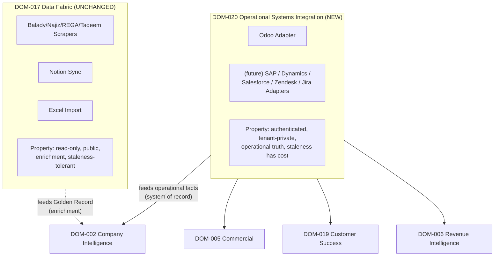
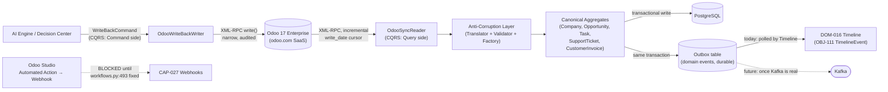
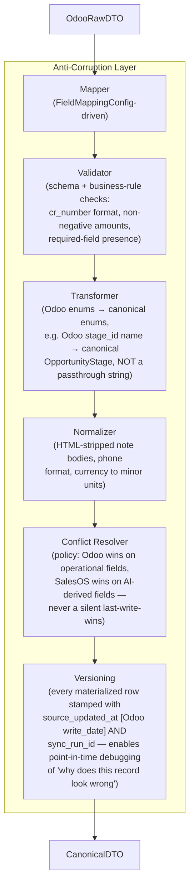

# Architecture Review Board (ARB) Report
## Subject: `ODOO_INTEGRATION_BLUEPRINT.md` v1.0 — Reviewed Against `CANONICAL_ARCHITECTURE.md` v1.0.0

**Review Date:** 2026-07-30
**Reviewers (roles assumed):** Chief Enterprise Architect · CTO · Principal DDD Architect · Enterprise Integration Architect · AI Platform Architect
**Review Type:** Adversarial ARB (challenge-to-break, not rubber-stamp)

---

## VERDICT

> ## ❌ CONDITIONAL REJECT — MAJOR REVISION REQUIRED
>
> The Blueprint is **directionally correct** (it correctly identifies that Kafka/Neo4j are aspirational and defaults to the proven synchronous-Postgres pattern) but **architecturally premature**. It jumps straight from "read Odoo" to "create four new canonical objects" without doing the DDD groundwork: no Bounded Context declaration, no Anti-Corruption Layer design, no tenant-scoped connector model, no Context Map, and — most seriously — **it names a one-vendor capability (`CAP-067 Odoo ERP Connector`) at the exact moment the roadmap admits Muhide will eventually need SAP/Dynamics/Salesforce/Zendesk/Jira/HubSpot too.** Building a bespoke, vendor-named capability today guarantees a second bespoke integration effort tomorrow, and a third, and a fourth — the opposite of what "Canonical Architecture" is supposed to prevent.
>
> This report does not ask for polish. It asks for a **redesign of Section 1–2 of the Blueprint** (Domain + Capability + Object model) before a single line of ingestion code is written. Sections 3 onward of the original Blueprint (the *business* insight — CR-number matching, `mail.message` as highest-leverage source, `crm.team` → Territory) **survive review and are endorsed**. The *architecture* around them does not.

---

## 1. Architecture Alignment — Mismatches Against the Canonical Registries

| Canonical Rule (from `CANONICAL_ARCHITECTURE.md`) | Blueprint Violation |
|---|---|
| §16.2: *"Canonical IDs (CAP-\*, OBJ-\*, WDG-\*) are immutable once assigned."* | The Blueprint invents four new OBJ IDs and one CAP ID **without registering them against §12 Traceability Matrix or §18 Dependency Graph.** No dependency edges were added (e.g., does `OBJ-020` depend on `OBJ-008 Task`? Undeclared.) |
| §5: Domain Ownership table maps every capability to exactly one domain. | `CAP-067` is assigned to `DOM-017 Data Fabric` by analogy to Notion/Excel — but Notion/Excel are **read/write utility imports with no ongoing operational truth**, whereas Odoo is a **live System of Record**. Placing it in the same domain as one-off spreadsheet imports is a category error (detailed in §5 of this report). |
| §7.2 Auth Patterns table enumerates exactly which endpoints are public/JWT/admin/permission/feature-flagged. | Blueprint's `INT-013`/`INT-014` introduce **new inbound trust boundaries** (an external system pushing/pulling tenant data) with **no entry in the Auth Patterns table** — this is not a documentation gap, it's a security-review gap: an integration boundary that isn't classified against the existing auth taxonomy cannot be audited. |
| §8 Event Registry: every event has a Producer, Consumer(s), Capability, Status. | Blueprint's own admission — *"دفع الأحداث الحقيقية لاحقاً"* — silently assumes zero net-new events. §14 of this report shows that is wrong: at minimum 5 new events are required, and none are registered. |
| §9 Widget Registry: 7 widgets fixed for Employee 360 (WDG-201–207). | Blueprint's own §7 admits *"لا يوجد widget مخصص لـ Tickets... يُنصح بإضافة WDG-208"* — correct instinct, but this is a **Widget SDK v1 Freeze violation** (ADR-003, "Widget SDK v1 Freeze," Accepted). Adding WDG-208 is an ADR-level decision, not a footnote in an integration blueprint. This needs its own ADR, not an aside. |
| §17.2 Multi-Tenant Coverage: 93.5%, 5 tables *known* to lack `tenant_id` by design (SSO, Marketplace, Feature Store — all justified as intentionally global). | Blueprint's four new tables (`support_tickets`, `financing_cases`, `commercial_invoices`, `interaction_notes`) all list `tenant_id` as a column — **but never specify how a `tenant_id` is resolved for a record that arrives from an external system with no concept of SalesOS tenancy at all.** This is not a "will add `tenant_id`" checkbox exercise — it requires a **Tenant Resolution Strategy**, addressed nowhere. See §16. |
| §13 Architecture Decisions: *"Modular Monolith (DDD)."* | The Blueprint's four objects are proposed with **zero DDD analysis** — no aggregate boundary, no invariants, no lifecycle. A document that claims to extend a "DDD" architecture cannot introduce four new persistent objects by table-schema sketch alone. This is the core failure of the submission, expanded in §2–3. |

**Alignment score: 3/10.** The Blueprint respects *naming conventions* (uses CAP-/OBJ- prefixes correctly, doesn't renumber existing IDs) but does not perform the *structural* work the registries exist to enforce (dependency declaration, domain-fit justification, ADR triggering, auth classification).

---

## 2. DDD Review

### 2.1 Bounded Contexts — undeclared

The Blueprint never states what Bounded Context Odoo data lives in. This is not pedantry — it has a concrete consequence: **`crm.lead`'s "stage" is not the same concept as `commercial_opportunities.stage`.** Odoo's stages (`To Do`, `in progress`, `Prospect`, `Won - Registered`, `Active (transacting)`, `Not interested`) encode **Muhide's onboarding/activation lifecycle**, not a classic sales-pipeline lifecycle. SalesOS's `OBJ-007 Opportunity.stage` was designed (per §3.1) for a generic sales pipeline (`identified` default, per the code inspected earlier). **Silently mapping one onto the other corrupts both models' Ubiquitous Language** — a `Won - Registered` Odoo lead is not the same business event as a SalesOS `closed_won` opportunity; the former means "the counterparty completed platform registration," the latter means "revenue recognized." Conflating them will produce a Forecast widget (`CAP-015`) that is *confidently wrong*.

**Verdict: this is the single most dangerous unstated assumption in the Blueprint.**

### 2.2 Context Mapping — the Blueprint accidentally proposes a Conformist relationship

Using standard DDD context-mapping vocabulary:

- Odoo is the **Upstream** system (source of operational truth).
- SalesOS is **Downstream** (consumer).
- The Blueprint's "direct mapping" tables (§1 of the original Blueprint: *"res.partner → OBJ-003 Company... مطابقة مباشرة"*) describe a **Conformist** relationship: SalesOS accepts Odoo's model, field names, and semantics as-is, with no translation boundary.
- Conformist is *sometimes* an acceptable, deliberate choice (when the upstream is stable and well-governed). **It is the wrong choice here**, because Odoo's schema is governed by **Odoo Studio, edited by non-developers, producing auto-generated field names** (`x_studio_selection_field_78m_1i8k7ojtv` — an actual field name observed in production). This upstream is **not stable, not versioned, not API-contracted**. Conformist relationships require a well-behaved upstream; Muhide's Odoo is the opposite of well-behaved by construction.
- **Correct pattern: Odoo as Open Host Service (it already exposes a generic, protocol-level interface — XML-RPC) consumed through an Anti-Corruption Layer.** SalesOS must define and protect its own Published Language (the canonical object model) and translate everything crossing the boundary. Full ACL design in §9.

### 2.3 Aggregates, Entities, Value Objects — the Blueprint conflates all three

| Blueprint Object | What it actually is | Correct DDD classification |
|---|---|---|
| `OBJ-019 SupportTicket` | Has its own identity + lifecycle (stage transitions, SLA breach, closure) independent of any other object | **Aggregate Root** — correctly proposed as new, but assigned to the wrong domain (§1, §15) |
| `OBJ-020 FinancingCase` | Modeled as a flat table with ~6 columns bolted onto "Commercial" | **This is not an aggregate — it's a Value Object attached to `OBJ-008 Task`.** It has no independent lifecycle; its state changes only as a reflection of the underlying Task's stage. Treating it as a first-class object with its own ID creates two sources of truth for the same case (the Task and the "FinancingCase"), an **aggregate boundary violation** — an update to one can silently desync from the other. **Redesign in §3.** |
| `OBJ-021 CustomerInvoice` | Genuinely independent lifecycle (issued → paid/overdue), owned by neither Company nor Opportunity exclusively | Correctly an **Aggregate Root**, but placed in the wrong Domain (Commercial, pre-sale) — should be Revenue Intelligence (post-sale). See §3, §5. |
| `OBJ-022 InteractionNote` | Immutable once written. No business invariant is ever enforced on it after creation. Never updated, only appended. | **This is not an Entity at all — it is a Domain Event, materialized as a Value Object in an append-only log.** Modeling it as a mutable Postgres row with CRUD semantics (as the Blueprint's flat "table" proposal implies) is a textbook DDD anti-pattern: **treating a fact-that-happened as a record-that-can-change.** Redesign in §3 and §14. |

**The Blueprint applies one design pattern (flat relational table + CRUD repository) to four objects that actually require three different DDD patterns (Aggregate, Value-Object-on-existing-Aggregate, Domain-Event-log). This is the review's core finding.**

### 2.4 Domain Services, Factories — entirely absent

Nothing in the Blueprint performs *translation with enforced invariants*. There is no `OdooToCanonicalTranslationService` (a Domain Service) and no `CanonicalCompanyFactory` (a Factory) that guarantees, e.g., a `Company` is never constructed with a malformed `cr_number`, regardless of whether the source is Odoo, a government scraper, or Excel import. Without a Factory sitting **in front of** all three ingestion paths, `OBJ-003 Company`'s invariants are enforced three times, inconsistently, in three different ingestion codepaths — or, more likely, enforced zero times, correctly, in any of them.

**Recommendation:** introduce `CanonicalCompanyFactory` and `CanonicalOpportunityFactory` as shared Domain Services, called by *every* ingestion path (Odoo, Excel, Notion, future connectors), not duplicated per-connector.

### 2.5 Shared Kernel — correctly avoided (one thing the Blueprint got right)

The Blueprint does not propose sharing code or schema between Odoo and SalesOS. Good — a Shared Kernel with an externally-governed, Studio-mutable system would be architectural malpractice. No further action needed here.

---

## 3. Canonical Object Review — Redesign

### OBJ-019 `SupportTicket` — **KEEP, but re-domain it**
Should exist as a new Aggregate Root. **Reject** the Blueprint's placement under "Contact Management or a new Support domain" (the Blueprint hedges between two domains — itself a sign the domain wasn't actually decided). **Correct domain: `DOM-019 Customer Success`**, which already exists in the canonical registry for exactly this purpose (Health Scores, Adoption, Engagement) and currently has **zero real capabilities** (`CAP-054 Customer Health Engine` is `❌ Not started`). `SupportTicket` is the missing raw material for `CAP-054` — this is a much stronger domain fit than a vague "Contact Management" placement.

### OBJ-020 `FinancingCase` — **REJECT as a standalone Aggregate. Redesign as a polymorphic extension on `OBJ-008 Task`.**

The Blueprint's own evidence undermines its own proposal: `project.task` in Muhide's Odoo is used for **at least three unrelated purposes** simultaneously — financing underwriting (`x_studio_financing_amount_requested`...), insurance underwriting (`x_studio_coverage_value`, `x_studio_policy_provider`...), and plain internal work tracking (`"SALES SUPPORT"`, `"MBT - Bawazir"`, `"Collaborator program"` — tasks with **zero** financing/insurance fields populated). A single flat `FinancingCase` table would either (a) be full of NULLs for 2/3 of real records, or (b) require the ingestion layer to silently *decide* which tasks "count" — an undocumented, brittle filter.

**Redesign:**
```
OBJ-008 Task (existing, unchanged)
    │
    └── has-one (0..1) ── OBJ-020 TaskCaseExtension (NEW — Value Object, not Aggregate)
                              case_type: enum { financing | insurance | generic }
                              payload: JSONB   (validated against a per-case_type JSON Schema)
                              risk_score: nullable float (AI-derived, written back by Decision Engine)
```
This avoids the "One Big Flabby Entity" anti-pattern (a table with 40 nullable columns, 35 of which are always empty for any given row), keeps `Task` as the single lifecycle owner (no dual-source-of-truth risk), and is *extensible* — a fourth case type (e.g., "insurance claim") is a new enum value + JSON Schema, not a schema migration.

**Domain: `DOM-005 Commercial` is wrong.** Underwriting/risk is not a pre-sale pipeline concern — it is a **post-sale operational risk concern**. This is exactly the gap that motivates §15's new domain (`DOM-020 Operational Intelligence`).

### OBJ-021 `CustomerInvoice` — **KEEP, but the naming fix is incomplete**

The Blueprint correctly identifies the collision with existing `OBJ-303 Invoice` (SalesOS billing its own tenants) but only renames the *new* side. **This is a half-fix.** Ubiquitous Language collisions are not resolved by adding a disambiguated new term while leaving the ambiguous old term unchanged — any engineer grepping `Invoice` six months from now still hits both, and the *old* one is the one that looks unmarked/default. **Mandatory correction: rename `OBJ-303` → `PlatformBillingInvoice` in the same PR that introduces `OBJ-021`.** This is a breaking rename inside an already-shipped Governance domain object — it requires its own ADR (proposed as `ADR-036` in §20).

**Domain: also wrong in the Blueprint.** `CustomerInvoice` feeds Churn/Health scoring (`CAP-018`, `CAP-054`) — its natural home is `DOM-006 Revenue Intelligence`, not `DOM-005 Commercial` (pre-sale).

### OBJ-022 `InteractionNote` — **KEEP the object, REJECT the storage model**

Correctly identified by the Blueprint as the single highest-value data source (endorsed — see §Business Insights Preserved, below). But it is modeled as a mutable Postgres entity when it is, in fact, an **immutable Domain Event**. Correct design:

- Append-only table, **no `UPDATE` or `DELETE` grants** at the application layer (enforce via Postgres role permissions, not just convention).
- Partitioned by month (see §17 — this table will be the fastest-growing table in the entire schema).
- **Domain: `DOM-016 Timeline & Activity`**, not left domain-less as in the original Blueprint — it *is*, structurally, a Timeline event with a rich-text payload, and should be modeled as a specialization of `OBJ-111 TimelineEvent` (already in the registry!) rather than an unrelated fifth object. This is a case where the Blueprint invented a new object when an existing one (`TimelineEvent`) was sitting right there in §3.2 of the canonical document, unused for this purpose.

**Corrected mapping:** `mail.message` → `OBJ-111 TimelineEvent` (existing object, extended with a `raw_text` field and `source_system: "odoo"` discriminator), **not** a new `OBJ-022`.

---

## 4. Capability Review — `CAP-067` Must Not Be Vendor-Named

**This is the report's central architectural objection.**

Section 19 of this ARB (Future Readiness) is asked to test the architecture against SAP, Oracle, Dynamics, HubSpot, Zoho, Salesforce, Monday, ClickUp, Jira, Zendesk, Freshdesk. **A capability literally named "Odoo ERP Connector" fails this test by definition** — the moment Muhide (or the *next* SalesOS tenant, since this is a multi-tenant platform) needs a second ERP/CRM, the team faces a binary choice: (a) build `CAP-068 SAP Connector`, `CAP-069 Dynamics Connector`... one bespoke capability per vendor, each re-solving sync, ID-mapping, conflict resolution, and ACL from scratch, or (b) retrofit `CAP-067` into a framework under time pressure, which is strictly harder than designing it as a framework from day one.

**Redesign:**

```
CAP-067 (renamed) — "External Operational System Integration Framework"
    ├── Generic capability: connector registration, credential vault, sync scheduling,
    │    field-mapping configuration, conflict resolution, ID-mapping store, ACL contracts
    ├── Adapter: OdooAdapter (implements SourceConnector interface)      ← first concrete instance
    ├── Adapter: (future) SAPAdapter
    ├── Adapter: (future) DynamicsAdapter
    ├── Adapter: (future) HubSpotAdapter / ZendeskAdapter / JiraAdapter
    └── Reuses existing `BUILTIN_CONNECTORS` registry pattern already stubbed in
         backend/intelligence/data_fabric/connectors.py — this scaffolding already
         anticipated a multi-vendor future (`odoo`, `sap`, `dynamics`, `hubspot` are
         ALL already listed as registry entries). The Blueprint should have recognized
         and extended this existing pattern rather than proposing a parallel, one-off module.
```

This is not a naming nitpick. The `ConnectorEngine`/`BUILTIN_CONNECTORS` scaffolding **already exists in the codebase** (confirmed in the prior architectural review of `connectors.py`) and was **already designed generically** — the Blueprint's `CAP-067` proposal, as written, would duplicate existing scaffolding under a different module path instead of completing the one that's already there. **This is the most concrete, checkable finding in this entire report: go complete `connectors.py`, do not build a parallel `salesos_integrations/odoo/` module next to it.**

---

## 5. Domain Review — `DOM-017` Cannot Absorb This. Propose `DOM-020`.

`DOM-017 Data Fabric`'s existing capabilities (`CAP-038` Notion Sync, `CAP-039` Excel Import, `CAP-040` Data Fabric/scrapers) share three properties: **read-only, public or low-trust source, enrichment-only (never operational truth), tolerant of staleness (a scraper refresh delayed a day is a non-event).**

Odoo (and any future ERP/CRM/helpdesk system) has the **opposite** properties: **authenticated, tenant-private, carries operational/financial truth, staleness has business consequences** (an invoice-paid event delayed by a day breaks a Churn model's timing).

Conflating these under one domain means one domain owns both "best-effort enrichment" and "must-be-correct operational sync" — these require different SLAs, different on-call ownership, different testing rigor (a failed Balady scrape is a shrug; a failed Odoo sync that miscounts invoice-overdue amounts is a customer-facing incorrect Churn Risk score).

**Recommendation: create `DOM-020 Operational Systems Integration`**, distinct from `DOM-017 Data Fabric`.



`DOM-020` owns: `CAP-067` (the reframed generic framework), `OBJ-019 SupportTicket`, `OBJ-020 TaskCaseExtension`, `OBJ-021 CustomerInvoice` (co-owned with `DOM-006` as consumer), the new `ExternalSystemConnection` object (§16), and the ACL contracts (§9).

---

## 6. Integration Architecture — Evaluated Against the *Actual* Current State, Not the Aspirational One

| Option | Verdict for Muhide/Odoo, today | Reasoning |
|---|---|---|
| REST | ❌ Rejected | Odoo does not expose a rich REST surface without custom server-side controllers, and Muhide's instance is odoo.com SaaS-hosted — no custom module deployment rights confirmed this session. |
| GraphQL | ❌ Rejected | Not available on Odoo at all without third-party modules; irrelevant here. |
| **XML-RPC** | ✅ **Primary mechanism, today** | Already proven this week against production data; only viable read/write path given hosting constraints. |
| CDC (Postgres logical replication) | ❌ Rejected, hard blocker | odoo.com SaaS gives zero database-level access. This option only becomes available if Muhide migrates to Odoo.sh or self-hosted — not a near-term lever. |
| Webhook (Odoo Studio Automated Action) | 🟡 **Available, but blocked by an existing P0** | Native, no-code, confirmed available on Odoo 17 Enterprise. **However**, per `CANONICAL_ARCHITECTURE.md` §14, the SalesOS-side receiving path (`CAP-027 Webhooks`) has an **unresolved P0: SSRF, no URL allowlist, `app/routers/workflows.py:493`**, plus a CSRF bypass via `X-API-Key`. Turning on inbound Odoo webhooks today means exposing a known-vulnerable endpoint to a new external caller. **Hard gate, not a nice-to-have.** |
| Kafka / general Event Bus | 🟡 **Defer as the backbone; don't defer as the *pattern*** | §17 Health Scorecard: Kafka defaults to `in_memory`, event-driven adoption is **Grade D** (5 of ~60 modules). Building the initial sync on top of Kafka would mean building on the *least* proven part of the entire platform. But — see §14 — the **Outbox Pattern** decouples "recording that an event happened" from "Kafka being production-grade," and should be adopted now regardless of Kafka's maturity. |
| Polling (naive, full-table) | ❌ Rejected as designed in the Blueprint | The Blueprint never specifies incremental/delta pulls. At 27,264 `crm.lead` records today (growing), full-table XML-RPC polling on every scheduled run is not viable long-term (see §17 Performance). |
| **Scheduled Incremental Sync** | ✅ **Correct mechanism** | Delta pull via `write_date > last_cursor`, using the existing, working `CAP-028 Scheduled Jobs`. This is what the Blueprint *should* have specified instead of unqualified "scheduled sync." |
| Command Bus | 🟡 Recommended for the write-back path only | Writes from SalesOS → Odoo (AI scores, enrichment fields) should go through an explicit `WriteBackCommand` abstraction (not raw `execute_kw` calls scattered through service code), so that write-back failures are retryable/auditable independent of the read-sync path. Not addressed in the Blueprint at all. |
| CQRS | 🟡 Recommended, lightweight | Separate the **read model** (`OdooSyncReader`, bulk, tolerant of staleness) from the **write model** (`OdooWriteBackCommand`, narrow, single-field, must be auditable) — these have opposite consistency/latency requirements and should not share one repository class as the Blueprint implies. |
| Event Sourcing (full) | ❌ Rejected for now, ✅ keep the door open | Full Event Sourcing is too heavy for the platform's current maturity (Grade D event adoption). But `OBJ-111 TimelineEvent` extended with Odoo-sourced events (§3) is, structurally, an event log already — if event-sourcing ever becomes a real platform direction, this table is the natural seed, not a rewrite. |

**Recommended architecture, corrected:**



---

## 7. Repository Pattern Review

The Blueprint says "Postgres directly" but never chooses among **Imported / Cached / Mirrored / Referenced / Federated / Virtualized / Indexed / Normalized / Materialized** — these are not synonyms, and the choice has real consequences.

| Strategy | Verdict |
|---|---|
| **Federated / Virtualized** (query Odoo live, never persist) | ❌ Rejected. XML-RPC latency (we observed multi-second responses on large `fields_get`/`search_read` calls this week) makes live federation unusable for any user-facing page (Company 360 cannot block-render on an Odoo round-trip). |
| **Referenced** (store only an Odoo ID, dereference on read) | ❌ Rejected for the same latency reason, plus it defeats Search/Entity Resolution, which need the actual field values indexed locally. |
| **Mirrored + Materialized** | ✅ **Correct strategy.** Data is pulled, translated via ACL, and *materialized* as first-class SalesOS rows (not just cached blobs) — this is what makes Golden Record matching, Search indexing (pgvector/pg_trgm), and Knowledge Graph population possible at all. |
| **Cached** (as an *additional* layer, not the primary strategy) | ✅ Correct, but as a *read-through cache* (Redis, already in stack) in front of the materialized Postgres rows for hot paths (e.g., repeated Company 360 loads), not as a substitute for materialization. |
| **Normalized** | ✅ Required — Odoo's flat, denormalized `x_studio_*` sprawl must not be imported flat; the ACL normalizes it into the canonical shape (§9). |
| **Indexed** | ✅ Required, and currently unaddressed — see §17 (new tables need `tenant_id + company_id + updated_at` composite indexes at minimum; `TimelineEvent` extension needs a BRIN index on `occurred_at` given append-only growth). |

**Verdict: Mirrored + Materialized + Cached(Redis, secondary) + Normalized + Indexed. Federated/Virtualized/Referenced are explicitly wrong for this integration and should be documented as a rejected alternative in the ADR, not silently absent.**

---

## 8. Canonical Data Model — Contracts Are Missing Entirely

The Blueprint has **zero DTOs, zero mapper classes, zero versioned contracts.** It implies direct attribute mapping (`res.partner.name` → `Company.name_ar`). Given the observed field-name fragility (auto-generated Studio field IDs), this is not sustainable.

**Required layers (none currently specified):**

```
OdooRawDTO            (1:1 shape of the XML-RPC response, untyped/loosely typed, never touches domain code)
      │
      ▼  [Mapper — configuration-driven, NOT hardcoded attribute access]
FieldMappingConfig     (versioned, tenant-scoped table: odoo_model + odoo_field_label → canonical_field
                        — critically, mapped by STUDIO LABEL where possible, with technical-name as
                        fallback, and a validation job that alerts when a mapped technical name
                        disappears from fields_get() — this is the direct mitigation for the
                        x_studio_selection_field_78m_1i8k7ojtv fragility problem)
      │
      ▼
CanonicalDTO           (typed, validated, matches canonical Aggregate shape exactly)
      │
      ▼  [Factory — enforces invariants]
Domain Aggregate       (Company / Opportunity / Task / SupportTicket / CustomerInvoice)
```

**Why configuration-driven mapping, specifically:** a hardcoded Python mapper (`company.cr_number = odoo_record["x_studio_cr_number"]`) breaks silently the day a Muhide admin edits that Studio field. A configuration-driven mapping, validated on every scheduled sync run, **fails loudly** (alert: "expected field `x_studio_cr_number` on `project.task`, not found — mapping stale") instead of silently ingesting `null` into a field Entity Resolution depends on. This single design choice is the difference between a connector that degrades gracefully and one that silently corrupts Golden Record matching six months from now.

---

## 9. Anti-Corruption Layer — Full Design



None of these six sub-components exist in the Blueprint as submitted. The Blueprint's "repository pulls from Odoo" collapses all six responsibilities into one undifferentiated step — which is precisely how upstream schema drift becomes downstream data corruption without anyone noticing until a customer complains that their Company 360 page shows the wrong risk score.

**Conflict Resolution policy detail (missing from the Blueprint entirely):** what happens when an AI-computed `risk_score` (written back to Odoo, per the original Blueprint's write-back idea) is then re-read on the next sync cycle? Without an explicit policy, the connector could read its own AI output back as if it were fresh Odoo-native data — a feedback loop that silently reinforces the model's own priors. **Explicit rule required: fields written by SalesOS (`x_studio_*_ai_score` style) must be excluded from the read-mapping in the opposite direction, permanently, by convention enforced in `FieldMappingConfig`, not by developer memory.**

---

## 10. Knowledge Graph Review — Beyond "Populate It"

The original Blueprint's insight (Odoo will be Neo4j's first real data) is correct but underspecified — "populate Neo4j" is not an architecture, it's an aspiration.

**Should Neo4j become:**
- ~~Enterprise Knowledge Graph (everything)~~ — too broad, no clear ownership boundary, would become a dumping ground.
- ~~Decision Graph~~ — too narrow, conflates with Decision Center's own audit trail.
- ✅ **Commercial + Operational Relationship Graph**, scoped explicitly: Company, Contact, Employee, Opportunity, SupportTicket, TaskCaseExtension nodes; `TRADES_WITH` (buyer↔seller — Muhide's actual core business relationship), `OWNS_CASE`, `RAISED_TICKET`, `SIGNED_AGREEMENT` edges. This matches `WDG-110 Relationship Graph`'s existing, narrower scope — don't over-scope the graph beyond the widget that consumes it.

**Consistency mechanism — this is the part the original Blueprint entirely missed:** the graph must **not** be dual-written from the connector alongside Postgres (classic distributed-consistency failure mode — a crash between the two writes leaves them permanently out of sync, and nothing detects it). **Correct pattern: the graph is a projection, built by consuming the same Outbox events (§6, §14) that feed Timeline.** One write (Postgres + Outbox, single transaction), two independent downstream projections (Timeline table, Neo4j graph) — both eventually consistent from one durable source, neither a second source of truth.

---

## 11. Company 360 — Impact Review

| Element | Change required | Risk flagged |
|---|---|---|
| Widgets | `WDG-108 Golden Record`, `WDG-109 Government Intelligence` go from empty to populated for real customers (correctly predicted by original Blueprint) | **New risk, unaddressed by the Blueprint:** several real Odoo tickets we found this session have `partner_id = False` (missing customer link). Golden Record matching on `cr_number` **silently skips these records** — meaning some real customers get *zero* enrichment with no visible error. The 360 page will look complete while quietly excluding exactly the accounts with the worst data hygiene — likely correlated with exactly the accounts most in need of attention. **This must be surfaced as a visible "unlinked record" badge, not silently dropped.** |
| APIs | `CAP-004`'s 17 existing endpoints (`/api/v1/companies/*`) need **zero new endpoints** if Mirrored+Materialized (§7) is followed correctly — Odoo-sourced companies are just rows in the existing `companies` table. This is a point *in favor* of the corrected repository strategy: no API surface bloat. |
| Repositories | `CompanyRepository` / `PgVectorCompanyRepository` (existing, Postgres-backed — the "good" 45-repo category per §17.1) — **no new repository class needed** if the ACL correctly materializes into the existing schema. The Blueprint's proposal to add net-new tables for Company-adjacent data is only justified for genuinely new concepts (SupportTicket, TaskCaseExtension), not for Company/Contact/Opportunity themselves. |
| Services | New: `OdooSyncReader`, ACL components (§9) — genuinely new. | — |
| Smart Timeline (`WDG-102`) | Becomes the **primary consumer** of the redesigned `OBJ-111 TimelineEvent` extension (§3) — this is where `mail.message` content actually surfaces to a user, correctly. |

**Verdict: Company 360 improves significantly, but only if the Golden Record "silent skip" risk is explicitly handled — otherwise the platform's flagship capability degrades from "empty" (obviously incomplete) to "confidently incomplete" (worse, because it looks done).**

---

## 12. Employee 360 — Impact Review

The original Blueprint's re-prioritization (Activity primary, Email secondary) is **empirically correct** (0 real emails for the company's top performer, 86 real interaction notes) and is **endorsed without reservation.**

What the Blueprint missed:

- Re-prioritizing which widget is "primary" is a **UI/UX decision affecting a frozen widget contract** (`ADR-003 Widget SDK v1 Freeze`). This needs its own ADR (proposed `ADR-037`), not a paragraph in an integration doc — the Widget SDK freeze exists specifically to prevent ad-hoc widget reordering/reinterpretation outside of a governed process.
- `WDG-208` (new "Support & Cases" widget, correctly proposed by the original Blueprint) needs **service and API design**, not just a table reference — specifically: does it show *tickets the employee is assigned* or *tickets for companies the employee owns*? These are different queries with different perceived meanings to the employee viewing their own profile (`/employees/me`). Undecided in the Blueprint.
- `AI Coach` (`WDG-203`, `AI-AG-004`) consuming `InteractionNote`/`TimelineEvent` content needs a **defined prompt-grounding contract** (which fields, what time window, what PII is excluded) — see §13. Not specified.

---

## 13. AI Architecture — Impact Review

| AI Component | Impact | Gap in Blueprint |
|---|---|---|
| `AI Coach` (`AI-AG-004`) | Primary beneficiary of `OBJ-111`-extended data | No prompt contract defined — risk of feeding raw, unfiltered note text (which contains phone numbers, e.g. *"+966 55 961 1367"* observed literally in production notes this week) directly into an LLM prompt. **PII scrubbing step missing from the entire Blueprint, despite being called out in the earlier (broader) report — it was dropped in the focused Blueprint.** |
| `Recommendation Engine` (`AI-AG-003`) / `Decision Center` (`CAP-022`) | Would consume `TaskCaseExtension.risk_score` | No spec for who computes `risk_score` (rule-based? LLM? both?) or how it avoids the feedback-loop problem flagged in §9. |
| `RAG Pipeline` (`CAP-024`) | Natural home for embedding `TimelineEvent.raw_text` | **Entirely unmentioned in the focused Blueprint.** If `InteractionNote`/`TimelineEvent` is the headline "highest-value" data source, its RAG ingestion path is not optional detail — it's the actual mechanism by which the value is realized. This is a significant omission. |
| `Prompt Registry` (`CAP-023`) | Needs a new registered prompt, e.g. `AI-PR-010 "Odoo Case Risk Assessment"` | Not proposed. |
| `Memory` (`CAP-063`, not started) | N/A yet | Correctly out of scope — flagging only that future work here should not assume Odoo data arrives pre-cleaned; it won't. |

---

## 14. Event Architecture — Corrected Event Model

**New events required (none currently registered in §8):**

| Event | Producer | Consumer(s) | Mechanism |
|---|---|---|---|
| `odoo.company.synced` | `OdooSyncReader` (via ACL) | Entity Resolution, Search | Outbox |
| `odoo.opportunity.stage_changed` | ACL (translated, not raw Odoo stage string) | Timeline, Revenue, Forecast | Outbox |
| `odoo.ticket.sla_breach_imminent` | Derived (SalesOS-computed, not from Odoo directly) | Customer Success, NBA | Outbox |
| `odoo.financing_case.risk_flagged` | Decision Center (after scoring `TaskCaseExtension`) | Timeline, NBA | Outbox |
| `odoo.invoice.overdue_threshold_crossed` | Derived (SalesOS-computed: `invoice_date_due` vs now) | Churn Intelligence, Revenue Dashboard | Outbox |

**No existing event becomes obsolete.** But `opportunity.stage_changed` (already registered, status 🟡 "Partial") gains its **first real producer** — currently, per §8, it's defined but not reliably wired end-to-end; Odoo integration is the forcing function that finally requires it to work, which is a secondary benefit worth stating explicitly.

**Should events become first-class citizens?** Not yet, platform-wide (Grade D adoption is a systemic issue bigger than this integration). But *for this integration specifically*, yes — via the Outbox pattern (§6), which gets the durability benefit of "events as first-class facts" without depending on Kafka's production maturity. This is the correct scoped answer: don't fix the whole platform's event culture as a side effect of one integration, but don't repeat the platform's existing weakness either.

---

## 15. Operational Intelligence — Full Domain Design (`DOM-020`)

| Layer | Design |
|---|---|
| **Domain** | `DOM-020 Operational Systems Integration` (owns the framework + adapters) — paired with using `DOM-019 Customer Success` and `DOM-006 Revenue Intelligence` as *consumers* of the objects it produces (objects are placed by *business meaning*, not by *source system*, per §3/§5 corrections) |
| **Capabilities** | `CAP-067` External System Integration Framework (generic); Odoo Adapter is a *registered instance*, not a separate CAP |
| **Objects** | `OBJ-019 SupportTicket` (own DOM-019); `OBJ-020 TaskCaseExtension` (Value Object on existing `OBJ-008 Task`); `OBJ-021 CustomerInvoice` (own DOM-006); `OBJ-111 TimelineEvent` extended (own DOM-016, existing); **new** `ExternalSystemConnection` (§16, own DOM-020 — the tenant-scoped credential/config object, genuinely new and genuinely missing from the original Blueprint) |
| **Services** | `OdooSyncReader` (CQRS query side), `OdooWriteBackWriter` (CQRS command side), ACL (`Mapper`, `Validator`, `Transformer`, `Normalizer`, `ConflictResolver`), `CanonicalCompanyFactory`/`CanonicalOpportunityFactory` (shared with Excel/Notion ingestion, not duplicated) |
| **Repositories** | Existing `CompanyRepository`/`ContactRepository`/`PostgresOpportunityRepository` (reused, per §11 — no new repos for objects that already exist canonically); new `SupportTicketRepository`, `CustomerInvoiceRepository`, `ExternalSystemConnectionRepository` (Postgres-backed from day one — **do not** add these to the 35-repository InMemory pile per §17.1's own documented anti-pattern) |
| **APIs** | New: `/api/v1/integrations/odoo/*` (connection config, sync status, manual trigger) — modeled directly on the existing `/api/v1/integrations/google/*` pattern (§7.1), which already solves this exact problem for a different vendor |
| **Events** | Per §14 |
| **Widgets** | `WDG-208` (new, Employee 360 — pending `ADR-037`); no new Company 360 widgets needed (existing 11 widgets absorb the data, per §11) |

---

## 16. Multi-Tenant Review — The Most Concrete Gap in the Original Blueprint

**The Blueprint never asks: "Whose Odoo instance is this?"** It implicitly hardcodes a single Odoo connection (Muhide's). SalesOS is a multi-tenant platform (§17.2: 93.5% tenant_id coverage, by design). The moment a second tenant also runs Odoo — or the same tenant rotates their Odoo API key — the Blueprint's design has no answer.

**Required, entirely new object:**

```
ExternalSystemConnection
  id, tenant_id, system_type ("odoo" | future values),
  connection_config (encrypted JSONB: url, db, username),
  credential_ref (pointer into a secrets vault — NEVER the raw API key in this table),
  last_sync_cursor (write_date watermark, per-model),
  status (active | error | disabled)
```

**Security requirement, directly analogous to existing code:** §21.1 of the canonical doc shows `GoogleAccount` tokens are **Fernet-encrypted at rest**. The Odoo API key must follow the **identical** pattern — the Blueprint doesn't mention encryption at all, which, given the existing precedent already in the codebase, is not a new problem to solve, just an existing pattern to *not skip*.

**Cross-tenant risk:** without `ExternalSystemConnection.tenant_id` strictly enforced at the query layer (and given §14's documented, *unresolved* Decision Center cross-tenant IDOR bug elsewhere in the same codebase), a connector bug here would not be a hypothetical risk — it would be the second known instance of the same class of bug. **Any PR implementing this must include a cross-tenant regression test as a merge gate, not an afterthought**, precisely because the codebase has already shipped this bug class once.

---

## 17. Performance Review

| Concern | Blueprint status | Correction |
|---|---|---|
| Full-table vs incremental sync | Unaddressed (implies "scheduled sync," no cursor) | Mandatory `write_date`-based incremental pull per model, per §6/§8 |
| Indexing on new tables | Unaddressed | Minimum: composite `(tenant_id, company_id, updated_at)` on `support_tickets`, `customer_invoices`; BRIN index on `TimelineEvent.occurred_at` given append-only, time-ordered growth |
| `TimelineEvent`/`InteractionNote` growth rate | Unaddressed — this table will outgrow every other table in the schema within months given 2,416+ notes already exist for a company this small | Monthly partitioning, mandatory from day one — retrofitting partitioning onto a live, growing, unpartitioned table later is materially more expensive than designing it in |
| XML-RPC rate limits / timeouts | Unaddressed — we observed real timeouts this week on large `fields_get`/`ir.model` calls | Backoff + circuit breaker in `OdooSyncReader`; paginate `search_read` with `limit`/`offset`, never unbounded |
| Neo4j write volume | Unaddressed | Since graph writes are now a **projection** off the Outbox (§10), not dual-writes, this is naturally rate-limited by the projector, not by the connector — a secondary benefit of the corrected design |
| Redis cache invalidation | Unaddressed | Cache key must include the `sync_run_id`/`source_updated_at` stamp (§9 Versioning) so a stale cache entry is detectable, not just time-expired |

---

## 18. Security Review

| Risk | Status |
|---|---|
| Webhook SSRF (`app/routers/workflows.py:493`) | **Confirmed blocker for `INT-014`, correctly identified by the original Blueprint** — endorsed, and this report adds: this is a **platform-wide** P0, not Odoo-specific; fixing it unblocks *every* future webhook-based connector, which is additional justification for prioritizing it regardless of Odoo timelines. |
| API Key / credential storage | **Unaddressed by Blueprint** — must reuse Fernet-encryption pattern (§16), never store the raw Odoo API key in `FieldMappingConfig`, logs, or telemetry events (`CAP-045` Telemetry — verify sync-job logging doesn't accidentally capture request payloads containing the key). |
| Replay attacks (future Webhook) | **Unaddressed** — when `INT-014` is eventually enabled, the receiving endpoint needs a nonce/timestamp check, not just a shared secret, or a captured Studio webhook payload could be replayed. |
| Tenant leakage | **Unaddressed** — see §16; compounded by the existing, unresolved Decision Center IDOR bug elsewhere in the codebase, which sets a concerning precedent. |
| CSRF bypass via `X-API-Key` (`app/common/csrf.py`) | Same root blocker as SSRF for the webhook path; **both must close together**, not sequentially, since an attacker only needs one. |
| Odoo-side exposure | **Not evaluated by the Blueprint at all** — worth noting for completeness: the Odoo API user itself should be a **dedicated, minimally-scoped integration user** (not an admin account), with read-only access to `account.move` maintained (already true, confirmed this session) and write access scoped only to the specific Studio fields SalesOS writes back to — Odoo-side least-privilege is as much a part of this integration's security posture as SalesOS-side. |

---

## 19. Future Readiness — Stress Test

**Test: assume SAP, Dynamics, HubSpot, Zoho, Salesforce, Monday, ClickUp, Jira, Zendesk, Freshdesk all arrive over the next 3 years.**

- **Against the original Blueprint (`CAP-067 Odoo ERP Connector`, no generic framework, no ACL contracts, hardcoded field mapping):** ❌ **Does not survive.** Every new system requires a full bespoke re-implementation: new capability ID, new hardcoded mapper, no shared conflict-resolution policy, no shared credential vault pattern. Ten systems means ten divergent, unmaintainable integration codebases within a "modular monolith" that was supposed to prevent exactly this kind of sprawl.

- **Against the redesign in this report (`CAP-067` as a generic framework extending the already-stubbed `connectors.py`/`BUILTIN_CONNECTORS`, ACL with configuration-driven mapping, `ExternalSystemConnection` as a tenant-scoped multi-adapter object, Outbox-based events, CQRS read/write separation):** ✅ **Survives.** Each new system is: one new `SourceConnector` implementation (Odoo's XML-RPC quirks isolated to the Odoo adapter only), one new `FieldMappingConfig` row-set (no code change for straightforward field renames), reuse of the same `ExternalSystemConnection`, ACL, Outbox, and Factory machinery. Zendesk/Jira/Freshdesk in particular map almost directly onto the already-designed `SupportTicket`/`DOM-019` shape with zero additional object design.

**This is the single clearest argument for rejecting the Blueprint as submitted and adopting this report's redesign: the redesign costs marginally more up front and is the only version of this work that is not thrown away by the third integration.**

---

## 20. Enterprise Readiness Score

| Dimension | Score (0–10) | Justification |
|---|---|---|
| Architecture Alignment | **3** | Ignores dependency graph, ADR triggers, auth-pattern registration (§1) |
| DDD Maturity | **2** | No Bounded Context, no Context Map, Aggregate/Value-Object conflation across all four proposed objects (§2–3) |
| Scalability | **4** | Correctly avoids Kafka/Neo4j dependence, but no incremental sync, no partitioning, no indexing specified (§17) |
| Maintainability | **3** | Hardcoded field mapping against a Studio-mutable schema is a maintenance time-bomb (§8) |
| Extensibility | **2** | Vendor-named capability fails the very future-integrations test this review was asked to run (§19) |
| Security | **3** | Correctly identifies the SSRF/CSRF blocker but proposes nothing for credential encryption, tenant isolation, or replay protection (§16, §18) |
| Performance | **3** | No incremental sync, no partitioning strategy for the fastest-growing table in the schema (§17) |
| AI Readiness | **4** | Correctly identifies the highest-value data source (`mail.message`), but drops the PII-scrubbing and RAG-ingestion path entirely (§13) |
| Integration Readiness | **5** | The *business* mapping (§1 of original Blueprint) is genuinely strong; the *mechanism* around it is not (§6–9) |
| Operational Readiness | **3** | No tenant-scoped connection model, no monitoring/alerting on mapping drift (§8, §16) |
| Knowledge Graph Readiness | **4** | Correct instinct (Odoo = first real data), wrong consistency mechanism (dual-write risk, §10) |
| Future ERP Readiness | **2** | Fails the explicit stress test in §19 as submitted |

**Overall weighted score: 3.3 / 10 — Not enterprise-ready as submitted.**

**With the corrections in this report applied (generic framework, ACL, Outbox, CQRS, tenant-scoped connection object, TaskCaseExtension redesign, TimelineEvent reuse):** projected **7.5 / 10** — genuinely enterprise-grade, and specifically durable against the 10-vendor future-integration stress test in §19.

---

## Business Insights Preserved (What the Original Blueprint Got Right)

To be fair, and because a review board that finds nothing right is as useless as one that finds nothing wrong:

1. **`x_studio_cr_number` as a free join key to 141,221 already-scraped companies** — genuinely excellent, high-leverage, correctly identified. Endorsed without reservation.
2. **`mail.message` (reframed here as `TimelineEvent` extension) as the highest-value, highest-volume, richest data source** — correct, evidence-backed (2,416+ real notes vs. 82 real emails company-wide), correctly prioritized ahead of Company/Contact ingestion.
3. **`crm.team` → Territory Management** — correct, low-effort, real-data-for-an-empty-capability win.
4. **Correctly rejecting Kafka/Neo4j/Webhook-first designs** in favor of the platform's actually-proven synchronous-Postgres pattern — the *instinct* was right; this report's job was to make the *execution* of that instinct DDD-sound and future-proof.

---

## Recommended ADRs to Formally Open

| ADR | Title | Triggered by |
|---|---|---|
| `ADR-036` | Rename `OBJ-303 Invoice` → `PlatformBillingInvoice`; introduce `OBJ-021 CustomerInvoice` | §3 |
| `ADR-037` | Employee 360 Widget Reordering — Activity Primary, Email Secondary + new `WDG-208` | §12 |
| `ADR-038` | External System Integration Framework (generalize `CAP-067`, formalize `connectors.py`) | §4, §19 |
| `ADR-039` | New Domain `DOM-020 Operational Systems Integration` | §5 |
| `ADR-040` | Outbox Pattern Adoption for Domain Events (independent of Kafka maturity) | §6, §14 |
| `ADR-041` | `ExternalSystemConnection` — Tenant-Scoped Credential & Sync-State Model | §16 |

---

## Migration Roadmap (Revised)

| Phase | Duration | Content |
|---|---|---|
| **Phase 0 — Foundation (new, not in original Blueprint)** | 1 week | `ADR-038` through `ADR-041` written and approved; `ExternalSystemConnection` object + Fernet-encrypted credential storage; `FieldMappingConfig` table + validation job |
| **Phase 1** | 1-2 weeks | Complete `connectors.py`/`BUILTIN_CONNECTORS` with a real `OdooAdapter` implementing `SourceConnector`; `CanonicalCompanyFactory`/`CanonicalOpportunityFactory`; incremental sync via `write_date` cursor; `cr_number` matching against existing 141,221 companies |
| **Phase 2** | 1 week | `OBJ-111 TimelineEvent` extension for `mail.message`; Outbox table; PII-scrubbing pre-RAG; `AI-PR-010` prompt registration |
| **Phase 3** | 1-2 weeks | `OBJ-019 SupportTicket` (own migration, `DOM-019`); `OBJ-020 TaskCaseExtension` (Value Object on `Task`, JSONB payload + per-type JSON Schema validation) |
| **Phase 4** | 1 week | `OBJ-021 CustomerInvoice` + `ADR-036` rename of `OBJ-303`; `crm.team` → Territory |
| **Phase 5** | ongoing, gated | `INT-014` Webhook enablement **only after** `workflows.py:493` and `csrf.py` P0s close; Neo4j projection off the Outbox; re-evaluate Kafka once platform-wide event adoption improves beyond Grade D |

---

*End of ARB Report. Verdict stands: Conditional Reject on the Blueprint as submitted; the redesign in Sections 3–19 of this report is the recommended path to formal approval.*
