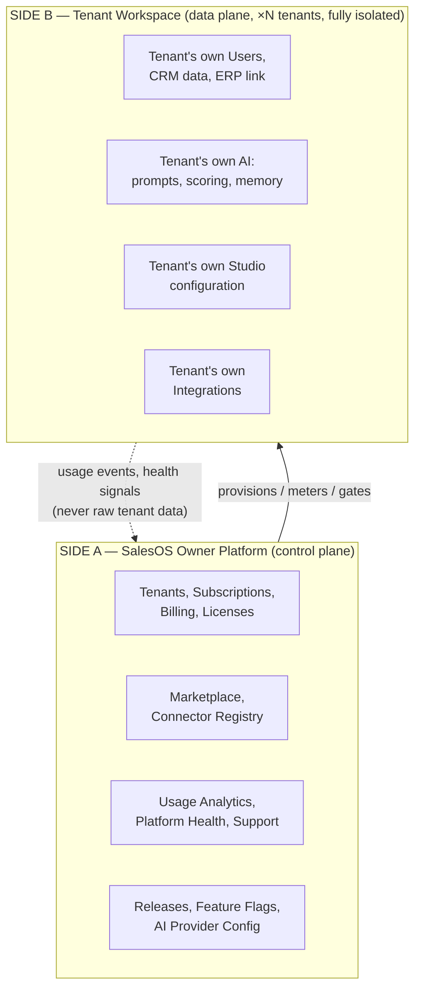
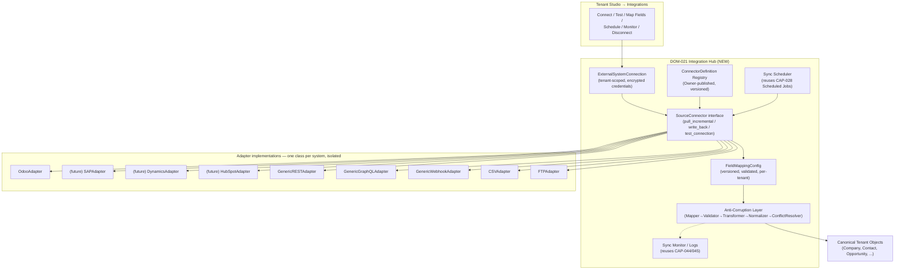
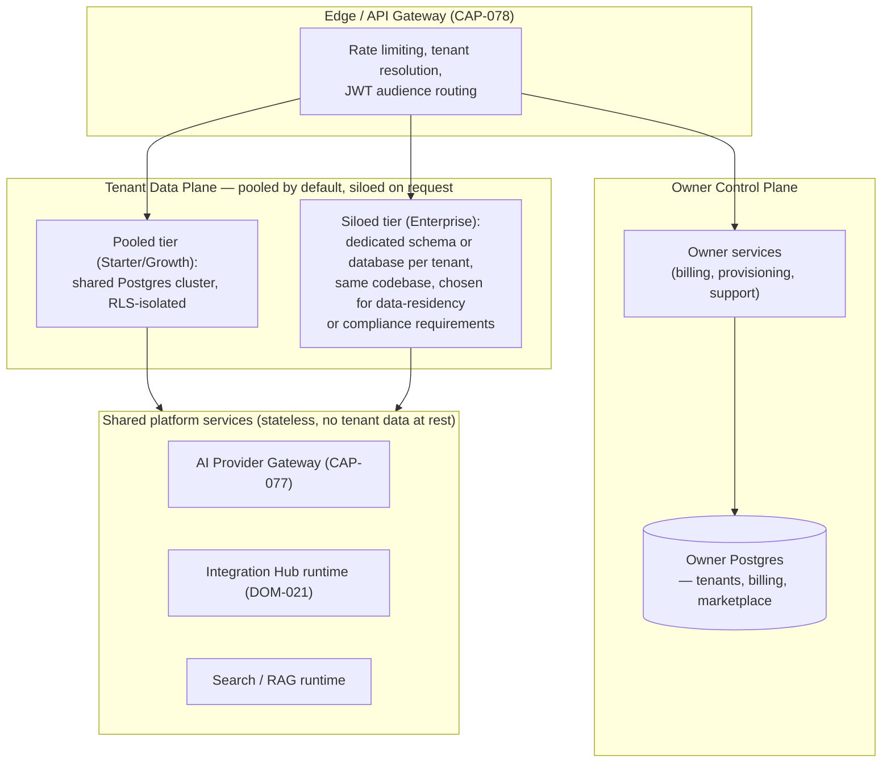

# SalesOS as a Commercial SaaS Platform — Architecture Redesign

> **Status:** Proposal — extends `CANONICAL_ARCHITECTURE.md` v1.0.0. Does not contradict it; every existing DOM/CAP/OBJ ID is preserved unchanged (per §16.2 immutability rule). This document adds the **Product Platform layer** that the canonical document never had, because it was written from the assumption of one tenant (Muhide) rather than hundreds.
> **Version:** 2.0.0-proposal
> **Author role:** Chief Product Officer / Chief Enterprise Architect
> **Requires:** CTO/Architect approval before any DOM/CAP/OBJ ID below is considered assigned (§16.2).
> **Prior art this document builds on:** `ODOO_INTEGRATION_BLUEPRINT.md`, `ARB_REVIEW_ODOO_INTEGRATION.md`, `ARB_META_REVIEW.md` (the connector-framework debate below resolves in favor of the framework — see §5.0 for why the calculus changed), and the iSkala GTM reverse-engineering report (artifact `43e33b93`).

---

## 0. The Reframe

`CANONICAL_ARCHITECTURE.md` §1 states: *"Multi-tenant by design (every table has `tenant_id`)."* That sentence is true and was always necessary — but it describes **row-level isolation inside one running application**, not **a product with a business model, a buyer, a self-service configuration surface, and an ecosystem**. Those are different problems:

| What the canonical doc already solved | What it never addressed |
|---|---|
| A `tenant_id` column on 72/77 tables | Who provisions a tenant? Who bills it? What happens when it churns? |
| RBAC (`roles`, `permissions`) inside a tenant | Who administers SalesOS *itself*, across all tenants? |
| A capability registry (`CAP-*`) describing what the product *can do* | A licensing model describing what a *given tenant is entitled to use* |
| `connectors.py` / `BUILTIN_CONNECTORS` as a stub, and one bespoke Odoo blueprint | A generic Integration Hub that onboards a connector without a code change |
| Feature flags (Grade A, per-tenant override — the one piece of platform maturity already in place) | A no-code Studio where a tenant's own admin configures the platform without engineering involvement |

**The single architectural move this document makes:** split the system into two planes that share a database engine and a codebase, but never share data, never share an admin surface, and are governed by different teams.



Everything already in `CANONICAL_ARCHITECTURE.md` (DOM-001 through DOM-019, CAP-001 through CAP-066) is **Tenant Workspace** content — it stays exactly where it is. This document adds what's missing: the **Owner Platform** (net-new), the **Tenant Studio** (a no-code configuration layer over existing tenant capabilities), the **Integration Hub** (generalizing the one-off Odoo connector debate into a real framework), the **GTM Studio** (nativizing the iSkala carousel concepts), and the **governance/licensing model** that makes "sell to hundreds of customers" an actual operating model instead of a slogan.

---

## 1. SalesOS Owner Platform (Side A)

Used exclusively by SalesOS's own employees (Platform Ops, Support, Sales-of-SalesOS, Engineering). No tenant, ever, sees any part of this. This is a **new top-level domain**, `DOM-020`.

### 1.1 Capabilities

| ID | Capability | What it does | Consumes / feeds |
|---|---|---|---|
| **CAP-068** | Tenant Provisioning | Create/suspend/delete a tenant workspace; assign region/data-residency; seed default Studio config from a plan template | `ExternalSystemConnection`-style isolation, §13 |
| **CAP-069** | Subscription & Billing | Plan assignment, usage metering, invoicing, dunning, upgrade/downgrade, proration | Stripe/payment provider (external), Licensing model §16 |
| **CAP-070** | License & Entitlement Engine | Per-tenant feature entitlements (which DOM/CAP a plan unlocks), seat counting, overage handling | Feature Flags (existing, Grade A) — entitlements are flags scoped at the *plan* level, flags stay the per-tenant override mechanism |
| **CAP-071** | Connector Marketplace (Owner side) | Certify, version, and publish connectors (Odoo, SAP, HubSpot, etc.) that tenants install from Side B | Integration Hub, §5 |
| **CAP-072** | App/Prompt/Playbook Marketplace (Owner side) | Certify and publish GTM playbooks, prompt packs, scoring templates tenants can install | GTM Studio §6, AI Studio §7 |
| **CAP-073** | Platform Usage Analytics | Cross-tenant (anonymized/aggregated) usage, adoption, churn-risk-of-tenant signals | Owner-only Analytics, never joins tenant data across tenants |
| **CAP-074** | Platform Health & Monitoring | Uptime, latency, error budgets, per-tenant resource consumption, noisy-neighbor detection | Extends existing `CAP-044 Monitoring`, `CAP-045 Telemetry` — those stay, this adds the cross-tenant rollup view |
| **CAP-075** | Platform Support Console | Impersonate-with-consent, ticket triage, tenant health snapshot for CS/Support | Requires an explicit, audited, time-boxed impersonation grant — never silent access |
| **CAP-076** | Release & Feature-Flag Management (Owner side) | Canary/staged rollout across tenants, kill-switch per feature per tenant | Extends existing feature flag infra — this is the *operator console* for it |
| **CAP-077** | AI Provider Fleet Management | Register/rotate provider API keys and models available to tenants (OpenAI, Anthropic, etc.), cost ceilings per plan | AI Studio §7 |
| **CAP-078** | API Gateway & Rate Limiting (platform-level) | Per-tenant rate limits, API key issuance at the platform layer (distinct from tenant-level `CAP-047 API Keys`, which governs a tenant's *own* users' keys) | Sits in front of all `/api/v1/*` traffic |
| **CAP-079** | Security & Compliance Center | Cross-tenant audit rollup, SOC2/ISO evidence collection, data-residency enforcement, breach-notification workflow | Reads `audit_logs` per-tenant (never writes into a tenant's data) |
| **CAP-080** | Tenant Lifecycle & Success | Onboarding checklist automation, health-scored churn-risk-of-tenant (not to be confused with tenant-internal `CAP-054 Customer Success`, which scores the *tenant's own customers*) | Feeds CAP-069 renewal motion |

### 1.2 Owner Platform Objects (new, `OBJ-320`–`OBJ-339`)

| ID | Object | Table | Tenant-scoped? | Notes |
|---|---|---|---|---|
| OBJ-320 | **Tenant** (extended) | `tenants` | N/A — root | Already exists (OBJ-001); extended with `plan_id`, `region`, `data_residency`, `provisioning_status`, `trial_ends_at` |
| OBJ-321 | **Subscription** | `subscriptions` | Owner-only | tenant_id (FK, not RLS-scoped — Owner reads across all), plan_id, status, billing_cycle, seats |
| OBJ-322 | **Plan** (extended) | `plans` | Owner-only | Already exists (OBJ-301); extended with `entitlements JSONB` (which DOM/CAP/quota this plan unlocks) |
| OBJ-323 | **Invoice** (extended → renamed) | `platform_billing_invoices` | Owner-only | Renamed from `OBJ-303 Invoice` — see §20 for why the rename is now mandatory, not optional |
| OBJ-324 | **UsageMeter** | `usage_meters` | Owner-only, keyed by tenant_id | AI tokens, connector syncs, API calls, storage — the metering substrate for usage-based billing |
| OBJ-325 | **MarketplaceListing** | `marketplace_listings` | Owner-only (published), tenant-visible (read) | Connector/App/Prompt-pack/Playbook listings, versioned, certification status |
| OBJ-326 | **ConnectorDefinition** | `connector_definitions` | Owner-only (registry), tenant instantiates via `ExternalSystemConnection` (§5) | The *type* (Odoo, SAP...); not a tenant's live connection |
| OBJ-327 | **PlatformHealthSnapshot** | `platform_health_snapshots` | Owner-only | Cross-tenant rollup of existing per-tenant `HealthSnapshot` (OBJ-308) |
| OBJ-328 | **SupportImpersonationGrant** | `support_impersonation_grants` | Owner-only, audited | Time-boxed, tenant-consented, fully logged access grant for CAP-075 |
| OBJ-329 | **AIProviderRegistration** | `ai_provider_registrations` | Owner-only | Provider credentials, model allowlist per plan tier |

---

## 2. Tenant Workspace (Side B)

This is **everything in `CANONICAL_ARCHITECTURE.md` today** (DOM-001 through DOM-019), unchanged, plus the **hard requirement** that every object listed in the prompt's "Multi-Tenant Requirements" section is provably tenant-isolated. Cross-checking against §17.2 of the canonical doc: 72/77 tables already carry `tenant_id`. The 5 gap tables (`sso_connections`, `marketplace_plugins`, `feature_definitions`, `feature_values`, and one more per the doc's own inconsistency note) are **intentionally global today** — under the two-plane model, that intentional-global design now has a home: they belong to the **Owner Platform**, not to a tenant, and should be re-labeled accordingly rather than flagged as a tenant-isolation gap. This is a genuine clarification the two-plane model resolves for free.

**Nothing in DOM-001–DOM-019 needs to move.** What changes is governance: every one of those domains' capabilities must now be **independently licensable per tenant** (via CAP-070 Entitlements) and **independently configurable per tenant without code** (via Tenant Studio, §4) — that's new load-bearing infrastructure around existing, unchanged capabilities.

---

## 3. Tenant Studio

**One new domain, `DOM-022 Tenant Studio`**, sitting beside (not inside) the domains it configures. This is the no-code layer every tenant admin uses. It does not own business data — it owns **configuration** that shapes how DOM-001–DOM-019 behave for that tenant.

### 3.1 Studio Modules

| Module | Configures | New capability ID |
|---|---|---|
| **Integrations Studio** | Integration Hub connections (ERP, CRM, Email, Calendar, Webhooks) | CAP-081 (see §5) |
| **Custom Objects & Fields** | Schema extension without migration — tenant-defined fields on Company/Contact/Opportunity/etc. | CAP-082 |
| **Workflow Builder & Automation** | Extends existing `CAP-025 Workflow Engine` with a tenant-facing no-code canvas | CAP-083 |
| **Identity Resolution & Golden Record Rules** | Tenant-tunable matching thresholds on top of existing `CAP-037 Entity Resolution` | CAP-084 |
| **Scoring Rules** (Lead / Company / Opportunity) | Tenant-defined scoring models, replacing/augmenting the platform default scorer | CAP-085 |
| **Buyer Personas, ICP, TAM/SAM/SOM** | GTM Studio inputs (§6) | CAP-086 |
| **Territories** | Extends existing `CAP-017 Territory Management` with tenant-defined rules (geography, industry, size) | CAP-087 (existing CAP-017 stays the runtime; this is the config surface) |
| **Sales Playbooks** | Tenant-authored playbooks, installable from Marketplace (CAP-072) or built from scratch | CAP-088 |
| **Prompt Library** | Tenant's own prompt registry, extending `CAP-023 AI Prompt Registry` with tenant-owned entries | CAP-089 |
| **Knowledge Sources / RAG Sources** | Tenant-configured document/URL/API sources feeding their own `CAP-024 RAG Pipeline` | CAP-090 |
| **AI Policies, Memory, Guardrails** | Tenant-tunable AI Studio settings (§7) | CAP-091 |
| **Permissions** | Extends existing `CAP-003 RBAC` with tenant-custom roles | (no new CAP — existing CAP-003 already supports this; Studio is just the UI) |
| **Branding & Languages** | White-label theming, i18n beyond the platform's Arabic/English default | CAP-092 |
| **Notification Rules** | Tenant-defined notification routing/thresholds | CAP-093 |

### 3.2 Design principle: Studio is a config compiler, not a runtime

Every Studio module writes **configuration objects** (below), which existing runtimes (Workflow Engine, Entity Resolution, Scoring, RAG, RBAC) read at execution time. Studio never becomes a second implementation of business logic — this is the same lesson the Odoo ARB already learned the hard way about hardcoded field mapping (`ARB_REVIEW_ODOO_INTEGRATION.md` §8): **configuration-driven, validated, versioned — not code forks per tenant.**

---

## 4. SaaS Navigation (Information Architecture)

Two completely separate shells, gated by which "side" the authenticated principal belongs to:

```
salesos.io/
├── owner.salesos.io/                      ← Side A shell (internal SSO only, never public signup)
│   ├── /tenants                           (CAP-068)
│   ├── /billing                           (CAP-069)
│   ├── /marketplace/manage                (CAP-071, CAP-072)
│   ├── /usage                             (CAP-073)
│   ├── /platform-health                   (CAP-074)
│   ├── /support                           (CAP-075)
│   ├── /releases                          (CAP-076)
│   ├── /ai-providers                      (CAP-077)
│   └── /security-compliance               (CAP-079)
│
└── app.salesos.io/{tenant-slug}/          ← Side B shell (existing (dashboard) routes, unchanged)
    ├── /dashboard, /companies, /pipeline, /revenue, ...   (existing, unchanged — DOM-001–019)
    ├── /studio/                           ← NEW — Tenant Studio shell
    │   ├── /studio/integrations           (CAP-081)
    │   ├── /studio/objects-fields         (CAP-082)
    │   ├── /studio/workflows              (CAP-083, extends CAP-025)
    │   ├── /studio/scoring                (CAP-085)
    │   ├── /studio/gtm                    (CAP-086 — ICP/TAM/SAM/SOM/Personas)
    │   ├── /studio/territories            (CAP-087)
    │   ├── /studio/playbooks              (CAP-088)
    │   ├── /studio/ai                     (CAP-089, 090, 091 — Prompt Library, RAG Sources, Policies/Memory/Guardrails)
    │   ├── /studio/branding               (CAP-092)
    │   └── /studio/notifications          (CAP-093)
    └── /gtm/                              ← NEW — GTM Studio runtime surface (§6)
        ├── /gtm/discovery                 (Lead Discovery, ICP-driven sourcing)
        ├── /gtm/enrichment                (Enrichment + Verification)
        ├── /gtm/website-intelligence
        ├── /gtm/outreach                  (AI Outreach + Sequencing)
        ├── /gtm/meetings                  (Meeting Intelligence — extends CAP-020)
        └── /gtm/revenue-intelligence      (extends CAP-018)
```

**Tenant isolation at the routing layer:** `{tenant-slug}` resolves to a tenant context at the edge (middleware, not client-side `useEffect` — this also closes the existing §14 gap: *"No middleware.ts — Auth protection is client-side only"*). This is a second, independent reason to fix that gap: it is now not just an auth bug but a **tenant-isolation architecture requirement**.

---

## 5. Integration Hub & Connector Architecture

### 5.0 Why the calculus changed since the Odoo ARB debate

`ARB_META_REVIEW.md` correctly downgraded "generalized Connector Framework" from Mandatory to **over-engineering for a five-person team building one connector for one tenant.** That verdict was correct *for that scope*. The scope is no longer that. This document's mandate — "hundreds or thousands of customers," "tomorrow another tenant may connect SAP, Oracle, Dynamics..." — is precisely the condition both the ARB and the meta-review said would flip the verdict: *"revisit when a second connector is actually funded/scoped."* It now is. **The framework is mandatory under this mandate, not optional.** The right-sized version from the meta-review (a small `SourceConnector` interface, `ExternalSystemConnection` tenant model, `FieldMappingConfig`) becomes the actual, permanent design — it was never wrong, it just wasn't needed yet. It's needed now.

### 5.1 Architecture



### 5.2 Capabilities

| ID | Capability | Domain |
|---|---|---|
| **CAP-067** | Integration Hub / External System Integration Framework (generic; the Odoo blueprint's capability, formally generalized per §5.0) | DOM-021 |
| **CAP-081** | Integrations Studio (tenant-facing config UI: connect, test, map, schedule, monitor, disconnect) | DOM-022 |
| **CAP-094** | Connector Certification Pipeline (Owner side — how a new adapter gets published to the marketplace) | DOM-020 |

### 5.3 New Objects

| ID | Object | Notes |
|---|---|---|
| OBJ-330 | **ExternalSystemConnection** | Exactly as specified in `ARB_REVIEW_ODOO_INTEGRATION.md` §16: `tenant_id`, `system_type`, encrypted `connection_config`, `credential_ref` (vault pointer, never raw secret), `last_sync_cursor`, `status`. This is now the **template every connector instantiates**, not an Odoo-specific object. |
| OBJ-331 | **FieldMappingConfig** | Versioned, tenant-scoped, `source_model + source_field_label → canonical_field`, with a `fields_get()`-equivalent drift-detection job per connector type |
| OBJ-332 | **SyncRun** | One row per scheduled sync execution — cursor watermark, record counts, error log, for observability |
| OBJ-333 | **ConflictResolutionPolicy** | Per-connection, per-field: which side wins on conflict (mirrors the ARB's "Odoo wins on operational fields, SalesOS wins on AI-derived fields" rule, generalized) |

### 5.4 Odoo's place in this model (Deliverable 18)

Odoo is **the first certified adapter**, not a hardcoded module. Concretely:

1. `OdooAdapter` implements `SourceConnector` (`pull_incremental()`, `write_back()`, `test_connection()`) — exactly the interface the ARB proposed, now formalized as the *only* interface any adapter implements.
2. Everything Odoo-specific (XML-RPC quirks, Studio auto-generated field names, `write_date` cursor semantics) lives inside `OdooAdapter` and nowhere else — no other part of the platform ever imports Odoo-specific code.
3. A tenant connects Odoo through Tenant Studio → Integrations exactly the same way a different tenant later connects SAP: enter credentials → test connection → map fields (via `FieldMappingConfig`, pre-seeded with the Odoo certified mapping but tenant-overridable for their own Studio customizations) → schedule sync (reuses `CAP-028`) → monitor (reuses `CAP-044/045`) → disconnect (revokes `credential_ref`, does not delete historical synced data unless the tenant explicitly requests deletion).
4. All mandatory conditions from `ARB_META_REVIEW.md`'s "Approve with Conditions" verdict carry forward unchanged: encrypted tenant-scoped credentials, incremental sync, immutable interaction-note modeling, PII scrubbing before RAG, feature-flagged rollout. Those conditions were never about Odoo specifically — they're now the **certification bar every adapter must clear**, which is a stronger, more durable version of the same requirement.

---

## 6. GTM Studio — Nativizing the iSkala Concepts (Deliverable 19)

The iSkala carousel (reverse-engineered in artifact `43e33b93`) describes a **10-tool, single-operator prospecting stack** covering Lead Discovery → Call Recording, explicitly stopping before CRM, Reporting, or Revenue Intelligence. SalesOS already owns everything past that stop point (DOM-005 Commercial through DOM-006 Revenue Intelligence). The correct move — **confirmed by that report's own gap analysis** — is not to integrate Apollo/Clay/SmartLead/Debounce as vendor modules, but to make the *capability categories* those tools represent into native, vendor-agnostic SalesOS capabilities, with the named vendors becoming optional **providers behind the Integration Hub** (§5), exactly like any ERP/CRM connector.

### 6.1 Concept → Native Capability Mapping

| iSkala carousel concept | Vendor example (becomes optional provider) | Native SalesOS Capability | Domain |
|---|---|---|---|
| ICP definition (prompt-only in the deck) | Apollo's prompt-based classification | **CAP-095 ICP Engine** — versioned, reusable ICP object (not a one-off prompt) | DOM-023 GTM Intelligence (NEW) |
| TAM/SAM/SOM | (not in deck at all — genuine gap even the source material misses) | **CAP-096 Market Sizing (TAM/SAM/SOM)**, computed against the platform's own 141,221-company Saudi government dataset — a moat no iSkala-stack vendor can match | DOM-023 |
| Lead Discovery | Apollo.io | **CAP-097 Lead Discovery**, sourcing first from the platform's own government-scraped company base (`DOM-017 Data Fabric`), falling back to an external provider connector only for contact-level data the government sources don't carry | DOM-023 |
| Lookalike Accounts | Ocean.io | **CAP-098 Lookalike Accounts**, trained on the tenant's own won/lost `Opportunity` history — strictly better than a generic firmographic model because it's grounded in the tenant's real outcomes | DOM-023 |
| Enrichment | iSkala Enrich, LeadMagic, BetterContact | **CAP-099 Enrichment Waterfall** — a native multi-provider waterfall service (the providers are swappable connectors; the orchestration and dedup logic is the durable, native asset) | DOM-023 |
| Verification | Debounce | **CAP-100 Contact Verification** — commodity capability, one connector interface, easily swapped | DOM-023 |
| Website Intelligence | Claygent/Clay | **CAP-101 Website Intelligence** — reuses the platform's own LLM spend (already licensed for `CAP-023/024`) instead of paying a second per-row vendor for the same class of task | DOM-023 |
| Buyer Intelligence | (implicit, unnamed in deck) | **CAP-102 Buyer Intelligence** — extends the existing `WDG-106 Decision Makers` widget on Company 360 into a full buying-committee model | DOM-002 (existing) |
| AI Outreach (copywriting) | Claude (already used) | **CAP-103 AI Outreach** — routed through the existing, governed `CAP-023 Prompt Registry` and tenant Prompt Library (§3.1), not a disconnected copy tool | DOM-023 |
| Sequencing | SmartLead, Aimfox/Heyreach | **CAP-104 Sequencing Engine** — channel-agnostic (email + LinkedIn + WhatsApp, per the report's own finding that WhatsApp/calls are Muhide's actual dominant channel, not email), bound to the existing `Activity`/`Task` objects rather than living in a disconnected outreach tool | DOM-005 (existing, extends CAP-013 Activity Management) |
| Meeting Intelligence | Fathom | **Already native** — `CAP-020 Meeting Intelligence` exists and is architecturally superior (bound to `Opportunity`, not floating) — this is a case of *replace*, not integrate |
| Revenue Intelligence | (absent from deck entirely) | **Already native** — DOM-006, fully built |

### 6.2 New Domain: `DOM-023 GTM Intelligence`

Owns CAP-095 through CAP-101, 103. Consumes existing `DOM-017 Data Fabric` (for the government-data sourcing moat) and existing `DOM-002 Company Intelligence` (Golden Record matching is the same `cr_number` join already proven in the Odoo work). Feeds `DOM-005 Commercial` (a sourced, scored lead becomes a `Contact`/`Company`/`Opportunity` through the same canonical objects everything else uses — no parallel data model, unlike the iSkala stack's 8 disconnected vendor databases).

### 6.3 What the iSkala report explicitly warns against, carried forward as a design constraint

The report's own findings are directly load-bearing here and should not be re-litigated:
- **No LinkedIn ToS-risk automation** — CAP-104's LinkedIn channel must go through a compliant partner API, not scraping/automation of the kind Aimfox/Heyreach perform.
- **No 8-vendor fragmentation** — every capability above is one native service with swappable providers behind the Integration Hub, not eight parallel subscriptions with no shared data model.
- **Regional data moat is real and worth protecting** — CAP-099's Arabic/GCC contact coverage (the actual gap iSkala Enrich exploits) should be a first-class provider priority, not an afterthought.

---

## 7. AI Studio

A tenant-scoped configuration and runtime layer, formalizing what DOM-012 (AI Platform) already has as engineering primitives into an admin-facing product surface.

| Module | Wraps existing | New/extended |
|---|---|---|
| Prompt Library | `CAP-023 AI Prompt Registry` | Tenant-owned prompt versions, installable from Marketplace (CAP-072) |
| Knowledge/RAG Sources | `CAP-024 RAG Pipeline` | Tenant-configured source connections (documents, URLs, connector-fed data) |
| AI Policies | `AI-GR-*` Guardrails (existing, ✅) | Per-tenant policy toggles: what data classes may reach which model tier, PII-scrubbing rules (directly reusing `AI-GR-001`, per the ARB's own finding that this was under-leveraged in the Odoo work) |
| Memory | `CAP-063 AI Memory` (currently ❌ not started) | This redesign makes it tenant-scoped by construction from day one — no tenant's AI memory is ever visible to another tenant or to the Owner Platform |
| Guardrails | `AI-GR-001`–`006` (existing, ✅) | Exposed as tenant-configurable policy, not just backend code |
| Model/Provider selection | `CAP-077 AI Provider Fleet Management` (Owner side) | Tenant picks from the models their **plan entitlement** allows (CAP-070) — this is the licensing-AI-cost link |

---

## 8. New Canonical Objects — Summary Table

(Full detail per-section above; consolidated here for the registry.)

| Range | Category | Count | Owner |
|---|---|---|---|
| OBJ-320–329 | Owner Platform (Subscription, Plan extension, UsageMeter, MarketplaceListing, ConnectorDefinition, PlatformHealthSnapshot, SupportImpersonationGrant, AIProviderRegistration) | 10 | DOM-020 |
| OBJ-330–333 | Integration Hub (ExternalSystemConnection, FieldMappingConfig, SyncRun, ConflictResolutionPolicy) | 4 | DOM-021 |
| OBJ-340–349 | Tenant Studio config objects (WorkflowTemplate, ScoringRuleSet, GoldenRecordRuleSet, TerritoryRuleSet, PlaybookDefinition, BrandingConfig, NotificationRule, CustomObjectDefinition, CustomFieldDefinition, PermissionOverride) | 10 | DOM-022 |
| OBJ-350–356 | GTM Intelligence (ICPProfile, MarketSizingSnapshot(TAM/SAM/SOM), LookalikeModel, EnrichmentRequest, VerificationResult, WebsiteIntelligenceSnapshot, SequenceDefinition) | 7 | DOM-023 |
| OBJ-019–022 | *(already reserved by Odoo Blueprint; unchanged)* SupportTicket, TaskCaseExtension, CustomerInvoice, TimelineEvent-extension | 4 | DOM-019/005/006/016 per ARB redesign |

**None of these collide with existing OBJ-001–OBJ-312.** The `OBJ-019`–`022` gap in the original numbering (Core Business Objects table stops at 018, Intelligence Objects starts at 101) is exactly where the Odoo blueprint's approved objects already sit — no renumbering needed anywhere.

---

## 9. New Domains — Summary Table

| ID | Domain | Owner | Description |
|---|---|---|---|
| **DOM-020** | **Platform Operations** | SalesOS (Owner) | Tenants, Subscriptions, Billing, Licensing, Marketplace curation, Usage Analytics, Platform Health, Support, Releases, AI Provider fleet |
| **DOM-021** | **Integration Hub** | Platform (shared engineering, tenant-configured) | Generic connector framework, adapters, field mapping, sync scheduling — supersedes the single-vendor framing of the original `CAP-067` proposal |
| **DOM-022** | **Tenant Studio** | Tenant (self-service) | No-code configuration surface over DOM-001–019 capabilities: workflows, scoring, territories, playbooks, prompts, branding, permissions |
| **DOM-023** | **GTM Intelligence** | Tenant (data), Platform (engine) | ICP, TAM/SAM/SOM, Lead Discovery, Lookalikes, Enrichment, Verification, Website Intelligence, AI Outreach — nativized iSkala concepts |
| **DOM-024** | **Marketplace & Ecosystem** | Platform (curation), Tenant (install) | Connector, App, Prompt-pack, and Playbook marketplace — the install-time counterpart to DOM-020's publish-time curation and DOM-021/022/023's runtime |

`DOM-017 Data Fabric` is explicitly **not** touched (recall the meta-review's finding that a full DOM-020-for-trust-tiering was over-engineering for one connector) — the new domains here solve a different problem (control-plane-vs-data-plane, and a genuinely new capability category), not the trust-tier sub-tagging question, which remains correctly deferred exactly as the meta-review concluded.

---

## 10. New Capabilities — Consolidated List

CAP-067 (generalized), CAP-068 through CAP-104 as introduced in §1, §3, §5, §6 above — 38 new/reframed capability IDs, none colliding with the existing CAP-001–CAP-066 range or the Odoo blueprint's proposed CAP-067.

---

## 11. Database Additions

### 11.1 New tables (Owner Platform — never row-level-security scoped to a tenant; queried cross-tenant by design, by Owner-role principals only)

`subscriptions`, `platform_billing_invoices` (renamed from `invoices`), `usage_meters`, `marketplace_listings`, `connector_definitions`, `platform_health_snapshots`, `support_impersonation_grants`, `ai_provider_registrations`.

### 11.2 New tables (Tenant Workspace — `tenant_id` mandatory, RLS-enforced from creation, not retrofitted)

`external_system_connections`, `field_mapping_configs`, `sync_runs`, `conflict_resolution_policies`, `workflow_templates`, `scoring_rule_sets`, `golden_record_rule_sets`, `territory_rule_sets`, `playbook_definitions`, `branding_configs`, `notification_rules`, `custom_object_definitions`, `custom_field_definitions`, `permission_overrides`, `icp_profiles`, `market_sizing_snapshots`, `lookalike_models`, `enrichment_requests`, `verification_results`, `website_intelligence_snapshots`, `sequence_definitions`.

### 11.3 Reclassification of the existing "5 gap tables"

Per §2 above: `sso_connections`, `marketplace_plugins` → `marketplace_listings` (superseded), `feature_definitions`, `feature_values` are **relabeled from "tenant-isolation gap" to "correctly Owner-Platform-scoped"** in the registry — this resolves a documented inconsistency in `CANONICAL_ARCHITECTURE.md` §17.2 for free, since those tables were never supposed to be tenant-scoped in the first place.

### 11.4 Indexing/partitioning carried forward

Every new tenant-scoped table gets `(tenant_id, updated_at)` composite indexes minimum, per the ARB's already-established performance standard (`ARB_REVIEW_ODOO_INTEGRATION.md` §17). `sync_runs` and any high-volume event-like table (e.g., the `TimelineEvent` extension for `InteractionNote`) get monthly partitioning from day one, per the same precedent.

---

## 12. Multi-Tenant Security

| Layer | Mechanism | Status |
|---|---|---|
| **Row-level isolation** | Postgres RLS policy on every tenant-scoped table, keyed to `tenant_id` from the JWT claim — not just application-level `WHERE tenant_id = ?` filtering, which is exactly the class of bug that produced the existing, unresolved **Decision Center cross-tenant IDOR** (`CANONICAL_ARCHITECTURE.md` §14) | **Mandatory fix, not new scope** — this redesign does not introduce this requirement, it makes the existing gap non-negotiable given the stated "hundreds of customers" scale |
| **Owner/Tenant boundary** | Two separate JWT issuers/audiences — an Owner-Platform token can never be presented to a Tenant Workspace endpoint and vice versa | New — did not need to exist when there was one tenant |
| **Credential isolation** | Every `ExternalSystemConnection` credential is tenant-scoped, Fernet-encrypted, referenced (never stored raw) — exact precedent from `GoogleAccount` (already ✅ in the existing codebase) | Extends existing pattern |
| **Cross-tenant regression testing** | Mandatory merge gate on any PR touching a tenant-scoped table or the Integration Hub, per the ARB's own recommendation (§16 of `ARB_REVIEW_ODOO_INTEGRATION.md`) given the platform "has already shipped this bug class once" | Carried forward, now platform-wide policy, not Odoo-specific |
| **Support impersonation** | `SupportImpersonationGrant` — time-boxed, tenant-consent-gated, fully audited; no standing Owner access to tenant data ever | New |
| **Data residency** | `Tenant.region` / `data_residency` field — determines which physical database/region a tenant's data lives in, relevant given AQLIYA's GCC/Saudi regulatory context (PDPL) already flagged as a real gap in the ARB meta-review | New — directly answers the ARB's flagged PDPL omission |
| **Secrets vault** | All connector and AI-provider credentials in a dedicated secrets manager (not `connection_config` JSONB directly) — `credential_ref` is a pointer, never the value | Extends existing pattern from GoogleAccount |
| **Webhook SSRF/CSRF** | The existing unresolved P0s (`app/routers/workflows.py:493`, `app/common/csrf.py`) become a **hard platform-wide launch blocker**, not just an Odoo-integration blocker — any tenant's webhook-based connector (not just Odoo's) is unusable until these close | Elevated priority under this redesign |

---

## 13. Deployment Architecture



**Tiering rationale:** most tenants (Starter/Growth) share a pooled Postgres cluster with strict RLS — this is the only economically viable model at "hundreds to thousands of customers" scale. Enterprise tenants (data-residency, compliance, or scale requirements) get schema-per-tenant or database-per-tenant isolation, same application code, controlled entirely by `Tenant.provisioning_status` and `data_residency` — **isolation tier is a provisioning decision, not an architecture fork.**

---

## 14. Marketplace Strategy

Three surfaces, one underlying `MarketplaceListing` object (OBJ-325), differentiated by `listing_type`:

| Listing type | Examples | Install mechanism |
|---|---|---|
| **Connector** | Odoo, SAP, Dynamics, HubSpot, Salesforce, QuickBooks, Xero, generic REST/GraphQL/Webhook/CSV/FTP | Tenant Studio → Integrations → Browse Marketplace → Connect (§5) |
| **App/Prompt Pack** | Vertical prompt libraries (e.g., "GCC Trade Finance Underwriting Prompts"), pre-built dashboards | Tenant Studio → AI → Prompt Library → Install |
| **Playbook** | Sales methodology templates (MEDDIC, Challenger, vertical-specific playbooks) | Tenant Studio → Playbooks → Install |

**Certification pipeline (CAP-094, Owner side):** every listing goes through automated contract testing (schema conformance to `SourceConnector` for connectors), security review, and a sandboxed trial before publishing — this is the mechanism that makes "third parties can build connectors" safe at scale, and is the direct answer to "tomorrow another tenant may connect X without changing the platform architecture": the platform architecture doesn't change, a new `ConnectorDefinition` + `OdooAdapter`-equivalent class gets certified and published.

**Revenue model for the marketplace:** revenue share on paid third-party listings (standard platform-marketplace economics — Salesforce AppExchange / HubSpot Marketplace precedent), free for first-party (Owner-built) connectors/playbooks bundled into plans.

---

## 15. Licensing Model

Licensing is **entitlement, not code**. A `Plan` (OBJ-322, extended) carries an `entitlements` JSONB blob naming which DOM/CAP a tenant on that plan can access, and at what quota. `CAP-070 License & Entitlement Engine` evaluates entitlements at request time, layered **on top of** the existing per-tenant feature-flag system (Grade A maturity, already proven) rather than replacing it:

```
Plan.entitlements → gates whole DOM/CAP visibility (can this tenant see /studio/gtm at all?)
Feature Flags     → gates gradual rollout within an entitled capability (is this tenant's GTM Studio
                     on the new scoring-v2 engine yet, even though they're entitled to GTM Studio?)
```

This two-layer model means a canary rollout (flags) and a commercial packaging decision (entitlements) never have to be the same mechanism — a common SaaS platform mistake this design avoids by keeping the existing flag system exactly as-is and adding entitlements alongside it, not instead of it.

| Example tier | DOM/CAP entitlement | Quota example |
|---|---|---|
| **Starter** | DOM-001–006 (core CRM + revenue), DOM-021 (1 connector) | 5 seats, 1 connector, 10K AI tokens/mo |
| **Growth** | + DOM-011/012 (AI/RAG), DOM-023 (GTM Intelligence), DOM-022 (Studio) | 50 seats, 5 connectors, 500K AI tokens/mo |
| **Enterprise** | All domains, DOM-024 marketplace publishing rights, siloed deployment tier (§13), custom entitlements | Negotiated seats/connectors/tokens, dedicated support (CAP-075 SLA) |

---

## 16. Subscription Model

Usage-based + seat-based hybrid, metered via `UsageMeter` (OBJ-324):

| Dimension | Metered unit | Billed how |
|---|---|---|
| Seats | Named users | Per-seat, monthly/annual |
| AI consumption | Tokens (input+output), by model tier | Included allotment per plan + overage rate |
| Connector syncs | Sync-runs or records-synced per connector per month | Included allotment + overage |
| Storage | GB (documents, RAG embeddings, TimelineEvent/InteractionNote volume) | Included allotment + overage |
| Marketplace apps | Per-install fee or revenue-share (third-party) | Pass-through billing via CAP-069 |

**Billing/provisioning lifecycle:** Trial → Active → Past Due (dunning) → Suspended (read-only Tenant Workspace, no writes) → Churned (data retention window per PDPL-style policy, then deletion) — all driven by `Subscription.status` (OBJ-321), enforced at the API Gateway (CAP-078), never by application code scattered across domains.

---

## 17. What Must Change Inside `CANONICAL_ARCHITECTURE.md`

Concrete diff list, ready for a CTO/Architect-approved PR per §16.2's own change-control rule:

1. **§1 Product Vision** — add a "Product Platform" horizon above "Today/6 Months/12 Months": *SalesOS is a multi-tenant SaaS platform sold to hundreds of customers; AQLIYA's other products (AuditOS, DecisionOS, LocalContentOS) are future tenants-of-a-different-shape on the same Owner Platform, not separate codebases.*
2. **§2 Business Domains** — append DOM-020 through DOM-024 (this document, §9).
3. **§3 Canonical Object Model** — append OBJ-320–356 (this document, §8); execute the `OBJ-303 Invoice → PlatformBillingInvoice` rename now (it was "Recommended" in the meta-review when only one new `CustomerInvoice` object existed; at platform scale, with `Invoice` now also meaning "an Owner-Platform billing record queried across every tenant," the ambiguity is materially worse, and the rename becomes mandatory — with a migration/aliasing period the original ARB report was correctly criticized for omitting, per `ARB_META_REVIEW.md` §9).
4. **§4 Capability Registry** — append CAP-067 (redefined as generic, per §5.0) through CAP-104 (this document, §10); mark CAP-036 Signal Marketplace as **superseded by DOM-024/CAP-071/072** (the old marketplace becomes the tenant-facing install surface for the new Owner-curated listings, not a separate system).
5. **§5 Domain Ownership** — add ownership rows for DOM-020–024.
6. **§6 UI Registry** — add the `owner.salesos.io/*` route tree and the `/studio/*`, `/gtm/*` route trees (this document, §4).
7. **§7 API Registry** — add `/api/v1/owner/*` (Side A, entirely new auth audience), `/api/v1/integrations/*` (generalized, superseding the Odoo-specific `/api/v1/integrations/odoo/*` proposal — Odoo becomes `/api/v1/integrations/{connection_id}` where `connection_id` resolves to a connector type), `/api/v1/studio/*`, `/api/v1/gtm/*`.
8. **§7.2 Auth Patterns** — add a new row: **Owner-Platform JWT** (distinct issuer/audience from tenant JWTs — this is new, not a variant of existing JWT auth).
9. **§13 Architecture Decisions** — add: *"Tenancy: pooled-by-default with RLS, siloed-on-request for Enterprise (§13 of this document)"*; add: *"Licensing: entitlement-layer-over-feature-flags, not flag replacement."*
10. **§14 Current Gaps** — reclassify the "5 tables missing tenant_id" finding from a gap to an intentional Owner-Platform design (§11.3 of this document); elevate Webhook SSRF/CSRF from "Security P0" to "Platform-wide launch blocker for all connector types," not just Odoo's.
11. **§16 Authority & Maintenance** — the document hierarchy diagram gains a node: this document sits at the same level as `CANONICAL_ARCHITECTURE.md` (a sibling "Platform Architecture SSOT"), not subordinate to it — the two together are the full picture, one describing the tenant runtime, one describing the commercial platform around it.
12. **§17 Health Scorecard** — add two new dimensions to track going forward: **Multi-Tenant Commercial Readiness** (does entitlement enforcement exist yet — today: no) and **Marketplace Ecosystem Maturity** (today: CAP-036 exists as a stub, no certification pipeline — today: pre-Grade).
13. **Version bump** — `CANONICAL_ARCHITECTURE.md` becomes v2.0.0 once these are merged; this document (`SAAS_PLATFORM_ARCHITECTURE.md`) is retired as a standalone once its content is absorbed, exactly as the Odoo Blueprint is designed to be absorbed per its own closing line.

---

## 18. The 10-Year Durability Test

Run the same stress test the Odoo ARB applied (`ARB_REVIEW_ODOO_INTEGRATION.md` §19), against this document instead of a single connector:

- **Assume 500 tenants, 15 certified connectors, 3 acquired AQLIYA sibling products, and a Studio ecosystem with 200 third-party playbooks, in 2036.** Does this architecture survive without a rewrite?
- **Owner/Tenant split:** survives — adding a product (AuditOS) means a new set of DOM/CAP under the same Tenant Workspace shell and the same Owner Platform billing/provisioning substrate, not a new codebase.
- **Integration Hub:** survives — each of the 15 connectors is one `SourceConnector` implementation; none required a framework change, per the same reasoning that made this mandatory in §5.0.
- **Entitlement/Plan model:** survives — new products and new capabilities are new entitlement keys, not new billing systems.
- **What would NOT survive, flagged honestly rather than glossed over:** the pooled-multi-tenant Postgres tier (§13) will eventually need sharding-by-tenant-cohort at very large scale — this document does not solve that, and shouldn't try to yet (the Odoo ARB's own "Rule of Three" lesson applies: don't build sharding infrastructure before the pooled tier actually strains under real load). **Explicitly deferred, stated as deferred**, not silently assumed away.

---

*End of proposal. Per `CANONICAL_ARCHITECTURE.md` §16.2, every ID above is provisional until CTO/Architect approval; no code should be written against these IDs before that approval lands.*
