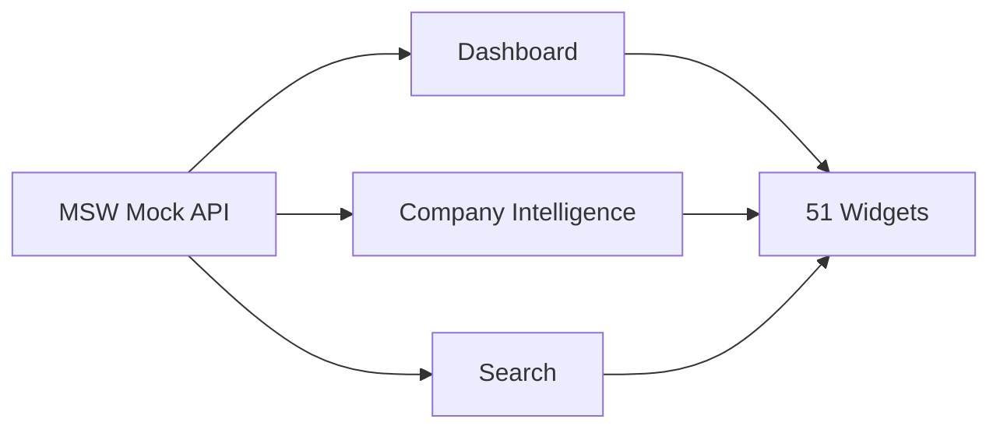

# SalesOS QA Checklist

> قبل الإطلاق — التحقق من كل Widget وكل حالة

---

## ✅ Widget States

لكل Widget من الـ 51:

| الحالة | الاختبار | النتيجة |
|--------|---------|--------|
| ✅ Ready | يعرض البيانات كاملة | |
| ✅ Loading | شاشة التحميل متوفرة | |
| ✅ Empty | لا توجد بيانات — رسالة مناسبة | |
| ✅ Error | خطأ — رسالة + زر إعادة المحاولة | |
| ✅ Degraded | بيانات جزئية مع تنبيه | |

## ✅ Accessibility

| المعيار | الاختبار |
|---------|---------|
| ✅ Keyboard | Tab, Arrow Keys, Enter, Escape |
| ✅ Screen Reader | ARIA roles, labels, live regions |
| ✅ Focus | Focus trap في الـ overlay |
| ✅ Dark Mode | كل الألوان متوافقة مع `dark:` |
| ✅ RTL | `dir="rtl"`, النصوص العربية |
| ✅ Reduced Motion | `motion-reduce:transition-none` |
| ✅ Touch Targets | >= 44px للأزرار |

## ✅ Business Flow

| التدفق | Widgets المتأثرة |
|--------|----------------|
| ✅ Dashboard → جميع الويدجت | 6 Dashboard widgets |
| ✅ Company Intelligence → 10 أبعاد | Company DNA, AI Rec, Timeline, etc |
| ✅ Search → Command Bar → نتائج | Search SDK + CommandBar |
| ✅ NBA → إنشاء فرصة | NBA → Opportunity |
| ✅ الفرصة → تغيير المرحلة | Opportunity Detail |
| ✅ الفرصة → Pipeline | Opportunity List → Pipeline |
| ✅ الفرصة → مهمة | Opportunity → Task |
| ✅ اجتماع → Meeting Brief | Meeting Intelligence |

## ✅ Data Flow

## ✅ Performance

| المقياس | الحد | الحالة |
|---------|------|-------|
| First Load | < 3s | |
| Widget Render | < 100ms | |
| Search Response | < 500ms | |
| NBA Calculation | < 200ms | |
